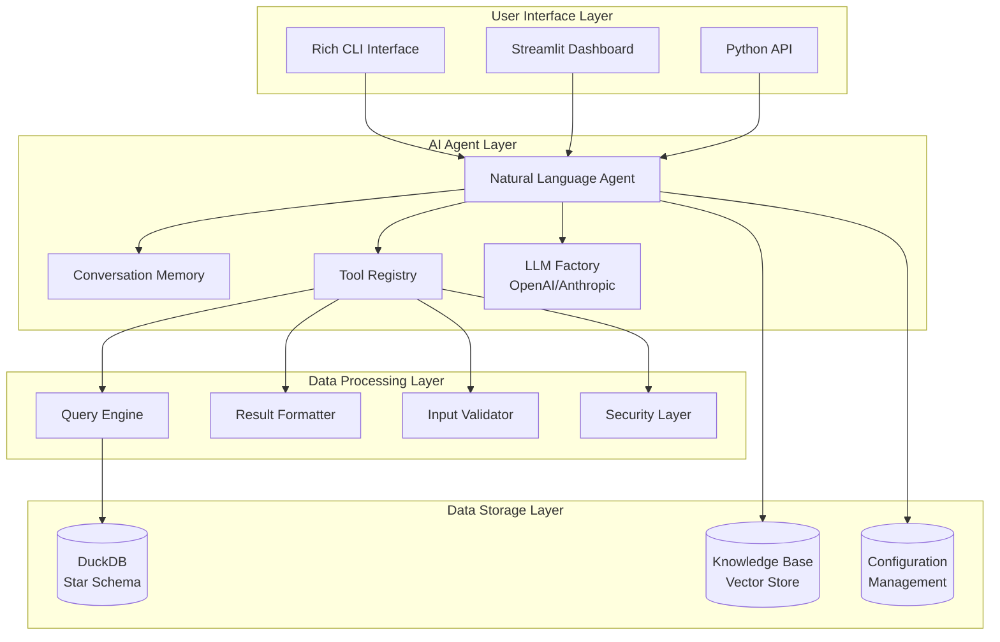
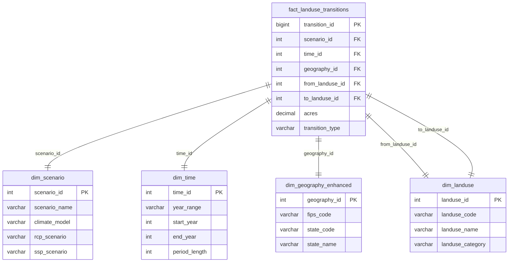

# Design Document

## Overview

The RPA Land Use Analytics system is designed as a modern, AI-powered analytics platform that transforms complex USDA Forest Service land use data into accessible insights through natural language interfaces. The system follows a layered architecture with clear separation of concerns, enabling scalability, maintainability, and extensibility.

## Architecture

### High-Level Architecture



### Component Architecture

The system is organized into distinct layers, each with specific responsibilities:

1. **User Interface Layer**: Multiple interaction modalities
2. **AI Agent Layer**: Natural language processing and conversation management
3. **Data Processing Layer**: Query execution and result formatting
4. **Data Storage Layer**: Optimized data storage and configuration

## Components and Interfaces

### 1. AI Agent System

#### LanduseAgent (Core Agent)
```python
class LanduseAgent:
    """
    Modern landuse agent with LangGraph architecture
    - Memory-first design with conversation persistence
    - Graph-based workflow for complex queries
    - Tool-based extensibility
    - Multi-LLM support (OpenAI/Anthropic)
    """
    
    def __init__(self, config: LanduseConfig)
    def query(self, user_input: str) -> AgentResponse
    def get_conversation_history(self) -> List[BaseMessage]
    def reset_conversation(self) -> None
```

#### Tool System
```python
# Tool Registry Pattern
def create_execute_query_tool(config, db_connection, schema) -> Tool
def create_schema_tool(schema) -> Tool  
def create_analysis_tool(config) -> Tool
def create_map_generation_tool(config) -> Tool  # Optional
```

#### Memory Management
```python
class AgentState(TypedDict):
    """State management for conversation flow"""
    messages: List[BaseMessage]
    context: Dict[str, Any]
    iteration_count: int
    max_iterations: int
```

### 2. Data Access Layer

#### DuckDB Connection Management
```python
class DuckDBConnection:
    """
    Streamlit-compatible connection with:
    - Connection pooling
    - Read-only access for security
    - Automatic retry logic
    - Performance monitoring
    """
    
    def execute_query(self, query: SQLQuery) -> QueryResult
    def get_schema(self) -> SchemaInfo
    def validate_query(self, query: str) -> ValidationResult
```

#### Query Engine
```python
class QueryEngine:
    """
    Handles SQL generation and execution:
    - Query optimization (automatic LIMIT clauses)
    - Parameter sanitization
    - Result streaming for large datasets
    - Performance monitoring
    """
    
    def execute(self, query: str, params: Dict = None) -> QueryResult
    def explain(self, query: str) -> QueryPlan
    def optimize(self, query: str) -> OptimizedQuery
```

### 3. Configuration System

#### Unified Configuration
```python
@dataclass
class LanduseConfig:
    """
    Centralized configuration with environment variable support:
    - Database settings
    - Model configuration (OpenAI/Anthropic)
    - Agent behavior parameters
    - Security settings
    - Feature flags
    """
    
    db_path: str
    model_name: str
    temperature: float
    max_iterations: int
    enable_memory: bool
    enable_map_generation: bool
    # ... additional configuration options
```

### 4. User Interface Components

#### Streamlit Dashboard
```python
# Multi-page application with:
# - Home/status page
# - Natural language chat interface
# - Analytics dashboard with pre-built visualizations
# - Data explorer with schema browser
# - Settings and configuration management
```

#### Rich CLI Interface
```python
# Terminal interface with:
# - Colored output and formatting
# - Interactive prompts
# - Progress indicators
# - Table formatting for results
# - Error handling and help
```

## Data Models

### Database Schema (Star Schema Design)



### Application Data Models

```python
# Pydantic models for type safety and validation
class QueryResult(BaseModel):
    data: List[Dict[str, Any]]
    columns: List[str]
    row_count: int
    execution_time: float
    query: str

class AgentResponse(BaseModel):
    response: str
    query_results: Optional[QueryResult]
    assumptions: List[str]
    suggestions: List[str]
    
class ScenarioInfo(BaseModel):
    scenario_id: int
    scenario_name: str
    climate_model: str
    rcp_scenario: str
    ssp_scenario: str
```

## Error Handling

### Layered Error Handling Strategy

1. **Input Validation Layer**
   - SQL injection prevention
   - Parameter sanitization
   - Query complexity limits

2. **Database Layer**
   - Connection retry logic
   - Query timeout handling
   - Resource limit enforcement

3. **Agent Layer**
   - LLM API error handling
   - Conversation state recovery
   - Graceful degradation

4. **User Interface Layer**
   - User-friendly error messages
   - Debugging information (when appropriate)
   - Recovery suggestions

### Security Implementation

```python
class SecurityValidator:
    """
    Multi-layer security validation:
    - SQL injection prevention
    - Query complexity analysis
    - Rate limiting
    - Input sanitization
    """
    
    def validate_query(self, query: str) -> ValidationResult
    def check_rate_limit(self, user_id: str) -> bool
    def sanitize_input(self, user_input: str) -> str
```

## Testing Strategy

### Test Architecture

1. **Unit Tests** (>90% coverage target)
   - Individual component testing
   - Mock LLM responses for consistency
   - Database operation testing with fixtures

2. **Integration Tests**
   - End-to-end agent workflows
   - Real database connections
   - Multi-component interaction testing

3. **Performance Tests**
   - Query execution benchmarks
   - Memory usage monitoring
   - Concurrent user simulation

4. **Security Tests**
   - SQL injection attempt testing
   - Rate limiting validation
   - Input sanitization verification

### Test Data Management

```python
# Test fixtures and data management
class TestDataManager:
    """
    Manages test data and database fixtures:
    - Sample database creation
    - Test scenario data
    - Mock LLM responses
    - Performance benchmarks
    """
    
    def create_test_database(self) -> str
    def load_sample_data(self) -> None
    def get_mock_responses(self) -> Dict[str, str]
```

## Performance Considerations

### Database Optimization

1. **Star Schema Design**
   - Optimized for analytical queries
   - Efficient joins through foreign keys
   - Columnar storage benefits

2. **Query Optimization**
   - Automatic LIMIT clause addition
   - Index utilization
   - Query plan analysis

3. **Connection Management**
   - Connection pooling
   - Read-only connections
   - Resource cleanup

### Memory Management

1. **Result Streaming**
   - Large result set handling
   - Pagination support
   - Memory-efficient processing

2. **Conversation Memory**
   - Efficient state storage
   - Memory cleanup policies
   - Context window management

## Deployment Architecture

### Development Environment
```yaml
# Local development setup
- Python 3.9+ with uv package manager
- DuckDB local database file
- Environment variable configuration
- Rich CLI interface for testing
```

### Production Environment (Streamlit Cloud)
```yaml
# Cloud deployment configuration
- Streamlit Cloud hosting
- Secrets management for API keys
- Database file deployment
- Multi-page application structure
```

### Configuration Management
```python
# Environment-based configuration
class DeploymentConfig:
    """
    Environment-specific settings:
    - Development: Local files, debug enabled
    - Production: Cloud secrets, optimized settings
    - Testing: Mock services, isolated data
    """
```

## Extensibility Design

### Plugin Architecture

1. **Tool Registration System**
   - Dynamic tool loading
   - Custom tool development
   - Tool dependency management

2. **LLM Provider Abstraction**
   - Factory pattern for model creation
   - Provider-agnostic interfaces
   - Easy provider switching

3. **Data Source Abstraction**
   - Database connection interfaces
   - Multiple data source support
   - Schema adaptation capabilities

### Future Extension Points

1. **Additional Data Sources**
   - Integration with other USDA datasets
   - Real-time data feeds
   - External API connections

2. **Enhanced Visualization**
   - Interactive mapping capabilities
   - Advanced charting options
   - Export functionality

3. **Advanced Analytics**
   - Machine learning integration
   - Predictive modeling
   - Statistical analysis tools

## Knowledge Base Integration

### Vector Store Architecture
```python
class KnowledgeBase:
    """
    RPA Assessment document integration:
    - Vector embeddings of methodology documents
    - Context-aware query enhancement
    - Domain-specific knowledge injection
    """
    
    def search_context(self, query: str) -> List[Document]
    def enhance_prompt(self, query: str, context: List[Document]) -> str
```

This design provides a robust, scalable foundation for the RPA Land Use Analytics system while maintaining flexibility for future enhancements and extensions.