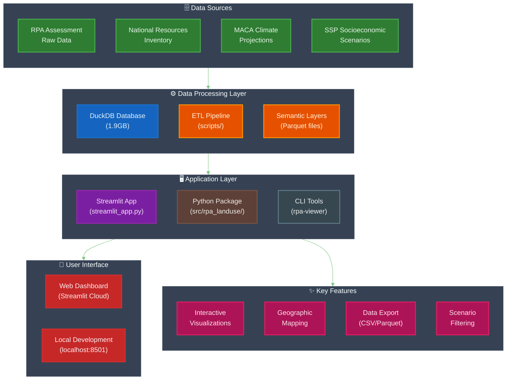
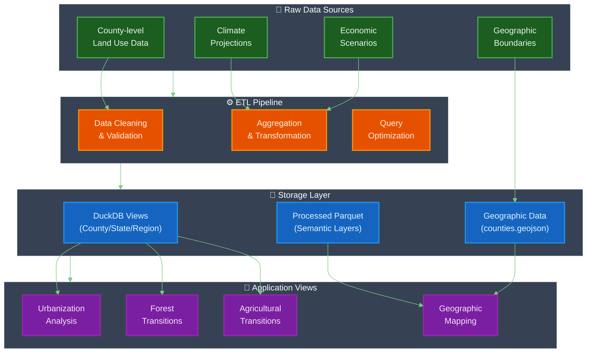
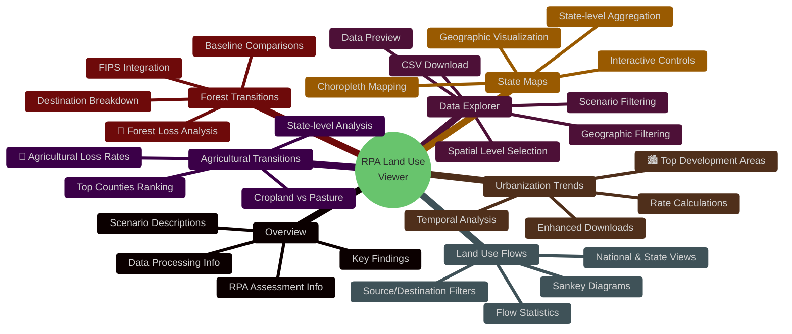
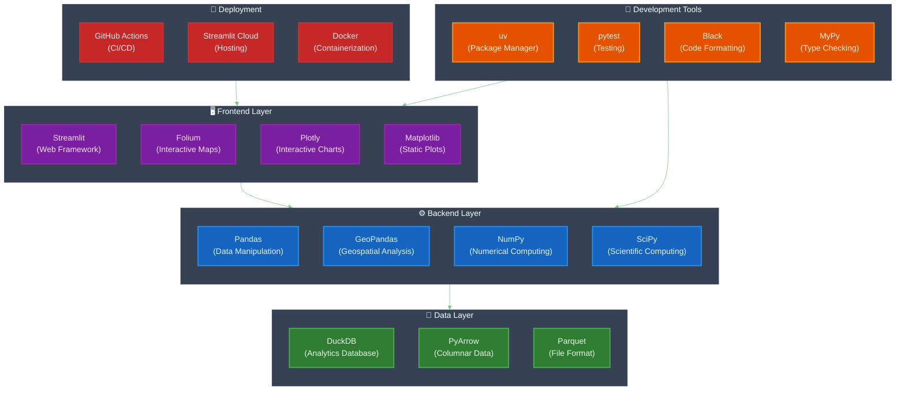

# RPA Land Use Change Data Viewer - Project Overview

## 🌲 About the Project

The **RPA Land Use Change Data Viewer** is an interactive data science platform for exploring and analyzing USDA Forest Service's Resources Planning Act (RPA) Assessment land use change projections. This project transforms complex geospatial datasets into accessible visualizations for policy makers, researchers, and land use planners.

## 🏗️ Project Architecture



## 📊 Data Flow Architecture



## 🎯 Application Features & Tabs



## 🛠️ Technical Stack



## 📁 Project Structure

```
rpa-landuse/
├── 📱 streamlit_app.py           # Main Streamlit application (2,745 lines)
├── 📦 src/rpa_landuse/           # Core Python package
│   ├── cli.py                    # Command line interface
│   ├── commands/                 # Analysis commands
│   ├── db/                       # Database utilities
│   └── utils/                    # Helper functions
├── 🗄️ data/                      # Data storage
│   ├── database/                 # DuckDB database (1.9GB)
│   ├── processed/                # Optimized parquet files
│   ├── raw/                      # Original datasets
│   └── counties.geojson          # Geographic boundaries
├── 🔄 semantic_layers/           # Processed data views
│   ├── base_analysis/            # Basic aggregations
│   └── regional_analysis/        # Regional summaries
├── 🧪 scripts/                   # Data processing scripts
├── 🏗️ .github/workflows/         # CI/CD pipelines
├── 📋 tests/                     # Test suite
├── 📚 docs/                      # Documentation
└── ⚙️ pyproject.toml             # Project configuration
```

## 🎯 Key Analysis Capabilities

### 1. **Urbanization Analysis** 🏙️
- **Question**: "Where is urban development rate highest?"
- **Capabilities**: County-level urban development ranking, baseline rate calculations, temporal trends
- **Output**: Enhanced CSV downloads with FIPS codes, regional classifications, source land breakdown

### 2. **Forest Transition Analysis** 🌲
- **Question**: "Which areas are losing the most forest land?"
- **Capabilities**: Forest loss hotspots, destination land use analysis, baseline comparisons
- **Output**: Geographic data integration, annualized loss rates, destination breakdown

### 3. **Agricultural Transition Analysis** 🌾
- **Question**: "Where is agricultural land loss rate highest?"
- **Capabilities**: Cropland vs. pasture analysis, state-level rankings, temporal patterns
- **Output**: Source/destination breakdowns, rate calculations, policy-relevant metrics

### 4. **Scenario Comparison** 📊
- **Climate Scenarios**: RCP4.5 (lower warming) vs RCP8.5 (higher warming)
- **Socioeconomic Pathways**: SSP1-5 (different growth patterns)
- **Integrated Analysis**: 20 scenario combinations for comprehensive planning

## 🚀 Getting Started

### Prerequisites
- Python 3.11
- uv (recommended package manager)

### Installation

```bash
# Clone the repository
git clone https://github.com/your-username/rpa-landuse.git
cd rpa-landuse

# Setup virtual environment with uv
uv venv
source .venv/bin/activate  # On Windows: .venv\Scripts\activate

# Install dependencies
uv pip install -e .

# Run the Streamlit app
streamlit run streamlit_app.py
```

### Command Line Tools

```bash
# General viewer
rpa-viewer

# Specific analysis tools
rpa-urban-analysis
rpa-forest-analysis  
rpa-ag-analysis
```

## 🔍 Data Sources & Methodology

The RPA Assessment uses an empirical econometric model based on:
- **National Resources Inventory (NRI)** data (2001-2012)
- **MACA climate projections** 
- **SSP socioeconomic scenarios**
- **County-level analysis** for the conterminous United States

Land use projections cover five major classes:
- 🌲 Forest
- 🏘️ Developed
- 🌽 Crop
- 🐄 Pasture  
- 🌾 Rangeland

## 📈 Sample Analysis Results

**Top Urban Development Areas (ensemble_HH scenario):**
- **County**: Fresno County, CA (54,858 acres)
- **State**: Texas (1,943,086 acres)

**Top Forest Loss Areas:**
- **County**: Aroostook County, ME (174,910 acres)
- **State**: Alabama (1,078,434 acres)

**Top Agricultural Loss Areas:**
- **County**: Chouteau County, MT (58,106 acres)
- **State**: Texas (1,943,086 acres)

## 🎨 Dark Mode Compatibility

This project overview uses Mermaid diagrams optimized for dark mode viewing with:
- Dark background colors (`#0D1117`, `#161B22`)
- High contrast text (`#E8F5E8`, `#FFFFFF`)
- Accessible color palettes for different node types
- Clear visual hierarchy and readable typography

## 📄 License

MIT License - See [LICENSE](LICENSE) for details.

## 🤝 Contributing

This project supports the USDA Forest Service's Resources Planning Act Assessment. Contributions are welcome for:
- Additional analysis features
- Performance optimizations
- Documentation improvements
- Bug fixes and testing

---

*Last updated: 2024*
*USDA Forest Service: Resources Planning Act Assessment* 