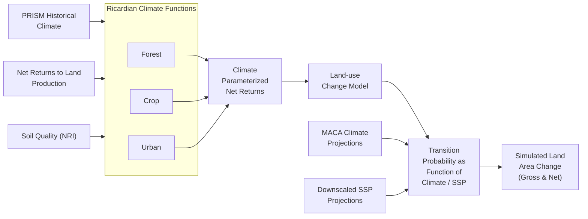

# 🌲 RPA Land Use Analytics

AI-powered analytics tool for USDA Forest Service RPA Assessment land use data. Built with a modern data stack (DuckDB, LangChain, GPT-4) to analyze county-level land use projections from the 2020 Resources Planning Act Assessment.

## ✨ Features

- **🤖 Natural Language Queries**: Ask questions like "Which scenarios show the most agricultural land loss?"
- **🌐 Modern Web Frontend**: Next.js + React application with chat, analytics, and data explorer
- **🦆 Modern Data Stack**: DuckDB star schema optimized for analytics
- **📈 Rich Visualizations**: Choropleth maps, time series, and interactive charts
- **🎨 Beautiful UI**: Rich terminal and web interfaces with professional formatting
- **🌍 Climate Analysis**: Compare RCP/SSP scenarios and geographic patterns

## 🚀 Quick Start

### 1. Install Dependencies
```bash
# Install all dependencies using uv
uv sync

# Verify installation
uv run python -c "import landuse; print('✅ Installation successful')"
```

### 2. Configure API Access
```bash
# Copy example environment file to config directory
cp .env.example config/.env

# Edit config/.env and add your API key:
# OPENAI_API_KEY=your_openai_key_here      # For GPT models
```

### 3. Set Up Database
```bash
# If you have the raw data file, convert it to DuckDB
uv run python scripts/converters/convert_to_duckdb.py

# The database should be at: data/processed/landuse_analytics.duckdb
```

### 4. Run Applications

#### Option A: Web Frontend (Recommended)
See the [rpa-landuse-frontend](../rpa-landuse-frontend) directory for the Next.js web application.

```bash
# Navigate to frontend directory
cd ../rpa-landuse-frontend

# Install dependencies and run
npm install && npm run dev

# Open http://localhost:3000 in your browser
```

#### Option B: Command Line Agent
```bash
# Interactive terminal-based analysis
uv run rpa-analytics

# Or with specific model
uv run rpa-analytics --model gpt-4o --verbose
```

#### Option C: Direct Database Access
```bash
# Browser-based DuckDB UI
duckdb data/processed/landuse_analytics.duckdb -ui

# Command line SQL interface  
duckdb data/processed/landuse_analytics.duckdb
```

### 5. Example Questions to Try
- "Which states have the most urban expansion?"
- "Compare forest loss between RCP45 and RCP85 scenarios"  
- "Show population growth trends in California"
- "What are the agricultural land transitions in Texas?"

## ⚙️ Configuration

### Environment Variables
The application uses environment variables for configuration. Copy `.env.example` to `config/.env` and customize:

```bash
# API Key (required)
OPENAI_API_KEY=your_openai_key              # For GPT-4o-mini, GPT-4o models

# Model Configuration  
LANDUSE_MODEL=gpt-4o-mini                   # Model to use (gpt-4o-mini, gpt-4o, gpt-3.5-turbo)
TEMPERATURE=0.1                             # Model temperature (0.0-2.0)
MAX_TOKENS=4000                             # Maximum tokens per response

# Database Configuration
LANDUSE_DB_PATH=data/processed/landuse_analytics.duckdb
LANDUSE_MAX_QUERY_ROWS=1000                 # Maximum rows returned by queries
LANDUSE_DEFAULT_DISPLAY_LIMIT=50            # Default rows displayed to user

# Agent Configuration
LANDUSE_MAX_ITERATIONS=5                    # Maximum tool calls before stopping
LANDUSE_MAX_EXECUTION_TIME=120              # Maximum seconds for query execution

# Performance & Security
ENABLE_RATE_LIMITING=true
LANDUSE_RATE_LIMIT_CALLS=60                 # Max API calls per minute
LOG_LEVEL=INFO                              # DEBUG, INFO, WARNING, ERROR
```

### Modern Configuration System
The application supports both legacy and modern configuration approaches:

- **Legacy Config**: Uses `LanduseConfig` class with individual environment variables
- **Modern Config**: Uses `AppConfig` with nested Pydantic validation and `LANDUSE_` prefixed vars

### Command Line Options
The CLI agent supports various configuration options:
```bash
uv run rpa-analytics --help                 # Show all options
uv run rpa-analytics --model gpt-4o --verbose
uv run rpa-analytics --max-iterations 10 --temperature 0.2
```

## 📁 Project Structure

```
rpa-landuse/
├── 🤖 src/landuse/             # Core application modules
│   ├── agents/                 # AI-powered analysis agents
│   │   ├── agent.py           # Main CLI entry point (rpa-analytics)
│   │   ├── landuse_agent.py   # LangGraph-based natural language agent
│   │   ├── formatting.py      # Query result formatting with percentage changes
│   │   ├── prompts.py         # Specialized system prompts
│   │   └── prompt_selector.py # Automatic prompt selection
│   ├── core/                  # Modern architecture components
│   │   ├── app_config.py      # Pydantic-based unified configuration
│   │   ├── container.py       # Dependency injection system
│   │   └── interfaces.py      # Clean architectural interfaces
│   ├── infrastructure/        # Production-ready infrastructure
│   │   ├── cache.py          # Thread-safe caching with TTL
│   │   ├── logging.py        # Structured JSON logging
│   │   ├── metrics.py        # Performance metrics collection
│   │   └── performance.py    # Decorator-based monitoring
│   ├── connections/           # Database connection management
│   │   └── duckdb_connection.py # Thread-safe DuckDB connection
│   ├── tools/                # LangGraph agent tools
│   │   ├── common_tools.py   # SQL execution and analysis tools
│   │   └── map_generation_tool.py # Choropleth map generation
│   └── security/             # Security and validation
│       └── database_security.py # SQL injection prevention
├── 🔧 scripts/               # Data processing and setup
│   ├── converters/           # Data transformation utilities
│   │   └── convert_to_duckdb.py # JSON → DuckDB star schema conversion
│   └── setup/               # Database enhancement scripts
├── 📊 data/
│   ├── processed/           # Optimized database
│   │   └── landuse_analytics.duckdb # 1.2GB star schema database
│   └── ssp_projections/     # Socioeconomic projection data
├── 🧪 tests/                # Comprehensive test suite (89.75% coverage)
│   ├── unit/               # Unit tests for all modules
│   ├── integration/        # Integration tests with real database  
│   └── fixtures/           # Test data and mocking utilities
├── 📚 docs/                # Extensive documentation
│   ├── getting-started/    # Setup and configuration guides
│   ├── agents/            # Agent architecture documentation
│   ├── data/              # Database schema and data dictionary
│   └── development/       # Architecture and testing guides
├── ⚙️ config/              # Configuration directory
│   └── .env               # Environment variables (create from .env.example)
├── 🌍 .env.example        # Environment configuration template
└── 📋 pyproject.toml      # Modern Python project with uv
```

## 🗄️ Database Schema

**Modern DuckDB Star Schema** optimized for analytics:

- **`fact_landuse_transitions`**: 5.4M records of land use changes
- **`dim_scenario`**: 20 climate scenarios (RCP45/85, SSP1/5)
- **`dim_geography`**: 3,075 US counties with FIPS codes
- **`dim_landuse`**: 5 land use types (Crop, Pasture, Forest, etc.)
- **`dim_time`**: 6 time periods (2012-2100)

**Pre-built Views:**
- `v_agriculture_transitions`: Agricultural land changes
- `v_scenario_summary`: Aggregated scenario comparisons

## 🎯 Key Capabilities

### 🌐 Web Application
The Next.js frontend provides:
- **💬 Natural Language Chat**: Real-time conversation with AI agent, SSE streaming
- **📈 Analytics Dashboard**: Interactive visualizations with Plotly.js
- **🔍 Data Explorer**: SQL query interface with schema browser
- **📥 Data Extraction**: Export query results in CSV/JSON formats

### 🤖 Natural Language Analysis
```
🌾 Ask> "Which states have the most urban expansion?"

🦆 Query executed with percentage-based formatting:
┏━━━━━━━━━━━━┳━━━━━━━━━━━━┳━━━━━━━━━━━━━━━━━━━━━━━┳━━━━━━━━━━━━━━━━━━━━━━━━━━━━┓
┃ State Name ┃ Start Year ┃ Urban Expansion Acres ┃ Urban Expansion Acres Pct ┃
┃            ┃            ┃                       ┃ Change From 2025          ┃  
┡━━━━━━━━━━━━╇━━━━━━━━━━━━╇━━━━━━━━━━━━━━━━━━━━━━━╇━━━━━━━━━━━━━━━━━━━━━━━━━━━━┩
│ California │ 2030       │ 184,553              │ +23.0%                    │
│ Texas      │ 2030       │ 172,952              │ +23.5%                    │
│ California │ 2050       │ 220,000              │ +46.7%                    │
└────────────┴────────────┴───────────────────────┴────────────────────────────┘
```

### 🧠 Advanced AI Features
- **Cross-Dataset Integration**: Automatically combines land use, population, and income data
- **Percentage-Based Reporting**: Shows trends as percentage changes from 2025 baseline
- **Automatic Prompt Selection**: Detects query intent and applies specialized prompts
- **Time-Aware Analysis**: Always includes temporal dimensions for trend analysis
- **Security Validation**: SQL injection prevention with allowlist-based validation

### 📈 Business Intelligence
- **Agricultural Impact**: Track farmland loss and conversion patterns with percentage trends
- **Climate Scenarios**: Compare emission pathways (RCP45 vs RCP85) across time
- **Demographic Analysis**: Population and income projections linked to land use changes  
- **Geographic Patterns**: County and state-level analysis with choropleth maps
- **Urbanization Pressure**: Development trends with percentage changes over time

## 📖 About the RPA Assessment

The Resources Planning Act (RPA) Assessment is a report prepared in response to the mandate in the 1974 Forest and Rangeland Renewable Resources Planning Act (Public Law 93-378, 88 Stat 475, as amended). The 2020 RPA Assessment is the sixth report in this series and provides a comprehensive analysis of the status, trends, and projected future of U.S. forests, forest product markets, rangelands, water, biodiversity, outdoor recreation, and the effects of socioeconomic and climatic change upon these resources.

The Assessment evaluates conditions across all ownerships nationwide and projects resource trends from 2020 to 2070 across four scenarios with differing assumptions about:
- U.S. and global population and economic growth
- Technology change
- Bioenergy preferences
- Openness of international trade
- Wood-energy consumption
- Global climate change

The results inform resource managers and policymakers as they develop strategies to sustain natural resources. Important differences are found regionally and locally, highlighting the need for flexible adaptation and management strategies. The USDA Forest Service uses these results to inform strategic planning and forest planning.

## 🔬 Dataset Overview

The data contains county-level land use projections from 2020-2070 based on an econometric model calibrated using observed transitions from 2001-2012 (National Resources Inventory data). These projections help understand how climate change and socioeconomic factors may reshape America's landscape.

### Key Methodology Points
- **Model Type**: Econometric model based on historical land use transitions
- **Spatial Detail**: 3,075 counties in the conterminous United States  
- **Time Periods**: Six projection periods from 2012 to 2100
- **Scenarios**: 20 combinations of climate models and socioeconomic pathways
- **Land Classes**: Forest, Crop, Pasture, Rangeland, and Urban
- **Key Assumption**: Development is irreversible (urban land doesn't revert)
- **Scope**: Private land only (public lands assumed unchanged)

For detailed methodology, see [LAND_USE_METHODOLOGY.md](docs/LAND_USE_METHODOLOGY.md)

### Land-use Change Model

The land use projections were generated using a model that integrates climate, economic, and land quality factors:



This diagram shows how the RPA Land Use Model integrates various inputs:
- Historical climate data (PRISM)
- Economic factors (Net Returns to Land Production)
- Land characteristics (Soil Quality from NRI)
- Future climate projections (MACA)
- Future socioeconomic projections (SSPs)

These inputs flow through Ricardian Climate Functions for different land use system types, producing climate-parameterized net returns that feed into the land-use change model. The model generates transition probabilities as functions of climate and socioeconomic factors, ultimately producing the simulated land area changes found in this dataset.

### RPA Integrated Scenarios

For clarity and policy relevance, this application focuses on the 5 most important scenarios from the full dataset of 20 scenarios. These represent the key RPA Integrated scenarios plus the overall mean projection:

- **Sustainable Development Pathway** (RCP4.5-SSP1) - *Most optimistic scenario*
- **Climate Challenge Scenario** (RCP8.5-SSP3) - *Climate stress with economic challenges*
- **Moderate Growth Scenario** (RCP8.5-SSP2) - *Middle-of-the-road scenario*
- **High Development Scenario** (RCP8.5-SSP5) - *High development pressure*
- **Ensemble Projection** - *Average across all 20 scenarios*

Each ensemble scenario represents the mean projection across 5 different climate models (CNRM_CM5, HadGEM2_ES365, IPSL_CM5A_MR, MRI_CGCM3, NorESM1_M) to capture the range of climate uncertainty.

**Climate & Economic Factors:**
- **Climate projections**: RCP4.5 (lower warming) vs RCP8.5 (higher warming)
- **Socioeconomic pathways**: SSP1-5 representing different population and economic growth patterns
- **Policy focus**: These 5 scenarios provide the most relevant range for land use planning and policy decisions

### Time Periods
- Calibration period: 2012-2020 (Removed from data viewer)
- Projection periods: 2020-2070 in 10-year intervals
  - 2020-2030
  - 2030-2040
  - 2040-2050
  - 2050-2060
  - 2060-2070

### Land Use Categories
Transitions between five main land use types:
- Cropland
- Pasture land
- Rangeland
- Forest land
- Urban developed land

### Geographic Coverage
- All counties in the conterminous United States
- Counties identified by 5-digit FIPS codes
- Organized into hierarchical regions (States → Subregions → Regions)

## 🔍 Key Findings

The RPA Assessment projections reveal several important trends for land use in the United States:

- **Developed land area** is projected to increase in the future, while all non-developed land uses are projected to lose area. The most common source of new developed land is forest land.

- **Forest land area** is projected to decrease under all scenarios, although at lower rates than projected by the 2010 Assessment. Overall forest land losses are projected to be between 1.9 and 3.7 percent by 2070.

- **Climate and economic impacts** vary: Higher projected population and income growth lead to relatively less forest land, while hotter projected future climates lead to relatively more forest land.

- **Sensitivity to factors**: Projected future land use change is more sensitive to the variation in economic factors across RPA scenarios than to the variation among climate projections.

- **Regional variations**: The greatest increases in developed land use are projected for the RPA South Region, with highest forest land loss also projected in this region.

## 📊 Technical Architecture

This project showcases modern software engineering practices with a production-ready AI analytics platform:

### 🏗️ Core Technologies
- **🤖 LangGraph + LangChain**: Advanced AI agent workflows with state management
- **🦆 DuckDB**: High-performance analytical database with columnar storage
- **🌐 FastAPI**: REST API backend with SSE streaming support
- **🐍 Pydantic v2**: Type-safe data validation and configuration management
- **📊 Rich Terminal UI**: Beautiful command-line interface with colors and formatting
- **🧪 Comprehensive Testing**: 89.75% test coverage with 142+ unit and integration tests

### 🔧 Modern Architecture (2025)
- **Modular Design**: Single Responsibility Principle with 5 specialized managers
- **Dependency Injection**: Clean architecture with `DependencyContainer` and interface abstractions
- **Performance Monitoring**: Decorator-based timing with metrics collection and structured logging
- **Configuration System**: Unified Pydantic-based `AppConfig` with environment variable integration
- **Infrastructure Components**: Thread-safe caching, structured JSON logging, and performance metrics

### 🤖 AI Agent Features  
- **Cross-Dataset Integration**: Automatically combines land use, population, and economic data
- **Time-Aware Analysis**: Includes temporal dimensions for percentage-based trend reporting
- **Automatic Prompt Selection**: Detects query intent and applies specialized prompts for different domains
- **Security-First**: SQL injection prevention with allowlist-based validation and comprehensive error handling
- **Streaming Responses**: Real-time response generation with conversation memory and checkpointing

### 🛡️ Production Quality
- **Security**: Comprehensive SQL injection prevention, API key masking, rate limiting
- **Error Handling**: Custom exception hierarchy with 10+ specific exception types  
- **Performance**: Bulk loading optimization (5-10x faster), connection pooling, query caching
- **Observability**: Real-time performance metrics, structured logging, health monitoring
- **Testing**: Real functionality testing (no mocking of business logic), 89.75% coverage

## 📚 Data Source & Attribution

This project analyzes data from the **USDA Forest Service 2020 Resources Planning Act (RPA) Assessment**.

### RPA Assessment
**Official Website**: https://www.fs.usda.gov/research/rpa

**Full Report Citation**: U.S. Department of Agriculture, Forest Service. 2023. Future of America's Forest and Rangelands: Forest Service 2020 Resources Planning Act Assessment. Gen. Tech. Rep. WO-102. Washington, DC. https://doi.org/10.2737/WO-GTR-102

### Land Use Projections Dataset
**Dataset Citation**: Mihiar, A.J.; Lewis, D.J.; Coulston, J.W. 2023. Land use projections for the 2020 RPA Assessment. Fort Collins, CO: Forest Service Research Data Archive. https://doi.org/10.2737/RDS-2023-0026

**Usage**: Download the data from the link above and unzip the .json data file to `data/raw/county_landuse_projections_RPA.json`

## 🧪 Testing & Development

### Run Tests
```bash
# Run all tests with coverage
uv run python -m pytest tests/ --cov=src --cov-report=term-missing

# Run specific test categories  
uv run python -m pytest tests/unit/          # Unit tests
uv run python -m pytest tests/integration/   # Integration tests

# Run with parallel execution
uv run python -m pytest tests/ -n auto
```

### Development Tools
```bash
# Install development dependencies
uv sync --group dev

# Code quality checks
uv run ruff check src/ tests/                # Linting
uv run mypy src/                             # Type checking  
uv run safety check                          # Security audit

# Documentation
mkdocs serve                                 # Local documentation server
```

### Testing Philosophy
- **89.75% test coverage** with 142+ comprehensive tests
- **Real functionality testing**: Uses actual API calls and database connections
- **No business logic mocking**: Tests real agent behavior and data processing
- **Integration testing**: Full end-to-end workflows with actual DuckDB database

---

**RPA Land Use Analytics** - Transforming America's land use data into actionable insights with modern AI 🌲

*Ready to explore? Start with the command line agent: `uv run rpa-analytics`*
