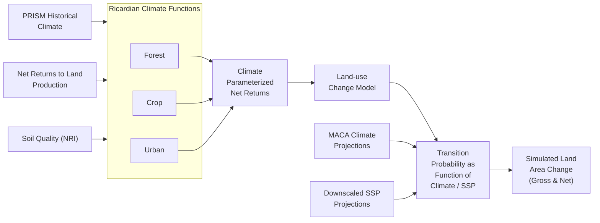

# 🌲 RPA Land Use Analytics

AI-powered analytics tool for USDA Forest Service RPA Assessment land use data. Built with a modern data stack (DuckDB, LangChain, Claude/GPT-4) to analyze county-level land use projections from the 2020 Resources Planning Act Assessment.

## ✨ Features

- **🤖 Natural Language Queries**: Ask questions like "Which scenarios show the most agricultural land loss?"
- **🦆 Modern Data Stack**: DuckDB star schema optimized for analytics
- **📊 Rich Analytics**: Automatic summary statistics and business insights
- **🎨 Beautiful Interface**: Rich terminal UI with colors and markdown
- **🌍 Climate Analysis**: Compare RCP/SSP scenarios and geographic patterns

## 🚀 Quick Start

### 1. Check Your Setup
```bash
# Run the quickstart script to verify everything is ready
uv run python quickstart.py
```

This will check your API keys, database, and dependencies, then provide specific instructions if anything is missing.

### 2. Environment Setup (if needed)
```bash
# Install dependencies
uv sync

# Alternative: Guided setup (creates .env file and tests everything)
uv run python setup_agents.py
```

### 3. Configure API Access
```bash
# Copy example environment file to config directory (recommended)
cp .env.example config/.env

# Edit config/.env and add your OpenAI API key:
# OPENAI_API_KEY=your_api_key_here
```

### 4. Try the Natural Language Query Agent
```bash
# Interactive RPA data analysis with natural language
uv run python src/landuse/agents/landuse_natural_language_agent.py

# Or use the shortcut:
uv run rpa-analytics

# Alternative: DuckDB UI in browser
duckdb data/processed/landuse_analytics.duckdb -ui
```

### 5. Example Questions to Try
- "Which scenarios show the most agricultural land loss?"
- "Compare forest loss between RCP45 and RCP85 scenarios"
- "Which states have the most urban expansion?"
- "Show me crop to pasture transitions by state"

## 📁 Project Structure

```
langchain-landuse/
├── 🤖 src/landuse/             # Core runtime application
│   ├── agents/                 # AI-powered natural language agents
│   │   ├── landuse_natural_language_agent.py  # Main NL → SQL agent
│   │   ├── base_agent.py       # Common agent functionality
│   │   ├── constants.py        # Shared constants & configurations
│   │   └── formatting.py       # Output formatting utilities
│   └── utilities/              # Runtime utilities
│       └── security.py         # Input validation & rate limiting
├── 🔧 scripts/                 # Setup & maintenance scripts
│   ├── converters/             # Data transformation tools
│   │   └── convert_to_duckdb.py  # JSON → DuckDB star schema
│   └── setup/                  # Database setup utilities
│       └── enhance_database.py   # Add state names & views
├── 📊 data/
│   ├── raw/                    # Source JSON data (20M+ lines)
│   └── processed/              # Optimized DuckDB database
│       └── landuse_analytics.duckdb  # Star schema (1.2GB)
├── 🧪 tests/                   # Comprehensive test suite (91% coverage)
│   ├── unit/                   # Unit tests for all modules
│   ├── integration/            # Integration tests with real database
│   └── fixtures/               # Test data and utilities
├── 📚 docs/                    # Comprehensive documentation
│   ├── getting-started/        # Installation & quickstart guides
│   ├── queries/               # Query examples & patterns
│   ├── data/                  # Database schema & data documentation
│   └── development/           # Architecture & testing guides
├── ⚙️ config/                  # Configuration files
├── 🌍 .env.example            # Environment configuration template
├── 🚀 quickstart.py           # Environment verification script
└── 📋 pyproject.toml          # Modern Python project configuration
```

## 🗄️ Database Schema

**Modern DuckDB Star Schema** optimized for analytics:

- **`fact_landuse_transitions`**: 5.4M records of land use changes
- **`dim_scenario`**: 20 climate scenarios (RCP45/85, SSP1/5)
- **`dim_geography`**: 3,075 US counties with FIPS codes
- **`dim_landuse`**: 5 land use types (Crop, Pasture, Forest, etc.)
- **`dim_time`**: 6 time periods (2012-2100)

**Pre-built Views:**
- `v_agriculture_transitions`: Agricultural land changes
- `v_scenario_summary`: Aggregated scenario comparisons

## 🎯 Key Capabilities

### Natural Language Analysis
```
🌾 Ask> "Which scenarios show the most agricultural land loss?"

🦆 DuckDB Query Results (20 rows)
SQL: SELECT s.scenario_name, SUM(f.acres) as acres_lost 
     FROM fact_landuse_transitions f 
     JOIN dim_scenario s ON f.scenario_id = s.scenario_id...

Results:
scenario_name                    acres_lost
CNRM_CM5_rcp85_ssp5             2,648,344
MRI_CGCM3_rcp85_ssp5            2,643,261
...
```

### Business Intelligence
- **Agricultural Impact**: Track farmland loss and conversion patterns
- **Climate Scenarios**: Compare emission pathways (RCP45 vs RCP85)
- **Geographic Analysis**: State and county-level trends
- **Urbanization Pressure**: Development vs conservation patterns

## 📖 About the RPA Assessment

The Resources Planning Act (RPA) Assessment is a report prepared in response to the mandate in the 1974 Forest and Rangeland Renewable Resources Planning Act (Public Law 93-378, 88 Stat 475, as amended). The 2020 RPA Assessment is the sixth report in this series and provides a comprehensive analysis of the status, trends, and projected future of U.S. forests, forest product markets, rangelands, water, biodiversity, outdoor recreation, and the effects of socioeconomic and climatic change upon these resources.

The Assessment evaluates conditions across all ownerships nationwide and projects resource trends from 2020 to 2070 across four scenarios with differing assumptions about:
- U.S. and global population and economic growth
- Technology change
- Bioenergy preferences
- Openness of international trade
- Wood-energy consumption
- Global climate change

The results inform resource managers and policymakers as they develop strategies to sustain natural resources. Important differences are found regionally and locally, highlighting the need for flexible adaptation and management strategies. The USDA Forest Service uses these results to inform strategic planning and forest planning.

## 🔬 Dataset Overview

The data contains county-level land use projections from 2020-2070 based on an econometric model calibrated using observed transitions from 2001-2012 (National Resources Inventory data). These projections help understand how climate change and socioeconomic factors may reshape America's landscape.

### Key Methodology Points
- **Model Type**: Econometric model based on historical land use transitions
- **Spatial Detail**: 3,075 counties in the conterminous United States  
- **Time Periods**: Six projection periods from 2012 to 2100
- **Scenarios**: 20 combinations of climate models and socioeconomic pathways
- **Land Classes**: Forest, Crop, Pasture, Rangeland, and Urban
- **Key Assumption**: Development is irreversible (urban land doesn't revert)
- **Scope**: Private land only (public lands assumed unchanged)

For detailed methodology, see [LAND_USE_METHODOLOGY.md](docs/LAND_USE_METHODOLOGY.md)

### Land-use Change Model

The land use projections were generated using a model that integrates climate, economic, and land quality factors:



This diagram shows how the RPA Land Use Model integrates various inputs:
- Historical climate data (PRISM)
- Economic factors (Net Returns to Land Production)
- Land characteristics (Soil Quality from NRI)
- Future climate projections (MACA)
- Future socioeconomic projections (SSPs)

These inputs flow through Ricardian Climate Functions for different land use system types, producing climate-parameterized net returns that feed into the land-use change model. The model generates transition probabilities as functions of climate and socioeconomic factors, ultimately producing the simulated land area changes found in this dataset.

### RPA Integrated Scenarios

For clarity and policy relevance, this application focuses on the 5 most important scenarios from the full dataset of 20 scenarios. These represent the key RPA Integrated scenarios plus the overall mean projection:

- **Sustainable Development Pathway** (RCP4.5-SSP1) - *Most optimistic scenario*
- **Climate Challenge Scenario** (RCP8.5-SSP3) - *Climate stress with economic challenges*
- **Moderate Growth Scenario** (RCP8.5-SSP2) - *Middle-of-the-road scenario*
- **High Development Scenario** (RCP8.5-SSP5) - *High development pressure*
- **Ensemble Projection** - *Average across all 20 scenarios*

Each ensemble scenario represents the mean projection across 5 different climate models (CNRM_CM5, HadGEM2_ES365, IPSL_CM5A_MR, MRI_CGCM3, NorESM1_M) to capture the range of climate uncertainty.

**Climate & Economic Factors:**
- **Climate projections**: RCP4.5 (lower warming) vs RCP8.5 (higher warming)
- **Socioeconomic pathways**: SSP1-5 representing different population and economic growth patterns
- **Policy focus**: These 5 scenarios provide the most relevant range for land use planning and policy decisions

### Time Periods
- Calibration period: 2012-2020 (Removed from data viewer)
- Projection periods: 2020-2070 in 10-year intervals
  - 2020-2030
  - 2030-2040
  - 2040-2050
  - 2050-2060
  - 2060-2070

### Land Use Categories
Transitions between five main land use types:
- Cropland
- Pasture land
- Rangeland
- Forest land
- Urban developed land

### Geographic Coverage
- All counties in the conterminous United States
- Counties identified by 5-digit FIPS codes
- Organized into hierarchical regions (States → Subregions → Regions)

## 🔍 Key Findings

The RPA Assessment projections reveal several important trends for land use in the United States:

- **Developed land area** is projected to increase in the future, while all non-developed land uses are projected to lose area. The most common source of new developed land is forest land.

- **Forest land area** is projected to decrease under all scenarios, although at lower rates than projected by the 2010 Assessment. Overall forest land losses are projected to be between 1.9 and 3.7 percent by 2070.

- **Climate and economic impacts** vary: Higher projected population and income growth lead to relatively less forest land, while hotter projected future climates lead to relatively more forest land.

- **Sensitivity to factors**: Projected future land use change is more sensitive to the variation in economic factors across RPA scenarios than to the variation among climate projections.

- **Regional variations**: The greatest increases in developed land use are projected for the RPA South Region, with highest forest land loss also projected in this region.

## 📊 Technical Architecture

This project combines modern AI/ML technologies with high-performance analytics to enable natural language exploration of complex land use data:

### Core Technologies
- **🤖 LangChain + GPT-4/Claude**: Natural language to SQL translation
- **🦆 DuckDB**: High-performance analytical database with columnar storage
- **🎨 Rich Terminal UI**: Beautiful command-line interface with colors and formatting
- **🧪 Comprehensive Testing**: 91% test coverage with unit and integration tests
- **🏗️ Modern Python**: Clean architecture with src layout and type hints

### AI Agent Features
- **Schema-aware query generation**: Understands database structure and relationships
- **Automatic query optimization**: Adds appropriate LIMIT clauses and filters
- **Business context**: Provides insights and summary statistics
- **Error handling**: Helpful error messages and query suggestions
- **Configurable limits**: Prevents runaway queries with time and iteration limits

## 📚 Data Source & Attribution

This project analyzes data from the **USDA Forest Service 2020 Resources Planning Act (RPA) Assessment**.

### RPA Assessment
**Official Website**: https://www.fs.usda.gov/research/rpa

**Full Report Citation**: U.S. Department of Agriculture, Forest Service. 2023. Future of America's Forest and Rangelands: Forest Service 2020 Resources Planning Act Assessment. Gen. Tech. Rep. WO-102. Washington, DC. https://doi.org/10.2737/WO-GTR-102

### Land Use Projections Dataset
**Dataset Citation**: Mihiar, A.J.; Lewis, D.J.; Coulston, J.W. 2023. Land use projections for the 2020 RPA Assessment. Fort Collins, CO: Forest Service Research Data Archive. https://doi.org/10.2737/RDS-2023-0026

**Usage**: Download the data from the link above and unzip the .json data file to `data/raw/county_landuse_projections_RPA.json`

## 🚀 Getting Started

Ready to explore RPA Assessment data with natural language? Run our quickstart script to verify your setup:

```bash
uv run python quickstart.py
```

This will check your environment and guide you through any needed setup steps. Then start asking questions like:

- "What are the land use projections for my state?"
- "Compare forest loss between RCP4.5 and RCP8.5 scenarios"
- "Which regions face the most urban expansion by 2070?"

---

**RPA Land Use Analytics** - Transforming America's land use data into actionable insights 🌲
