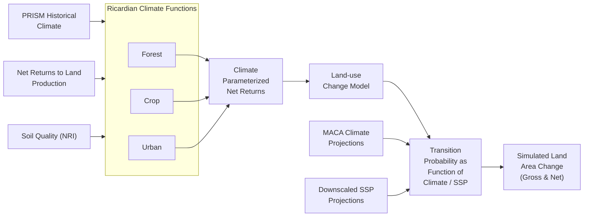
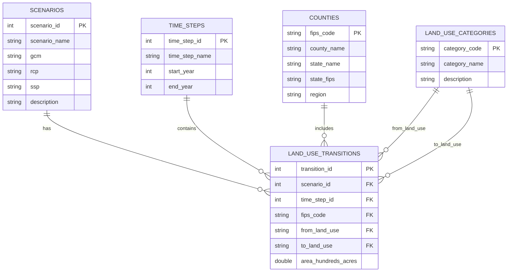

# RPA Land Use Change Data Viewer

## About the RPA Assessment

The Resources Planning Act (RPA) Assessment is a report prepared in response to the mandate in the 1974 Forest and Rangeland Renewable Resources Planning Act (Public Law 93-378, 88 Stat 475, as amended). The 2020 RPA Assessment is the sixth report in this series and provides a comprehensive analysis of the status, trends, and projected future of U.S. forests, forest product markets, rangelands, water, biodiversity, outdoor recreation, and the effects of socioeconomic and climatic change upon these resources.

The Assessment evaluates conditions across all ownerships nationwide and projects resource trends from 2020 to 2070 across four scenarios with differing assumptions about:
- U.S. and global population and economic growth
- Technology change
- Bioenergy preferences
- Openness of international trade
- Wood-energy consumption
- Global climate change

The results inform resource managers and policymakers as they develop strategies to sustain natural resources. Important differences are found regionally and locally, highlighting the need for flexible adaptation and management strategies. The USDA Forest Service uses these results to inform strategic planning and forest planning.

## Project Overview

This project provides an **interactive data science platform** for exploring and analyzing RPA land use change projections. It combines:

- **High-performance data processing** using DuckDB for handling large geospatial datasets
- **Interactive web visualization** with Streamlit for policy makers and researchers
- **Comprehensive analysis tools** for urbanization trends and forest land transitions
- **Downloadable datasets** for further analysis and research

### Key Features

🌍 **Geographic Analysis**: County-level data for the entire conterminous United States  
📊 **Scenario Modeling**: 20 different climate and socioeconomic scenarios  
🏙️ **Urbanization Focus**: Detailed analysis of where urban development rates are highest  
🌲 **Forest Transitions**: Track forest land conversion patterns  
📈 **Interactive Visualizations**: Dynamic charts, maps, and data exploration  
💾 **Data Export**: Download processed datasets for external analysis  

## Technical Architecture

### Data Layer
- **DuckDB Database** (`data/database/rpa.db` - 1.9GB): Full dataset with optimized queries
- **Processed Parquet Files** (`semantic_layers/`): Optimized views for web deployment
- **Geographic Data** (`data/counties.geojson`): County boundaries for mapping

### Application Layer
- **Streamlit Web App** (`app.py`, `streamlit_app.py`): Interactive dashboard
- **Python Package** (`src/rpa_landuse/`): Core functionality and CLI tools
- **Data Processing Pipeline** (`scripts/`): ETL operations and optimization

### Deployment
- **Streamlit Cloud** ready with optimized datasets
- **GitHub Actions** for CI/CD workflows
- **Docker** support for containerized deployment

## Streamlit Interactive Dashboard

The interactive dashboard provides comprehensive tools for exploring RPA land use data with a focus on answering key policy questions like "Where is urban development rate highest?"

### Running the Dashboard

1. Set up the environment (see setup instructions below):
   ```bash
   ./setup_venv.sh
   ```

2. Install the package in development mode:
   ```bash
   source .venv/bin/activate
   pip install -e .
   ```

3. Run the Streamlit app:
   ```bash
   streamlit run streamlit_app.py
   ```

4. The app will open at `http://localhost:8501`

### Dashboard Features

**1. Overview Tab**
   - RPA Assessment methodology and key findings
   - Data processing information
   - Scenario descriptions and time periods

**2. Data Explorer Tab**
   - Interactive exploration of all datasets
   - Column information and data previews
   - **Download functionality** for CSV export
   - Basic statistics for each dataset

**3. Urbanization Trends Tab**
   - **Highest urban development rates** by county and region
   - Interactive charts showing transitions to urban land by scenario
   - Time series analysis of forest, cropland, and pasture conversion
   - **Top counties by urbanization rate** with downloadable results
   - Filtering by scenario and time period

**4. Forest Transitions Tab**
   - Forest land conversion patterns by destination land use
   - Counties experiencing the highest forest land loss
   - Detailed RPA Assessment findings

**5. Agricultural Transitions Tab**
   - **Highest agricultural land loss rates** by county and state
   - Analysis of both cropland and pasture land transitions
   - Filtering by source agricultural land type (cropland vs. pasture)
   - Destination analysis (what agricultural land is converted to)
   - **Top counties by agricultural loss rate** with downloadable results
   - National trends visualization

**6. State Map Tab**
   - **Geographic visualization** of land use changes
   - Choropleth maps showing urban development patterns
   - State-level aggregation of county data

### Answering Key Questions

The dashboard is specifically designed to answer critical policy questions:

**"Where is the urban development rate highest?"**
- County-level rankings of urban development
- Regional comparisons across scenarios
- Time-series analysis of development patterns
- Downloadable datasets for further analysis

**"Which areas are losing the most forest land?"**
- Forest conversion hotspots by county and state
- Analysis by destination land use (forest converted to what)
- Regional and temporal patterns
- Downloadable datasets for further analysis

**"Where is agricultural land loss rate highest?"**
- Agricultural land conversion hotspots by county and state
- Analysis by source land type (cropland vs. pasture)
- Analysis by destination land use (agricultural land converted to what)
- Regional and temporal patterns
- Downloadable datasets for further analysis

**"How do different scenarios affect land use patterns?"**
- Scenario comparison tools
- Climate vs. socioeconomic impact analysis
- Sensitivity analysis across projections

### Sample Analysis Results

The analysis tools provide concrete answers to policy questions. Here are some example findings from the ensemble_HH scenario:

**Top Urban Development Areas:**
- **County Level**: Fresno County, CA (54,858 acres), Kern County, CA (50,385 acres)
- **State Level**: Texas (1,943,086 acres), California (1,275,077 acres)

**Top Forest Loss Areas:**
- **County Level**: Aroostook County, ME (174,910 acres), Washington County, ME (156,432 acres)
- **State Level**: Alabama (1,078,434 acres), Georgia (987,654 acres)

**Top Agricultural Land Loss Areas:**
- **County Level**: Chouteau County, MT (58,106 acres), Fresno County, CA (54,858 acres)
- **State Level**: Texas (1,943,086 acres), Iowa (1,433,715 acres)

All results include detailed metrics such as loss rates per decade, time periods covered, and are available for download as CSV files for further analysis.

## Key Findings

The RPA Assessment projections reveal several important trends for land use in the United States:

- **Developed land area** is projected to increase in the future, while all non-developed land uses are projected to lose area. The most common source of new developed land is forest land.

- **Forest land area** is projected to decrease under all scenarios, although at lower rates than projected by the 2010 Assessment. Overall forest land losses are projected to be between 1.9 and 3.7 percent by 2070.

- **Climate and economic impacts** vary: Higher projected population and income growth lead to relatively less forest land, while hotter projected future climates lead to relatively more forest land.

- **Sensitivity to factors**: Projected future land use change is more sensitive to the variation in economic factors across RPA scenarios than to the variation among climate projections.

- **Regional variations**: The greatest increases in developed land use are projected for the RPA South Region, with highest forest land loss also projected in this region.

## Dataset Overview

The data represents gross land-use changes projected at the county level, based on an empirical econometric model of observed land-use transitions from 2001-2012 using National Resources Inventory (NRI) data. Land use change is a major driver of resource change, and these projections were made for each county in the conterminous United States from 2020 to 2070.

The projections cover five major land use classes (forest, developed, crop, pasture, and rangeland) and are explicitly linked to projected climate change and socioeconomic change through the 20 RPA scenario-climate futures. All land use change was assumed to occur on privately owned land, with land development treated as an irreversible change. The projections are policy-neutral, based on historical land use relationships driven by future climate change and socioeconomic growth assumptions.

### Land-use Change Model

The land use projections were generated using a model that integrates climate, economic, and land quality factors:


```mermaid
graph LR
    %% Data nodes (yellow ovals)
    PRISM["PRISM Historical<br/>Climate"]:::data
    NetReturns["Net Returns to Land<br/>Production"]:::data
    SoilQuality["Soil Quality (NRI)"]:::data
    MACA["MACA Climate<br/>Projections"]:::data
    SSP["Downscaled SSP<br/>Projections"]:::data
    
    %% Ricardian Climate Functions box
    subgraph RCF["Ricardian Climate Functions"]
        Forest["Forest"]:::process
        Crop["Crop"]:::process
        Urban["Urban"]:::process
    end
    
    %% Process nodes (gray rectangles)
    LandUseModel["Land-use<br/>Change Model"]:::process
    
    %% Output nodes (red hexagons)
    ClimateParam["Climate<br/>Parameterized<br/>Net Returns"]:::output
    Transition["Transition<br/>Probability as<br/>Function of<br/>Climate / SSP"]:::output
    SimulatedChange["Simulated Land<br/>Area Change<br/>(Gross & Net)"]:::output
    
    %% Simplified connections to the RCF box
    PRISM --> RCF
    NetReturns --> RCF
    SoilQuality --> RCF
    
    %% Connections from RCF components to other nodes
    Forest --> ClimateParam
    Crop --> ClimateParam
    Urban --> ClimateParam
    
    ClimateParam --> LandUseModel
    LandUseModel --> Transition
    MACA --> Transition
    SSP --> Transition
    
    Transition --> SimulatedChange
```

This diagram shows how the RPA Land Use Model integrates various inputs:
- Historical climate data (PRISM)
- Economic factors (Net Returns to Land Production)
- Land characteristics (Soil Quality from NRI)
- Future climate projections (MACA)
- Future socioeconomic projections (SSPs)

These inputs flow through Ricardian Climate Functions for different land use system types, producing climate-parameterized net returns that feed into the land-use change model. The model generates transition probabilities as functions of climate and socioeconomic factors, ultimately producing the simulated land area changes found in this dataset.

### RPA Integrated Scenarios
For clarity and policy relevance, this application focuses on the 5 most important scenarios from the full dataset of 20 scenarios. These represent the key RPA Integrated scenarios plus the overall mean projection:

- **Sustainable Development Pathway** (RCP4.5-SSP1) - *Most optimistic scenario*
- **Climate Challenge Scenario** (RCP8.5-SSP3) - *Climate stress with economic challenges*
- **Moderate Growth Scenario** (RCP8.5-SSP2) - *Middle-of-the-road scenario*
- **High Development Scenario** (RCP8.5-SSP5) - *High development pressure*
- **Ensemble Projection** - *Average across all 20 scenarios*

Each ensemble scenario represents the mean projection across 5 different climate models (CNRM_CM5, HadGEM2_ES365, IPSL_CM5A_MR, MRI_CGCM3, NorESM1_M) to capture the range of climate uncertainty.

**Climate & Economic Factors:**
- **Climate projections**: RCP4.5 (lower warming) vs RCP8.5 (higher warming)
- **Socioeconomic pathways**: SSP1-5 representing different population and economic growth patterns
- **Policy focus**: These 5 scenarios provide the most relevant range for land use planning and policy decisions

### Time Periods
- Calibration period: 2012-2020 (Removed from data viewer)
- Projection periods: 2020-2070 in 10-year intervals
  - 2020-2030
  - 2030-2040
  - 2040-2050
  - 2050-2060
  - 2060-2070

### Land Use Categories
Transitions between five main land use types:
- Cropland
- Pasture land
- Rangeland
- Forest land
- Urban developed land

### Geographic Coverage
- All counties in the conterminous United States
- Counties identified by 5-digit FIPS codes
- Organized into hierarchical regions (States → Subregions → Regions)

## Project Setup

### Requirements

- **Python 3.11** (specified in `.python-version`)
- **Git** for version control
- **Virtual environment** support (venv or conda)

### Core Dependencies

- **Data Processing**: pandas, numpy, duckdb, pyarrow
- **Web Framework**: streamlit, streamlit-folium
- **Visualization**: matplotlib, seaborn, folium
- **Geospatial**: geopandas, shapely
- **AI/ML**: pandasai, openai (optional)
- **Utilities**: python-dotenv, tqdm, httpx

### Environment Setup

**Option 1: UV Package Manager (Recommended)**
```bash
# Install UV if not already installed
pip install uv

# Create virtual environment with Python 3.11
python3.11 -m venv .venv
source .venv/bin/activate

# Install dependencies using UV (much faster!)
uv pip install -r requirements.txt

# Install package in development mode
uv pip install -e .

# Optional: Install AI features
uv pip install -e ".[ai]" --prerelease=allow

# Optional: Install development tools
uv pip install -e ".[dev]"
```

**Option 2: Automated Setup Script**
```bash
# Use the provided setup script (uses pip)
./setup_venv.sh

# Activate the virtual environment
source .venv/bin/activate

# Install in development mode
uv pip install -e .
```

**Option 3: Traditional pip**
```bash
# Ensure Python 3.11 is available
python3.11 --version

# Create virtual environment with Python 3.11
python3.11 -m venv .venv
source .venv/bin/activate

# Install dependencies
pip install -r requirements.txt

# Install package in development mode
pip install -e .
```

### Verification

After setup, verify the installation:
```bash
# Check Python version
python --version  # Should show Python 3.11.x

# Test package import
python -c "import rpa_landuse; print(rpa_landuse.__version__)"

# Test CLI commands
rpa-viewer --help
rpa-urban-analysis --help

# Run tests (if available)
pytest tests/

# Start the application
streamlit run streamlit_app.py
```

## Command Line Tools

The package includes several command-line tools for data analysis:

### Urban Development Analysis

Quickly identify where urban development rates are highest:

```bash
# List available scenarios
rpa-urban-analysis --list-scenarios

# Find top 10 counties with highest urban development
rpa-urban-analysis --scenario ensemble_HH --level county --top 10

# Analyze by state and save results
rpa-urban-analysis --scenario ensemble_HH --level state --output urban_analysis.csv

# Filter by specific time period
rpa-urban-analysis --scenario ensemble_HH --decade "2020-2030" --level county --top 5
```

### Forest Loss Analysis

Quickly identify where forest loss rates are highest:

```bash
# List available scenarios and destinations
rpa-forest-analysis --list-scenarios
rpa-forest-analysis --list-destinations

# Find top 10 counties with highest forest loss
rpa-forest-analysis --scenario ensemble_HH --level county --top 10

# Analyze forest conversion to urban areas specifically
rpa-forest-analysis --scenario ensemble_HH --to-category Urban --level county --top 10

# Analyze by state and save results
rpa-forest-analysis --scenario ensemble_HH --level state --output forest_loss_analysis.csv

# Filter by specific time period and destination
rpa-forest-analysis --scenario ensemble_HH --decade "2020-2030" --to-category Cropland --level county --top 5
```

### Agricultural Land Loss Analysis

Quickly identify where agricultural land loss rates are highest:

```bash
# List available scenarios, sources, and destinations
rpa-ag-analysis --list-scenarios
rpa-ag-analysis --list-sources
rpa-ag-analysis --list-destinations

# Find top 10 counties with highest agricultural land loss (both cropland and pasture)
rpa-ag-analysis --scenario ensemble_HH --level county --top 10

# Analyze only cropland loss
rpa-ag-analysis --scenario ensemble_HH --from-category Cropland --level county --top 10

# Analyze agricultural land conversion to urban areas specifically
rpa-ag-analysis --scenario ensemble_HH --to-category Urban --level county --top 10

# Analyze cropland converted to urban areas
rpa-ag-analysis --scenario ensemble_HH --from-category Cropland --to-category Urban --level county --top 10

# Analyze by state and save results
rpa-ag-analysis --scenario ensemble_HH --level state --output ag_loss_analysis.csv

# Filter by specific time period and source
rpa-ag-analysis --scenario ensemble_HH --decade "2020-2030" --from-category Pasture --level county --top 5
```

### Main CLI Interface

Access all tools through the main CLI:

```bash
# Run the Streamlit app
rpa-viewer app

# See all available commands
rpa-viewer --help

# Note: For analysis commands with arguments, use the standalone tools:
# rpa-urban-analysis, rpa-forest-analysis, and rpa-ag-analysis
```

## Data Source

This dataset was developed by Mihiar, Lewis & Coulston for the USDA Forest Service for the Resources Planning Act (RPA) 2020 Assessment. Download the data here: https://doi.org/10.2737/RDS-2023-0026. Unzip the .json data file to data/raw/. 

## Database Setup

Required dependencies:
- Pandas: Data processing and analysis
- DuckDB: Database operations (embedded analytics database)
- tqdm: Progress bars for data loading
- python-dotenv: Environment variable management

The simplest way to set up the database is to use the provided script:

```bash
./setup_database.sh
```

This script will:
1. Create a Python virtual environment using pip
2. Install required dependencies
3. Initialize the DuckDB database schema
4. Import the land use data from the raw JSON file
5. Remove the calibration period (2012) data
6. Remove redundant t1 and t2 columns as these can be calculated from transition data

## Querying the Database

The repository includes a command-line tool (`query_db.py`) for quick data exploration and analysis:

```bash
# Make the script executable if needed
chmod +x query_db.py

# List all available tables
./query_db.py tables

# View database schema for a specific table
./query_db.py describe land_use_transitions

# List all scenarios
./query_db.py scenarios

# List all time steps
./query_db.py timesteps

# List all land use types
./query_db.py landuse

# List counties (optionally filter by state)
./query_db.py counties
./query_db.py counties --state "California"

# Query land use transitions with filtering options
./query_db.py transitions --scenario 1 --timestep 2 --limit 10
./query_db.py transitions --scenario 1 --timestep 2 --county "01001" --from cr --to ur

# Run a custom SQL query
./query_db.py query "SELECT * FROM scenarios LIMIT 5"

# Enter interactive SQL mode
./query_db.py interactive
```

The interactive mode provides a SQL prompt where you can run multiple queries in sequence, which is useful for exploratory data analysis.

### Database Schema


```mermaid
erDiagram
    SCENARIOS {
        int scenario_id PK
        string scenario_name
        string gcm
        string rcp
        string ssp
        string description
    }
    TIME_STEPS {
        int time_step_id PK
        string time_step_name
        int start_year
        int end_year
    }
    COUNTIES {
        string fips_code PK
        string county_name
        string state_name
        string state_fips
        string region
    }
    LAND_USE_CATEGORIES {
        string category_code PK
        string category_name
        string description
    }
    LAND_USE_TRANSITIONS {
        int transition_id PK
        int scenario_id FK
        int time_step_id FK
        string fips_code FK
        string from_land_use FK
        string to_land_use FK
        double area_hundreds_acres
    }
    
    SCENARIOS ||--o{ LAND_USE_TRANSITIONS : "has"
    TIME_STEPS ||--o{ LAND_USE_TRANSITIONS : "contains"
    COUNTIES ||--o{ LAND_USE_TRANSITIONS : "includes"
    LAND_USE_CATEGORIES ||--o{ LAND_USE_TRANSITIONS : "from_land_use"
    LAND_USE_CATEGORIES ||--o{ LAND_USE_TRANSITIONS : "to_land_use"
```

The DuckDB database includes the following tables:

1. `scenarios`
   - scenario_id (PK)
   - scenario_name
   - gcm (Global Climate Model)
   - rcp (Representative Concentration Pathway)
   - ssp (Shared Socioeconomic Pathway)
   - description

2. `time_steps`
   - time_step_id (PK)
   - time_step_name
   - start_year
   - end_year

3. `counties`
   - fips_code (PK)
   - county_name
   - state_name
   - state_fips
   - region

4. `land_use_categories`
   - category_code (PK)
   - category_name
   - description

5. `land_use_transitions`
   - transition_id (PK)
   - scenario_id (FK)
   - time_step_id (FK)
   - fips_code (FK)
   - from_land_use (FK)
   - to_land_use (FK)
   - area_hundreds_acres