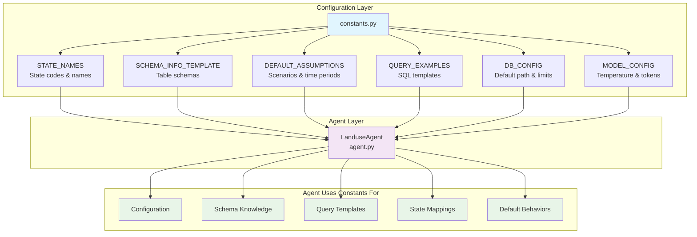

# How Constants.py Connects to the Agent

## Overview

The `constants.py` file serves as a centralized configuration and knowledge base for the LanduseAgent. It contains all the domain-specific information, templates, and defaults that the agent needs to operate effectively.

## Architecture Diagram



## How Each Constant is Used

### 1. **SCHEMA_INFO_TEMPLATE** (Database Knowledge)

The agent uses this to understand the database structure:

```python
# In agent.py _get_schema_info() method:
def _get_schema_info(self) -> str:
    # Start with template
    schema_info = SCHEMA_INFO_TEMPLATE
    
    # Add actual table counts...
    # The template provides the base knowledge about tables and relationships
```

**Purpose**: Gives the LLM complete understanding of the database schema so it can generate correct SQL queries.

### 2. **STATE_NAMES** (Geographic Mapping)

Used in the `get_state_code` tool:

```python
@tool
def get_state_code(state_name: str) -> str:
    # Create reverse mapping
    name_to_code = {v.lower(): k for k, v in STATE_NAMES.items()}
    
    # Convert "Texas" → "48", "California" → "06", etc.
```

**Purpose**: Allows users to use state names naturally ("Texas") instead of codes ("48").

### 3. **DEFAULT_ASSUMPTIONS** (Query Defaults)

Used in the system prompt to handle ambiguous queries:

```python
def _get_system_prompt(self) -> str:
    return f"""
    DEFAULT ASSUMPTIONS (when user doesn't specify):
    - Scenarios: {DEFAULT_ASSUMPTIONS["scenarios"]}
    - Time Periods: {DEFAULT_ASSUMPTIONS["time_period"]}
    - Geographic Scope: {DEFAULT_ASSUMPTIONS["geographic_scope"]}
    - Transition Type: {DEFAULT_ASSUMPTIONS["transition_type"]}
    """
```

**Purpose**: Provides sensible defaults when users ask vague questions like "How much forest is being lost?"

### 4. **QUERY_EXAMPLES** (SQL Templates)

Used by the `suggest_query_examples` tool:

```python
@tool
def suggest_query_examples(category: str = "general") -> str:
    if category.lower() in QUERY_EXAMPLES:
        return f"Example Query - {category.title()}:\n{QUERY_EXAMPLES[category.lower()]}"
```

**Purpose**: Provides tested SQL patterns for common analysis types.

### 5. **DB_CONFIG** (Database Configuration)

Used during initialization:

```python
config_dict = {
    'db_path': Path(db_path or os.getenv('LANDUSE_DB_PATH', DB_CONFIG['default_path'])),
    'max_query_rows': DB_CONFIG['max_query_limit'],
    'default_display_limit': DB_CONFIG['default_display_limit']
}
```

**Purpose**: Centralizes database-related settings and limits.

### 6. **MODEL_CONFIG** (LLM Configuration)

Used for model defaults:

```python
'model_name': model_name or os.getenv('LANDUSE_MODEL', MODEL_CONFIG['default_openai_model']),
'temperature': temperature or float(os.getenv('TEMPERATURE', str(MODEL_CONFIG['default_temperature']))),
'max_tokens': max_tokens or int(os.getenv('MAX_TOKENS', str(MODEL_CONFIG['default_max_tokens']))),
'max_iterations': MODEL_CONFIG['max_iterations'],
'max_execution_time': MODEL_CONFIG['max_execution_time']
```

**Purpose**: Sets safe defaults for LLM behavior and execution limits.

## Benefits of This Architecture

1. **Separation of Concerns**: Domain knowledge is separated from agent logic
2. **Easy Updates**: Change constants without touching agent code
3. **Reusability**: Multiple agents or tools can share the same constants
4. **Maintainability**: All configuration in one place
5. **Type Safety**: Constants provide consistent types and values

## Example Flow

When a user asks "Which states have the most forest loss?":

1. Agent receives the query
2. Uses **SCHEMA_INFO_TEMPLATE** to understand table relationships
3. Applies **DEFAULT_ASSUMPTIONS** (all scenarios, full time period)
4. May reference **QUERY_EXAMPLES["agricultural_loss"]** as a pattern
5. Uses **STATE_NAMES** to convert state codes to names in results
6. Respects **DB_CONFIG** limits on query size
7. Operates within **MODEL_CONFIG** constraints

## Environment Variable Overrides

Many constants can be overridden via environment variables:

```bash
# Override defaults
export LANDUSE_MAX_QUERY_ROWS=5000
export LANDUSE_MAX_ITERATIONS=10
export LANDUSE_MODEL=gpt-4

# Constants.py reads these in DB_CONFIG and MODEL_CONFIG
```

This provides flexibility without code changes.

## Summary

The modern RPA Land Use Analytics configuration architecture provides:

### Layered Configuration
- **`LanduseConfig`**: Type-safe, environment-aware configuration dataclass
- **`constants.py`**: RPA domain knowledge and tested query patterns  
- **`prompts.py`**: Modular system prompts with domain specialization
- **`state_mappings.py`**: Geographic utilities and FIPS code management

### Key Improvements Over Legacy Patterns
1. **Type Safety**: Dataclass-based configuration with validation
2. **Environment Integration**: Seamless deployment configuration
3. **Modularity**: Clear separation of concerns
4. **Extensibility**: Easy addition of new capabilities and domains
5. **Testing**: Configuration isolation and mocking support

### Production Benefits
- **Reliability**: Robust configuration loading with fallbacks
- **Monitoring**: Configuration-aware logging and diagnostics  
- **Deployment**: Environment-based configuration for different stages
- **Maintenance**: Single source of truth for domain knowledge

This architecture enables both simple usage (`LanduseAgent()`) and sophisticated customization while maintaining production reliability and developer experience.