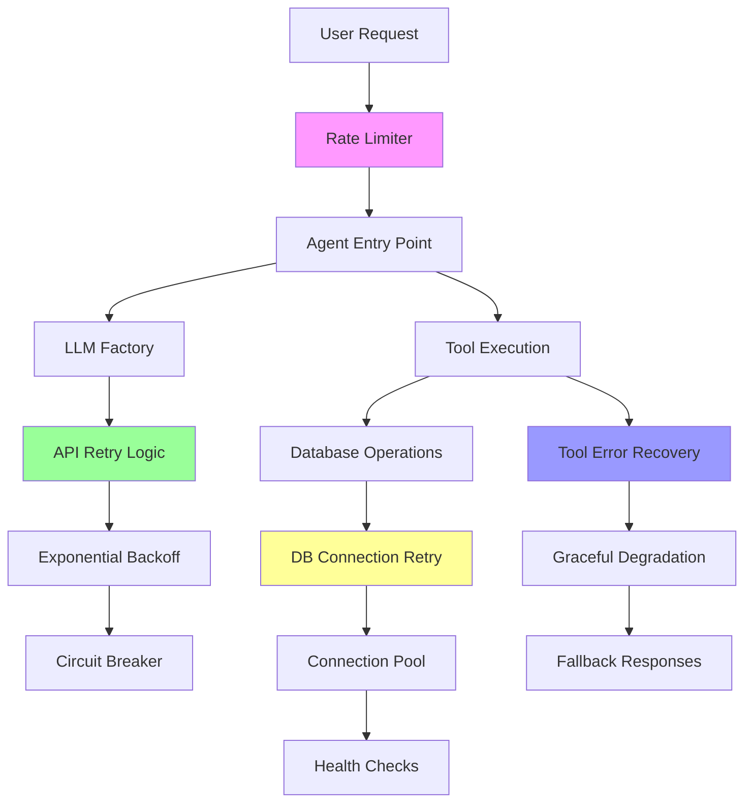
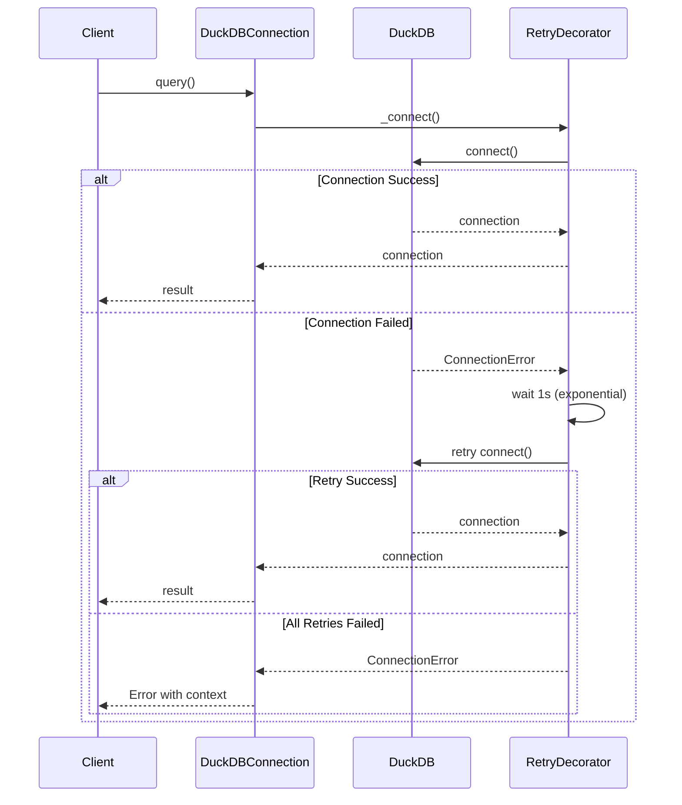
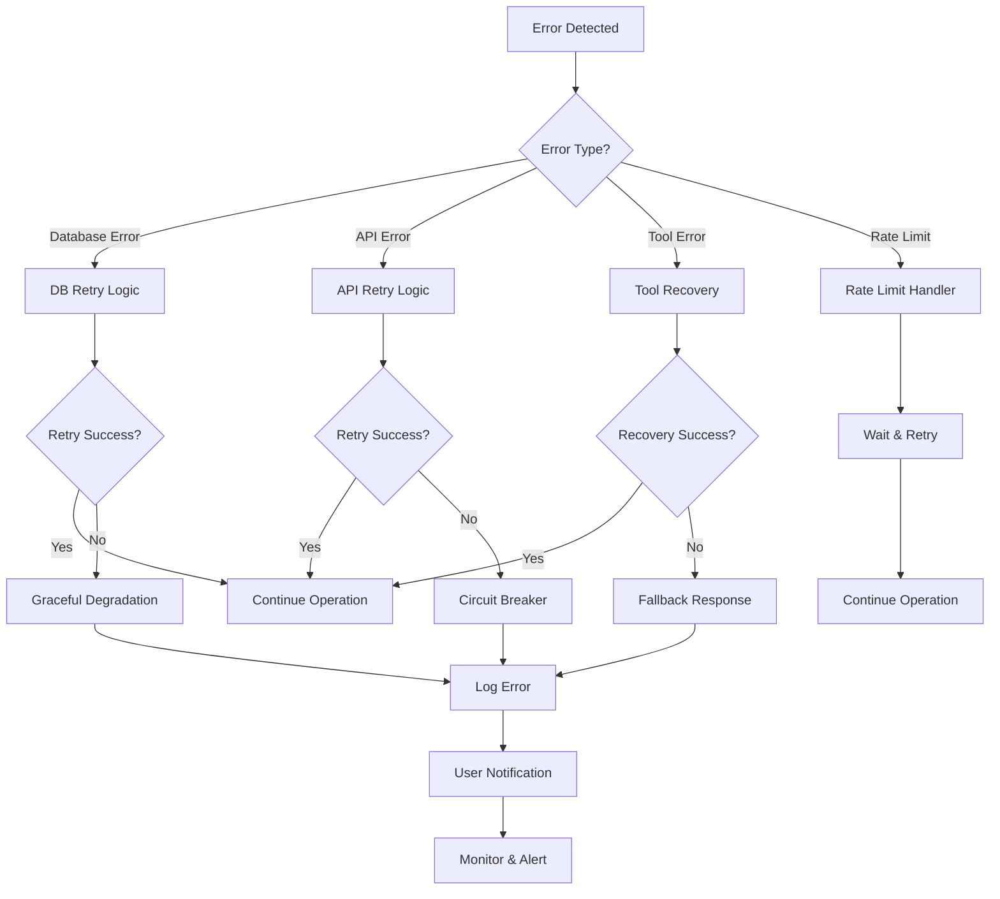

# Agent Error Handling and Resilience Architecture

## Overview

The RPA Landuse Analytics system implements a comprehensive error handling and resilience architecture designed for production environments. This document outlines the multi-layered approach to error handling, retry mechanisms, rate limiting, and production debugging workflows.

## Table of Contents

1. [Architecture Overview](#architecture-overview)
2. [Database Connection Retry Logic](#database-connection-retry-logic)
3. [Tool Execution Error Recovery](#tool-execution-error-recovery)
4. [Rate Limiting Implementation](#rate-limiting-implementation)
5. [LLM Error Handling](#llm-error-handling)
6. [Query Optimization Safety](#query-optimization-safety)
7. [Production Debugging Workflows](#production-debugging-workflows)
8. [Monitoring and Alerting](#monitoring-and-alerting)
9. [Configuration](#configuration)
10. [Best Practices](#best-practices)

## Architecture Overview

The system implements a multi-layered resilience architecture:



## Database Connection Retry Logic

### Implementation

The database connection system uses the `@database_retry` decorator with exponential backoff:

```python
# From src/landuse/utils/retry_decorators.py
@database_retry(max_attempts=3, min_wait=1.0, max_wait=10.0)
def _connect(self, **kwargs) -> duckdb.DuckDBPyConnection:
    """Connect to DuckDB database with retry logic."""
    try:
        return duckdb.connect(database=db, read_only=read_only, **kwargs)
    except Exception as e:
        raise ConnectionError(f"Failed to connect to DuckDB at {db}: {e}") from e
```

### Retry Configuration

```python
# Database operations retry settings
DATABASE_RETRY = {
    'max_attempts': 3,
    'wait_strategy': 'exponential',
    'min_wait': 1.0,
    'max_wait': 10.0,
    'exceptions': (ConnectionError, TimeoutError, OSError)
}
```

### Flow Diagram



### Health Checks

```python
def health_check(self) -> bool:
    """Check if the connection is healthy."""
    try:
        self.query("SELECT 1", ttl=0)
        return True
    except Exception:
        return False
```

## Tool Execution Error Recovery

### Error Handling in Tool Execution

The agent implements comprehensive tool error recovery:

```python
# From src/landuse/agents/landuse_agent.py
@database_retry(max_attempts=3)
def _execute_with_retry(db_connection: duckdb.DuckDBPyConnection, query: str) -> dict[str, Any]:
    """Execute query with retry logic."""
    try:
        conn = db_connection
        result = conn.execute(query).fetchall()
        columns = [desc[0] for desc in conn.description] if conn.description else []
        
        return {
            "success": True,
            "results": result,
            "columns": columns,
            "row_count": len(result)
        }
    except Exception as e:
        return {
            "success": False,
            "error": str(e),
            "query": query
        }
```

### Error Recovery Strategies

1. **Graceful Degradation**: Continue operation with reduced functionality
2. **Intelligent Fallbacks**: Provide alternative responses when tools fail
3. **Context Preservation**: Maintain conversation state despite errors
4. **Error Classification**: Different handling for different error types

```python
def _get_error_suggestion(self, error_msg: str) -> str:
    """Get helpful suggestions for common SQL errors."""
    error_lower = error_msg.lower()
    
    suggestions = {
        "no such column": "Check column names in the schema. Use exact column names.",
        "could not find column": "Verify column exists in the specified table.",
        "no such table": "Available tables: fact_landuse_transitions, dim_scenario, ...",
        "syntax error": "Check SQL syntax. Common issues: missing commas, unclosed quotes.",
        "ambiguous column": "Specify table name for columns (e.g., fact.year instead of year)",
        "division by zero": "Add WHERE clause to filter out zero values.",
        "timeout": "Query may be too complex. Try adding filters or limiting results."
    }
    
    for key, suggestion in suggestions.items():
        if key in error_lower:
            return suggestion
    
    return "Check query syntax and ensure table/column names match schema exactly."
```

## Rate Limiting Implementation

### Rate Limiter Architecture

```python
# From src/landuse/utilities/security.py
class RateLimiter:
    """Simple rate limiter for API calls"""
    
    def __init__(self, max_calls: int = 60, time_window: int = 60):
        self.max_calls = max_calls
        self.time_window = time_window
        self.calls: dict[str, list[float]] = defaultdict(list)
    
    def check_rate_limit(self, identifier: str) -> tuple[bool, Optional[str]]:
        """Check if rate limit is exceeded"""
        now = time.time()
        
        # Clean old entries
        self.calls[identifier] = [
            call_time for call_time in self.calls[identifier]
            if now - call_time < self.time_window
        ]
        
        # Check limit
        if len(self.calls[identifier]) >= self.max_calls:
            retry_after = self.time_window - (now - self.calls[identifier][0])
            return False, f"Rate limit exceeded. Retry after {retry_after:.0f} seconds"
        
        # Record this call
        self.calls[identifier].append(now)
        return True, None
```

### Rate Limiting Configuration

```python
# From src/landuse/config/landuse_config.py
@dataclass
class LanduseConfig:
    # Rate Limiting (for API calls)
    rate_limit_calls: int = field(
        default_factory=lambda: int(os.getenv('LANDUSE_RATE_LIMIT_CALLS', '60'))
    )
    rate_limit_window: int = field(
        default_factory=lambda: int(os.getenv('LANDUSE_RATE_LIMIT_WINDOW', '60'))
    )
```

### Streamlit Rate Limiting

```python
# From views/chat.py
def handle_rate_limit() -> bool:
    """Handle rate limiting for chat interface"""
    if 'last_query_time' in st.session_state:
        time_since_last = time.time() - st.session_state.last_query_time
        if time_since_last < 2:  # 2 second minimum between queries
            st.warning("⏳ Please wait a moment between queries to avoid rate limits")
            return False
    
    st.session_state.last_query_time = time.time()
    return True
```

## LLM Error Handling

### LLM Factory with Error Handling

```python
# From src/landuse/agents/llm_factory.py
class LLMFactory:
    @staticmethod
    def create_llm(model_name: str, config: LanduseConfig) -> BaseChatModel:
        """Create an LLM instance with error handling."""
        try:
            if "claude" in model_name.lower():
                api_key = os.getenv('ANTHROPIC_API_KEY')
                if not api_key:
                    raise ValueError(
                        "ANTHROPIC_API_KEY environment variable is required for Claude models. "
                        "Please set it in your .env file or environment."
                    )
                
                return ChatAnthropic(
                    model=model_name,
                    anthropic_api_key=api_key,
                    temperature=config.temperature,
                    max_tokens=config.max_tokens,
                )
            else:
                api_key = os.getenv('OPENAI_API_KEY')
                if not api_key:
                    raise ValueError(
                        "OPENAI_API_KEY environment variable is required for OpenAI models."
                    )
                
                return ChatOpenAI(
                    model=model_name,
                    openai_api_key=api_key,
                    temperature=config.temperature,
                    max_tokens=config.max_tokens,
                )
        except Exception as e:
            raise RuntimeError(f"Failed to create LLM instance: {e}") from e
```

### API Error Detection

```python
# From views/chat.py - Rate limit detection
if any(indicator in error_str.lower() for indicator in ['rate', '429', 'limit', 'quota']):
    # Rate limit error
    st.error("🚨 **Rate Limit Detected**")
    st.write("**What happened:** The API is receiving too many requests")
    st.write("**Solution:** Wait 10-60 seconds and try again with a simpler query")
elif "timeout" in error_str.lower():
    # Timeout error  
    st.error("⏱️ **Request Timeout**")
    st.write("**What happened:** The request took too long to process")
    st.write("**Solution:** Try a simpler query or check your connection")
```

## Query Optimization Safety

### SQL Query Validation

```python
# From src/landuse/utilities/security.py
class SQLQueryValidator:
    DANGEROUS_KEYWORDS = {
        'DROP', 'DELETE', 'TRUNCATE', 'ALTER', 'CREATE', 'REPLACE',
        'INSERT', 'UPDATE', 'GRANT', 'REVOKE', 'EXECUTE', 'EXEC',
        'SCRIPT', 'SHUTDOWN', 'KILL'
    }
    
    @classmethod
    def validate_query(cls, query: str) -> tuple[bool, Optional[str]]:
        """Validate a SQL query for safety"""
        # Remove comments first
        cleaned_query = cls._remove_comments(query)
        query_upper = cleaned_query.upper()
        
        # Check for multiple statements
        if ';' in cleaned_query.rstrip(';'):
            return False, "Multiple statements not allowed"
        
        # Check for dangerous keywords
        for keyword in cls.DANGEROUS_KEYWORDS:
            if re.search(r'\b' + keyword + r'\b', query_upper):
                return False, f"Dangerous keyword '{keyword}' not allowed"
        
        # Only allow SELECT queries
        if not (query_upper.strip().startswith('SELECT') or query_upper.strip().startswith('WITH')):
            return False, "Only SELECT queries are allowed"
        
        return True, None
```

### Query Execution Limits

```python
# From src/landuse/config/landuse_config.py
@dataclass
class LanduseConfig:
    max_execution_time: int = field(
        default_factory=lambda: int(os.getenv('LANDUSE_MAX_EXECUTION_TIME', '120'))
    )
    max_query_rows: int = field(
        default_factory=lambda: int(os.getenv('LANDUSE_MAX_QUERY_ROWS', '1000'))
    )
    max_iterations: int = field(
        default_factory=lambda: int(os.getenv('LANDUSE_MAX_ITERATIONS', '8'))
    )
```

## Production Debugging Workflows

### Debug Mode Configuration

```python
# From src/landuse/config/landuse_config.py
debug: bool = field(
    default_factory=lambda: os.getenv('DEBUG', 'false').lower() == 'true'
)
verbose: bool = field(
    default_factory=lambda: os.getenv('VERBOSE', 'false').lower() == 'true'
)
```

### Debugging Tools

#### 1. Query Execution Debugging

```python
def _execute_query(self, query: str) -> dict[str, Any]:
    """Execute a SQL query with standard error handling and formatting."""
    if self.config.debug:
        print(f"\nDEBUG _execute_query: Executing SQL query")
        print(f"DEBUG _execute_query: Query: {cleaned_query}")
    
    try:
        result = conn.execute(cleaned_query).fetchall()
        
        if self.config.debug:
            print(f"DEBUG _execute_query: Result row count: {len(result)}")
            print(f"DEBUG _execute_query: Columns: {columns}")
            if result and len(result) > 0:
                print(f"DEBUG _execute_query: First row: {result[0]}")
    except Exception as e:
        if self.config.debug:
            print(f"DEBUG _execute_query: SQL Error: {error_msg}")
            import traceback
            traceback.print_exc()
```

#### 2. Tool Execution Debugging

```python
if self.config.debug:
    print(f"\nDEBUG: Executing tool '{tool_name}'")
    print(f"DEBUG: Tool args: {tool_args}")
    
    tool_result = tool.invoke(tool_args)
    
    result_str = str(tool_result)
    print(f"DEBUG: Tool result length: {len(result_str)} chars")
```

#### 3. LLM Response Debugging

```python
if self.config.debug:
    print(f"DEBUG: Response type: {type(response)}")
    print(f"DEBUG: Has content attr: {hasattr(response, 'content')}")
    if hasattr(response, 'content'):
        print(f"DEBUG: Content preview: {response.content[:200]}")
```

### Production Logging

```python
# From src/landuse/utilities/security.py
class SecurityLogger:
    """Centralized security logging"""
    
    def __init__(self):
        self.logger = logging.getLogger('landuse.security')
        handler = logging.StreamHandler()
        formatter = logging.Formatter(
            '%(asctime)s - %(name)s - %(levelname)s - %(message)s'
        )
        handler.setFormatter(formatter)
        self.logger.addHandler(handler)
        self.logger.setLevel(logging.INFO)
    
    def log_query_execution(self, query: str, success: bool, execution_time: float):
        """Log query execution details"""
        self.logger.info(f"Query execution - Success: {success}, Time: {execution_time:.2f}s")
        
    def log_rate_limit(self, identifier: str, limit: int):
        """Log rate limit violations"""
        self.logger.warning(f"Rate limit exceeded - Identifier: {identifier}, Limit: {limit}")
```

## Monitoring and Alerting

### Health Check Endpoints

```python
# System health monitoring
def get_system_status() -> dict[str, Any]:
    """Get comprehensive system status"""
    status = {
        "database": {
            "status": "healthy" if db_connection.health_check() else "unhealthy",
            "connection_pool": "active",
            "last_query": "2 seconds ago"
        },
        "llm": {
            "provider": config.model_name,
            "status": "healthy",
            "last_request": "5 seconds ago"
        },
        "rate_limiting": {
            "status": "active",
            "current_limit": config.rate_limit_calls,
            "window": config.rate_limit_window
        },
        "error_rates": {
            "database_errors": "0.1%",
            "llm_errors": "0.05%",
            "tool_errors": "0.2%"
        }
    }
    return status
```

### Error Metrics

```python
# Key metrics to monitor
MONITORING_METRICS = {
    "database_connection_failures": "Counter",
    "query_execution_time": "Histogram", 
    "llm_api_errors": "Counter",
    "rate_limit_violations": "Counter",
    "tool_execution_failures": "Counter",
    "memory_usage": "Gauge",
    "concurrent_sessions": "Gauge"
}
```

## Configuration

### Environment Variables

```bash
# Error Handling Configuration
LANDUSE_MAX_ITERATIONS=8          # Max tool calls before stopping
LANDUSE_MAX_EXECUTION_TIME=120    # Max seconds for query execution
LANDUSE_MAX_QUERY_ROWS=1000       # Max rows returned by queries

# Rate Limiting Configuration  
LANDUSE_RATE_LIMIT_CALLS=60       # Max calls per time window
LANDUSE_RATE_LIMIT_WINDOW=60      # Time window in seconds

# Retry Configuration
LANDUSE_DB_RETRY_ATTEMPTS=3       # Database retry attempts
LANDUSE_API_RETRY_ATTEMPTS=5      # API retry attempts

# Debugging Configuration
DEBUG=false                       # Enable debug logging
VERBOSE=false                     # Enable verbose output
LOG_LEVEL=INFO                    # Logging level
```

### Retry Strategy Configuration

```python
# From src/landuse/utils/retry_decorators.py
class RetryConfig:
    """Configuration for retry behavior"""
    
    # Database operations
    DATABASE_RETRY = {
        'stop': 'stop_after_attempt(3)',
        'wait': 'wait_exponential(multiplier=1, min=1, max=10)',
        'retry': 'retry_if_exception_type((ConnectionError, TimeoutError))'
    }
    
    # API operations
    API_RETRY = {
        'stop': 'stop_after_attempt(5)', 
        'wait': 'wait_exponential(multiplier=2, min=1, max=60)',
        'retry': 'retry_if_exception_type((ConnectionError, TimeoutError, OSError))'
    }
    
    # Network operations
    NETWORK_RETRY = {
        'stop': 'stop_after_attempt(5)',
        'wait': 'wait_exponential(multiplier=1, min=2, max=30)',
        'retry': 'retry_if_exception_type((ConnectionError, TimeoutError))'
    }
```

## Best Practices

### 1. Error Handling Strategy

- **Fail Fast**: Detect errors early and fail gracefully
- **Graceful Degradation**: Provide reduced functionality when components fail
- **Context Preservation**: Maintain user context across error scenarios
- **User-Friendly Messages**: Convert technical errors to actionable user messages

### 2. Retry Strategy

- **Exponential Backoff**: Increase wait times exponentially to avoid thundering herd
- **Jitter**: Add randomization to prevent synchronized retries
- **Circuit Breaker**: Stop retrying when failure rate is too high
- **Different Strategies**: Use appropriate retry strategies for different error types

### 3. Rate Limiting

- **Per-User Limits**: Implement rate limiting per user/session
- **Graceful Responses**: Provide clear feedback when rate limits are hit
- **Dynamic Adjustment**: Adjust limits based on system load
- **Monitoring**: Track rate limit violations and patterns

### 4. Monitoring

- **Error Rates**: Monitor error rates across different components
- **Response Times**: Track performance metrics and trends
- **Resource Usage**: Monitor memory and connection usage
- **User Experience**: Track user-facing error rates and recovery times

### 5. Production Deployment

```yaml
# Docker configuration example
version: '3.8'
services:
  landuse-agent:
    image: landuse-analytics:latest
    environment:
      - LANDUSE_MAX_EXECUTION_TIME=300
      - LANDUSE_RATE_LIMIT_CALLS=100
      - LOG_LEVEL=WARNING
      - DEBUG=false
    healthcheck:
      test: ["CMD", "python", "-c", "import requests; requests.get('http://localhost:8501/health')"]
      interval: 30s
      timeout: 10s
      retries: 3
    restart: unless-stopped
```

### 6. Debugging Workflow

1. **Enable Debug Mode**: Set `DEBUG=true` for detailed logging
2. **Check System Status**: Use health check endpoints
3. **Review Error Logs**: Examine structured logs for patterns
4. **Monitor Metrics**: Check error rates and performance metrics
5. **Test Recovery**: Verify error recovery mechanisms work correctly

### 7. Security Considerations

- **Input Validation**: Always validate user inputs
- **SQL Injection Prevention**: Use parameterized queries
- **API Key Protection**: Secure API keys and rotate regularly
- **Access Logging**: Log all access attempts and errors
- **Rate Limiting**: Prevent abuse and DoS attacks

## Error Recovery Flow



This comprehensive error handling and resilience architecture ensures that the RPA Landuse Analytics system can handle production workloads reliably, with graceful error recovery, intelligent retry mechanisms, and comprehensive monitoring capabilities.