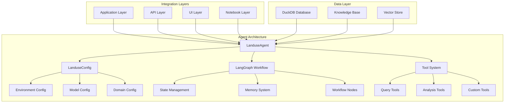

# Agent Integration and Extension Guide

This comprehensive guide explains how to integrate and extend the RPA Land Use Analytics agent system for different applications and custom use cases.

## Table of Contents

1. [Integration Architecture Overview](#integration-architecture-overview)
2. [Embedding Agents in Applications](#embedding-agents-in-applications)
3. [Streamlit Integration Patterns](#streamlit-integration-patterns)
4. [Custom Domain Specialization](#custom-domain-specialization)
5. [Agent Subclassing and Extension](#agent-subclassing-and-extension)
6. [API Integration Patterns](#api-integration-patterns)
7. [Jupyter Notebook Integration](#jupyter-notebook-integration)
8. [Testing Custom Agent Implementations](#testing-custom-agent-implementations)
9. [Production Deployment Patterns](#production-deployment-patterns)
10. [Security Considerations](#security-considerations)

---

## Integration Architecture Overview

The RPA Land Use Analytics agent system follows a modular, extensible architecture built on three core components:



### Core Integration Principles

1. **Configuration-Driven**: All behavior controlled through `LanduseConfig`
2. **Framework-Agnostic**: Core agent works with any Python framework
3. **Memory-Aware**: Built-in conversation state management
4. **Tool-Extensible**: Easy addition of custom tools and capabilities
5. **Type-Safe**: Full Pydantic v2 validation and type checking

---

## Embedding Agents in Applications

### Basic Integration Pattern

The simplest way to embed an agent in any Python application:

```python
from landuse.agents import LanduseAgent
from landuse.config import LanduseConfig

class MyApplication:
    def __init__(self):
        # Configure agent for your use case
        config = LanduseConfig.for_agent_type('basic', 
            model_name="gpt-4o-mini",
            enable_memory=False,  # Disable if you handle state externally
            debug=False
        )
        self.agent = LanduseAgent(config=config)
    
    def process_user_query(self, user_input: str) -> str:
        """Process a user query and return results"""
        try:
            return self.agent.query(user_input)
        except Exception as e:
            return f"Error processing query: {e}"
    
    def get_schema_info(self) -> str:
        """Get database schema for UI display"""
        return self.agent._get_schema_help()
    
    def clear_conversation(self):
        """Reset conversation history"""
        self.agent.clear_history()
```

### Advanced Integration with Custom State

For applications that need custom state management:

```python
from landuse.agents import LanduseAgent
from landuse.config import LanduseConfig
from typing import Dict, Any, Optional

class CustomStateAgent:
    def __init__(self, user_id: str):
        self.user_id = user_id
        self.config = LanduseConfig.for_agent_type('basic')
        self.agent = LanduseAgent(config=self.config)
        self.user_context = {}
        
    def query_with_context(self, 
                          question: str, 
                          context: Optional[Dict[str, Any]] = None) -> str:
        """Execute query with additional user context"""
        
        # Add context to the question
        if context:
            context_str = self._format_context(context)
            enhanced_question = f"Context: {context_str}\n\nQuestion: {question}"
        else:
            enhanced_question = question
            
        # Execute query
        return self.agent.query(enhanced_question)
    
    def _format_context(self, context: Dict[str, Any]) -> str:
        """Format context for inclusion in queries"""
        parts = []
        if 'user_region' in context:
            parts.append(f"User is interested in {context['user_region']}")
        if 'focus_area' in context:
            parts.append(f"Focus on {context['focus_area']} analysis")
        return "; ".join(parts)
```

---

## Streamlit Integration Patterns

The codebase includes a comprehensive Streamlit integration that demonstrates best practices for web UI integration.

### Key Integration Components

#### 1. Agent Caching with TTL

```python
@st.cache_resource(ttl=300)  # 5 minute TTL
def get_agent(model_name: str = None):
    """Cached agent initialization with error handling"""
    try:
        config = LanduseConfig.for_agent_type('streamlit', 
            model_name=model_name,
            debug=True
        )
        agent = LanduseAgent(config=config)
        return agent, None
    except Exception as e:
        return None, str(e)
```

#### 2. Fragment-Based UI Updates

```python
@st.fragment
def handle_user_input():
    """Isolated UI fragment for user input handling"""
    agent, error = get_agent(st.session_state.selected_model)
    
    if error:
        st.error(f"❌ {error}")
        return
    
    if prompt := st.chat_input("Ask about land use..."):
        # Process query with error handling
        with st.chat_message("assistant"):
            with st.spinner("🔍 Analyzing..."):
                response = agent.query(prompt)
                st.markdown(response)
```

#### 3. Model Selection and State Management

```python
def initialize_session_state():
    """Initialize Streamlit session state"""
    if "messages" not in st.session_state:
        st.session_state.messages = []
    if "selected_model" not in st.session_state:
        st.session_state.selected_model = "gpt-4o-mini"

def handle_model_change(selected_model: str):
    """Handle model selection changes"""
    if selected_model != st.session_state.selected_model:
        st.session_state.selected_model = selected_model
        st.session_state.messages = []  # Clear history
        st.cache_resource.clear()  # Clear agent cache
        st.rerun()
```

### Complete Streamlit Integration Example

```python
import streamlit as st
from landuse.agents import LanduseAgent
from landuse.config import LanduseConfig

def create_agent_app():
    st.title("🌲 Land Use Analytics")
    
    # Initialize session state
    if "agent" not in st.session_state:
        config = LanduseConfig.for_agent_type('streamlit')
        st.session_state.agent = LanduseAgent(config=config)
    
    # Chat interface
    for message in st.session_state.get("messages", []):
        with st.chat_message(message["role"]):
            st.markdown(message["content"])
    
    # User input
    if prompt := st.chat_input("Ask about land use data..."):
        # Add user message
        st.session_state.messages.append({"role": "user", "content": prompt})
        
        with st.chat_message("user"):
            st.markdown(prompt)
        
        # Get agent response
        with st.chat_message("assistant"):
            with st.spinner("Processing..."):
                response = st.session_state.agent.query(prompt)
                st.markdown(response)
                
        # Store assistant response
        st.session_state.messages.append({"role": "assistant", "content": response})

if __name__ == "__main__":
    create_agent_app()
```

---

## Custom Domain Specialization

Create domain-specific agents by customizing configuration and tools.

### Agricultural Focus Agent

```python
from landuse.agents import LanduseAgent
from landuse.config import LanduseConfig

class AgriculturalAgent(LanduseAgent):
    """Specialized agent for agricultural land use analysis"""
    
    def __init__(self):
        config = LanduseConfig(
            domain_focus='agriculture',
            analysis_style='detailed',
            enable_map_generation=True
        )
        super().__init__(config=config)
        
        # Override system prompt for agricultural focus
        self.system_prompt = self._get_agricultural_prompt()
    
    def _get_agricultural_prompt(self) -> str:
        """Get agricultural-focused system prompt"""
        return """
        You are an agricultural land use specialist analyzing USDA Forest Service RPA data.
        
        Focus specifically on:
        - Crop and pasture land transitions
        - Agricultural productivity impacts
        - Climate scenario effects on farming
        - Regional agricultural patterns
        
        Always prioritize agricultural land use types (crop, pasture) in your analysis.
        Provide specific recommendations for agricultural planning.
        
        Available land use types:
        - crop: Agricultural cropland
        - pasture: Livestock grazing land
        - forest: Forested areas
        - urban: Developed/built areas
        - rangeland: Natural grasslands
        
        """ + self.schema

class UrbanPlanningAgent(LanduseAgent):
    """Specialized agent for urban development analysis"""
    
    def __init__(self):
        config = LanduseConfig(
            domain_focus='urban',
            analysis_style='policy-focused',
            enable_map_generation=True
        )
        super().__init__(config=config)
        self.system_prompt = self._get_urban_prompt()
    
    def _get_urban_prompt(self) -> str:
        """Get urban planning focused system prompt"""
        return """
        You are an urban planning specialist analyzing land development patterns.
        
        Focus on:
        - Urban expansion patterns and rates
        - What land types are being developed
        - Regional development pressures
        - Infrastructure and growth planning implications
        
        Always highlight urban development trends and their sources.
        Provide insights relevant to city planners and development agencies.
        
        """ + self.schema

# Usage example
def create_specialized_agents():
    """Create domain-specific agents"""
    ag_agent = AgriculturalAgent()
    urban_agent = UrbanPlanningAgent()
    
    # Agricultural analysis
    crop_analysis = ag_agent.query(
        "Which regions are losing the most agricultural land to development?"
    )
    
    # Urban planning analysis  
    urban_growth = urban_agent.query(
        "What are the top 10 fastest growing urban areas?"
    )
    
    return crop_analysis, urban_growth
```

### Climate Impact Specialist Agent

```python
class ClimateImpactAgent(LanduseAgent):
    """Specialized agent for climate scenario analysis"""
    
    def __init__(self):
        config = LanduseConfig(
            domain_focus='climate',
            analysis_style='scientific',
            enable_map_generation=True,
            max_iterations=10  # Allow more complex analysis
        )
        super().__init__(config=config)
        
        # Add climate-specific tools
        self.tools.extend(self._create_climate_tools())
    
    def _create_climate_tools(self):
        """Create specialized climate analysis tools"""
        from langchain.tools import tool
        
        @tool
        def compare_rcp_scenarios(query: str) -> str:
            """Compare RCP45 vs RCP85 climate scenarios"""
            # Custom climate comparison logic
            pass
            
        @tool
        def analyze_temperature_impacts(region: str) -> str:
            """Analyze land use impacts by temperature increase"""
            # Temperature impact analysis
            pass
            
        return [compare_rcp_scenarios, analyze_temperature_impacts]
    
    def analyze_climate_scenarios(self, region: str = None) -> str:
        """Perform comprehensive climate scenario analysis"""
        if region:
            question = f"Compare how RCP45 and RCP85 scenarios affect land use in {region}"
        else:
            question = "Compare national land use changes between RCP45 and RCP85 scenarios"
            
        return self.query(question)
```

---

## Agent Subclassing and Extension

### Base Extension Pattern

```python
from landuse.agents import LanduseAgent
from landuse.config import LanduseConfig
from typing import Optional, Dict, Any

class CustomAgent(LanduseAgent):
    """Base class for custom agent extensions"""
    
    def __init__(self, 
                 config: Optional[LanduseConfig] = None,
                 custom_tools: Optional[list] = None):
        
        # Initialize base agent
        super().__init__(config)
        
        # Add custom tools
        if custom_tools:
            self.tools.extend(custom_tools)
            
        # Custom initialization
        self._setup_custom_features()
    
    def _setup_custom_features(self):
        """Override for custom setup logic"""
        pass
    
    def custom_query(self, 
                    question: str, 
                    custom_context: Dict[str, Any]) -> str:
        """Query with custom context injection"""
        # Add custom context processing
        enhanced_question = self._enhance_with_context(question, custom_context)
        return self.query(enhanced_question)
    
    def _enhance_with_context(self, 
                             question: str, 
                             context: Dict[str, Any]) -> str:
        """Add custom context to questions"""
        # Override for custom context handling
        return question
    
    def validate_query(self, question: str) -> bool:
        """Add custom query validation"""
        # Override for custom validation logic
        return len(question.strip()) > 0
```

### Cached Response Agent

```python
from functools import lru_cache
import hashlib

class CachedResponseAgent(LanduseAgent):
    """Agent with response caching for improved performance"""
    
    def __init__(self, config: Optional[LanduseConfig] = None):
        super().__init__(config)
        self._response_cache = {}
    
    def query(self, question: str) -> str:
        """Query with response caching"""
        # Generate cache key
        cache_key = self._generate_cache_key(question)
        
        # Check cache
        if cache_key in self._response_cache:
            return self._response_cache[cache_key]
        
        # Execute query
        response = super().query(question)
        
        # Cache response
        self._response_cache[cache_key] = response
        
        return response
    
    def _generate_cache_key(self, question: str) -> str:
        """Generate cache key for question"""
        normalized = question.lower().strip()
        return hashlib.md5(normalized.encode()).hexdigest()
    
    def clear_cache(self):
        """Clear response cache"""
        self._response_cache.clear()
```

### Logging and Metrics Agent

```python
import logging
import time
from datetime import datetime

class MonitoredAgent(LanduseAgent):
    """Agent with comprehensive logging and metrics"""
    
    def __init__(self, config: Optional[LanduseConfig] = None):
        super().__init__(config)
        self.logger = logging.getLogger(f"agent.{id(self)}")
        self.metrics = {
            'queries_processed': 0,
            'total_processing_time': 0,
            'errors': 0,
            'successful_queries': 0
        }
    
    def query(self, question: str) -> str:
        """Query with monitoring and metrics"""
        start_time = time.time()
        self.metrics['queries_processed'] += 1
        
        self.logger.info(f"Processing query: {question[:100]}...")
        
        try:
            response = super().query(question)
            self.metrics['successful_queries'] += 1
            self.logger.info(f"Query completed successfully")
            return response
            
        except Exception as e:
            self.metrics['errors'] += 1
            self.logger.error(f"Query failed: {e}")
            raise
            
        finally:
            processing_time = time.time() - start_time
            self.metrics['total_processing_time'] += processing_time
            self.logger.info(f"Query processing time: {processing_time:.2f}s")
    
    def get_metrics(self) -> Dict[str, Any]:
        """Get agent performance metrics"""
        avg_time = (self.metrics['total_processing_time'] / 
                   max(self.metrics['queries_processed'], 1))
        
        return {
            **self.metrics,
            'average_processing_time': avg_time,
            'success_rate': (self.metrics['successful_queries'] / 
                           max(self.metrics['queries_processed'], 1)),
            'timestamp': datetime.now().isoformat()
        }
```

---

## API Integration Patterns

### FastAPI Integration

```python
from fastapi import FastAPI, HTTPException, BackgroundTasks
from pydantic import BaseModel
from typing import Optional, Dict, Any
from landuse.agents import LanduseAgent
from landuse.config import LanduseConfig

app = FastAPI(title="RPA Land Use Analytics API")

# Global agent instance
agent_instance = None

class QueryRequest(BaseModel):
    question: str
    model_name: Optional[str] = "gpt-4o-mini"
    context: Optional[Dict[str, Any]] = None

class QueryResponse(BaseModel):
    answer: str
    processing_time: float
    model_used: str
    timestamp: str

@app.on_event("startup")
async def startup_event():
    """Initialize agent on startup"""
    global agent_instance
    config = LanduseConfig.for_agent_type('basic')
    agent_instance = LanduseAgent(config=config)

@app.post("/query", response_model=QueryResponse)
async def process_query(request: QueryRequest):
    """Process a natural language query"""
    if not agent_instance:
        raise HTTPException(status_code=503, detail="Agent not initialized")
    
    start_time = time.time()
    
    try:
        # Process the query
        answer = agent_instance.query(request.question)
        processing_time = time.time() - start_time
        
        return QueryResponse(
            answer=answer,
            processing_time=processing_time,
            model_used=agent_instance.model_name,
            timestamp=datetime.now().isoformat()
        )
        
    except Exception as e:
        raise HTTPException(status_code=500, detail=f"Query processing failed: {e}")

@app.get("/schema")
async def get_schema():
    """Get database schema information"""
    if not agent_instance:
        raise HTTPException(status_code=503, detail="Agent not initialized")
    
    return {"schema": agent_instance._get_schema_help()}

@app.post("/clear-history")
async def clear_history():
    """Clear agent conversation history"""
    if not agent_instance:
        raise HTTPException(status_code=503, detail="Agent not initialized")
    
    agent_instance.clear_history()
    return {"message": "History cleared successfully"}

# Health check endpoint
@app.get("/health")
async def health_check():
    """Health check endpoint"""
    return {
        "status": "healthy",
        "agent_initialized": agent_instance is not None,
        "timestamp": datetime.now().isoformat()
    }
```

### Flask Integration

```python
from flask import Flask, request, jsonify
from flask_cors import CORS
from landuse.agents import LanduseAgent
from landuse.config import LanduseConfig
import time
from datetime import datetime

app = Flask(__name__)
CORS(app)  # Enable CORS for web frontends

# Initialize agent
config = LanduseConfig.for_agent_type('basic')
agent = LanduseAgent(config=config)

@app.route('/api/query', methods=['POST'])
def process_query():
    """Process a natural language query"""
    try:
        data = request.get_json()
        question = data.get('question')
        
        if not question:
            return jsonify({'error': 'Question is required'}), 400
        
        start_time = time.time()
        answer = agent.query(question)
        processing_time = time.time() - start_time
        
        return jsonify({
            'answer': answer,
            'processing_time': processing_time,
            'model_used': agent.model_name,
            'timestamp': datetime.now().isoformat()
        })
        
    except Exception as e:
        return jsonify({'error': str(e)}), 500

@app.route('/api/schema', methods=['GET'])
def get_schema():
    """Get database schema"""
    return jsonify({'schema': agent._get_schema_help()})

@app.route('/api/health', methods=['GET'])
def health_check():
    """Health check"""
    return jsonify({
        'status': 'healthy',
        'timestamp': datetime.now().isoformat()
    })

if __name__ == '__main__':
    app.run(debug=True, host='0.0.0.0', port=5000)
```

### Express.js Integration (Python API Called from Node.js)

```javascript
// server.js
const express = require('express');
const { spawn } = require('child_process');
const cors = require('cors');

const app = express();
app.use(cors());
app.use(express.json());

// Call Python agent via subprocess
function callPythonAgent(question) {
    return new Promise((resolve, reject) => {
        const python = spawn('python', ['-c', `
import sys
sys.path.insert(0, 'src')
from landuse.agents import LanduseAgent
from landuse.config import LanduseConfig

config = LanduseConfig.for_agent_type('basic')
agent = LanduseAgent(config=config)
result = agent.query("${question}")
print(result)
        `]);
        
        let result = '';
        python.stdout.on('data', (data) => {
            result += data.toString();
        });
        
        python.on('close', (code) => {
            if (code === 0) {
                resolve(result.trim());
            } else {
                reject(new Error(`Python process exited with code ${code}`));
            }
        });
    });
}

app.post('/api/query', async (req, res) => {
    try {
        const { question } = req.body;
        const answer = await callPythonAgent(question);
        res.json({ answer });
    } catch (error) {
        res.status(500).json({ error: error.message });
    }
});

app.listen(3000, () => {
    console.log('Server running on port 3000');
});
```

---

## Jupyter Notebook Integration

### Basic Notebook Integration

```python
# Cell 1: Setup
import sys
from pathlib import Path

# Add source path
src_path = Path.cwd() / "src"
sys.path.insert(0, str(src_path))

from landuse.agents import LanduseAgent
from landuse.config import LanduseConfig
import pandas as pd
import matplotlib.pyplot as plt

# Cell 2: Initialize Agent
config = LanduseConfig.for_agent_type('basic', 
    model_name="gpt-4o-mini",
    enable_map_generation=True,
    debug=True
)
agent = LanduseAgent(config=config)

print("✅ Agent initialized successfully")
print(f"🤖 Using model: {agent.model_name}")
```

### Interactive Research Notebook

```python
# Cell 3: Interactive Query Function
def ask_agent(question: str, show_debug: bool = False):
    """Wrapper for agent queries with notebook-friendly output"""
    print(f"🔍 Question: {question}")
    print("-" * 50)
    
    try:
        response = agent.query(question)
        print("📊 Answer:")
        print(response)
        
        if show_debug:
            print("\n🐛 Debug Info:")
            print(f"Model: {agent.model_name}")
            print(f"History length: {len(agent.conversation_history)}")
            
    except Exception as e:
        print(f"❌ Error: {e}")
    
    print("\n" + "="*70 + "\n")

# Cell 4: Research Questions
research_questions = [
    "How much agricultural land is projected to be lost by 2070?",
    "Which climate scenarios show the most forest loss?",
    "What are the top 5 states for urban expansion?",
    "Compare RCP45 vs RCP85 scenarios for California"
]

# Execute all research questions
for question in research_questions:
    ask_agent(question)
```

### Data Analysis Integration

```python
# Cell 5: Extract Data for Analysis
def get_raw_data(query: str) -> pd.DataFrame:
    """Get raw data from agent for further analysis"""
    # Execute query to get structured data
    response = agent._execute_query(query)
    
    if response['success']:
        return pd.DataFrame(response['results'], columns=response['columns'])
    else:
        raise Exception(f"Query failed: {response['error']}")

# Example: Get agricultural land loss data
sql_query = """
SELECT 
    g.state_name,
    s.scenario_name,
    SUM(f.change_in_area) as total_ag_loss
FROM fact_landuse_transitions f
JOIN dim_geography g ON f.fips_code = g.fips_code
JOIN dim_scenario s ON f.scenario_id = s.scenario_id
JOIN dim_landuse l1 ON f.from_landuse_id = l1.landuse_id
WHERE l1.landuse_name IN ('crop', 'pasture')
    AND f.change_in_area < 0
GROUP BY g.state_name, s.scenario_name
ORDER BY total_ag_loss
"""

ag_data = get_raw_data(sql_query)

# Cell 6: Visualization
plt.figure(figsize=(12, 8))
ag_pivot = ag_data.pivot(index='state_name', 
                        columns='scenario_name', 
                        values='total_ag_loss')
ag_pivot.plot(kind='bar', figsize=(15, 8))
plt.title('Agricultural Land Loss by State and Scenario')
plt.ylabel('Land Area Change (acres)')
plt.xticks(rotation=45)
plt.tight_layout()
plt.show()
```

### Notebook Research Assistant

```python
class NotebookResearchAssistant:
    """Research assistant for Jupyter notebooks"""
    
    def __init__(self):
        self.agent = LanduseAgent()
        self.research_log = []
    
    def research(self, topic: str, questions: list = None):
        """Conduct research on a topic"""
        print(f"🔬 Researching: {topic}")
        print("="*50)
        
        if not questions:
            # Generate questions automatically
            question_prompt = f"Generate 5 research questions about {topic} using the RPA land use data"
            questions_response = self.agent.query(question_prompt)
            print("📋 Generated Research Questions:")
            print(questions_response)
            print("\n")
        
        results = {}
        for i, question in enumerate(questions or [], 1):
            print(f"❓ Question {i}: {question}")
            answer = self.agent.query(question)
            results[question] = answer
            self.research_log.append({
                'topic': topic,
                'question': question,
                'answer': answer,
                'timestamp': datetime.now()
            })
            print(f"📊 Answer: {answer[:200]}...")
            print("-" * 40)
        
        return results
    
    def export_research(self, filename: str = None):
        """Export research log to file"""
        if not filename:
            filename = f"research_log_{datetime.now().strftime('%Y%m%d_%H%M%S')}.md"
        
        with open(filename, 'w') as f:
            f.write("# RPA Land Use Research Log\n\n")
            for entry in self.research_log:
                f.write(f"## {entry['topic']}\n\n")
                f.write(f"**Question:** {entry['question']}\n\n")
                f.write(f"**Answer:** {entry['answer']}\n\n")
                f.write(f"**Timestamp:** {entry['timestamp']}\n\n")
                f.write("---\n\n")
        
        print(f"📄 Research exported to {filename}")

# Usage
assistant = NotebookResearchAssistant()

# Research agricultural impacts
ag_questions = [
    "Which scenarios show the most agricultural land loss?",
    "What regions are most vulnerable to agricultural decline?",
    "How do different climate pathways affect crop vs pasture land?"
]

ag_results = assistant.research("Agricultural Climate Impacts", ag_questions)
assistant.export_research("agricultural_research.md")
```

---

## Testing Custom Agent Implementations

### Unit Testing Framework

```python
import pytest
from unittest.mock import Mock, patch, MagicMock
from landuse.agents import LanduseAgent
from landuse.config import LanduseConfig

class TestCustomAgent:
    """Test framework for custom agent implementations"""
    
    @pytest.fixture
    def mock_config(self):
        """Create mock configuration"""
        with patch('landuse.config.landuse_config.LanduseConfig.__post_init__'):
            config = LanduseConfig(
                db_path="test.db",
                model_name="gpt-4o-mini"
            )
        return config
    
    @pytest.fixture
    def mock_agent(self, mock_config):
        """Create mock agent for testing"""
        with patch('landuse.agents.landuse_agent.ChatOpenAI') as mock_llm:
            with patch('os.getenv', return_value='test-key'):
                mock_llm_instance = Mock()
                mock_llm.return_value = mock_llm_instance
                
                agent = LanduseAgent(config=mock_config)
                agent.llm = mock_llm_instance
                return agent
    
    def test_agent_initialization(self, mock_agent):
        """Test agent initializes correctly"""
        assert mock_agent is not None
        assert hasattr(mock_agent, 'config')
        assert hasattr(mock_agent, 'llm')
    
    def test_query_processing(self, mock_agent):
        """Test query processing"""
        # Mock LLM response
        mock_response = Mock()
        mock_response.content = "Test response"
        mock_agent.llm.bind_tools.return_value.invoke.return_value = mock_response
        
        result = mock_agent.simple_query("Test question")
        assert "Test response" in result
    
    def test_error_handling(self, mock_agent):
        """Test error handling"""
        # Mock LLM to raise exception
        mock_agent.llm.bind_tools.return_value.invoke.side_effect = Exception("Test error")
        
        result = mock_agent.simple_query("Test question")
        assert "Error" in result

# Custom Agent Testing
class TestCustomDomainAgent:
    """Test domain-specific agents"""
    
    def test_agricultural_agent(self):
        """Test agricultural specialist agent"""
        with patch('landuse.config.landuse_config.LanduseConfig.__post_init__'):
            with patch('landuse.agents.landuse_agent.ChatOpenAI'):
                with patch('os.getenv', return_value='test-key'):
                    from my_custom_agents import AgriculturalAgent
                    
                    agent = AgriculturalAgent()
                    
                    # Test domain-specific configuration
                    assert agent.config.domain_focus == 'agriculture'
                    assert 'agricultural' in agent.system_prompt.lower()
    
    def test_urban_planning_agent(self):
        """Test urban planning specialist agent"""
        with patch('landuse.config.landuse_config.LanduseConfig.__post_init__'):
            with patch('landuse.agents.landuse_agent.ChatOpenAI'):
                with patch('os.getenv', return_value='test-key'):
                    from my_custom_agents import UrbanPlanningAgent
                    
                    agent = UrbanPlanningAgent()
                    
                    # Test domain-specific configuration
                    assert agent.config.domain_focus == 'urban'
                    assert 'urban' in agent.system_prompt.lower()
```

### Integration Testing

```python
import pytest
from pathlib import Path
import tempfile
import duckdb

class TestAgentIntegration:
    """Integration tests for agent systems"""
    
    @pytest.fixture
    def test_database(self):
        """Create test database with minimal schema"""
        with tempfile.NamedTemporaryFile(suffix='.duckdb', delete=False) as f:
            db_path = f.name
        
        # Create test database with minimal schema
        conn = duckdb.connect(db_path)
        conn.execute("""
            CREATE TABLE dim_geography (
                fips_code VARCHAR,
                state_name VARCHAR,
                county_name VARCHAR
            )
        """)
        conn.execute("""
            INSERT INTO dim_geography VALUES 
            ('01001', 'Alabama', 'Autauga'),
            ('01003', 'Alabama', 'Baldwin')
        """)
        conn.close()
        
        yield db_path
        
        # Cleanup
        Path(db_path).unlink()
    
    def test_real_query_execution(self, test_database):
        """Test actual query execution against test database"""
        config = LanduseConfig(
            db_path=test_database,
            model_name="gpt-4o-mini"
        )
        
        with patch('os.getenv', return_value='test-key'):
            agent = LanduseAgent(config=config)
            
            # Test schema retrieval
            schema = agent._get_schema()
            assert 'dim_geography' in schema
            
            # Test query execution
            result = agent._execute_query("SELECT COUNT(*) FROM dim_geography")
            assert result['success'] is True
            assert result['results'][0][0] == 2  # 2 test rows

class TestStreamlitIntegration:
    """Test Streamlit integration patterns"""
    
    def test_agent_caching(self):
        """Test agent caching mechanism"""
        # Mock Streamlit cache
        cache_store = {}
        
        def mock_cache_resource(ttl=None):
            def decorator(func):
                def wrapper(*args, **kwargs):
                    key = str(args) + str(kwargs)
                    if key not in cache_store:
                        cache_store[key] = func(*args, **kwargs)
                    return cache_store[key]
                return wrapper
            return decorator
        
        # Test caching behavior
        with patch('streamlit.cache_resource', mock_cache_resource):
            # First call should initialize agent
            agent1, error1 = get_agent("gpt-4o-mini")
            
            # Second call should return cached agent
            agent2, error2 = get_agent("gpt-4o-mini")
            
            assert agent1 is agent2  # Same instance from cache

def test_api_integration():
    """Test API integration patterns"""
    from your_api_module import app
    from fastapi.testclient import TestClient
    
    client = TestClient(app)
    
    # Test health check
    response = client.get("/health")
    assert response.status_code == 200
    
    # Test query endpoint
    query_data = {"question": "How many counties are in the database?"}
    response = client.post("/query", json=query_data)
    assert response.status_code == 200
    assert "answer" in response.json()
```

### Performance Testing

```python
import time
import pytest
from landuse.agents import LanduseAgent
from landuse.config import LanduseConfig

class TestAgentPerformance:
    """Performance tests for agent implementations"""
    
    def test_query_response_time(self):
        """Test query response times"""
        config = LanduseConfig.for_agent_type('basic')
        agent = LanduseAgent(config=config)
        
        test_queries = [
            "How many land use types are there?",
            "Show me the top 5 states by land area",
            "Compare RCP45 and RCP85 scenarios"
        ]
        
        for query in test_queries:
            start_time = time.time()
            response = agent.query(query)
            response_time = time.time() - start_time
            
            # Assert reasonable response time (< 30 seconds)
            assert response_time < 30.0
            assert len(response) > 0
    
    def test_memory_usage(self):
        """Test memory usage patterns"""
        import psutil
        import os
        
        process = psutil.Process(os.getpid())
        initial_memory = process.memory_info().rss
        
        # Create multiple agents
        agents = []
        for i in range(5):
            config = LanduseConfig.for_agent_type('basic')
            agent = LanduseAgent(config=config)
            agents.append(agent)
        
        final_memory = process.memory_info().rss
        memory_increase = final_memory - initial_memory
        
        # Memory increase should be reasonable (< 500MB)
        assert memory_increase < 500 * 1024 * 1024
    
    def test_concurrent_queries(self):
        """Test concurrent query handling"""
        import threading
        import queue
        
        config = LanduseConfig.for_agent_type('basic')
        agent = LanduseAgent(config=config)
        
        results = queue.Queue()
        
        def worker(query_id):
            try:
                response = agent.query(f"Test query {query_id}")
                results.put(('success', query_id, response))
            except Exception as e:
                results.put(('error', query_id, str(e)))
        
        # Start multiple threads
        threads = []
        for i in range(3):
            thread = threading.Thread(target=worker, args=(i,))
            threads.append(thread)
            thread.start()
        
        # Wait for completion
        for thread in threads:
            thread.join()
        
        # Check results
        success_count = 0
        while not results.empty():
            status, query_id, response = results.get()
            if status == 'success':
                success_count += 1
        
        assert success_count >= 2  # At least 2/3 should succeed
```

---

## Production Deployment Patterns

### Docker Deployment

```dockerfile
# Dockerfile
FROM python:3.11-slim

WORKDIR /app

# Install system dependencies
RUN apt-get update && apt-get install -y \
    build-essential \
    curl \
    && rm -rf /var/lib/apt/lists/*

# Install Python dependencies
COPY requirements.txt .
RUN pip install --no-cache-dir -r requirements.txt

# Copy application code
COPY src/ ./src/
COPY data/ ./data/

# Set environment variables
ENV PYTHONPATH=/app/src
ENV LANDUSE_DB_PATH=/app/data/processed/landuse_analytics.duckdb

# Health check
HEALTHCHECK --interval=30s --timeout=30s --start-period=5s --retries=3 \
    CMD python -c "from landuse.agents import LanduseAgent; LanduseAgent()" || exit 1

# Run application
CMD ["python", "-m", "landuse.agents.agent"]
```

```yaml
# docker-compose.yml
version: '3.8'

services:
  landuse-agent:
    build: .
    ports:
      - "8000:8000"
    environment:
      - OPENAI_API_KEY=${OPENAI_API_KEY}
      - ANTHROPIC_API_KEY=${ANTHROPIC_API_KEY}
      - LANDUSE_MODEL=gpt-4o-mini
      - DEBUG=false
    volumes:
      - ./data:/app/data:ro
      - ./logs:/app/logs
    restart: unless-stopped
    
  nginx:
    image: nginx:alpine
    ports:
      - "80:80"
    volumes:
      - ./nginx.conf:/etc/nginx/nginx.conf
    depends_on:
      - landuse-agent
```

### Kubernetes Deployment

```yaml
# k8s-deployment.yaml
apiVersion: apps/v1
kind: Deployment
metadata:
  name: landuse-agent
spec:
  replicas: 3
  selector:
    matchLabels:
      app: landuse-agent
  template:
    metadata:
      labels:
        app: landuse-agent
    spec:
      containers:
      - name: landuse-agent
        image: landuse-agent:latest
        ports:
        - containerPort: 8000
        env:
        - name: OPENAI_API_KEY
          valueFrom:
            secretKeyRef:
              name: api-keys
              key: openai-key
        - name: ANTHROPIC_API_KEY
          valueFrom:
            secretKeyRef:
              name: api-keys
              key: anthropic-key
        volumeMounts:
        - name: data-volume
          mountPath: /app/data
          readOnly: true
        resources:
          requests:
            memory: "1Gi"
            cpu: "500m"
          limits:
            memory: "2Gi"
            cpu: "1000m"
        livenessProbe:
          httpGet:
            path: /health
            port: 8000
          initialDelaySeconds: 30
          periodSeconds: 10
      volumes:
      - name: data-volume
        persistentVolumeClaim:
          claimName: landuse-data-pvc
---
apiVersion: v1
kind: Service
metadata:
  name: landuse-agent-service
spec:
  selector:
    app: landuse-agent
  ports:
  - protocol: TCP
    port: 80
    targetPort: 8000
  type: LoadBalancer
```

### Environment-Specific Configuration

```python
# production_config.py
from landuse.config import LanduseConfig
import os

class ProductionConfig:
    """Production-specific configuration patterns"""
    
    @staticmethod
    def get_config(environment: str = "production") -> LanduseConfig:
        """Get environment-specific configuration"""
        
        base_config = {
            'debug': False,
            'verbose': False,
            'enable_memory': True,
            'max_iterations': 5,
            'rate_limit_calls': 30,  # Conservative for production
            'rate_limit_window': 60
        }
        
        env_configs = {
            'development': {
                **base_config,
                'debug': True,
                'verbose': True,
                'model_name': 'gpt-4o-mini',
                'max_iterations': 8
            },
            'staging': {
                **base_config,
                'model_name': 'gpt-4o-mini',
                'max_iterations': 6,
                'rate_limit_calls': 20
            },
            'production': {
                **base_config,
                'model_name': os.getenv('PRODUCTION_MODEL', 'gpt-4o'),
                'max_iterations': 5,
                'rate_limit_calls': 10,  # Very conservative
                'max_execution_time': 60  # Shorter timeout
            }
        }
        
        config_kwargs = env_configs.get(environment, env_configs['production'])
        return LanduseConfig.for_agent_type('basic', **config_kwargs)

# Load balancer configuration
class LoadBalancedAgentPool:
    """Pool of agents for load balancing"""
    
    def __init__(self, pool_size: int = 3):
        self.pool_size = pool_size
        self.agents = []
        self.current_index = 0
        
        # Initialize agent pool
        for i in range(pool_size):
            config = ProductionConfig.get_config()
            agent = LanduseAgent(config=config)
            self.agents.append(agent)
    
    def get_agent(self) -> LanduseAgent:
        """Get next agent from pool (round-robin)"""
        agent = self.agents[self.current_index]
        self.current_index = (self.current_index + 1) % self.pool_size
        return agent
    
    def query(self, question: str) -> str:
        """Execute query using load-balanced agent"""
        agent = self.get_agent()
        return agent.query(question)
```

### Monitoring and Observability

```python
# monitoring.py
import logging
import time
from datetime import datetime
from typing import Dict, Any
import prometheus_client
from prometheus_client import Counter, Histogram, Gauge

class AgentMonitoring:
    """Comprehensive monitoring for production agents"""
    
    def __init__(self):
        # Prometheus metrics
        self.query_counter = Counter(
            'agent_queries_total', 
            'Total number of queries processed',
            ['model', 'status']
        )
        
        self.query_duration = Histogram(
            'agent_query_duration_seconds',
            'Time spent processing queries',
            ['model']
        )
        
        self.active_queries = Gauge(
            'agent_active_queries',
            'Number of currently active queries'
        )
        
        # Setup logging
        self.logger = logging.getLogger('agent.monitoring')
        self.setup_logging()
    
    def setup_logging(self):
        """Setup structured logging"""
        handler = logging.StreamHandler()
        formatter = logging.Formatter(
            '%(asctime)s - %(name)s - %(levelname)s - %(message)s'
        )
        handler.setFormatter(formatter)
        self.logger.addHandler(handler)
        self.logger.setLevel(logging.INFO)
    
    def monitor_query(self, agent: LanduseAgent, question: str) -> str:
        """Monitor a query execution"""
        start_time = time.time()
        self.active_queries.inc()
        
        try:
            self.logger.info(f"Starting query: {question[:100]}...")
            
            # Execute query
            response = agent.query(question)
            
            # Record success metrics
            duration = time.time() - start_time
            self.query_counter.labels(
                model=agent.model_name, 
                status='success'
            ).inc()
            self.query_duration.labels(model=agent.model_name).observe(duration)
            
            self.logger.info(f"Query completed successfully in {duration:.2f}s")
            return response
            
        except Exception as e:
            # Record error metrics
            duration = time.time() - start_time
            self.query_counter.labels(
                model=agent.model_name, 
                status='error'
            ).inc()
            
            self.logger.error(f"Query failed after {duration:.2f}s: {e}")
            raise
            
        finally:
            self.active_queries.dec()

# Usage in production API
monitor = AgentMonitoring()

@app.post("/query")
async def monitored_query(request: QueryRequest):
    """API endpoint with monitoring"""
    agent = get_agent()
    response = monitor.monitor_query(agent, request.question)
    return {"answer": response}
```

---

## Security Considerations

### Input Validation and Sanitization

```python
from landuse.utils.security import SecurityValidator
import re
from typing import Optional

class SecureAgent(LanduseAgent):
    """Security-enhanced agent implementation"""
    
    def __init__(self, config: Optional[LanduseConfig] = None):
        super().__init__(config)
        self.security_validator = SecurityValidator()
    
    def query(self, question: str) -> str:
        """Secure query processing with validation"""
        # Input validation
        if not self._validate_input(question):
            return "Invalid input: Query contains potentially harmful content"
        
        # Rate limiting check
        if not self._check_rate_limit():
            return "Rate limit exceeded. Please wait before making another request."
        
        # Execute query with security monitoring
        try:
            return super().query(question)
        except Exception as e:
            # Log security events
            self._log_security_event("query_error", str(e))
            return "An error occurred while processing your request."
    
    def _validate_input(self, question: str) -> bool:
        """Validate user input for security"""
        # Check length
        if len(question) > 1000:
            return False
        
        # Check for SQL injection patterns
        sql_injection_patterns = [
            r'\b(DROP|DELETE|UPDATE|INSERT|CREATE|ALTER)\b',
            r'[;\'"\\]',
            r'--\s',
            r'/\*.*\*/',
        ]
        
        for pattern in sql_injection_patterns:
            if re.search(pattern, question, re.IGNORECASE):
                self._log_security_event("sql_injection_attempt", question)
                return False
        
        # Check for script injection
        script_patterns = [
            r'<script.*?>',
            r'javascript:',
            r'vbscript:',
            r'on\w+\s*=',
        ]
        
        for pattern in script_patterns:
            if re.search(pattern, question, re.IGNORECASE):
                self._log_security_event("script_injection_attempt", question)
                return False
        
        return True
    
    def _check_rate_limit(self) -> bool:
        """Check rate limiting"""
        # Implement rate limiting logic
        # This would typically use Redis or similar
        return True
    
    def _log_security_event(self, event_type: str, details: str):
        """Log security events"""
        import logging
        security_logger = logging.getLogger('security')
        security_logger.warning(f"Security event: {event_type} - {details}")
```

### API Key Management

```python
import os
from cryptography.fernet import Fernet
from typing import Optional

class SecureAPIKeyManager:
    """Secure API key management"""
    
    def __init__(self, key_file: str = ".secret_key"):
        self.key_file = key_file
        self._cipher = self._get_or_create_cipher()
    
    def _get_or_create_cipher(self) -> Fernet:
        """Get or create encryption cipher"""
        if os.path.exists(self.key_file):
            with open(self.key_file, 'rb') as f:
                key = f.read()
        else:
            key = Fernet.generate_key()
            with open(self.key_file, 'wb') as f:
                f.write(key)
            os.chmod(self.key_file, 0o600)  # Secure permissions
        
        return Fernet(key)
    
    def encrypt_key(self, api_key: str) -> str:
        """Encrypt API key"""
        return self._cipher.encrypt(api_key.encode()).decode()
    
    def decrypt_key(self, encrypted_key: str) -> str:
        """Decrypt API key"""
        return self._cipher.decrypt(encrypted_key.encode()).decode()
    
    def get_secure_config(self) -> LanduseConfig:
        """Get configuration with secure key handling"""
        # Check for encrypted keys first
        openai_key = os.getenv('OPENAI_API_KEY_ENCRYPTED')
        if openai_key:
            os.environ['OPENAI_API_KEY'] = self.decrypt_key(openai_key)
        
        anthropic_key = os.getenv('ANTHROPIC_API_KEY_ENCRYPTED')
        if anthropic_key:
            os.environ['ANTHROPIC_API_KEY'] = self.decrypt_key(anthropic_key)
        
        return LanduseConfig.for_agent_type('basic')

# Usage
key_manager = SecureAPIKeyManager()
secure_config = key_manager.get_secure_config()
secure_agent = SecureAgent(config=secure_config)
```

### Access Control and Authentication

```python
from functools import wraps
import jwt
from datetime import datetime, timedelta

class AgentAccessControl:
    """Access control for agent services"""
    
    def __init__(self, secret_key: str):
        self.secret_key = secret_key
        self.authorized_users = set()
    
    def generate_token(self, user_id: str, expires_hours: int = 24) -> str:
        """Generate JWT token for user"""
        payload = {
            'user_id': user_id,
            'exp': datetime.utcnow() + timedelta(hours=expires_hours),
            'iat': datetime.utcnow()
        }
        return jwt.encode(payload, self.secret_key, algorithm='HS256')
    
    def verify_token(self, token: str) -> Optional[str]:
        """Verify JWT token and return user_id"""
        try:
            payload = jwt.decode(token, self.secret_key, algorithms=['HS256'])
            return payload['user_id']
        except jwt.ExpiredSignatureError:
            return None
        except jwt.InvalidTokenError:
            return None
    
    def require_auth(self, func):
        """Decorator for authentication required endpoints"""
        @wraps(func)
        def wrapper(*args, **kwargs):
            # Extract token from request headers
            token = kwargs.get('auth_token')
            if not token:
                raise ValueError("Authentication token required")
            
            user_id = self.verify_token(token)
            if not user_id:
                raise ValueError("Invalid or expired token")
            
            # Add user_id to kwargs
            kwargs['user_id'] = user_id
            return func(*args, **kwargs)
        
        return wrapper

# Secure API endpoint
access_control = AgentAccessControl(secret_key="your-secret-key")

@access_control.require_auth
def secure_query(question: str, auth_token: str = None, user_id: str = None) -> str:
    """Secure query endpoint with authentication"""
    # Log user activity
    logging.info(f"User {user_id} executing query: {question[:50]}...")
    
    # Create user-specific agent configuration
    config = LanduseConfig.for_agent_type('basic')
    agent = SecureAgent(config=config)
    
    return agent.query(question)
```

---

## Conclusion

This guide provides comprehensive patterns for integrating and extending the RPA Land Use Analytics agent system. Key takeaways:

### Best Practices Summary

1. **Configuration-First**: Always use `LanduseConfig` for consistent, type-safe configuration
2. **Framework Integration**: The agent works with any Python framework through simple initialization patterns
3. **Custom Specialization**: Create domain-specific agents by subclassing and customizing prompts/tools
4. **Production Ready**: Include monitoring, security, caching, and error handling for production deployments
5. **Testing Strategy**: Comprehensive unit, integration, and performance testing patterns
6. **Security Focused**: Input validation, rate limiting, secure key management, and access control

### Next Steps

1. **Choose Your Integration**: Start with the pattern that matches your use case (web app, API, notebook)
2. **Customize Configuration**: Use `LanduseConfig.for_agent_type()` for your specific needs
3. **Add Domain Logic**: Extend the base agent with domain-specific prompts and tools
4. **Implement Security**: Add appropriate security measures for your deployment environment
5. **Monitor and Scale**: Use the monitoring patterns for production observability

The modular architecture ensures that integrations are maintainable, secure, and scalable while preserving the core functionality of the RPA Land Use Analytics system.