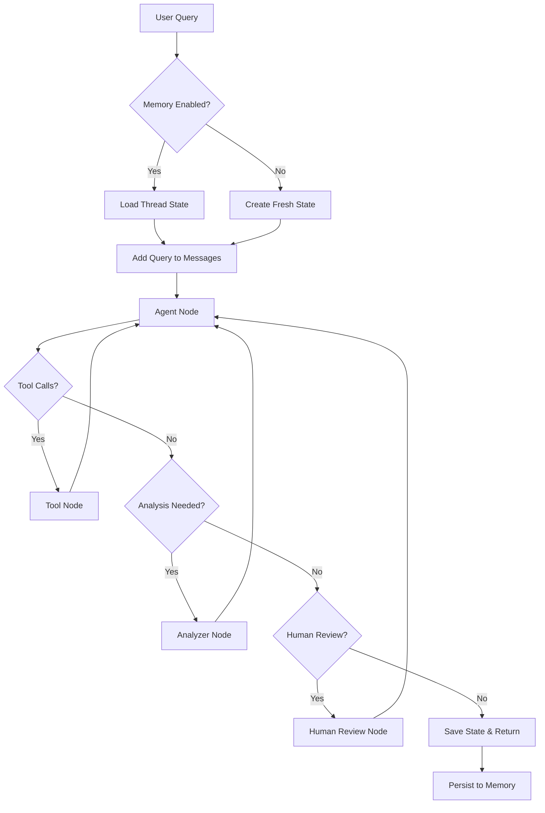

# Memory and State Management Architecture

## Overview

The RPA Land Use Analytics Agent implements a modern, memory-first architecture using LangGraph's state management system. This architecture provides robust conversation memory, state persistence, and thread-based isolation for concurrent conversations.

## Architecture Components

### Core State Management

#### AgentState TypedDict

The agent state is defined using Python's `TypedDict` for type safety and clarity:

```python
class AgentState(TypedDict):
    """State definition for the landuse agent"""
    messages: list[BaseMessage]
    context: dict[str, Any]
    iteration_count: int
    max_iterations: int
```

**State Fields:**
- `messages`: Complete conversation history as LangChain `BaseMessage` objects
- `context`: Arbitrary key-value pairs for maintaining execution context
- `iteration_count`: Current iteration counter to prevent infinite loops
- `max_iterations`: Maximum allowed iterations before terminating

#### Memory Persistence

The agent uses LangGraph's `MemorySaver` for conversation persistence:

```python
from langgraph.checkpoint.memory import MemorySaver

class LanduseAgent:
    def __init__(self, config: Optional[LanduseConfig] = None):
        # Memory-first architecture (2025 best practice)
        self.memory = MemorySaver()
```

## State Flow Architecture



## Memory Configuration

### Configuration Options

Memory features are controlled through the `LanduseConfig` class:

```python
@dataclass
class LanduseConfig:
    # Memory and State Management
    enable_memory: bool = field(
        default_factory=lambda: os.getenv('LANDUSE_ENABLE_MEMORY', 'true').lower() == 'true'
    )
```

### Environment Configuration

```bash
# Enable/disable memory persistence
LANDUSE_ENABLE_MEMORY=true

# Memory is enabled by default for graph-based queries
# Disabled by default for Streamlit (uses session state instead)
```

### Agent Type Configurations

Different agent types have optimized memory configurations:

```python
type_defaults = {
    'basic': {
        'enable_memory': True,
        'max_iterations': 5
    },
    'streamlit': {
        'enable_memory': False,  # Streamlit handles its own state
        'max_iterations': 8
    },
    'map': {
        'enable_memory': True,
        'max_iterations': 8
    }
}
```

## Thread-Based Conversation Management

### Thread ID System

Each conversation is identified by a unique thread ID:

```python
def query(self, question: str, use_graph: bool = False, thread_id: Optional[str] = None) -> str:
    """
    Execute a natural language query using the agent.
    
    Args:
        question: The natural language question to answer
        use_graph: Whether to use the full LangGraph workflow
        thread_id: Optional thread ID for conversation memory
    """
    if use_graph:
        return self._graph_query(question, thread_id)
```

### Thread Configuration

Thread IDs are passed through LangGraph's configuration system:

```python
def _graph_query(self, question: str, thread_id: Optional[str] = None) -> str:
    # Prepare config with thread_id for memory
    config = {}
    if thread_id and self.config.enable_memory:
        config = {"configurable": {"thread_id": thread_id}}
    
    # Execute the graph with memory
    result = self.graph.invoke(initial_state, config=config)
```

### Automatic Thread Generation

For streaming queries without explicit thread IDs:

```python
def stream_query(self, question: str, thread_id: Optional[str] = None) -> Any:
    config = {}
    if thread_id and self.config.enable_memory:
        config = {"configurable": {"thread_id": thread_id}}
    elif not thread_id:
        # Auto-generate thread ID for streaming
        config = {"configurable": {"thread_id": f"landuse-stream-{int(time.time())}"}}
```

## Conversation History Management

### Dual-Mode History

The agent supports two conversation history modes:

#### 1. Simple Mode (In-Memory)

For non-graph queries, conversation history is maintained in memory:

```python
def __init__(self, config: Optional[LanduseConfig] = None):
    # Initialize conversation history for simple mode
    self.conversation_history = []  # Store (role, content) tuples
    self.max_history_length = 20  # Keep last N messages
```

#### 2. Graph Mode (Persistent)

For graph-based queries, history is managed through LangGraph state:

```python
def _graph_query(self, question: str, thread_id: Optional[str] = None) -> str:
    # Add conversation history to context
    for role, content in self.conversation_history:
        if role == "user":
            initial_messages.append(HumanMessage(content=content))
        elif role == "assistant":
            initial_messages.append(AIMessage(content=content))
```

### History Trimming

Automatic history management prevents memory bloat:

```python
def _update_conversation_history(self, question: str, response: str) -> None:
    """Update conversation history with new question and response."""
    self.conversation_history.append(("user", question))
    self.conversation_history.append(("assistant", response))
    
    # Trim history if it gets too long
    if len(self.conversation_history) > self.max_history_length:
        self.conversation_history = self.conversation_history[-self.max_history_length:]
```

## State Persistence Patterns

### Graph Compilation with Checkpointing

```python
def _build_graph(self) -> StateGraph:
    """Build the LangGraph state graph."""
    workflow = StateGraph(AgentState)
    
    # Add nodes and edges...
    
    # Compile with memory if enabled
    if self.config.enable_memory:
        return workflow.compile(checkpointer=self.memory)
    else:
        return workflow.compile()
```

### State Recovery

Conversation state is automatically recovered when using the same thread ID:

```python
# First conversation
response1 = agent.query("What states are in the database?", 
                       use_graph=True, thread_id="user-session-123")

# Follow-up question in same thread (maintains context)
response2 = agent.query("How many counties are in the first state?", 
                       use_graph=True, thread_id="user-session-123")
```

## Streamlit Integration

### Session State Management

Streamlit applications use `st.session_state` for memory:

```python
def initialize_session_state():
    """Initialize session state for chat"""
    if "messages" not in st.session_state:
        st.session_state.messages = []
    
    if "selected_model" not in st.session_state:
        st.session_state.selected_model = "gpt-4o-mini"
```

### Model Switching

Model changes clear conversation history:

```python
if selected_model != st.session_state.selected_model:
    st.session_state.selected_model = selected_model
    st.session_state.messages = []  # Clear chat history
    st.session_state.show_welcome = True
```

### Message Persistence

Chat messages are stored in Streamlit session state:

```python
# Add user message
st.session_state.messages.append({"role": "user", "content": prompt})

# Add assistant response
st.session_state.messages.append({
    "role": "assistant", 
    "content": response,
    "metadata": {"query_time": query_time}
})
```

## Context Management

### Execution Context

The `context` field in `AgentState` stores execution metadata:

```python
initial_state = {
    "messages": initial_messages,
    "context": {},  # Can store query metadata, user preferences, etc.
    "iteration_count": 0,
    "max_iterations": self.config.max_iterations
}
```

### Tool Result Context

Tool execution results can be stored in context for later reference:

```python
def _analyzer_node(self, state: AgentState) -> dict[str, Any]:
    """Analyzer node for providing insights on query results."""
    recent_results = self._extract_recent_results(state["messages"])
    
    # Store analysis in context for future reference
    context = state.get("context", {})
    context["last_analysis"] = recent_results
    
    return {"context": context}
```

## Performance Considerations

### Memory Usage

- **In-Memory History**: Limited to 20 messages by default
- **Thread Isolation**: Each thread maintains separate state
- **Automatic Cleanup**: Old threads are garbage collected by LangGraph

### Scalability

- **Concurrent Threads**: Multiple conversations can run simultaneously
- **Memory Bounds**: History trimming prevents unbounded growth
- **Cache TTL**: Streamlit agent cache expires after 5 minutes

## Debugging State Issues

### Debug Configuration

Enable detailed state debugging:

```python
config = LanduseConfig(debug=True, verbose=True)
agent = LanduseAgent(config)
```

### State Inspection

Monitor state flow in debug mode:

```python
if self.config.debug:
    print(f"DEBUG: Current state iteration: {state['iteration_count']}")
    print(f"DEBUG: Message count: {len(state['messages'])}")
    print(f"DEBUG: Context keys: {list(state.get('context', {}).keys())}")
```

### Memory Diagnostics

Check memory configuration:

```python
def diagnose_memory(agent: LanduseAgent) -> dict:
    """Diagnose memory configuration and state"""
    return {
        "memory_enabled": agent.config.enable_memory,
        "memory_type": type(agent.memory).__name__,
        "history_length": len(agent.conversation_history),
        "max_history": agent.max_history_length
    }
```

## Testing Memory Features

### Integration Tests

Test conversation continuity:

```python
def test_memory_functionality():
    """Test conversation memory"""
    agent_config.enable_memory = True
    agent = LanduseAgent(agent_config)
    
    thread_id = "test-memory-thread"
    
    # First query
    response1 = agent.query("What states are in the database?", 
                           use_graph=True, thread_id=thread_id)
    
    # Follow-up query that should use context
    response2 = agent.query("How many counties are in the first state you mentioned?", 
                           use_graph=True, thread_id=thread_id)
    
    assert "context reference" in response2.lower()
```

### Thread Isolation Tests

Verify thread isolation:

```python
def test_thread_isolation():
    """Test that different threads maintain separate state"""
    agent = LanduseAgent(config)
    
    # Two separate conversations
    response1_a = agent.query("Tell me about Texas", thread_id="thread-a")
    response1_b = agent.query("Tell me about California", thread_id="thread-b")
    
    # Follow-ups should reference correct state
    response2_a = agent.query("How many counties?", thread_id="thread-a")
    response2_b = agent.query("How many counties?", thread_id="thread-b")
    
    # Responses should reference correct states
    assert "texas" in response2_a.lower()
    assert "california" in response2_b.lower()
```

## Production Deployment Patterns

### Configuration Best Practices

```python
# Production configuration
config = LanduseConfig.for_agent_type('streamlit', 
    enable_memory=False,  # Use Streamlit session state
    max_iterations=5,     # Conservative limit
    verbose=False         # Disable debug output
)
```

### Memory Management

- **Streamlit**: Disable LangGraph memory, use session state
- **API Services**: Enable memory with appropriate thread management
- **Batch Processing**: Disable memory for stateless operations

### Monitoring

Track memory usage in production:

```python
def monitor_memory_usage(agent: LanduseAgent) -> dict:
    """Monitor memory usage metrics"""
    return {
        "active_threads": len(agent.memory._storage) if hasattr(agent.memory, '_storage') else 0,
        "history_length": len(agent.conversation_history),
        "memory_enabled": agent.config.enable_memory
    }
```

## Best Practices

### Thread Management

1. **Consistent Thread IDs**: Use stable identifiers (user ID + session)
2. **Thread Cleanup**: Implement periodic cleanup for inactive threads
3. **Error Handling**: Handle corrupted state gracefully

### State Design

1. **Minimal State**: Store only essential information
2. **Immutable Updates**: Use functional state updates
3. **Validation**: Validate state consistency at boundaries

### Performance

1. **History Limits**: Set appropriate history length limits
2. **Context Pruning**: Remove outdated context regularly
3. **Memory Monitoring**: Track memory usage in production

### Security

1. **Thread Isolation**: Ensure threads cannot access each other's state
2. **Data Sanitization**: Clean sensitive data from history
3. **Access Control**: Validate thread ownership

## Migration Guide

### From Legacy LangChain Agents

```python
# Old pattern (stateless)
class OldAgent:
    def query(self, question: str) -> str:
        # No state persistence
        return self.llm.invoke(question)

# New pattern (stateful)
class NewAgent:
    def query(self, question: str, thread_id: str) -> str:
        # Persistent state with memory
        return self.graph.invoke(state, config={"configurable": {"thread_id": thread_id}})
```

### Configuration Updates

```python
# Update existing configurations
old_config = {
    "enable_langgraph": True,
    "use_memory": True
}

# New unified configuration
new_config = LanduseConfig(
    enable_memory=True,
    max_iterations=8
)
```

This comprehensive memory and state management system provides robust conversation continuity, thread safety, and production-ready performance for the RPA Land Use Analytics Agent.