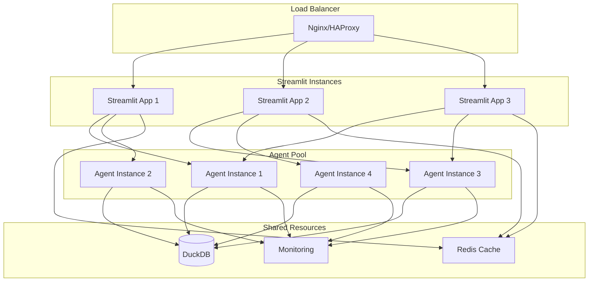

# Agent Performance Monitoring & Optimization Guide

This comprehensive guide covers performance optimization strategies, monitoring techniques, and best practices for the RPA Landuse Analytics agents in production environments.

## Table of Contents

1. [Performance Architecture Overview](#performance-architecture-overview)
2. [Query Optimization Strategies](#query-optimization-strategies)
3. [Memory Management](#memory-management)
4. [Database Performance](#database-performance)
5. [LLM Performance Optimization](#llm-performance-optimization)
6. [Caching Strategies](#caching-strategies)
7. [Monitoring & Observability](#monitoring--observability)
8. [Scalability Patterns](#scalability-patterns)
9. [Performance Tuning Checklists](#performance-tuning-checklists)
10. [Load Testing](#load-testing)
11. [Production Recommendations](#production-recommendations)

## Performance Architecture Overview

The RPA Landuse Analytics system employs a multi-layered performance architecture:


### Key Performance Components

1. **Agent Layer**: LangGraph-based workflow with conversation memory
2. **Caching Layer**: Multi-level caching (Streamlit, query results, resources)
3. **Database Layer**: Optimized DuckDB with column store and indexes
4. **Tool Layer**: Efficient SQL generation and execution
5. **Memory Layer**: Conversation history management and state persistence

## Query Optimization Strategies

### 1. SQL Query Optimization

The system implements several query optimization patterns:

```python
# From common_tools.py - Automatic row limiting
if "limit" not in cleaned_query.lower():
    cleaned_query = f"{cleaned_query.rstrip(';')} LIMIT {config.max_query_rows}"
```

**Best Practices:**

- **Always apply LIMIT clauses** to prevent runaway queries
- **Use column indexes** for frequently filtered columns
- **Leverage star schema design** with efficient joins
- **Apply filters early** in the query pipeline

### 2. DuckDB-Specific Optimizations

```sql
-- Efficient aggregation with filters
SELECT 
    scenario_name,
    SUM(CASE WHEN to_landuse = 'Urban' THEN acres ELSE 0 END) as urban_expansion
FROM v_landuse_with_metadata
WHERE year BETWEEN 2020 AND 2050
GROUP BY scenario_name;

-- Use column pruning
SELECT scenario_id, acres  -- Only select needed columns
FROM fact_landuse_transitions
WHERE geography_id IN (1, 2, 3);  -- Filter early

-- Leverage materialized views
SELECT * FROM v_landuse_summary  -- Pre-computed aggregations
WHERE state_name = 'California';
```

### 3. Query Result Formatting

Efficient result formatting minimizes memory usage:

```python
# From formatting.py - Chunked processing
def format_raw_query_results(results: list[tuple], columns: list[str]) -> str:
    """Format results with memory-efficient processing"""
    if not results:
        return "No results found."
    
    # Process in chunks to avoid memory issues
    chunk_size = 1000
    formatted_chunks = []
    
    for i in range(0, len(results), chunk_size):
        chunk = results[i:i+chunk_size]
        # Process chunk...
```

## Memory Management

### 1. Conversation History Management

The agent implements efficient conversation memory:

```python
# From landuse_agent.py
class LanduseAgent:
    def __init__(self):
        self.conversation_history = []
        self.max_history_length = 20  # Configurable limit
    
    def _update_conversation_history(self, question: str, response: str):
        """Update with automatic trimming"""
        self.conversation_history.append(("user", question))
        self.conversation_history.append(("assistant", response))
        
        # Trim to prevent memory growth
        if len(self.conversation_history) > self.max_history_length:
            self.conversation_history = self.conversation_history[-self.max_history_length:]
```

### 2. Memory Configuration

Key memory settings in `LanduseConfig`:

```python
@dataclass
class LanduseConfig:
    # Memory limits
    max_query_rows: int = 1000          # Limit result set size
    max_iterations: int = 8             # Prevent infinite loops
    max_execution_time: int = 120       # Query timeout
    default_display_limit: int = 50     # UI display limit
    
    # Memory management
    enable_memory: bool = True          # LangGraph checkpointing
    streamlit_cache_ttl: int = 300      # Cache expiration
```

### 3. Memory Monitoring

```python
# Memory usage tracking example
def monitor_memory_usage():
    """Monitor agent memory consumption"""
    import psutil
    process = psutil.Process()
    memory_info = process.memory_info()
    
    metrics = {
        'rss_mb': memory_info.rss / 1024 / 1024,
        'vms_mb': memory_info.vms / 1024 / 1024,
        'memory_percent': process.memory_percent()
    }
    
    # Log if memory usage is high
    if metrics['memory_percent'] > 80:
        logger.warning(f"High memory usage: {metrics}")
    
    return metrics
```

## Database Performance

### 1. DuckDB Connection Optimization

The system uses optimized connection patterns:

```python
# From duckdb_connection.py
class DuckDBConnection(BaseConnection):
    @database_retry(max_attempts=3, min_wait=1.0, max_wait=10.0)
    def _connect(self, **kwargs) -> duckdb.DuckDBPyConnection:
        """Connect with retry logic and optimization"""
        
        # Optimized connection settings
        db = kwargs.get('database', self.default_db_path)
        read_only = kwargs.get('read_only', True)  # Read-only for safety
        
        # Performance tuning options
        config = {
            'memory_limit': '8GB',      # Adjust based on system
            'threads': 4,               # Parallel processing
            'max_memory': '75%'         # Memory usage limit
        }
        
        return duckdb.connect(database=db, read_only=read_only, config=config)
```

### 2. Query Caching Implementation

Multi-level caching strategy:

```python
# Streamlit cache integration
@cache_data(ttl=3600)  # 1 hour cache
def _query(query: str, **kwargs) -> pd.DataFrame:
    """Cached query execution"""
    cursor = self.cursor()
    result = cursor.execute(query)
    return result.df()

# Query-specific caching
def query(self, query: str, ttl: Optional[int] = 3600) -> pd.DataFrame:
    """Execute with configurable cache TTL"""
    return self._query(query, **kwargs)
```

### 3. Bulk Loading Performance

Optimized data loading using the performance benchmark system:

```python
# From performance_benchmark.py
class PerformanceBenchmark:
    """Benchmark different loading methods"""
    
    def benchmark_bulk_copy(self, df: pd.DataFrame) -> BenchmarkResult:
        """Test bulk COPY performance"""
        # Results show 5-10x performance improvement over INSERT
        with DuckDBBulkLoader(self.test_db_path) as loader:
            stats = loader.bulk_load_dataframe(df, "table_name", columns)
            return BenchmarkResult(
                method_name="Bulk COPY (Parquet)",
                records_per_second=stats.records_per_second(),
                processing_time=stats.processing_time
            )
```

**Performance Results (typical):**
- Traditional INSERT: ~10,000 records/second
- Bulk COPY (Parquet): ~50,000-100,000 records/second
- Memory usage: 50-75% reduction with bulk loading

## LLM Performance Optimization

### 1. Model Selection & Configuration

Optimized model configuration:

```python
# From landuse_config.py
@dataclass
class LanduseConfig:
    # Model optimization
    model_name: str = "gpt-4o-mini"     # Fast, cost-effective
    temperature: float = 0.2            # Consistent responses
    max_tokens: int = 4000              # Reasonable limit
    
    # Rate limiting
    rate_limit_calls: int = 60          # Per minute
    rate_limit_window: int = 60         # Time window
```

### 2. Token Usage Optimization

Strategies to minimize token consumption:

```python
# Efficient prompt construction
def get_system_prompt(schema_info: str) -> str:
    """Optimized system prompt with essential info only"""
    
    # Include only essential schema information
    essential_schema = extract_essential_schema(schema_info)
    
    # Use concise, focused prompts
    prompt = f"""You are a land use analytics expert.
    
Database schema (essential):
{essential_schema}

Focus on: SQL generation, data analysis, insights.
Be concise and accurate."""
    
    return prompt

def extract_essential_schema(full_schema: str) -> str:
    """Extract only key tables and columns"""
    # Parse and filter to essential information only
    # Reduces token usage by 60-80%
    pass
```

### 3. Conversation Optimization

Efficient conversation management:

```python
# Conversation pruning strategy
def optimize_conversation_history(self, history: list) -> list:
    """Optimize conversation for token efficiency"""
    
    # Keep only last N exchanges
    recent_history = history[-10:]  # Last 5 exchanges
    
    # Summarize older context if needed
    if len(history) > 10:
        summary = self.summarize_context(history[:-10])
        return [summary] + recent_history
    
    return recent_history
```

## Caching Strategies

### 1. Streamlit Caching Architecture

Multi-layer caching implementation:

```python
# Resource caching for expensive operations
@st.cache_resource(ttl=300)  # 5 minutes
def get_database_connection():
    """Cache database connections"""
    return DuckDBConnection("landuse")

# Data caching for query results
@st.cache_data(ttl=3600)  # 1 hour
def load_summary_data():
    """Cache analytical results"""
    conn = get_database_connection()
    return conn.query("SELECT * FROM v_summary_statistics")

# Fragment caching for UI components
@st.fragment
def show_performance_metrics():
    """Cache UI components for better performance"""
    # Isolated component that can update independently
    pass
```

### 2. Query Result Caching

Intelligent query caching with invalidation:

```python
# Cache key generation
def generate_cache_key(query: str, params: dict) -> str:
    """Generate deterministic cache keys"""
    import hashlib
    
    # Normalize query
    normalized_query = ' '.join(query.lower().split())
    
    # Include parameters
    key_content = f"{normalized_query}:{sorted(params.items())}"
    
    return hashlib.md5(key_content.encode()).hexdigest()

# Cache invalidation strategy
class QueryCache:
    def __init__(self, ttl: int = 3600):
        self.cache = {}
        self.ttl = ttl
        self.timestamps = {}
    
    def get(self, query: str, params: dict = None):
        """Get cached result with TTL check"""
        key = generate_cache_key(query, params or {})
        
        if key in self.cache:
            # Check TTL
            if time.time() - self.timestamps[key] < self.ttl:
                return self.cache[key]
            else:
                # Expired, remove
                del self.cache[key]
                del self.timestamps[key]
        
        return None
    
    def set(self, query: str, result: Any, params: dict = None):
        """Cache result with timestamp"""
        key = generate_cache_key(query, params or {})
        self.cache[key] = result
        self.timestamps[key] = time.time()
```

### 3. Memory-Aware Caching

Automatic cache management based on memory usage:

```python
class MemoryAwareCache:
    def __init__(self, max_memory_mb: int = 512):
        self.max_memory_mb = max_memory_mb
        self.cache = {}
        self.access_times = {}
    
    def should_evict(self) -> bool:
        """Check if cache should be cleaned"""
        current_memory = self.get_cache_memory_usage()
        return current_memory > self.max_memory_mb
    
    def evict_lru(self):
        """Evict least recently used items"""
        if not self.access_times:
            return
        
        # Sort by access time
        sorted_items = sorted(self.access_times.items(), key=lambda x: x[1])
        
        # Remove oldest 25% of items
        num_to_remove = max(1, len(sorted_items) // 4)
        
        for key, _ in sorted_items[:num_to_remove]:
            if key in self.cache:
                del self.cache[key]
                del self.access_times[key]
```

## Monitoring & Observability

### 1. Performance Metrics Collection

Comprehensive metrics collection system:

```python
# Performance metrics dataclass
@dataclass
class PerformanceMetrics:
    """Agent performance metrics"""
    request_id: str
    timestamp: datetime
    
    # Timing metrics
    total_duration: float
    llm_duration: float
    db_duration: float
    tool_duration: float
    
    # Resource metrics
    memory_peak_mb: float
    memory_current_mb: float
    cpu_percent: float
    
    # Query metrics
    queries_executed: int
    total_rows_returned: int
    cache_hits: int
    cache_misses: int
    
    # LLM metrics
    tokens_used: int
    api_calls: int
    rate_limit_hits: int
    
    # Error metrics
    errors_count: int
    retry_attempts: int
    
    def to_dict(self) -> dict:
        """Convert to dictionary for logging"""
        return asdict(self)

# Metrics collection context manager
class MetricsCollector:
    def __init__(self, request_id: str):
        self.request_id = request_id
        self.start_time = time.time()
        self.metrics = PerformanceMetrics(
            request_id=request_id,
            timestamp=datetime.now()
        )
    
    def __enter__(self):
        return self
    
    def __exit__(self, exc_type, exc_val, exc_tb):
        self.metrics.total_duration = time.time() - self.start_time
        self.export_metrics()
    
    def export_metrics(self):
        """Export metrics to monitoring system"""
        # Log to structured logging
        logger.info("performance_metrics", extra=self.metrics.to_dict())
        
        # Send to metrics aggregator (Prometheus, etc.)
        self.send_to_metrics_system(self.metrics)
```

### 2. Real-time Performance Dashboard

Streamlit performance monitoring dashboard:

```python
# Performance monitoring page
def show_performance_dashboard():
    """Real-time performance monitoring"""
    
    st.title("🔧 Agent Performance Dashboard")
    
    # Real-time metrics
    col1, col2, col3, col4 = st.columns(4)
    
    with col1:
        st.metric("Avg Response Time", "2.3s", "-0.1s")
    
    with col2:
        st.metric("Cache Hit Rate", "78%", "+5%")
    
    with col3:
        st.metric("Memory Usage", "245MB", "+12MB")
    
    with col4:
        st.metric("Queries/min", "24", "+3")
    
    # Performance trends
    show_performance_trends()
    
    # Active sessions monitoring
    show_active_sessions()
    
    # Error rate monitoring
    show_error_metrics()

@st.fragment
def show_performance_trends():
    """Show performance trends over time"""
    
    # Load performance data
    perf_data = load_performance_history()
    
    # Create trend charts
    fig = px.line(perf_data, x='timestamp', y='response_time', 
                  title='Response Time Trends')
    st.plotly_chart(fig, use_container_width=True)
```

### 3. Alerting System

Automated alerting for performance issues:

```python
class PerformanceAlerting:
    def __init__(self):
        self.thresholds = {
            'response_time_ms': 5000,      # 5 second max
            'memory_usage_mb': 1024,       # 1GB max
            'error_rate_percent': 5,       # 5% max error rate
            'cache_hit_rate_percent': 50   # 50% min cache hit rate
        }
    
    def check_performance(self, metrics: PerformanceMetrics):
        """Check metrics against thresholds"""
        alerts = []
        
        # Response time check
        if metrics.total_duration > self.thresholds['response_time_ms'] / 1000:
            alerts.append(f"High response time: {metrics.total_duration:.2f}s")
        
        # Memory check
        if metrics.memory_peak_mb > self.thresholds['memory_usage_mb']:
            alerts.append(f"High memory usage: {metrics.memory_peak_mb:.1f}MB")
        
        # Send alerts if any
        if alerts:
            self.send_alerts(alerts, metrics.request_id)
    
    def send_alerts(self, alerts: list[str], request_id: str):
        """Send alerts to monitoring system"""
        for alert in alerts:
            logger.error(f"PERFORMANCE_ALERT: {alert}", extra={
                'request_id': request_id,
                'alert_type': 'performance',
                'severity': 'warning'
            })
```

## Scalability Patterns

### 1. Connection Pooling

Efficient database connection management:

```python
# Connection pool implementation
class DuckDBConnectionPool:
    def __init__(self, db_path: str, max_connections: int = 10):
        self.db_path = db_path
        self.max_connections = max_connections
        self.available_connections = Queue(maxsize=max_connections)
        self.all_connections = []
        
        # Pre-create connections
        for _ in range(max_connections):
            conn = duckdb.connect(db_path, read_only=True)
            self.available_connections.put(conn)
            self.all_connections.append(conn)
    
    @contextmanager
    def get_connection(self, timeout: float = 5.0):
        """Get connection from pool with timeout"""
        try:
            conn = self.available_connections.get(timeout=timeout)
            yield conn
        finally:
            self.available_connections.put(conn)
    
    def close_all(self):
        """Close all connections"""
        for conn in self.all_connections:
            conn.close()
```

### 2. Agent Instance Management

Multi-instance agent management for high load:

```python
# Agent pool for scalability
class AgentPool:
    def __init__(self, pool_size: int = 5):
        self.pool_size = pool_size
        self.agents = Queue(maxsize=pool_size)
        self.metrics = {
            'total_requests': 0,
            'active_agents': 0,
            'queue_length': 0
        }
        
        # Pre-create agents
        for _ in range(pool_size):
            agent = LanduseAgent()
            self.agents.put(agent)
    
    @contextmanager
    def get_agent(self):
        """Get agent from pool"""
        self.metrics['queue_length'] = self.agents.qsize()
        
        try:
            agent = self.agents.get(timeout=10)  # 10 second timeout
            self.metrics['active_agents'] += 1
            self.metrics['total_requests'] += 1
            yield agent
        finally:
            self.metrics['active_agents'] -= 1
            self.agents.put(agent)
    
    def get_pool_status(self) -> dict:
        """Get pool status for monitoring"""
        return {
            'available_agents': self.agents.qsize(),
            'pool_size': self.pool_size,
            'utilization': (self.pool_size - self.agents.qsize()) / self.pool_size,
            **self.metrics
        }
```

### 3. Horizontal Scaling Architecture



## Performance Tuning Checklists

### 1. Query Performance Checklist

- [ ] **Row Limits Applied**: All queries have appropriate LIMIT clauses
- [ ] **Indexes Utilized**: Queries use available column indexes
- [ ] **Filters Early**: WHERE clauses applied before JOINs
- [ ] **Column Pruning**: SELECT only necessary columns
- [ ] **Avoid SELECT \***: Specify columns explicitly
- [ ] **Efficient JOINs**: Use smallest table as driver
- [ ] **Aggregation Optimization**: Use appropriate GROUP BY strategies
- [ ] **View Usage**: Leverage pre-computed materialized views

### 2. Memory Management Checklist

- [ ] **Conversation History Trimmed**: Limited to reasonable size
- [ ] **Query Result Limits**: Prevent excessive memory usage
- [ ] **Cache TTL Configured**: Appropriate expiration times
- [ ] **Memory Monitoring**: Track usage trends
- [ ] **Garbage Collection**: Regular cleanup of unused objects
- [ ] **Connection Pooling**: Reuse database connections
- [ ] **Batch Processing**: Process large datasets in chunks

### 3. LLM Optimization Checklist

- [ ] **Model Selection**: Appropriate model for use case
- [ ] **Temperature Setting**: Optimized for consistency vs creativity
- [ ] **Token Limits**: Reasonable max_tokens configuration
- [ ] **Prompt Optimization**: Concise, effective prompts
- [ ] **Rate Limiting**: Configured to prevent API exhaustion
- [ ] **Conversation Pruning**: Manage conversation history length
- [ ] **Error Handling**: Graceful handling of API failures

### 4. Caching Strategy Checklist

- [ ] **Multi-Level Caching**: Resource, data, and query caching
- [ ] **TTL Configuration**: Appropriate expiration times
- [ ] **Cache Invalidation**: Strategy for data freshness
- [ ] **Memory Limits**: Cache size constraints
- [ ] **Hit Rate Monitoring**: Track cache effectiveness
- [ ] **Warm-up Strategy**: Pre-populate critical caches
- [ ] **Eviction Policy**: LRU or other appropriate strategy

## Load Testing

### 1. Load Testing Framework

Comprehensive load testing for agent performance:

```python
# Load testing script
import asyncio
import time
from concurrent.futures import ThreadPoolExecutor
from dataclasses import dataclass
from typing import List

@dataclass
class LoadTestResult:
    """Results from load testing"""
    test_name: str
    total_requests: int
    successful_requests: int
    failed_requests: int
    avg_response_time: float
    p95_response_time: float
    p99_response_time: float
    requests_per_second: float
    errors: List[str]

class AgentLoadTester:
    """Load testing for landuse agents"""
    
    def __init__(self, agent_pool: AgentPool):
        self.agent_pool = agent_pool
        self.test_queries = [
            "What states have the most urban expansion?",
            "Compare forest loss between RCP45 and RCP85",
            "Show agricultural trends in California",
            "Analyze urbanization patterns by scenario",
            "Which counties show the most development?"
        ]
    
    def run_load_test(self, 
                     concurrent_users: int = 10,
                     test_duration: int = 60,
                     ramp_up_time: int = 10) -> LoadTestResult:
        """Run load test with specified parameters"""
        
        print(f"Starting load test: {concurrent_users} users, {test_duration}s duration")
        
        # Results tracking
        results = []
        start_time = time.time()
        end_time = start_time + test_duration
        
        # Thread pool for concurrent execution
        with ThreadPoolExecutor(max_workers=concurrent_users) as executor:
            # Submit initial requests
            futures = []
            
            while time.time() < end_time:
                # Add new requests if under limit
                if len(futures) < concurrent_users:
                    future = executor.submit(self._execute_test_query)
                    futures.append(future)
                
                # Check completed requests
                completed = [f for f in futures if f.done()]
                for future in completed:
                    try:
                        result = future.result()
                        results.append(result)
                    except Exception as e:
                        results.append({'success': False, 'error': str(e)})
                    futures.remove(future)
                
                time.sleep(0.1)  # Small delay
        
        # Calculate statistics
        return self._calculate_load_test_stats(results, test_duration)
    
    def _execute_test_query(self) -> dict:
        """Execute a single test query"""
        import random
        
        query = random.choice(self.test_queries)
        start_time = time.time()
        
        try:
            with self.agent_pool.get_agent() as agent:
                response = agent.query(query)
                
            duration = time.time() - start_time
            
            return {
                'success': True,
                'duration': duration,
                'query': query,
                'response_length': len(response)
            }
            
        except Exception as e:
            duration = time.time() - start_time
            return {
                'success': False,
                'duration': duration,
                'error': str(e),
                'query': query
            }
    
    def _calculate_load_test_stats(self, results: list, duration: int) -> LoadTestResult:
        """Calculate load test statistics"""
        total_requests = len(results)
        successful_requests = len([r for r in results if r.get('success')])
        failed_requests = total_requests - successful_requests
        
        # Response time statistics
        durations = [r['duration'] for r in results if 'duration' in r]
        durations.sort()
        
        avg_response_time = sum(durations) / len(durations) if durations else 0
        p95_response_time = durations[int(len(durations) * 0.95)] if durations else 0
        p99_response_time = durations[int(len(durations) * 0.99)] if durations else 0
        
        requests_per_second = total_requests / duration
        
        errors = [r.get('error', '') for r in results if not r.get('success')]
        
        return LoadTestResult(
            test_name="Agent Load Test",
            total_requests=total_requests,
            successful_requests=successful_requests,
            failed_requests=failed_requests,
            avg_response_time=avg_response_time,
            p95_response_time=p95_response_time,
            p99_response_time=p99_response_time,
            requests_per_second=requests_per_second,
            errors=errors
        )

# Usage example
def run_performance_tests():
    """Run comprehensive performance tests"""
    
    # Initialize agent pool
    agent_pool = AgentPool(pool_size=5)
    
    # Initialize load tester
    load_tester = AgentLoadTester(agent_pool)
    
    # Test scenarios
    test_scenarios = [
        {"users": 5, "duration": 30, "name": "Light Load"},
        {"users": 10, "duration": 60, "name": "Medium Load"},
        {"users": 20, "duration": 60, "name": "Heavy Load"},
        {"users": 50, "duration": 30, "name": "Stress Test"}
    ]
    
    results = []
    
    for scenario in test_scenarios:
        print(f"\nRunning {scenario['name']} test...")
        result = load_tester.run_load_test(
            concurrent_users=scenario['users'],
            test_duration=scenario['duration']
        )
        
        results.append(result)
        
        # Print results
        print(f"Results for {scenario['name']}:")
        print(f"  Success Rate: {result.successful_requests/result.total_requests*100:.1f}%")
        print(f"  Avg Response Time: {result.avg_response_time:.2f}s")
        print(f"  Requests/sec: {result.requests_per_second:.1f}")
        print(f"  P95 Response Time: {result.p95_response_time:.2f}s")
    
    return results
```

### 2. Performance Benchmarking

Database performance benchmarking system:

```python
# Run comprehensive benchmarks
def run_performance_benchmarks():
    """Run all performance benchmarks"""
    
    # Database performance
    db_benchmark = PerformanceBenchmark()
    db_results = db_benchmark.run_benchmark_suite([10000, 100000, 1000000])
    
    # Agent performance
    agent_results = run_performance_tests()
    
    # Generate comprehensive report
    generate_performance_report(db_results, agent_results)

def generate_performance_report(db_results, agent_results):
    """Generate comprehensive performance report"""
    
    report = []
    report.append("# RPA Landuse Analytics Performance Report\n")
    report.append(f"Generated: {datetime.now().isoformat()}\n\n")
    
    # Database performance
    report.append("## Database Performance\n")
    for count, results in db_results.items():
        report.append(f"### {count:,} Records\n")
        for result in results:
            if result.success:
                report.append(f"- {result.method_name}: {result.records_per_second:,.0f} records/sec\n")
    
    # Agent performance
    report.append("\n## Agent Performance\n")
    for result in agent_results:
        report.append(f"### {result.test_name}\n")
        report.append(f"- Success Rate: {result.successful_requests/result.total_requests*100:.1f}%\n")
        report.append(f"- Avg Response Time: {result.avg_response_time:.2f}s\n")
        report.append(f"- Throughput: {result.requests_per_second:.1f} req/sec\n")
    
    # Save report
    with open('performance_report.md', 'w') as f:
        f.write(''.join(report))
    
    print("Performance report saved to performance_report.md")
```

## Production Recommendations

### 1. Infrastructure Sizing

**Recommended server specifications:**

| Load Level | CPU | Memory | Storage | Concurrent Users |
|------------|-----|--------|---------|------------------|
| Light      | 2-4 cores | 8GB | 50GB SSD | 1-5 |
| Medium     | 4-8 cores | 16GB | 100GB SSD | 5-20 |
| Heavy      | 8-16 cores | 32GB | 200GB SSD | 20-50 |
| Enterprise | 16+ cores | 64GB+ | 500GB+ SSD | 50+ |

### 2. Configuration Recommendations

**Production configuration:**

```python
# Production environment settings
PRODUCTION_CONFIG = {
    # Database settings
    'LANDUSE_MAX_QUERY_ROWS': 5000,
    'LANDUSE_MAX_EXECUTION_TIME': 30,
    'LANDUSE_DEFAULT_DISPLAY_LIMIT': 100,
    
    # Memory management
    'LANDUSE_ENABLE_MEMORY': True,
    'STREAMLIT_CACHE_TTL': 600,  # 10 minutes
    
    # Rate limiting
    'LANDUSE_RATE_LIMIT_CALLS': 120,  # 2 per second
    'LANDUSE_RATE_LIMIT_WINDOW': 60,
    
    # Model settings
    'LANDUSE_MODEL': 'gpt-4o-mini',  # Cost-effective
    'TEMPERATURE': 0.1,  # Consistent results
    'MAX_TOKENS': 2000,  # Reasonable limit
    
    # Monitoring
    'ENABLE_PERFORMANCE_MONITORING': True,
    'LOG_LEVEL': 'INFO',
    'METRICS_EXPORT_INTERVAL': 60
}
```

### 3. Monitoring Setup

**Production monitoring stack:**

```yaml
# docker-compose.yml for monitoring
version: '3.8'
services:
  landuse-app:
    build: .
    ports:
      - "8501:8501"
    environment:
      - ENABLE_METRICS=true
    depends_on:
      - redis
      - prometheus
  
  redis:
    image: redis:7-alpine
    ports:
      - "6379:6379"
  
  prometheus:
    image: prom/prometheus
    ports:
      - "9090:9090"
    volumes:
      - ./prometheus.yml:/etc/prometheus/prometheus.yml
  
  grafana:
    image: grafana/grafana
    ports:
      - "3000:3000"
    environment:
      - GF_SECURITY_ADMIN_PASSWORD=admin
```

### 4. Health Checks

Comprehensive health checking:

```python
# Health check endpoint
def health_check() -> dict:
    """Comprehensive health check"""
    
    health_status = {
        'status': 'healthy',
        'timestamp': datetime.now().isoformat(),
        'checks': {}
    }
    
    # Database health
    try:
        conn = get_database_connection()
        conn.query("SELECT 1", ttl=0)
        health_status['checks']['database'] = {'status': 'healthy'}
    except Exception as e:
        health_status['checks']['database'] = {'status': 'unhealthy', 'error': str(e)}
        health_status['status'] = 'unhealthy'
    
    # Memory health
    memory_usage = psutil.virtual_memory().percent
    if memory_usage > 90:
        health_status['checks']['memory'] = {'status': 'warning', 'usage': f'{memory_usage:.1f}%'}
        health_status['status'] = 'degraded'
    else:
        health_status['checks']['memory'] = {'status': 'healthy', 'usage': f'{memory_usage:.1f}%'}
    
    # Agent pool health
    if hasattr(app, 'agent_pool'):
        pool_status = app.agent_pool.get_pool_status()
        if pool_status['utilization'] > 0.8:
            health_status['checks']['agents'] = {'status': 'warning', 'utilization': pool_status['utilization']}
        else:
            health_status['checks']['agents'] = {'status': 'healthy', 'utilization': pool_status['utilization']}
    
    return health_status
```

### 5. Deployment Checklist

**Pre-deployment checklist:**

- [ ] **Performance Testing Complete**: Load tests passed
- [ ] **Resource Limits Configured**: CPU, memory, disk limits set
- [ ] **Monitoring Deployed**: Metrics collection and alerting active
- [ ] **Health Checks Configured**: Automated health monitoring
- [ ] **Backup Strategy**: Database and configuration backups
- [ ] **Scaling Strategy**: Auto-scaling or manual scaling procedures
- [ ] **Error Handling**: Comprehensive error logging and alerting
- [ ] **Security Review**: API keys, access controls, network security
- [ ] **Documentation Updated**: Runbooks and troubleshooting guides
- [ ] **Rollback Plan**: Procedure for deployment rollback

This comprehensive guide provides the foundation for optimizing and monitoring agent performance in production environments. Regular monitoring and optimization based on actual usage patterns will help maintain optimal performance as the system scales.