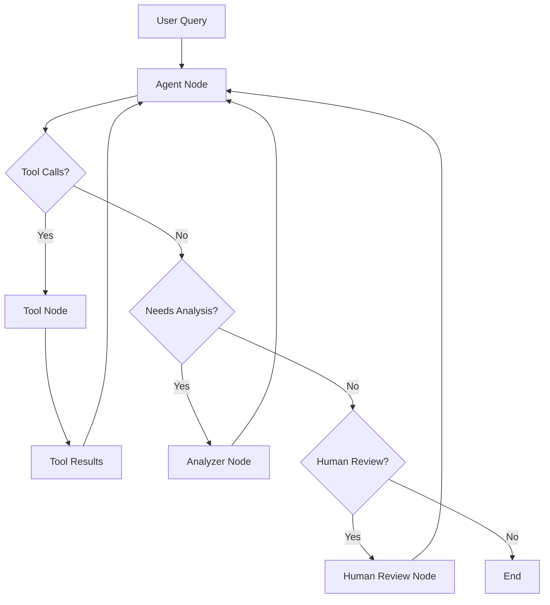

# RPA Land Use Analytics Agent

## Overview

The RPA Land Use Analytics project features a modern AI agent architecture built with **LangGraph** for state-based natural language analysis of USDA Forest Service RPA Assessment data. The system converts questions in plain English to optimized DuckDB SQL queries and provides comprehensive business insights.

## Modern Agent Architecture

### Core Agent: `LanduseAgent`

The main agent class provides a sophisticated workflow management system:

```python
from landuse.agents import LanduseAgent
from landuse.config import LanduseConfig

# Create with default configuration
agent = LanduseAgent()

# Or with custom configuration
config = LanduseConfig(
    model_name="claude-3-5-sonnet-20241022",
    enable_map_generation=True,
    enable_memory=True,
    analysis_style="detailed"
)
agent = LanduseAgent(config=config)

# Execute queries
response = agent.query("Which scenarios show the most agricultural land loss?")

# Stream responses for real-time interaction
for chunk in agent.stream_query("Compare forest loss across climate scenarios", thread_id="session-1"):
    print(chunk)

# Interactive chat mode
agent.chat()
```

### Key Features

- **🧠 LangGraph State Management**: Modern graph-based workflow with conversation memory
- **🗣️ Natural Language Processing**: Advanced prompt system with domain-specific variations
- **📊 Business Intelligence**: Comprehensive analysis with insights and summary statistics
- **🗺️ Map Generation**: Choropleth maps with geographic visualizations
- **💾 Conversation Memory**: Persistent checkpointing across sessions
- **🔄 Streaming Support**: Real-time response streaming for interactive experiences
- **⚡ Retry Logic**: Robust error handling with database connection retry
- **📚 Knowledge Base**: Optional RPA documentation integration via ChromaDB
- **🎯 Multi-Model Support**: GPT-4, Claude 3.5 Sonnet, and configurable LLM backends
- **🛠️ Tool Composition**: Modular tool system with subgraph support

## Configuration System

### Dataclass-Based Configuration

The agent uses a modern `LanduseConfig` dataclass with environment variable integration:

```python
from landuse.config import LanduseConfig
from landuse.agents import LanduseAgent

# Default configuration (reads from environment)
config = LanduseConfig.from_env()
agent = LanduseAgent(config)

# Override specific settings
config = LanduseConfig(
    model_name="claude-3-5-sonnet-20241022",
    temperature=0.1,
    max_tokens=4000,
    enable_memory=True,
    enable_map_generation=True,
    analysis_style="detailed",  # "standard", "detailed", "executive"
    domain_focus="agricultural",  # "agricultural", "climate", "urban", or "none"
    enable_knowledge_base=True
)
agent = LanduseAgent(config)

# Command-line overrides
config = LanduseConfig.from_env(
    model_name="gpt-4o",
    debug=True,
    verbose=True
)
```

### Configuration Options

#### Database & Performance
- `db_path`: Path to DuckDB database (default: `data/processed/landuse_analytics.duckdb`)
- `max_query_rows`: Maximum rows returned by queries (default: `1000`)
- `max_iterations`: Maximum agent iterations (default: `8`)
- `max_execution_time`: Maximum execution time in seconds (default: `120`)
- `default_display_limit`: Default rows to display (default: `50`)

#### Model Configuration
- `model_name`: LLM model to use (default: `gpt-4o-mini`)
- `temperature`: Model temperature 0.0-2.0 (default: `0.2`)
- `max_tokens`: Maximum response tokens (default: `4000`)

#### Agent Capabilities
- `enable_memory`: Enable conversation memory with checkpointing (default: `true`)
- `enable_map_generation`: Enable map generation tools (default: `true`)
- `enable_knowledge_base`: Enable RPA documentation retrieval (default: `false`)

#### Prompt Customization
- `analysis_style`: Analysis style - "standard", "detailed", "executive" (default: `standard`)
- `domain_focus`: Domain specialization - "agricultural", "climate", "urban", "none" (default: `none`)

#### System Behavior
- `verbose`: Enable verbose logging (default: `false`)
- `debug`: Enable debug mode with detailed tracing (default: `false`)
- `rate_limit_calls`: API rate limiting (default: `60`)
- `rate_limit_window`: Rate limit window in seconds (default: `60`)

## Tool System

The agent features a modular tool composition system with factory pattern:

### Core Tools (Always Available)
- **`execute_landuse_query`**: Execute SQL queries with retry logic and error handling
- **`analyze_landuse_results`**: Provide business insights and interpretation 
- **`explore_landuse_schema`**: Get database schema information with table counts
- **`lookup_state_info`**: Convert state names/abbreviations to FIPS codes

### Optional Tools (Configuration-Dependent)
- **`create_map`**: Generate choropleth maps (when `enable_map_generation=True`)
- **`search_rpa_docs`**: Retrieve RPA documentation (when `enable_knowledge_base=True`)

### Tool Creation Pattern

```python
# Tools are created using factory functions
from landuse.tools.common_tools import (
    create_execute_query_tool,
    create_analysis_tool,
    create_schema_tool
)
from landuse.tools.state_lookup_tool import create_state_lookup_tool
from landuse.tools.map_generation_tool import create_map_tool

# Tools are bound to specific agent instances with configuration
tools = [
    create_execute_query_tool(config, db_connection, schema),
    create_analysis_tool(),
    create_schema_tool(schema),
    create_state_lookup_tool()
]

if config.enable_map_generation:
    tools.append(create_map_tool())
```

## Usage Examples

### Basic Queries with Modern Configuration

```python
from landuse.agents import LanduseAgent
from landuse.config import LanduseConfig

# Standard analysis
config = LanduseConfig()
agent = LanduseAgent(config)

# Agricultural analysis
response = agent.query("How much agricultural land is being lost across RPA scenarios?")

# Climate scenario comparisons
response = agent.query("Compare forest loss between RCP4.5 and RCP8.5 pathways")

# Geographic patterns with state lookup
response = agent.query("Which states have the most urban expansion in California and Texas?")
```

### Streaming Queries with Memory

```python
# Enable memory and streaming
config = LanduseConfig(enable_memory=True)
agent = LanduseAgent(config)

# Stream responses with conversation continuity
thread_id = "land-use-analysis-session"
for chunk in agent.stream_query(
    "Analyze agricultural transitions in the Midwest", 
    thread_id=thread_id
):
    print(chunk)

# Follow-up question in same session
for chunk in agent.stream_query(
    "Now compare that to the Southeast region",
    thread_id=thread_id
):
    print(chunk)
```

### Map Generation and Analysis

```python
# Enable maps and detailed analysis
config = LanduseConfig(
    enable_map_generation=True,
    analysis_style="detailed",
    domain_focus="climate"
)
agent = LanduseAgent(config)

# Generate comprehensive analysis with maps
response = agent.query("Show forest loss patterns by climate model with maps")
```

### Domain-Specific Analysis

```python
# Agricultural focus with knowledge base
config = LanduseConfig(
    domain_focus="agricultural",
    analysis_style="executive",
    enable_knowledge_base=True
)
agent = LanduseAgent(config)

response = agent.query("What are the food security implications of projected cropland loss?")
```

### Interactive Chat with Context Manager

```python
# Context manager handles cleanup
with LanduseAgent(config) as agent:
    agent.chat()  # Rich interactive mode with conversation history
```

## Modern LangGraph Architecture

### State Management with TypedDict

```python
class AgentState(TypedDict):
    """Enhanced state tracking for conversation flow."""
    messages: list[BaseMessage]
    context: dict[str, Any]
    iteration_count: int
    max_iterations: int
```

### Graph Workflow



### Execution Modes

1. **Simple Query Mode** (Default): Direct LLM interaction with tool calling
2. **Graph Mode**: Full LangGraph workflow with state management
3. **Streaming Mode**: Real-time response streaming with checkpointing

### Query Processing Flow

1. **Input Processing**: Natural language question with conversation history
2. **Prompt Assembly**: Dynamic system prompt with schema and domain focus
3. **Tool Orchestration**: SQL generation and execution with retry logic
4. **Result Analysis**: Business insights and statistical summaries
5. **Response Formatting**: Rich terminal output or structured data
6. **Memory Persistence**: Conversation checkpointing (if enabled)

## Environment Configuration

Configure via `.env` file or environment variables:

```bash
# Required API Keys
OPENAI_API_KEY=your_openai_key
ANTHROPIC_API_KEY=your_anthropic_key

# Model Configuration
LANDUSE_MODEL=claude-3-5-sonnet-20241022  # or gpt-4o-mini
TEMPERATURE=0.2
MAX_TOKENS=4000

# Database and Performance
LANDUSE_DB_PATH=data/processed/landuse_analytics.duckdb
LANDUSE_MAX_QUERY_ROWS=1000
LANDUSE_MAX_ITERATIONS=8
LANDUSE_MAX_EXECUTION_TIME=120

# Agent Features
LANDUSE_ENABLE_MEMORY=true
LANDUSE_ENABLE_MAPS=true
LANDUSE_ENABLE_KNOWLEDGE_BASE=false

# Prompt Customization
LANDUSE_ANALYSIS_STYLE=standard  # standard, detailed, executive
LANDUSE_DOMAIN_FOCUS=none        # agricultural, climate, urban, none

# Debugging and Monitoring
VERBOSE=false
DEBUG=false
LANDUSE_RATE_LIMIT_CALLS=60
LANDUSE_RATE_LIMIT_WINDOW=60

# Knowledge Base (if enabled)
LANDUSE_KNOWLEDGE_BASE_PATH=src/landuse/docs
LANDUSE_CHROMA_PERSIST_DIR=data/chroma_db

# Map Generation (if enabled)
LANDUSE_MAP_OUTPUT_DIR=maps/agent_generated
```

## Best Practices

### Configuration Strategy
1. **Start with Defaults**: Use `LanduseConfig.from_env()` for most cases
2. **Progressive Enhancement**: Enable features (maps, memory, knowledge base) as needed
3. **Environment-Based Config**: Use `.env` files for deployment-specific settings
4. **Model Selection**: Claude 3.5 Sonnet for analysis quality, GPT-4o-mini for speed

### Performance Optimization
1. **Query Limits**: Set appropriate `max_query_rows` for large datasets
2. **Memory Management**: Enable conversation memory only for interactive sessions
3. **Rate Limiting**: Configure API rate limits based on your plan
4. **Caching**: Leverage database query result caching

### Development Workflow
1. **Debug Mode**: Use `debug=True` for development and troubleshooting
2. **Verbose Logging**: Enable for understanding agent decision-making
3. **Context Managers**: Use `with` statements for proper resource cleanup
4. **Error Handling**: Implement retry logic for production deployments

## Troubleshooting

### Common Issues

1. **API Key Errors**: Ensure `OPENAI_API_KEY` or `ANTHROPIC_API_KEY` environment variables are set
2. **Database Not Found**: Check `LANDUSE_DB_PATH` or run data conversion scripts
3. **Tool Call Errors**: Verify database schema and table availability
4. **Memory Issues**: Disable memory for simple queries or increase `max_iterations`
5. **Rate Limiting**: Adjust `rate_limit_calls` and `rate_limit_window` settings
6. **Knowledge Base Errors**: Ensure ChromaDB dependencies and document paths

### Debug and Monitoring

```python
# Enable comprehensive debugging
config = LanduseConfig(
    debug=True,
    verbose=True,
    max_iterations=10  # Allow more iterations for complex queries
)
agent = LanduseAgent(config)

# Clear conversation history if needed
agent.clear_history()

# Check agent configuration
print(f"Model: {agent.model_name}")
print(f"Database: {agent.config.db_path}")
print(f"Schema: {agent._get_schema_help()}")
```

### Performance Debugging

```python
# Monitor execution time and iterations
import time

start_time = time.time()
response = agent.query("Complex analysis query")
end_time = time.time()

print(f"Query took: {end_time - start_time:.2f} seconds")
print(f"Conversation length: {len(agent.conversation_history)}")
```

## API Reference

### LanduseAgent Class

```python
class LanduseAgent:
    """Modern landuse agent with LangGraph architecture and memory-first design."""
    
    def __init__(self, config: Optional[LanduseConfig] = None):
        """Initialize agent with configuration."""
    
    def query(
        self, 
        question: str, 
        use_graph: bool = False, 
        thread_id: Optional[str] = None
    ) -> str:
        """Execute a natural language query.
        
        Args:
            question: Natural language question to answer
            use_graph: Whether to use full LangGraph workflow (default: False)
            thread_id: Optional thread ID for conversation memory
            
        Returns:
            Agent response as formatted string
        """
    
    def simple_query(self, question: str) -> str:
        """Execute query using direct LLM interaction (stable mode)."""
    
    def stream_query(
        self, 
        question: str, 
        thread_id: Optional[str] = None
    ) -> Iterator[Any]:
        """Stream responses for real-time interaction."""
    
    def chat(self) -> None:
        """Start interactive Rich terminal chat interface."""
    
    def clear_history(self) -> None:
        """Clear conversation history."""
    
    def create_subgraph(
        self, 
        name: str, 
        specialized_tools: list[BaseTool]
    ) -> StateGraph:
        """Create specialized subgraph for complex workflows."""
    
    def create_map_subgraph(self) -> StateGraph:
        """Create map-focused analysis subgraph."""
    
    # Context manager support
    def __enter__(self) -> "LanduseAgent":
        """Context manager entry."""
    
    def __exit__(self, exc_type, exc_val, exc_tb) -> None:
        """Context manager exit with resource cleanup."""
```

### LanduseConfig Class

```python
@dataclass
class LanduseConfig:
    """Unified configuration for all landuse agents."""
    
    # Database Configuration
    db_path: str
    max_query_rows: int
    max_iterations: int
    max_execution_time: int
    default_display_limit: int
    
    # Model Configuration  
    model_name: str
    temperature: float
    max_tokens: int
    
    # Agent Capabilities
    enable_memory: bool
    enable_map_generation: bool
    enable_knowledge_base: bool
    
    # Prompt Customization
    analysis_style: str  # "standard", "detailed", "executive"
    domain_focus: str    # "agricultural", "climate", "urban", "none"
    
    # System Behavior
    verbose: bool
    debug: bool
    rate_limit_calls: int
    rate_limit_window: int
    
    @classmethod
    def from_env(cls, **overrides) -> "LanduseConfig":
        """Create configuration from environment variables with overrides."""
```

### AgentState TypedDict

```python
class AgentState(TypedDict):
    """State definition for LangGraph workflow."""
    messages: list[BaseMessage]
    context: dict[str, Any]
    iteration_count: int
    max_iterations: int
```

## Command Line Interface

The agent includes a comprehensive CLI:

```bash
# Interactive session with defaults
uv run python -m landuse.agents.agent

# Custom model and configuration
uv run python -m landuse.agents.agent --model claude-3-5-sonnet-20241022 --verbose

# Debug mode with custom database
uv run python -m landuse.agents.agent --debug --db-path /path/to/custom.duckdb

# Full configuration
uv run python -m landuse.agents.agent \
    --model gpt-4o \
    --temperature 0.1 \
    --max-iterations 10 \
    --verbose \
    --debug
```

## Advanced Workflow Patterns

### Memory-Enabled Sessions

```python
# Persistent conversation across queries
config = LanduseConfig(enable_memory=True)
agent = LanduseAgent(config)

# Queries build context over time
agent.query("Show agricultural land loss in California")
agent.query("Now compare that to Texas")  # References previous context
agent.query("What about the difference between scenarios?")  # Maintains thread
```

### Subgraph Specialization

```python
# Create specialized workflow for map analysis
map_subgraph = agent.create_map_subgraph()

# Use for geographic-focused analysis
result = map_subgraph.invoke({
    "messages": [HumanMessage(content="Analyze forest patterns by region")],
    "context": {},
    "iteration_count": 0,
    "max_iterations": 5
})
```

### Knowledge Base Integration

```python
# Enable RPA documentation retrieval
config = LanduseConfig(
    enable_knowledge_base=True,
    knowledge_base_path="src/landuse/docs",
    chroma_persist_dir="data/chroma_db"
)
agent = LanduseAgent(config)

# Queries can reference methodology and background
response = agent.query("Explain the econometric model used in RPA projections")
```

## Summary

The RPA Land Use Analytics agent provides a sophisticated, production-ready system for natural language analysis of land use data. Built on modern LangGraph architecture with comprehensive configuration, memory management, and tool composition, it enables both simple queries and complex analytical workflows while maintaining reliability and performance.