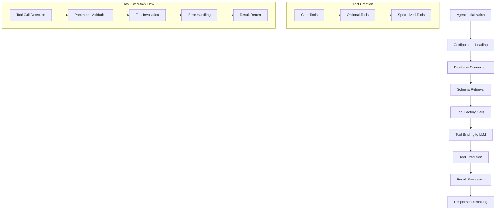

# Tool System Architecture

## Overview

The RPA Land Use Analytics agent employs a sophisticated tool system architecture built on modern design patterns including **factory pattern**, **dependency injection**, and **composition over inheritance**. This document provides comprehensive guidance on understanding, extending, and testing the tool system.

## Architecture Principles

### Core Design Patterns

1. **Factory Pattern**: Tools are created using factory functions rather than direct instantiation
2. **Dependency Injection**: Tools receive their dependencies (config, database connections) at creation time
3. **LangGraph Integration**: Tools follow LangGraph conventions with proper response formats
4. **Functional Composition**: Tools can be combined and orchestrated in complex workflows
5. **Configuration-Driven**: Tool availability and behavior controlled through centralized configuration

### Tool Lifecycle



## Factory Pattern Implementation

### Core Factory Functions

The system uses factory functions to create tools with proper dependency injection:

```python
# From src/landuse/tools/common_tools.py
def create_execute_query_tool(
    config: LanduseConfig,
    db_connection: duckdb.DuckDBPyConnection,
    schema: str
) -> Any:
    """
    Create a tool for executing SQL queries with consistent error handling.
    
    This factory pattern allows:
    - Dependency injection of config and database connection
    - Closure-based state management
    - Consistent error handling across all instances
    """
    
    @tool(args_schema=QueryInput)
    def execute_landuse_query(query: str) -> str:
        """Execute a SQL query against the landuse database."""
        # Tool implementation with access to injected dependencies
        cleaned_query = clean_sql_query(query)
        
        try:
            # Apply row limit if not present
            if "limit" not in cleaned_query.lower():
                cleaned_query = f"{cleaned_query.rstrip(';')} LIMIT {config.max_query_rows}"
            
            # Execute with retry logic
            result = _execute_with_retry(db_connection, cleaned_query)
            
            if result["success"]:
                return _format_success_response(result, config)
            else:
                return _format_error_response(result, schema)
                
        except Exception as e:
            return f"Error executing query: {str(e)}"
    
    return execute_landuse_query
```

### Factory Benefits

1. **Dependency Management**: Tools receive necessary dependencies at creation time
2. **Configuration Binding**: Each tool instance is bound to specific configuration
3. **State Encapsulation**: Tool state is properly encapsulated through closures
4. **Testing Support**: Easy to create tools with mock dependencies for testing

## Tool Composition System

### Core Tool Assembly

The agent assembles tools through a composition pattern in `LanduseAgent._create_tools()`:

```python
def _create_tools(self) -> list[BaseTool]:
    """Create tools for the agent using composition pattern."""
    tools = [
        # Core tools (always available)
        create_execute_query_tool(self.config, self.db_connection, self.schema),
        create_analysis_tool(),
        create_schema_tool(self.schema),
        create_state_lookup_tool()
    ]
    
    # Conditional tool composition based on configuration
    if self.knowledge_base:
        try:
            retriever_tool = self.knowledge_base.create_retriever_tool()
            tools.append(retriever_tool)
            self.console.print("[green]✓ Added RPA documentation retriever tool[/green]")
        except Exception as e:
            self.console.print(f"[red]Warning: Failed to create retriever tool: {str(e)}[/red]")
    
    return tools
```

### Tool Categories

#### Core Tools (Always Available)
- **`execute_landuse_query`**: SQL execution with retry logic and error handling
- **`analyze_landuse_results`**: Business insights and interpretation
- **`explore_landuse_schema`**: Database schema exploration
- **`lookup_state_info`**: State name/abbreviation/FIPS code resolution

#### Configuration-Dependent Tools
- **`generate_landuse_map`**: Map generation (when `enable_map_generation=True`)
- **`search_rpa_docs`**: Knowledge base retrieval (when `enable_knowledge_base=True`)

## LangGraph Integration

### LangGraph Tool Conventions

Tools integrate seamlessly with LangGraph workflows:

```python
# From src/landuse/tools/map_generation_tool.py
@tool(response_format="content_and_artifact")
def generate_landuse_map(
    map_type: Literal["state_counties", "regional", "national", "transitions"],
    state_name: Optional[str] = None,
    landuse_type: Optional[str] = "Forest",
    from_landuse: Optional[str] = None,
    to_landuse: Optional[str] = None,
    scenario: Optional[str] = None,
    time_period: Optional[str] = None
) -> tuple[str, dict[str, Any]]:
    """
    Generate various types of land use maps.
    
    Returns:
        Tuple of (content for model, artifact with map data)
    """
    # Tool implementation returns both content and artifact
    if result['success']:
        content = f"✅ Successfully generated {result.get('description', 'map')}"
        return content, result
    else:
        content = f"❌ Failed to generate map: {result.get('error', 'Unknown error')}"
        return content, result
```

### State Management Integration

Tools work within LangGraph's state management system:

```python
# From src/landuse/agents/landuse_agent.py
def _agent_node(self, state: AgentState) -> dict[str, Any]:
    """Main agent node that decides next action."""
    messages = state["messages"]
    
    # Get LLM response with tools bound
    response = self.llm.bind_tools(self.tools).invoke(messages)
    
    # Update state with new message
    return {
        "messages": messages + [response],
        "iteration_count": state.get("iteration_count", 0) + 1
    }
```

## Core Tools Deep Dive

### SQL Execution Tool

The `execute_landuse_query` tool demonstrates advanced patterns:

```python
class QueryInput(BaseModel):
    """Pydantic model for input validation."""
    query: str = Field(description="SQL query to execute against the landuse database")

@tool(args_schema=QueryInput)
def execute_landuse_query(query: str) -> str:
    """
    Execute a SQL query with comprehensive error handling.
    
    Features:
    - Automatic query cleaning and validation
    - Row limit enforcement
    - Retry logic with exponential backoff
    - Intelligent error suggestions
    - Schema-aware error messages
    """
    cleaned_query = clean_sql_query(query)
    
    try:
        # Apply row limit protection
        if "limit" not in cleaned_query.lower():
            cleaned_query = f"{cleaned_query.rstrip(';')} LIMIT {config.max_query_rows}"
        
        # Execute with retry decorator
        result = _execute_with_retry(db_connection, cleaned_query)
        
        if result["success"]:
            return _format_success_response(result, config)
        else:
            return _format_error_response(result, schema)
            
    except Exception as e:
        return f"Error executing query: {str(e)}"

@database_retry(max_attempts=3)
def _execute_with_retry(db_connection: duckdb.DuckDBPyConnection, query: str) -> dict[str, Any]:
    """Execute query with retry logic using tenacity decorator."""
    try:
        conn = db_connection
        result = conn.execute(query).fetchall()
        columns = [desc[0] for desc in conn.description] if conn.description else []
        
        return {
            "success": True,
            "results": result,
            "columns": columns,
            "row_count": len(result)
        }
    except Exception as e:
        return {
            "success": False,
            "error": str(e),
            "query": query
        }
```

### Analysis Tool

The `analyze_landuse_results` tool provides business intelligence:

```python
@tool
def analyze_landuse_results(
    query_results: str,
    original_question: str,
    additional_context: Optional[str] = None
) -> str:
    """
    Analyze landuse query results and provide business insights.
    
    Features:
    - Domain-specific pattern recognition
    - Contextual business insights
    - Policy implications analysis
    - Historical pattern comparisons
    """
    insights = []
    
    # Pattern-based analysis
    if "urban" in query_results.lower() and "increase" in original_question.lower():
        insights.append(
            "Urban expansion typically comes at the expense of agricultural and forest lands. "
            "The model shows development is irreversible - once land becomes urban, it stays urban."
        )
    
    # Climate scenario analysis
    if "rcp85" in query_results.lower() or "ssp5" in query_results.lower():
        insights.append(
            "High-emission scenarios (RCP85/SSP5) generally show more dramatic land use changes "
            "due to increased pressure on natural resources and agricultural systems."
        )
    
    # Return formatted insights
    if insights:
        return "\n\n".join(["Key Insights:"] + [f"• {insight}" for insight in insights])
    else:
        return "Results show the requested data. Consider examining trends over time or comparing scenarios for deeper insights."
```

### Map Generation Tool

The map generation tool showcases LangGraph artifact patterns:

```python
class MapGenerationTool:
    """Tool for generating various land use maps."""
    
    def __init__(self, db_path: str, output_dir: Optional[str] = None):
        self.db_path = Path(db_path)
        self.output_dir = Path(output_dir) if output_dir else Path("maps/agent_generated")
        self.output_dir.mkdir(exist_ok=True, parents=True)
    
    def create_state_county_map(self, state_name: str, landuse_type: str = "Forest",
                               scenario: Optional[str] = None, time_period: Optional[str] = None) -> dict[str, Any]:
        """Create a county-level map for a specific state."""
        conn = self._get_db_connection()
        
        try:
            # Complex SQL query with spatial data
            query = """
                WITH county_landuse AS (
                    SELECT
                        g.fips_code,
                        g.county_name,
                        g.state_name,
                        ST_AsText(g.geometry) as geometry_wkt,
                        g.area_sqmi,
                        SUM(CASE WHEN l.landuse_name = ? THEN f.acres ELSE 0 END) as landuse_acres,
                        SUM(f.acres) as total_acres
                    FROM dim_geography g
                    JOIN fact_landuse_transitions f ON g.geography_id = f.geography_id
                    JOIN dim_landuse l ON f.to_landuse_id = l.landuse_id
                    JOIN dim_scenario s ON f.scenario_id = s.scenario_id
                    JOIN dim_time t ON f.time_id = t.time_id
                    WHERE g.state_name = ?
                        AND g.geometry IS NOT NULL
                        AND s.scenario_name = ?
                        AND t.year_range = ?
                        AND f.transition_type = 'same'
                    GROUP BY g.fips_code, g.county_name, g.state_name, g.geometry, g.area_sqmi
                )
                SELECT
                    *,
                    ROUND(100.0 * landuse_acres / total_acres, 2) as landuse_pct
                FROM county_landuse
            """
            
            df = conn.execute(query, [landuse_type, state_name, scenario, time_period]).fetchdf()
            
            # GeoPandas processing and map generation
            df['geometry'] = df['geometry_wkt'].apply(wkt.loads)
            gdf = gpd.GeoDataFrame(df, geometry='geometry', crs='EPSG:4326')
            
            # Create matplotlib visualization
            fig, ax = plt.subplots(1, 1, figsize=(12, 10))
            gdf.plot(column='landuse_pct',
                    cmap='YlOrRd' if landuse_type == 'Urban' else 'Greens',
                    linewidth=0.5,
                    edgecolor='white',
                    ax=ax,
                    legend=True)
            
            # Save and return metadata
            filename = self._generate_filename("county_map", state_name=state_name, landuse_type=landuse_type)
            output_path = self.output_dir / f"{filename}.png"
            plt.savefig(output_path, dpi=150, bbox_inches='tight', facecolor='white')
            plt.close()
            
            return {
                "success": True,
                "map_path": str(output_path),
                "map_type": "state_county",
                "state": state_name,
                "landuse_type": landuse_type,
                "scenario": scenario,
                "time_period": time_period,
                "description": f"County-level {landuse_type} land use map for {state_name}"
            }
            
        except Exception as e:
            return {
                "success": False,
                "error": str(e),
                "map_path": None
            }

def create_map_generation_tool(db_path: str, output_dir: Optional[str] = None):
    """Factory function to create the map generation tool for LangGraph."""
    map_tool = MapGenerationTool(db_path, output_dir)
    
    @tool(response_format="content_and_artifact")
    def generate_landuse_map(
        map_type: Literal["state_counties", "regional", "national", "transitions"],
        state_name: Optional[str] = None,
        landuse_type: Optional[str] = "Forest",
        # ... other parameters
    ) -> tuple[str, dict[str, Any]]:
        """Generate maps with content and artifact response."""
        # Implementation delegates to MapGenerationTool instance
        if map_type == "state_counties":
            result = map_tool.create_state_county_map(state_name, landuse_type, scenario, time_period)
        # ... other map types
        
        # Format for LangGraph
        if result['success']:
            content = f"✅ Successfully generated {result.get('description', 'map')}"
            return content, result
        else:
            content = f"❌ Failed to generate map: {result.get('error', 'Unknown error')}"
            return content, result
    
    return generate_landuse_map
```

## Custom Tool Creation Guide

### Basic Tool Pattern

```python
from langchain_core.tools import tool
from pydantic import BaseModel, Field
from typing import Optional

class CustomToolInput(BaseModel):
    """Input schema for custom tool."""
    param1: str = Field(description="Primary parameter")
    param2: Optional[int] = Field(default=None, description="Optional parameter")

@tool(args_schema=CustomToolInput)
def custom_landuse_tool(param1: str, param2: Optional[int] = None) -> str:
    """
    Custom tool for specialized analysis.
    
    Args:
        param1: Primary parameter for analysis
        param2: Optional parameter for filtering
        
    Returns:
        Analysis results as formatted string
    """
    try:
        # Tool implementation
        result = perform_custom_analysis(param1, param2)
        return format_custom_results(result)
    except Exception as e:
        return f"Error in custom analysis: {str(e)}"
```

### Factory Pattern for Custom Tools

```python
def create_custom_tool(config: LanduseConfig, dependencies: dict) -> Any:
    """
    Factory function for creating custom tools with dependency injection.
    
    Args:
        config: Agent configuration
        dependencies: Tool dependencies (database, APIs, etc.)
        
    Returns:
        Configured tool instance
    """
    
    @tool(args_schema=CustomToolInput)
    def custom_tool_instance(param1: str, param2: Optional[int] = None) -> str:
        """Tool instance with injected dependencies."""
        # Access injected dependencies
        db_connection = dependencies['db_connection']
        api_client = dependencies['api_client']
        
        # Tool logic with error handling
        try:
            result = perform_analysis_with_deps(param1, param2, db_connection, api_client)
            return format_result(result, config.output_format)
        except Exception as e:
            return handle_tool_error(e, config.debug)
    
    return custom_tool_instance
```

### LangGraph Artifact Tools

```python
@tool(response_format="content_and_artifact")
def create_artifact_tool(
    operation: Literal["create", "analyze", "export"],
    parameters: dict
) -> tuple[str, dict[str, Any]]:
    """
    Tool that returns both content and artifacts for LangGraph.
    
    Args:
        operation: Type of operation to perform
        parameters: Operation parameters
        
    Returns:
        Tuple of (content for model, artifact data)
    """
    try:
        result = perform_operation(operation, parameters)
        
        # Create content for the model
        content = f"✅ Successfully completed {operation} operation"
        
        # Create artifact for the system
        artifact = {
            "operation": operation,
            "status": "success",
            "data": result,
            "metadata": {
                "timestamp": datetime.now().isoformat(),
                "parameters": parameters
            }
        }
        
        return content, artifact
        
    except Exception as e:
        error_content = f"❌ Failed to complete {operation}: {str(e)}"
        error_artifact = {
            "operation": operation,
            "status": "error",
            "error": str(e),
            "metadata": {"timestamp": datetime.now().isoformat()}
        }
        
        return error_content, error_artifact
```

## Tool Configuration Patterns

### Configuration-Driven Tool Assembly

```python
class ToolRegistry:
    """Registry for managing tool creation and configuration."""
    
    def __init__(self, config: LanduseConfig):
        self.config = config
        self.factories = {}
        self.instances = {}
    
    def register_factory(self, name: str, factory_func: callable):
        """Register a tool factory function."""
        self.factories[name] = factory_func
    
    def create_tool(self, name: str, dependencies: dict) -> BaseTool:
        """Create a tool instance using registered factory."""
        if name not in self.factories:
            raise ValueError(f"Unknown tool: {name}")
        
        factory = self.factories[name]
        instance = factory(self.config, dependencies)
        self.instances[name] = instance
        return instance
    
    def get_tool_set(self, tool_profile: str) -> list[BaseTool]:
        """Get predefined tool sets based on configuration profile."""
        profiles = {
            "basic": ["execute_query", "analyze_results"],
            "advanced": ["execute_query", "analyze_results", "schema_explore", "state_lookup"],
            "full": ["execute_query", "analyze_results", "schema_explore", "state_lookup", "generate_maps"],
            "research": ["execute_query", "analyze_results", "schema_explore", "knowledge_search"]
        }
        
        if tool_profile not in profiles:
            raise ValueError(f"Unknown tool profile: {tool_profile}")
        
        tools = []
        for tool_name in profiles[tool_profile]:
            if tool_name in self.instances:
                tools.append(self.instances[tool_name])
        
        return tools

# Usage in agent
def _create_tools(self) -> list[BaseTool]:
    """Create tools using registry pattern."""
    registry = ToolRegistry(self.config)
    
    # Register core tool factories
    registry.register_factory("execute_query", create_execute_query_tool)
    registry.register_factory("analyze_results", create_analysis_tool)
    registry.register_factory("schema_explore", create_schema_tool)
    registry.register_factory("state_lookup", create_state_lookup_tool)
    
    # Register optional tool factories
    if self.config.enable_map_generation:
        registry.register_factory("generate_maps", create_map_generation_tool)
    
    if self.config.enable_knowledge_base:
        registry.register_factory("knowledge_search", create_knowledge_search_tool)
    
    # Create dependencies
    dependencies = {
        'db_connection': self.db_connection,
        'schema': self.schema,
        'config': self.config
    }
    
    # Create tool instances
    tools = []
    for tool_name in ["execute_query", "analyze_results", "schema_explore", "state_lookup"]:
        tool = registry.create_tool(tool_name, dependencies)
        tools.append(tool)
    
    # Add optional tools
    if self.config.enable_map_generation:
        tools.append(registry.create_tool("generate_maps", dependencies))
    
    return tools
```

## Integration Patterns

### Tool Orchestration in LangGraph

```python
def _build_graph(self) -> StateGraph:
    """Build LangGraph with tool orchestration."""
    workflow = StateGraph(AgentState)
    
    # Tool nodes for different categories
    workflow.add_node("core_tools", ToolNode([
        self.tools_by_category["core"]
    ]))
    
    workflow.add_node("analysis_tools", ToolNode([
        self.tools_by_category["analysis"]
    ]))
    
    workflow.add_node("visualization_tools", ToolNode([
        self.tools_by_category["visualization"]
    ]))
    
    # Agent decision node
    workflow.add_node("agent", self._agent_node)
    
    # Conditional routing based on tool types needed
    workflow.add_conditional_edges(
        "agent",
        self._route_to_tools,
        {
            "core": "core_tools",
            "analysis": "analysis_tools", 
            "visualization": "visualization_tools",
            "end": END
        }
    )
    
    return workflow.compile(checkpointer=self.memory)

def _route_to_tools(self, state: AgentState) -> str:
    """Route to appropriate tool category based on last message."""
    last_message = state["messages"][-1]
    
    if hasattr(last_message, "tool_calls") and last_message.tool_calls:
        tool_names = [tc["name"] for tc in last_message.tool_calls]
        
        # Route based on tool categories
        if any(name in ["execute_landuse_query", "explore_landuse_schema"] for name in tool_names):
            return "core"
        elif any(name in ["analyze_landuse_results"] for name in tool_names):
            return "analysis"
        elif any(name in ["generate_landuse_map"] for name in tool_names):
            return "visualization"
    
    return "end"
```

### Subgraph Specialization

```python
def create_specialized_subgraph(self, domain: str) -> StateGraph:
    """Create domain-specific tool subgraphs."""
    
    if domain == "agricultural":
        specialized_tools = [
            self.get_tool("execute_landuse_query"),
            self.get_tool("analyze_agricultural_patterns"),
            self.get_tool("calculate_crop_metrics"),
            self.get_tool("generate_agricultural_maps")
        ]
    elif domain == "climate":
        specialized_tools = [
            self.get_tool("execute_landuse_query"),
            self.get_tool("compare_climate_scenarios"),
            self.get_tool("analyze_temporal_trends"),
            self.get_tool("generate_scenario_visualizations")
        ]
    else:
        raise ValueError(f"Unknown domain: {domain}")
    
    # Build specialized subgraph
    subgraph = StateGraph(AgentState)
    subgraph.add_node("specialized_agent", self._specialized_agent_node)
    subgraph.add_node("specialized_tools", ToolNode(specialized_tools))
    
    subgraph.set_entry_point("specialized_agent")
    subgraph.add_edge("specialized_agent", "specialized_tools")
    subgraph.add_edge("specialized_tools", END)
    
    return subgraph.compile()
```

## Testing Approaches

### Unit Testing Tools

```python
import pytest
from unittest.mock import Mock, patch
from landuse.tools.common_tools import create_execute_query_tool
from landuse.config.landuse_config import LanduseConfig

class TestExecuteQueryTool:
    """Test suite for SQL execution tool."""
    
    @pytest.fixture
    def mock_config(self):
        """Create mock configuration."""
        config = Mock(spec=LanduseConfig)
        config.max_query_rows = 1000
        config.debug = False
        return config
    
    @pytest.fixture
    def mock_db_connection(self):
        """Create mock database connection."""
        conn = Mock()
        conn.execute.return_value.fetchall.return_value = [
            ("California", "Forest", 1000000),
            ("Texas", "Forest", 800000)
        ]
        conn.description = [("state", "varchar"), ("landuse", "varchar"), ("acres", "bigint")]
        return conn
    
    @pytest.fixture
    def sample_schema(self):
        """Create sample schema."""
        return "Table: fact_landuse_transitions\n  - state: varchar\n  - landuse: varchar\n  - acres: bigint"
    
    def test_tool_creation(self, mock_config, mock_db_connection, sample_schema):
        """Test tool factory function."""
        tool = create_execute_query_tool(mock_config, mock_db_connection, sample_schema)
        
        assert tool is not None
        assert tool.name == "execute_landuse_query"
        assert hasattr(tool, "invoke")
    
    def test_successful_query_execution(self, mock_config, mock_db_connection, sample_schema):
        """Test successful query execution."""
        tool = create_execute_query_tool(mock_config, mock_db_connection, sample_schema)
        
        result = tool.invoke({"query": "SELECT * FROM fact_landuse_transitions"})
        
        assert "California" in result
        assert "Forest" in result
        assert "1000000" in result
        mock_db_connection.execute.assert_called_once()
    
    def test_query_with_limit_enforcement(self, mock_config, mock_db_connection, sample_schema):
        """Test automatic limit enforcement."""
        tool = create_execute_query_tool(mock_config, mock_db_connection, sample_schema)
        
        tool.invoke({"query": "SELECT * FROM fact_landuse_transitions"})
        
        # Verify limit was added
        call_args = mock_db_connection.execute.call_args[0][0]
        assert "LIMIT 1000" in call_args
    
    def test_error_handling(self, mock_config, mock_db_connection, sample_schema):
        """Test error handling and suggestions."""
        mock_db_connection.execute.side_effect = Exception("no such table: invalid_table")
        
        tool = create_execute_query_tool(mock_config, mock_db_connection, sample_schema)
        result = tool.invoke({"query": "SELECT * FROM invalid_table"})
        
        assert "Error:" in result
        assert "Available tables:" in result
        assert "fact_landuse_transitions" in result
```

### Integration Testing with Real Database

```python
import pytest
import duckdb
from pathlib import Path
from landuse.tools.common_tools import create_execute_query_tool
from landuse.config.landuse_config import LanduseConfig

class TestToolIntegration:
    """Integration tests with real database."""
    
    @pytest.fixture(scope="class")
    def test_db_path(self):
        """Create test database."""
        db_path = Path("tests/fixtures/test_landuse.duckdb")
        return str(db_path)
    
    @pytest.fixture(scope="class")
    def real_config(self):
        """Real configuration for testing."""
        return LanduseConfig(
            max_query_rows=100,
            debug=True
        )
    
    @pytest.fixture(scope="class")
    def real_db_connection(self, test_db_path):
        """Real database connection."""
        conn = duckdb.connect(test_db_path, read_only=True)
        yield conn
        conn.close()
    
    @pytest.fixture(scope="class")
    def real_schema(self, real_db_connection):
        """Real schema from test database."""
        schema_query = """
        SELECT table_name, column_name, data_type
        FROM information_schema.columns
        WHERE table_schema = 'main'
        ORDER BY table_name, ordinal_position
        """
        result = real_db_connection.execute(schema_query).fetchall()
        
        schema_lines = ["Database Schema:"]
        current_table = None
        for table_name, column_name, data_type in result:
            if table_name != current_table:
                schema_lines.append(f"\nTable: {table_name}")
                current_table = table_name
            schema_lines.append(f"  - {column_name}: {data_type}")
        
        return "\n".join(schema_lines)
    
    def test_real_query_execution(self, real_config, real_db_connection, real_schema):
        """Test with real database query."""
        tool = create_execute_query_tool(real_config, real_db_connection, real_schema)
        
        result = tool.invoke({
            "query": "SELECT COUNT(*) as row_count FROM fact_landuse_transitions LIMIT 5"
        })
        
        assert "row_count" in result
        assert "rows returned" in result or "No results found" in result
    
    def test_complex_join_query(self, real_config, real_db_connection, real_schema):
        """Test complex multi-table join."""
        tool = create_execute_query_tool(real_config, real_db_connection, real_schema)
        
        query = """
        SELECT 
            g.state_name,
            l.landuse_name,
            COUNT(*) as transition_count
        FROM fact_landuse_transitions f
        JOIN dim_geography g ON f.geography_id = g.geography_id
        JOIN dim_landuse l ON f.to_landuse_id = l.landuse_id
        WHERE g.state_name IN ('California', 'Texas')
        GROUP BY g.state_name, l.landuse_name
        ORDER BY transition_count DESC
        """
        
        result = tool.invoke({"query": query})
        
        # Should contain results or appropriate error message
        assert isinstance(result, str)
        assert len(result) > 0
```

### Tool Performance Testing

```python
import time
import pytest
from landuse.tools.common_tools import create_execute_query_tool

class TestToolPerformance:
    """Performance tests for tools."""
    
    def test_query_execution_time(self, real_config, real_db_connection, real_schema):
        """Test query execution performance."""
        tool = create_execute_query_tool(real_config, real_db_connection, real_schema)
        
        # Measure execution time
        start_time = time.time()
        result = tool.invoke({
            "query": "SELECT COUNT(*) FROM fact_landuse_transitions"
        })
        end_time = time.time()
        
        execution_time = end_time - start_time
        
        # Assert reasonable execution time (adjust threshold as needed)
        assert execution_time < 5.0, f"Query took too long: {execution_time:.2f}s"
        assert isinstance(result, str)
    
    def test_large_result_handling(self, real_config, real_db_connection, real_schema):
        """Test handling of large result sets."""
        # Modify config for testing large results
        large_config = LanduseConfig(max_query_rows=10000)
        tool = create_execute_query_tool(large_config, real_db_connection, real_schema)
        
        result = tool.invoke({
            "query": "SELECT * FROM fact_landuse_transitions"
        })
        
        # Should handle large results gracefully
        assert "LIMIT 10000" in result or "rows returned" in result
    
    @pytest.mark.parametrize("query_complexity", [
        "simple_select",
        "join_query", 
        "aggregate_query",
        "complex_cte"
    ])
    def test_query_complexity_performance(self, query_complexity, real_config, real_db_connection, real_schema):
        """Test performance across different query complexities."""
        queries = {
            "simple_select": "SELECT * FROM dim_landuse",
            "join_query": """
                SELECT g.state_name, COUNT(*) 
                FROM fact_landuse_transitions f 
                JOIN dim_geography g ON f.geography_id = g.geography_id 
                GROUP BY g.state_name
            """,
            "aggregate_query": """
                SELECT 
                    g.state_name,
                    l.landuse_name,
                    AVG(f.acres) as avg_acres,
                    SUM(f.acres) as total_acres
                FROM fact_landuse_transitions f
                JOIN dim_geography g ON f.geography_id = g.geography_id
                JOIN dim_landuse l ON f.to_landuse_id = l.landuse_id
                GROUP BY g.state_name, l.landuse_name
                ORDER BY total_acres DESC
            """,
            "complex_cte": """
                WITH state_totals AS (
                    SELECT 
                        g.state_name,
                        SUM(f.acres) as total_acres
                    FROM fact_landuse_transitions f
                    JOIN dim_geography g ON f.geography_id = g.geography_id
                    GROUP BY g.state_name
                ),
                landuse_totals AS (
                    SELECT
                        l.landuse_name,
                        SUM(f.acres) as landuse_total
                    FROM fact_landuse_transitions f
                    JOIN dim_landuse l ON f.to_landuse_id = l.landuse_id
                    GROUP BY l.landuse_name
                )
                SELECT 
                    st.state_name,
                    st.total_acres,
                    lt.landuse_name,
                    lt.landuse_total
                FROM state_totals st
                CROSS JOIN landuse_totals lt
                ORDER BY st.total_acres DESC, lt.landuse_total DESC
            """
        }
        
        tool = create_execute_query_tool(real_config, real_db_connection, real_schema)
        
        start_time = time.time()
        result = tool.invoke({"query": queries[query_complexity]})
        end_time = time.time()
        
        execution_time = end_time - start_time
        
        # Performance assertions based on complexity
        max_times = {
            "simple_select": 1.0,
            "join_query": 3.0,
            "aggregate_query": 5.0,
            "complex_cte": 10.0
        }
        
        assert execution_time < max_times[query_complexity], \
            f"{query_complexity} query took too long: {execution_time:.2f}s"
```

## Best Practices

### Tool Development Guidelines

1. **Factory Pattern**: Always use factory functions for tool creation
2. **Dependency Injection**: Inject all dependencies at creation time
3. **Error Handling**: Implement comprehensive error handling with helpful messages
4. **Input Validation**: Use Pydantic models for input validation
5. **Response Formatting**: Return structured, consistent response formats
6. **Configuration Binding**: Respect configuration settings for behavior
7. **Testing**: Write comprehensive unit and integration tests

### Performance Considerations

1. **Connection Management**: Reuse database connections across tools
2. **Query Optimization**: Apply limits and filters early in queries
3. **Retry Logic**: Implement exponential backoff for transient failures
4. **Memory Management**: Handle large result sets appropriately
5. **Caching**: Cache schema information and static data

### Security Guidelines

1. **SQL Injection Prevention**: Always clean and validate SQL queries
2. **Query Restrictions**: Prevent destructive operations (DROP, DELETE, UPDATE)
3. **Result Limits**: Enforce maximum row limits for queries
4. **Input Sanitization**: Validate all tool inputs through Pydantic schemas
5. **Error Information**: Don't expose sensitive information in error messages

## Summary

The RPA Land Use Analytics tool system provides a robust, extensible architecture for building AI agents with sophisticated capabilities. Through factory patterns, dependency injection, and LangGraph integration, the system enables both simple tool usage and complex workflow orchestration while maintaining reliability, performance, and testability.

Key strengths include:

- **Modular Design**: Tools can be composed and configured independently
- **LangGraph Native**: Full integration with modern LangGraph workflows
- **Production Ready**: Comprehensive error handling, retry logic, and testing
- **Extensible**: Clear patterns for adding new tools and capabilities
- **Performance Optimized**: Database connection management and query optimization
- **Type Safe**: Pydantic validation throughout the tool system

This architecture serves as a model for building sophisticated AI agent tool systems that are maintainable, testable, and production-ready.