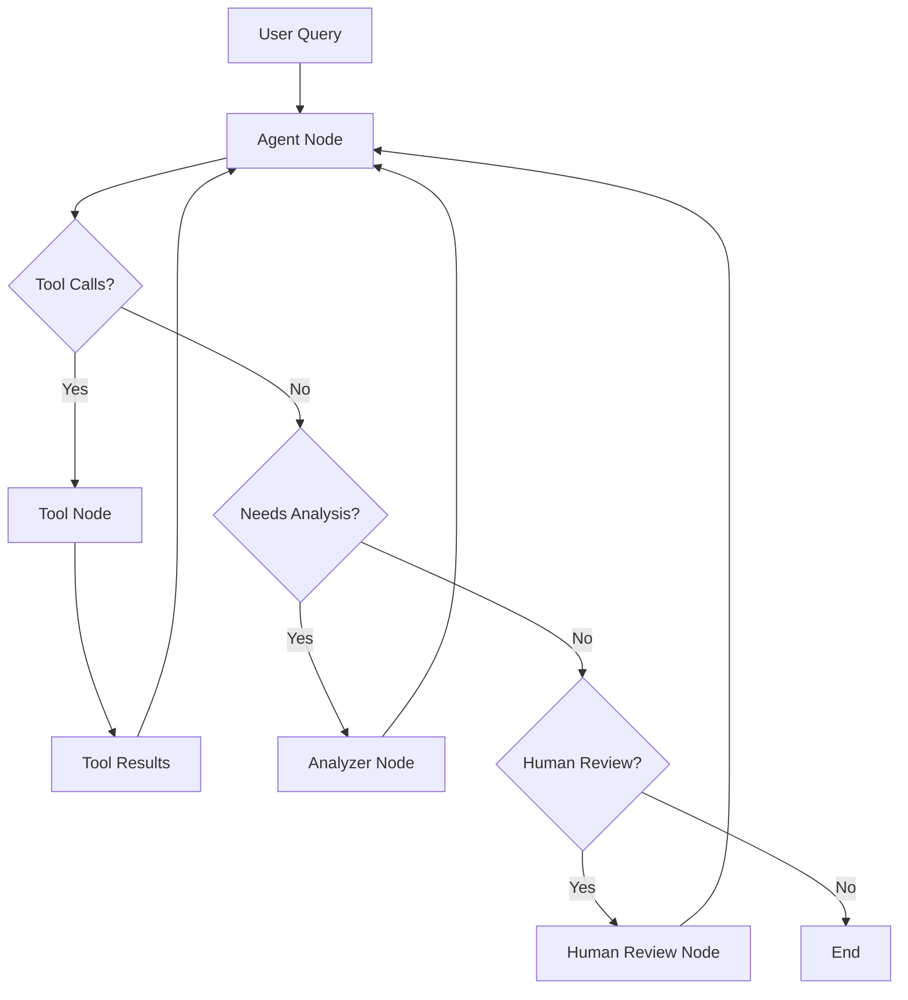

# Complete Agent System Guide

Welcome to the comprehensive guide for the RPA Land Use Analytics Agent System. This guide provides complete documentation for understanding, configuring, extending, and deploying the modern AI agents that power natural language analysis of USDA Forest Service RPA Assessment data.

## What is the Agent System?

The RPA Land Use Analytics Agent System is a sophisticated AI-powered framework built on **LangGraph** and **LangChain** that converts natural language questions into optimized database queries and provides comprehensive business insights. The system features:

- **🧠 Natural Language Understanding**: Convert English questions to optimized DuckDB SQL
- **📊 Business Intelligence**: Automatic insights and analysis with RPA domain expertise  
- **🗺️ Visualization Capabilities**: Generate choropleth maps and geographic visualizations
- **💾 Conversation Memory**: Persistent state and context across multiple queries
- **🔄 Streaming Support**: Real-time response streaming for interactive experiences
- **⚡ Production Ready**: Robust error handling, retry logic, and monitoring capabilities

## Modern Agent Architecture

### Core Agent: `LanduseAgent`

The main agent class provides a sophisticated workflow management system:

```python
from landuse.agents import LanduseAgent
from landuse.config import LanduseConfig

# Create with default configuration
agent = LanduseAgent()

# Or with custom configuration
config = LanduseConfig(
    model_name="claude-3-5-sonnet-20241022",
    enable_map_generation=True,
    enable_memory=True,
    analysis_style="detailed"
)
agent = LanduseAgent(config=config)

# Execute queries
response = agent.query("Which scenarios show the most agricultural land loss?")

# Stream responses for real-time interaction
for chunk in agent.stream_query("Compare forest loss across climate scenarios", thread_id="session-1"):
    print(chunk)

# Interactive chat mode
agent.chat()
```

### Key Features

- **🧠 LangGraph State Management**: Modern graph-based workflow with conversation memory
- **🗣️ Natural Language Processing**: Advanced prompt system with domain-specific variations
- **📊 Business Intelligence**: Comprehensive analysis with insights and summary statistics
- **🗺️ Map Generation**: Choropleth maps with geographic visualizations
- **💾 Conversation Memory**: Persistent checkpointing across sessions
- **🔄 Streaming Support**: Real-time response streaming for interactive experiences
- **⚡ Retry Logic**: Robust error handling with database connection retry
- **🎯 Multi-Model Support**: GPT-4, Claude 3.5 Sonnet, and configurable LLM backends
- **🛠️ Tool Composition**: Modular tool system with subgraph support

## Configuration System

### Dataclass-Based Configuration

The agent uses a modern `LanduseConfig` dataclass with environment variable integration:

```python
from landuse.config import LanduseConfig
from landuse.agents import LanduseAgent

# Default configuration (reads from environment)
config = LanduseConfig.from_env()
agent = LanduseAgent(config)

# Override specific settings
config = LanduseConfig(
    model_name="claude-3-5-sonnet-20241022",
    temperature=0.1,
    max_tokens=4000,
    enable_memory=True,
    enable_map_generation=True,
    analysis_style="detailed",  # "standard", "detailed", "executive"
    domain_focus="agricultural",  # "agricultural", "climate", "urban", or "none"
)
agent = LanduseAgent(config)

# Command-line overrides
config = LanduseConfig.from_env(
    model_name="gpt-4o",
    debug=True,
    verbose=True
)
```

### Configuration Options

#### Database & Performance
- `db_path`: Path to DuckDB database (default: `data/processed/landuse_analytics.duckdb`)
- `max_query_rows`: Maximum rows returned by queries (default: `1000`)
- `max_iterations`: Maximum agent iterations (default: `8`)
- `max_execution_time`: Maximum execution time in seconds (default: `120`)
- `default_display_limit`: Default rows to display (default: `50`)

#### Model Configuration
- `model_name`: LLM model to use (default: `gpt-4o-mini`)
- `temperature`: Model temperature 0.0-2.0 (default: `0.2`)
- `max_tokens`: Maximum response tokens (default: `4000`)

#### Agent Capabilities
- `enable_memory`: Enable conversation memory with checkpointing (default: `true`)
- `enable_map_generation`: Enable map generation tools (default: `true`)

#### Prompt Customization
- `analysis_style`: Analysis style - "standard", "detailed", "executive" (default: `standard`)
- `domain_focus`: Domain specialization - "agricultural", "climate", "urban", "none" (default: `none`)

#### System Behavior
- `verbose`: Enable verbose logging (default: `false`)
- `debug`: Enable debug mode with detailed tracing (default: `false`)
- `rate_limit_calls`: API rate limiting (default: `60`)
- `rate_limit_window`: Rate limit window in seconds (default: `60`)

## Tool System

The agent features a modular tool composition system with factory pattern:

### Core Tools (Always Available)
- **`execute_landuse_query`**: Execute SQL queries with retry logic and error handling
- **`analyze_landuse_results`**: Provide business insights and interpretation 
- **`explore_landuse_schema`**: Get database schema information with table counts
- **`lookup_state_info`**: Convert state names/abbreviations to FIPS codes

### Optional Tools (Configuration-Dependent)
- **`create_map`**: Generate choropleth maps (when `enable_map_generation=True`)

### Tool Creation Pattern

```python
# Tools are created using factory functions
from landuse.tools.common_tools import (
    create_execute_query_tool,
    create_analysis_tool,
    create_schema_tool
)
from landuse.tools.state_lookup_tool import create_state_lookup_tool
from landuse.tools.map_generation_tool import create_map_tool

# Tools are bound to specific agent instances with configuration
tools = [
    create_execute_query_tool(config, db_connection, schema),
    create_analysis_tool(),
    create_schema_tool(schema),
    create_state_lookup_tool()
]

if config.enable_map_generation:
    tools.append(create_map_tool())
```

## Environment Configuration

Configure via `.env` file or environment variables:

```bash
# Required API Keys
OPENAI_API_KEY=your_openai_key
ANTHROPIC_API_KEY=your_anthropic_key

# Model Configuration
LANDUSE_MODEL=claude-3-5-sonnet-20241022  # or gpt-4o-mini
TEMPERATURE=0.2
MAX_TOKENS=4000

# Database and Performance
LANDUSE_DB_PATH=data/processed/landuse_analytics.duckdb
LANDUSE_MAX_QUERY_ROWS=1000
LANDUSE_MAX_ITERATIONS=8
LANDUSE_MAX_EXECUTION_TIME=120

# Agent Features
LANDUSE_ENABLE_MEMORY=true
LANDUSE_ENABLE_MAPS=true

# Prompt Customization
LANDUSE_ANALYSIS_STYLE=standard  # standard, detailed, executive
LANDUSE_DOMAIN_FOCUS=none        # agricultural, climate, urban, none

# Debugging and Monitoring
VERBOSE=false
DEBUG=false
LANDUSE_RATE_LIMIT_CALLS=60
LANDUSE_RATE_LIMIT_WINDOW=60


# Map Generation (if enabled)
LANDUSE_MAP_OUTPUT_DIR=maps/agent_generated
```

## Usage Examples

### Basic Queries with Modern Configuration

```python
from landuse.agents import LanduseAgent
from landuse.config import LanduseConfig

# Standard analysis
config = LanduseConfig()
agent = LanduseAgent(config)

# Agricultural analysis
response = agent.query("How much agricultural land is being lost across RPA scenarios?")

# Climate scenario comparisons
response = agent.query("Compare forest loss between RCP4.5 and RCP8.5 pathways")

# Geographic patterns with state lookup
response = agent.query("Which states have the most urban expansion in California and Texas?")
```

### Streaming Queries with Memory

```python
# Enable memory and streaming
config = LanduseConfig(enable_memory=True)
agent = LanduseAgent(config)

# Stream responses with conversation continuity
thread_id = "land-use-analysis-session"
for chunk in agent.stream_query(
    "Analyze agricultural transitions in the Midwest", 
    thread_id=thread_id
):
    print(chunk)

# Follow-up question in same session
for chunk in agent.stream_query(
    "Now compare that to the Southeast region",
    thread_id=thread_id
):
    print(chunk)
```

### Map Generation and Analysis

```python
# Enable maps and detailed analysis
config = LanduseConfig(
    enable_map_generation=True,
    analysis_style="detailed",
    domain_focus="climate"
)
agent = LanduseAgent(config)

# Generate comprehensive analysis with maps
response = agent.query("Show forest loss patterns by climate model with maps")
```

### Domain-Specific Analysis

```python
# Agricultural focus
config = LanduseConfig(
    domain_focus="agricultural",
    analysis_style="executive",
)
agent = LanduseAgent(config)

response = agent.query("What are the food security implications of projected cropland loss?")
```

### Interactive Chat with Context Manager

```python
# Context manager handles cleanup
with LanduseAgent(config) as agent:
    agent.chat()  # Rich interactive mode with conversation history
```

## Modern LangGraph Architecture

### State Management with TypedDict

```python
class AgentState(TypedDict):
    """Enhanced state tracking for conversation flow."""
    messages: list[BaseMessage]
    context: dict[str, Any]
    iteration_count: int
    max_iterations: int
```

### Graph Workflow



### Execution Modes

1. **Simple Query Mode** (Default): Direct LLM interaction with tool calling
2. **Graph Mode**: Full LangGraph workflow with state management
3. **Streaming Mode**: Real-time response streaming with checkpointing

### Query Processing Flow

1. **Input Processing**: Natural language question with conversation history
2. **Prompt Assembly**: Dynamic system prompt with schema and domain focus
3. **Tool Orchestration**: SQL generation and execution with retry logic
4. **Result Analysis**: Business insights and statistical summaries
5. **Response Formatting**: Rich terminal output or structured data
6. **Memory Persistence**: Conversation checkpointing (if enabled)

## Advanced Configuration Patterns

### Environment-Specific Configuration

Create different configurations for different environments:

```python
from landuse.config import LanduseConfig
from enum import Enum

class Environment(Enum):
    DEVELOPMENT = "development"
    STAGING = "staging"
    PRODUCTION = "production"

class ConfigurationFactory:
    """Factory for creating environment-specific configurations"""
    
    @classmethod
    def create_config(cls, environment: Environment, **overrides) -> LanduseConfig:
        """Create configuration for specific environment"""
        
        env_configs = {
            Environment.DEVELOPMENT: {
                'debug': True,
                'verbose': True,
                'model_name': 'gpt-4o-mini',
                'max_iterations': 8,
                'rate_limit_calls': 100
            },
            Environment.STAGING: {
                'debug': False,
                'verbose': False,
                'model_name': 'gpt-4o-mini',
                'max_iterations': 6,
                'rate_limit_calls': 60
            },
            Environment.PRODUCTION: {
                'debug': False,
                'verbose': False,
                'model_name': 'claude-3-5-sonnet-20241022',
                'max_iterations': 5,
                'rate_limit_calls': 30,
                'max_execution_time': 60
            }
        }
        
        config_kwargs = env_configs.get(environment, env_configs[Environment.PRODUCTION])
        config_kwargs.update(overrides)
        return LanduseConfig.for_agent_type('basic', **config_kwargs)

# Usage
config = ConfigurationFactory.create_config(Environment.PRODUCTION)
agent = LanduseAgent(config=config)
```

### Security Configuration

```python
from landuse.utilities.security import SecurityValidator, RateLimiter

class SecurityConfig:
    """Security configuration for production"""
    
    def __init__(self, config: LanduseConfig):
        self.config = config
        self.query_validator = SecurityValidator()
        self.rate_limiter = RateLimiter(
            max_calls=config.rate_limit_calls,
            time_window=config.rate_limit_window
        )
    
    def validate_query(self, query: str, user_id: str) -> tuple[bool, Optional[str]]:
        """Validate query with rate limiting"""
        # Check rate limit first
        allowed, error = self.rate_limiter.check_rate_limit(user_id)
        if not allowed:
            return False, error
            
        # Validate SQL query
        return self.query_validator.validate_query(query)
```

### Performance Configuration

```python
class PerformanceConfig:
    """Performance optimization configurations"""
    
    @staticmethod
    def get_production_config() -> LanduseConfig:
        """Get optimized configuration for production"""
        return LanduseConfig(
            # Database optimization
            max_query_rows=5000,
            max_execution_time=30,
            default_display_limit=100,
            
            # Memory management
            enable_memory=True,
            streamlit_cache_ttl=600,  # 10 minutes
            
            # Rate limiting
            rate_limit_calls=120,  # 2 per second
            rate_limit_window=60,
            
            # Model settings
            model_name='gpt-4o-mini',  # Cost-effective
            temperature=0.1,  # Consistent results
            max_tokens=2000,  # Reasonable limit
        )
```

## Agent Specialization and Extension

### Domain-Specific Agents

Create specialized agents for different domains:

```python
class AgriculturalAgent(LanduseAgent):
    """Specialized agent for agricultural land use analysis"""
    
    def __init__(self):
        config = LanduseConfig(
            domain_focus='agriculture',
            analysis_style='detailed',
            enable_map_generation=True
        )
        super().__init__(config=config)
        
        # Override system prompt for agricultural focus
        self.system_prompt = self._get_agricultural_prompt()
    
    def _get_agricultural_prompt(self) -> str:
        """Get agricultural-focused system prompt"""
        return """
        You are an agricultural land use specialist analyzing USDA Forest Service RPA data.
        
        Focus specifically on:
        - Crop and pasture land transitions
        - Agricultural productivity impacts
        - Climate scenario effects on farming
        - Regional agricultural patterns
        
        Always prioritize agricultural land use types (crop, pasture) in your analysis.
        Provide specific recommendations for agricultural planning.
        """ + self.schema

class UrbanPlanningAgent(LanduseAgent):
    """Specialized agent for urban development analysis"""
    
    def __init__(self):
        config = LanduseConfig(
            domain_focus='urban',
            analysis_style='policy-focused',
            enable_map_generation=True
        )
        super().__init__(config=config)
        self.system_prompt = self._get_urban_prompt()
    
    def _get_urban_prompt(self) -> str:
        """Get urban planning focused system prompt"""
        return """
        You are an urban planning specialist analyzing land development patterns.
        
        Focus on:
        - Urban expansion patterns and rates
        - What land types are being developed
        - Regional development pressures
        - Infrastructure and growth planning implications
        
        Always highlight urban development trends and their sources.
        Provide insights relevant to city planners and development agencies.
        """ + self.schema
```

### Agent Extension Patterns

```python
from landuse.agents import LanduseAgent
from landuse.config import LanduseConfig
from typing import Optional, Dict, Any

class CustomAgent(LanduseAgent):
    """Base class for custom agent extensions"""
    
    def __init__(self, 
                 config: Optional[LanduseConfig] = None,
                 custom_tools: Optional[list] = None):
        
        # Initialize base agent
        super().__init__(config)
        
        # Add custom tools
        if custom_tools:
            self.tools.extend(custom_tools)
            
        # Custom initialization
        self._setup_custom_features()
    
    def _setup_custom_features(self):
        """Override for custom setup logic"""
        pass
    
    def custom_query(self, 
                    question: str, 
                    custom_context: Dict[str, Any]) -> str:
        """Query with custom context injection"""
        # Add custom context processing
        enhanced_question = self._enhance_with_context(question, custom_context)
        return self.query(enhanced_question)
    
    def _enhance_with_context(self, 
                             question: str, 
                             context: Dict[str, Any]) -> str:
        """Add custom context to questions"""
        # Override for custom context handling
        return question
```

## Integration Patterns

### Streamlit Integration

```python
import streamlit as st
from landuse.agents import LanduseAgent
from landuse.config import LanduseConfig

@st.cache_resource(ttl=300)  # 5 minute TTL
def get_agent(model_name: str = None):
    """Cached agent initialization with error handling"""
    try:
        config = LanduseConfig.for_agent_type('streamlit', 
            model_name=model_name,
            debug=True
        )
        agent = LanduseAgent(config=config)
        return agent, None
    except Exception as e:
        return None, str(e)

def create_agent_app():
    st.title("🌲 Land Use Analytics")
    
    # Initialize session state
    if "agent" not in st.session_state:
        config = LanduseConfig.for_agent_type('streamlit')
        st.session_state.agent = LanduseAgent(config=config)
    
    # Chat interface
    for message in st.session_state.get("messages", []):
        with st.chat_message(message["role"]):
            st.markdown(message["content"])
    
    # User input
    if prompt := st.chat_input("Ask about land use data..."):
        # Add user message
        st.session_state.messages.append({"role": "user", "content": prompt})
        
        with st.chat_message("user"):
            st.markdown(prompt)
        
        # Get agent response
        with st.chat_message("assistant"):
            with st.spinner("Processing..."):
                response = st.session_state.agent.query(prompt)
                st.markdown(response)
                
        # Store assistant response
        st.session_state.messages.append({"role": "assistant", "content": response})
```

### API Integration

```python
from fastapi import FastAPI, HTTPException
from pydantic import BaseModel
from landuse.agents import LanduseAgent
from landuse.config import LanduseConfig

app = FastAPI(title="RPA Land Use Analytics API")

# Global agent instance
agent_instance = None

class QueryRequest(BaseModel):
    question: str
    model_name: Optional[str] = "gpt-4o-mini"

class QueryResponse(BaseModel):
    answer: str
    processing_time: float
    model_used: str
    timestamp: str

@app.on_event("startup")
async def startup_event():
    """Initialize agent on startup"""
    global agent_instance
    config = LanduseConfig.for_agent_type('basic')
    agent_instance = LanduseAgent(config=config)

@app.post("/query", response_model=QueryResponse)
async def process_query(request: QueryRequest):
    """Process a natural language query"""
    if not agent_instance:
        raise HTTPException(status_code=503, detail="Agent not initialized")
    
    start_time = time.time()
    
    try:
        answer = agent_instance.query(request.question)
        processing_time = time.time() - start_time
        
        return QueryResponse(
            answer=answer,
            processing_time=processing_time,
            model_used=agent_instance.model_name,
            timestamp=datetime.now().isoformat()
        )
        
    except Exception as e:
        raise HTTPException(status_code=500, detail=f"Query processing failed: {e}")
```

## Performance Optimization

### Query Optimization

The system implements several performance optimization strategies:

```python
# Automatic row limiting to prevent runaway queries
if "limit" not in cleaned_query.lower():
    cleaned_query = f"{cleaned_query.rstrip(';')} LIMIT {config.max_query_rows}"

# Memory-efficient result formatting
def format_raw_query_results(results: list[tuple], columns: list[str]) -> str:
    """Format results with memory-efficient processing"""
    if not results:
        return "No results found."
    
    # Process in chunks to avoid memory issues
    chunk_size = 1000
    formatted_chunks = []
    
    for i in range(0, len(results), chunk_size):
        chunk = results[i:i+chunk_size]
        # Process chunk...
```

### Memory Management

```python
class LanduseAgent:
    def __init__(self):
        self.conversation_history = []
        self.max_history_length = 20  # Configurable limit
    
    def _update_conversation_history(self, question: str, response: str):
        """Update with automatic trimming"""
        self.conversation_history.append(("user", question))
        self.conversation_history.append(("assistant", response))
        
        # Trim to prevent memory growth
        if len(self.conversation_history) > self.max_history_length:
            self.conversation_history = self.conversation_history[-self.max_history_length:]
```

### Caching Strategies

```python
# Multi-level caching implementation
@st.cache_resource(ttl=300)  # 5 minutes
def get_database_connection():
    """Cache database connections"""
    return DuckDBConnection("landuse")

@st.cache_data(ttl=3600)  # 1 hour
def load_summary_data():
    """Cache analytical results"""
    conn = get_database_connection()
    return conn.query("SELECT * FROM v_summary_statistics")
```

## Monitoring and Observability

### Performance Metrics

```python
@dataclass
class PerformanceMetrics:
    """Agent performance metrics"""
    request_id: str
    timestamp: datetime
    
    # Timing metrics
    total_duration: float
    llm_duration: float
    db_duration: float
    
    # Resource metrics
    memory_peak_mb: float
    cpu_percent: float
    
    # Query metrics
    queries_executed: int
    total_rows_returned: int
    cache_hits: int
    cache_misses: int
    
    def to_dict(self) -> dict:
        """Convert to dictionary for logging"""
        return asdict(self)
```

### Real-time Monitoring

```python
def show_performance_dashboard():
    """Real-time performance monitoring"""
    
    st.title("🔧 Agent Performance Dashboard")
    
    # Real-time metrics
    col1, col2, col3, col4 = st.columns(4)
    
    with col1:
        st.metric("Avg Response Time", "2.3s", "-0.1s")
    
    with col2:
        st.metric("Cache Hit Rate", "78%", "+5%")
    
    with col3:
        st.metric("Memory Usage", "245MB", "+12MB")
    
    with col4:
        st.metric("Queries/min", "24", "+3")
```

## Testing Patterns

### Unit Testing

```python
import pytest
from unittest.mock import Mock, patch
from landuse.agents import LanduseAgent
from landuse.config import LanduseConfig

class TestLanduseAgent:
    """Test framework for agent functionality"""
    
    @pytest.fixture
    def mock_config(self):
        """Create mock configuration"""
        with patch('landuse.config.landuse_config.LanduseConfig.__post_init__'):
            config = LanduseConfig(
                db_path="test.db",
                model_name="gpt-4o-mini"
            )
        return config
    
    def test_agent_initialization(self, mock_config):
        """Test agent initializes correctly"""
        with patch('landuse.agents.landuse_agent.ChatOpenAI'):
            with patch('os.getenv', return_value='test-key'):
                agent = LanduseAgent(config=mock_config)
                assert agent is not None
                assert hasattr(agent, 'config')
```

### Integration Testing

```python
class TestAgentIntegration:
    """Integration tests for agent systems"""
    
    def test_real_query_execution(self, test_database):
        """Test actual query execution against test database"""
        config = LanduseConfig(
            db_path=test_database,
            model_name="gpt-4o-mini"
        )
        
        with patch('os.getenv', return_value='test-key'):
            agent = LanduseAgent(config=config)
            
            # Test schema retrieval
            schema = agent._get_schema()
            assert 'dim_geography' in schema
            
            # Test query execution
            result = agent._execute_query("SELECT COUNT(*) FROM dim_geography")
            assert result['success'] is True
```

## Production Deployment

### Docker Deployment

```dockerfile
# Dockerfile
FROM python:3.11-slim

WORKDIR /app

# Install system dependencies
RUN apt-get update && apt-get install -y \
    build-essential \
    curl \
    && rm -rf /var/lib/apt/lists/*

# Install Python dependencies
COPY requirements.txt .
RUN pip install --no-cache-dir -r requirements.txt

# Copy application code
COPY src/ ./src/
COPY data/ ./data/

# Set environment variables
ENV PYTHONPATH=/app/src
ENV LANDUSE_DB_PATH=/app/data/processed/landuse_analytics.duckdb

# Health check
HEALTHCHECK --interval=30s --timeout=30s --start-period=5s --retries=3 \
    CMD python -c "from landuse.agents import LanduseAgent; LanduseAgent()" || exit 1

# Run application
CMD ["python", "-m", "landuse.agents.agent"]
```

### Kubernetes Deployment

```yaml
apiVersion: apps/v1
kind: Deployment
metadata:
  name: landuse-agent
spec:
  replicas: 3
  selector:
    matchLabels:
      app: landuse-agent
  template:
    metadata:
      labels:
        app: landuse-agent
    spec:
      containers:
      - name: landuse-agent
        image: landuse-agent:latest
        ports:
        - containerPort: 8000
        env:
        - name: OPENAI_API_KEY
          valueFrom:
            secretKeyRef:
              name: api-keys
              key: openai-key
        resources:
          requests:
            memory: "1Gi"
            cpu: "500m"
          limits:
            memory: "2Gi"
            cpu: "1000m"
```

## Security Considerations

### Input Validation

```python
class SecureAgent(LanduseAgent):
    """Security-enhanced agent implementation"""
    
    def query(self, question: str) -> str:
        """Secure query processing with validation"""
        # Input validation
        if not self._validate_input(question):
            return "Invalid input: Query contains potentially harmful content"
        
        # Rate limiting check
        if not self._check_rate_limit():
            return "Rate limit exceeded. Please wait before making another request."
        
        # Execute query with security monitoring
        try:
            return super().query(question)
        except Exception as e:
            # Log security events
            self._log_security_event("query_error", str(e))
            return "An error occurred while processing your request."
    
    def _validate_input(self, question: str) -> bool:
        """Validate user input for security"""
        # Check length
        if len(question) > 1000:
            return False
        
        # Check for SQL injection patterns
        sql_injection_patterns = [
            r'\b(DROP|DELETE|UPDATE|INSERT|CREATE|ALTER)\b',
            r'[;\'"\\]',
            r'--\s',
            r'/\*.*\*/',
        ]
        
        for pattern in sql_injection_patterns:
            if re.search(pattern, question, re.IGNORECASE):
                self._log_security_event("sql_injection_attempt", question)
                return False
        
        return True
```

## Command Line Interface

The agent includes a comprehensive CLI:

```bash
# Interactive session with defaults
uv run python -m landuse.agents.agent

# Custom model and configuration
uv run python -m landuse.agents.agent --model claude-3-5-sonnet-20241022 --verbose

# Debug mode with custom database
uv run python -m landuse.agents.agent --debug --db-path /path/to/custom.duckdb

# Full configuration
uv run python -m landuse.agents.agent \
    --model gpt-4o \
    --temperature 0.1 \
    --max-iterations 10 \
    --verbose \
    --debug
```

## Best Practices

### Configuration Strategy
1. **Start with Defaults**: Use `LanduseConfig.from_env()` for most cases
2. **Progressive Enhancement**: Enable features (maps, memory) as needed
3. **Environment-Based Config**: Use `.env` files for deployment-specific settings
4. **Model Selection**: Claude 3.5 Sonnet for analysis quality, GPT-4o-mini for speed

### Performance Optimization
1. **Query Limits**: Set appropriate `max_query_rows` for large datasets
2. **Memory Management**: Enable conversation memory only for interactive sessions
3. **Rate Limiting**: Configure API rate limits based on your plan
4. **Caching**: Leverage database query result caching

### Development Workflow
1. **Debug Mode**: Use `debug=True` for development and troubleshooting
2. **Verbose Logging**: Enable for understanding agent decision-making
3. **Context Managers**: Use `with` statements for proper resource cleanup
4. **Error Handling**: Implement retry logic for production deployments

## Troubleshooting

### Common Issues

1. **API Key Errors**: Ensure `OPENAI_API_KEY` or `ANTHROPIC_API_KEY` environment variables are set
2. **Database Not Found**: Check `LANDUSE_DB_PATH` or run data conversion scripts
3. **Tool Call Errors**: Verify database schema and table availability
4. **Memory Issues**: Disable memory for simple queries or increase `max_iterations`
5. **Rate Limiting**: Adjust `rate_limit_calls` and `rate_limit_window` settings

### Debug and Monitoring

```python
# Enable comprehensive debugging
config = LanduseConfig(
    debug=True,
    verbose=True,
    max_iterations=10  # Allow more iterations for complex queries
)
agent = LanduseAgent(config)

# Clear conversation history if needed
agent.clear_history()

# Check agent configuration
print(f"Model: {agent.model_name}")
print(f"Database: {agent.config.db_path}")
print(f"Schema: {agent._get_schema_help()}")
```

## API Reference

### LanduseAgent Class

```python
class LanduseAgent:
    """Modern landuse agent with LangGraph architecture and memory-first design."""
    
    def __init__(self, config: Optional[LanduseConfig] = None):
        """Initialize agent with configuration."""
    
    def query(
        self, 
        question: str, 
        use_graph: bool = False, 
        thread_id: Optional[str] = None
    ) -> str:
        """Execute a natural language query."""
    
    def simple_query(self, question: str) -> str:
        """Execute query using direct LLM interaction (stable mode)."""
    
    def stream_query(
        self, 
        question: str, 
        thread_id: Optional[str] = None
    ) -> Iterator[Any]:
        """Stream responses for real-time interaction."""
    
    def chat(self) -> None:
        """Start interactive Rich terminal chat interface."""
    
    def clear_history(self) -> None:
        """Clear conversation history."""
    
    # Context manager support
    def __enter__(self) -> "LanduseAgent":
        """Context manager entry."""
    
    def __exit__(self, exc_type, exc_val, exc_tb) -> None:
        """Context manager exit with resource cleanup."""
```

## Related Documentation

### Quick Links
- **[Complete Setup Guide](../getting-started/complete-setup.md)** - Installation and first steps
- **[Complete Database Reference](../data/complete-reference.md)** - Database schema and tables
- **[Query Examples](../queries/complete-guide.md)** - Query patterns and examples
- **[API Documentation](../api/agent.md)** - Python integration

### Deep Dives
- **[System Prompts Architecture](SYSTEM_PROMPT_ARCHITECTURE.md)** - How prompts work and customize
- **[Tool System Architecture](TOOL_SYSTEM_ARCHITECTURE.md)** - Tool composition and creation
- **[Memory & State Management](MEMORY_STATE_MANAGEMENT.md)** - Conversation and state management
- **[Error Handling & Resilience](ERROR_HANDLING_RESILIENCE.md)** - Production reliability patterns
- **[Performance Monitoring](PERFORMANCE_MONITORING.md)** - Optimization and monitoring strategies
- **[Integration & Extension](INTEGRATION_EXTENSION.md)** - Embedding and extending agents
- **[Configuration Architecture](CONSTANTS_ARCHITECTURE.md)** - How constants connect to agents

The RPA Land Use Analytics agent provides a sophisticated, production-ready system for natural language analysis of land use data. Built on modern LangGraph architecture with comprehensive configuration, memory management, and tool composition, it enables both simple queries and complex analytical workflows while maintaining reliability and performance.

## See Also

### Related Documentation
- **[Complete Query Guide](../queries/complete-guide.md)** - Natural language query patterns and syntax for effective agent interaction
- **[Complete Examples Guide](../examples/complete-examples.md)** - Real-world workflows and use cases demonstrating agent capabilities
- **[Complete Database Reference](../data/complete-reference.md)** - Database schema and optimization strategies for agent queries
- **[RPA Assessment Complete](../rpa/rpa-assessment-complete.md)** - Background on data sources and methodology for context
- **[Complete Setup Guide](../getting-started/complete-setup.md)** - Installation and initial configuration

### Quick Navigation by Topic
- **Query Patterns**: See [Complete Query Guide](../queries/complete-guide.md#advanced-query-patterns) for agent interaction best practices
- **Practical Examples**: Check [Complete Examples Guide](../examples/complete-examples.md#step-by-step-workflows) for detailed agent workflows
- **Database Understanding**: Reference [Database Schema](../data/complete-reference.md#star-schema-design) for query optimization
- **Scenario Context**: Learn about [RPA Scenarios](../rpa/rpa-assessment-complete.md#climate-scenarios) for analysis context
- **Setup Instructions**: Follow [Installation Guide](../getting-started/complete-setup.md#agent-configuration) for initial setup

> **Consolidation Note**: This guide consolidates information from README.md, overview.md, ADVANCED_CONFIGURATION.md, INTEGRATION_EXTENSION.md, and PERFORMANCE_MONITORING.md into a single comprehensive agent system reference. For the most current agent configuration and capabilities, always refer to this complete guide rather than individual component files.