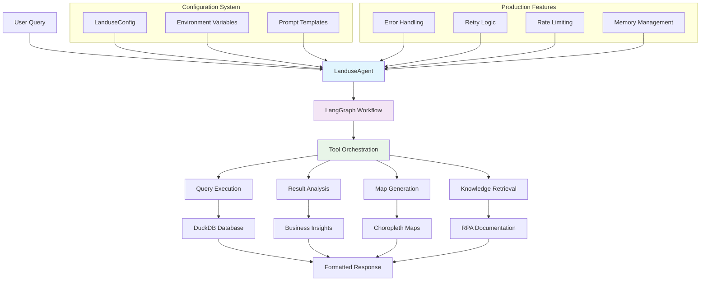

# Agent System Overview

Welcome to the comprehensive guide for the RPA Land Use Analytics Agent System. This section provides complete documentation for understanding, configuring, extending, and deploying the modern AI agents that power natural language analysis of USDA Forest Service RPA Assessment data.

## 🤖 What is the Agent System?

The RPA Land Use Analytics Agent System is a sophisticated AI-powered framework built on **LangGraph** and **LangChain** that converts natural language questions into optimized database queries and provides comprehensive business insights. The system features:

- **🧠 Natural Language Understanding**: Convert English questions to optimized DuckDB SQL
- **📊 Business Intelligence**: Automatic insights and analysis with RPA domain expertise
- **🗺️ Visualization Capabilities**: Generate choropleth maps and geographic visualizations
- **💾 Conversation Memory**: Persistent state and context across multiple queries
- **🔄 Streaming Support**: Real-time response streaming for interactive experiences
- **⚡ Production Ready**: Robust error handling, retry logic, and monitoring capabilities

## 🏗️ System Architecture



## 📖 Documentation Guide

### 🎯 **Start Here**
New to the agent system? Begin with these essential guides:

| Document | Purpose | Audience |
|----------|---------|----------|
| **[Architecture](README.md)** | Complete system overview with examples | All users |
| **[System Prompts](SYSTEM_PROMPT_ARCHITECTURE.md)** | How prompts work and customize | Developers |
| **[Configuration](CONSTANTS_ARCHITECTURE.md)** | How constants connect to agents | Developers |

### 🔧 **API Reference**
Detailed technical references for developers:

| Document | Purpose | Use Case |
|----------|---------|----------|
| **[Main Agent](../api/agent.md)** | LanduseAgent class API reference | Python integration |
| **[Query Capabilities](../api/landuse-query-agent.md)** | Natural language processing | Query patterns |
| **[LangGraph Integration](../api/langgraph-agent.md)** | Graph-based workflows | Advanced features |

### 🚀 **Advanced Topics**
Deep-dive into specialized areas:

| Document | Purpose | Audience |
|----------|---------|----------|
| **[Tool System](TOOL_SYSTEM_ARCHITECTURE.md)** | Tool composition and creation | Developers |
| **[Memory & State](MEMORY_STATE_MANAGEMENT.md)** | Conversation and state management | Advanced users |
| **[Error Handling](ERROR_HANDLING_RESILIENCE.md)** | Production reliability patterns | DevOps/SREs |
| **[Performance](PERFORMANCE_MONITORING.md)** | Optimization and monitoring | Performance teams |
| **[Integration](INTEGRATION_EXTENSION.md)** | Embedding and extending agents | Integration teams |

### ⚙️ **Configuration & Deployment**
Production deployment guidance:

| Document | Purpose | Use Case |
|----------|---------|----------|
| **[Advanced Configuration](ADVANCED_CONFIGURATION.md)** | Production deployment patterns | DevOps/SREs |

## 🚀 Quick Start

### Interactive Chat
```bash
# Start the interactive agent immediately
uv run python -m landuse.agents.agent

# Or use the package shortcut
uv run python -m landuse

# Or use the CLI alias (if configured)
uv run rpa-analytics
```

### Python Integration
```python
from landuse.agents import LanduseAgent
from landuse.config import LanduseConfig

# Initialize with defaults
agent = LanduseAgent()

# Ask natural language questions
response = agent.query("Which RPA scenarios show the most agricultural land loss?")
print(response)

# Enable advanced features
config = LanduseConfig(
    model_name="claude-3-5-sonnet-20241022",
    enable_map_generation=True,
    enable_memory=True,
    analysis_style="detailed"
)
agent = LanduseAgent(config=config)

# Stream responses for real-time interaction
for chunk in agent.stream_query("Compare forest loss across climate scenarios"):
    print(chunk, end="")
```

### Web Interface
```bash
# Launch the Streamlit dashboard
uv run streamlit run landuse_app.py

# Navigate to the Chat page for agent interaction
# Features: conversation history, model selection, streaming responses
```

## 🎯 Common Use Cases

### 🌾 Agricultural Analysis
```python
# Analyze agricultural land transitions
agent.query("How much farmland is projected to be lost to development by 2070?")
agent.query("Which scenarios show the greatest impact on crop production?")
agent.query("Compare agricultural losses between Texas and Iowa")
```

### 🌍 Climate Impact Assessment
```python
# Compare climate scenarios
agent.query("Compare forest loss between RCP45 and RCP85 pathways")
agent.query("What are the differences between low and high warming scenarios?")
agent.query("Show me urbanization trends under different climate models")
```

### 🗺️ Geographic Analysis
```python
# State and regional analysis
agent.query("Which states have the most urban expansion?")
agent.query("Compare land use changes between the South and Midwest")
agent.query("Show me county-level patterns in California")
```

### 📈 Temporal Trend Analysis
```python
# Time series analysis
agent.query("Show forest area trends from 2020 to 2100")
agent.query("When does urban expansion accelerate the most?")
agent.query("Compare land use changes by decade")
```

## 🎨 Key Features

### Natural Language Processing
- **Domain Expertise**: Deep understanding of RPA terminology and concepts
- **SQL Generation**: Optimized queries using the star schema design
- **Context Awareness**: Maintains conversation history and reference context
- **Error Recovery**: Intelligent suggestions when queries fail

### Advanced Capabilities
- **Map Generation**: Choropleth maps for geographic visualization
- **Streaming Responses**: Real-time response generation
- **Multi-Model Support**: Claude 3.5 Sonnet, GPT-4, and configurable backends
- **Knowledge Integration**: Access to RPA methodology documentation

### Production Features
- **Robust Error Handling**: Graceful failure recovery with helpful diagnostics
- **Rate Limiting**: Built-in API rate limiting and throttling
- **Memory Management**: Efficient conversation history and state persistence
- **Configuration Flexibility**: Environment-based configuration for different deployments

## 🛠️ Configuration Overview

### Environment Variables
```bash
# Model Selection
LANDUSE_MODEL=claude-3-5-sonnet-20241022  # or gpt-4o-mini

# API Keys (one required)
ANTHROPIC_API_KEY=your_key
OPENAI_API_KEY=your_key

# Database Configuration
LANDUSE_DB_PATH=data/processed/landuse_analytics.duckdb

# Agent Features
LANDUSE_ENABLE_MEMORY=true
LANDUSE_ENABLE_MAPS=true
LANDUSE_ENABLE_KNOWLEDGE_BASE=false

# Performance Tuning
LANDUSE_MAX_QUERY_ROWS=1000
LANDUSE_MAX_ITERATIONS=8
LANDUSE_MAX_EXECUTION_TIME=120
```

### Python Configuration
```python
from landuse.config import LanduseConfig

# Load from environment
config = LanduseConfig.from_env()

# Custom configuration
config = LanduseConfig(
    model_name="claude-3-5-sonnet-20241022",
    temperature=0.1,
    enable_memory=True,
    enable_map_generation=True,
    analysis_style="detailed",  # "standard", "detailed", "executive"
    domain_focus="agricultural"  # "agricultural", "climate", "urban", "none"
)
```

## 🔗 Integration Examples

### Streamlit Dashboard
The agent powers the interactive web dashboard with natural language chat capabilities, streaming responses, and conversation history.

### API Endpoints
```python
# Flask API integration
from flask import Flask, request, jsonify
from landuse.agents import LanduseAgent

app = Flask(__name__)
agent = LanduseAgent()

@app.route('/query', methods=['POST'])
def query():
    question = request.json['question']
    result = agent.simple_query(question)
    return jsonify({'result': result})
```

### Jupyter Notebooks
```python
# Notebook integration for research
import pandas as pd
from landuse.agents import LanduseAgent

agent = LanduseAgent()
response = agent.query("Get agricultural data for analysis")
# Parse and visualize results
```

## 📊 Performance & Reliability

### Query Performance
- **Simple queries**: < 2 seconds
- **Complex aggregations**: 2-8 seconds
- **Multi-scenario comparisons**: 5-20 seconds
- **Geographic analysis**: 3-15 seconds

### Reliability Features
- **Automatic retry logic** for database connections
- **Query optimization** with intelligent limits
- **Error recovery** with helpful suggestions
- **Rate limiting** to prevent API overuse
- **Memory management** for long conversations

## 🚦 Next Steps

### For New Users
1. **[Quick Start Guide](../getting-started/quickstart.md)** - Get up and running quickly
2. **[Basic Queries](../queries/basic-queries.md)** - Learn query patterns
3. **[Architecture Overview](README.md)** - Understand the system design

### For Developers
1. **[API Reference](../api/agent.md)** - Integrate agents into applications
2. **[Tool System](TOOL_SYSTEM_ARCHITECTURE.md)** - Create custom tools
3. **[Configuration Guide](ADVANCED_CONFIGURATION.md)** - Production deployment

### For Advanced Users
1. **[Memory & State Management](MEMORY_STATE_MANAGEMENT.md)** - Conversation patterns
2. **[Performance Optimization](PERFORMANCE_MONITORING.md)** - Tune for production
3. **[Integration Patterns](INTEGRATION_EXTENSION.md)** - Embed in larger systems

## 💡 Getting Help

- **Interactive Help**: Type `help` in the chat interface for RPA-specific examples
- **Documentation**: Comprehensive guides in this Agent System section
- **Configuration Issues**: See [Troubleshooting Guide](../troubleshooting.md)
- **Database Setup**: Check [Database Overview](../data/database-overview.md)

---

The RPA Land Use Analytics Agent System represents a modern approach to making complex land use data accessible through natural language. Whether you're a researcher exploring climate scenarios, a policy maker analyzing agricultural impacts, or a developer building applications, the agent system provides the tools and flexibility needed for comprehensive RPA data analysis.