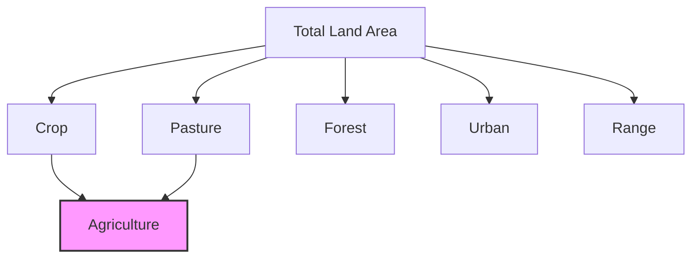

# Land Use Categories

Detailed explanation of each land use category in the database and how they relate to real-world land classification systems.

## Overview

The land use classification system used in this project is based on standard USDA and land cover categories, simplified into six main types for analysis.



## Primary Categories

### 🌾 Crop (Cropland)

**Definition:** Land used for the production of adapted crops for harvest.

**Includes:**
- Annual crops (corn, soybeans, wheat, etc.)
- Perennial crops (orchards, vineyards)
- Cultivated lands
- Crop rotation areas
- Fallow cropland

**Characteristics:**
- Actively managed for agricultural production
- Regular planting and harvesting cycles
- May include irrigation infrastructure
- Subject to agricultural policies and subsidies

**Typical Transitions:**
- **To Urban:** Agricultural land near cities under development pressure
- **To Pasture:** Crop-livestock integration or economic shifts
- **To Forest:** Abandoned farmland or conservation programs
- **From Pasture:** Intensification of agricultural use

### 🐄 Pasture

**Definition:** Land used primarily for grazing of livestock.

**Includes:**
- Improved pastures with planted grasses
- Grazing lands in rotation with crops
- Permanent pastures
- Hayfields

**Characteristics:**
- Managed grasslands for livestock
- May be fertilized or irrigated
- Often near crop areas (mixed farming)
- Can be converted relatively easily

**Typical Transitions:**
- **To Crop:** Agricultural intensification
- **To Urban:** Development in rural-urban fringe
- **To Forest:** Natural succession or tree planting
- **From Crop:** Shift to livestock farming

### 🌲 Forest

**Definition:** Land dominated by trees and woody vegetation.

**Includes:**
- Natural forests
- Managed forests for timber
- Forest plantations
- Wooded wetlands
- Young forest regeneration

**Characteristics:**
- Tree canopy coverage >10%
- May be managed or unmanaged
- Provides ecosystem services
- Subject to conservation policies

**Typical Transitions:**
- **To Urban:** Deforestation for development
- **To Crop:** Agricultural expansion
- **To Pasture:** Clearing for grazing
- **From Range:** Natural succession or afforestation

### 🏢 Urban

**Definition:** Developed land with constructed materials and infrastructure.

**Includes:**
- Cities and towns
- Residential areas
- Commercial and industrial zones
- Transportation infrastructure
- Urban green spaces (parks)

**Characteristics:**
- Permanent land use change
- High economic value
- Rarely converts to other uses
- Expanding in most scenarios

**Typical Transitions:**
- **From Forest:** Suburban expansion
- **From Crop:** Agricultural land conversion
- **From Pasture:** Rural development
- **To Urban:** Essentially none (permanent)

### 🌿 Range (Rangeland)

**Definition:** Natural grasslands and shrublands, typically in arid/semi-arid regions.

**Includes:**
- Native grasslands
- Shrublands
- Desert vegetation
- Non-improved grazing lands
- Prairie ecosystems

**Characteristics:**
- Natural vegetation
- Minimal management
- Often used for extensive grazing
- Climate-limited productivity

**Typical Transitions:**
- **To Pasture:** Improvement for livestock
- **To Crop:** Irrigation development
- **To Forest:** Succession in wetter areas
- **To Urban:** Limited (usually near cities)

### 📊 Total

**Definition:** Sum of all land use categories for validation.

**Purpose:**
- Data quality check
- Ensures accounting completeness
- Not a real land use category

**Usage in Queries:**
```sql
-- Always exclude Total from analyses
WHERE from_land_use != 'Total' 
  AND to_land_use != 'Total'
```

## Agricultural Aggregation

In the `*_ag` tables, agricultural land is combined:

### 🚜 Agriculture (Combined)

**Definition:** Crop + Pasture combined into a single category.

**Rationale:**
- Simplifies agricultural analysis
- Both are managed for food production
- Often intermixed on farms
- Similar policy implications

**When to Use:**
- Analyzing total agricultural land
- Food security assessments
- Comparing agricultural vs. natural land
- Policy scenario analysis

## Understanding Transitions

### Natural Progressions

Some transitions follow natural succession patterns:

```
Range → Forest (increasing precipitation)
Pasture → Forest (abandonment)
Crop → Pasture → Forest (land retirement)
```

### Economic Drivers

Market forces drive many transitions:

```
Forest → Crop (commodity prices high)
Pasture → Crop (intensification)
Range → Pasture (livestock expansion)
All → Urban (development pressure)
```

### Policy Influences

Conservation and development policies affect transitions:

```
Crop → Forest (conservation programs)
Forest → Forest (protection policies)
Pasture → Urban (zoning changes)
```

## Regional Variations

### Eastern US
- More Forest ↔ Crop transitions
- Higher Forest → Urban pressure
- Limited rangeland

### Western US
- Extensive rangelands
- Range ↔ Pasture transitions
- Water-limited crop expansion

### Midwest
- Crop ↔ Pasture rotations
- Stable agricultural land
- Urban expansion into farmland

### Coastal Areas
- High Urban expansion pressure
- Forest → Urban common
- Agricultural land loss

## Query Examples by Category

### Cropland Analysis
```
You> Show me counties with the most cropland expansion
You> What's converting to cropland in the High Crop Demand scenario?
You> Track cropland changes in Iowa counties
```

### Forest Conservation
```
You> Which counties maintain the most forest cover through 2100?
You> Show forest to urban conversion rates by decade
You> Compare forest outcomes across scenarios
```

### Urban Growth
```
You> Calculate urban expansion rates for major metropolitan areas
You> What land uses are consumed by urban growth?
You> Project when urban area will double from 2020 levels
```

### Agricultural Trends
```
You> Show the balance between crop and pasture over time
You> Which scenario maximizes agricultural productivity?
You> Find counties shifting from crops to livestock
```

### Rangeland Changes
```
You> How much rangeland converts to other uses?
You> Show rangeland preservation by scenario
You> Identify counties with significant range to pasture conversion
```

## Data Quality Considerations

### Classification Accuracy
- Based on remote sensing and surveys
- Some mixed land uses simplified
- Urban includes various developed types

### Temporal Consistency
- Categories stable across time periods
- Same definitions used throughout
- Allows valid historical comparisons

### Spatial Resolution
- County-level aggregation
- Sub-county variations not captured
- Edge effects at county boundaries

## Best Practices

1. **Consider Regional Context**
   - Land use meanings vary by region
   - Climate affects transition likelihood
   - Local policies matter

2. **Aggregate Thoughtfully**
   - Use agricultural aggregation for food analysis
   - Keep separate for detailed studies
   - Remember Total is for validation only

3. **Interpret Transitions**
   - Some transitions are rare/unlikely
   - Consider economic feasibility
   - Account for policy constraints

## Next Steps

- Review [Database Schema](schema.md) for technical details
- Explore [Data Sources](sources.md) for methodology
- See [Query Examples](../queries/examples.md) for category-specific analyses