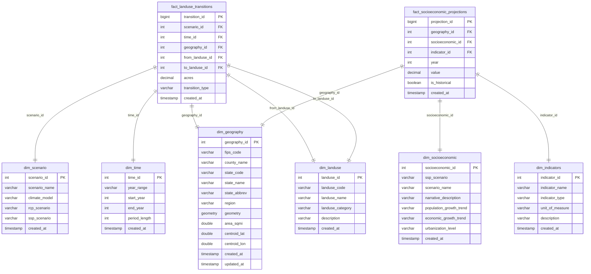

# Complete Database Reference

## Executive Summary

The RPA Land Use Analytics database is a comprehensive 372 MB DuckDB repository containing **5.7+ million land use transition records** across 3,075 US counties, 20 climate scenarios, and 6 time periods (2012-2070). The database uses an optimized star schema design with 8 tables and 5 analytical views, achieving 98.99% storage efficiency.

## Quick Statistics

| Metric | Value |
|--------|-------|
| **Database Size** | 372 MB (390,070,272 bytes) |
| **Total Records** | 5,724,134 records |
| **Land Use Transitions** | 5.4+ million transitions |
| **Geographic Coverage** | 3,075 US counties |
| **Climate Scenarios** | 20 scenarios (5 models × 4 combinations) |
| **Time Periods** | 6 periods (2012-2070) |
| **Total Land Tracked** | 16.7 million (1.67 billion actual acres) |
| **Storage Efficiency** | 98.99% block utilization |

## Database Architecture

### Star Schema Design

The database follows modern data warehousing best practices with a star schema optimized for analytical queries:



## Complete Table Reference

### Fact Tables (Data-Heavy)

#### fact_landuse_transitions

**Purpose**: Core table containing all land use transitions between categories across scenarios, time periods, and counties.

**Records**: 5,432,198 | **Size**: 5.18 MB | **Type**: Fact Table

##### Schema Definition

| Column | Data Type | Constraints | Description |
|--------|-----------|-------------|-------------|
| `transition_id` | BIGINT | | Unique identifier for each transition record |
| `scenario_id` | INTEGER | NOT NULL, FK | Reference to dim_scenario table |
| `time_id` | INTEGER | NOT NULL, FK | Reference to dim_time table |
| `geography_id` | INTEGER | NOT NULL, FK | Reference to dim_geography table |
| `from_landuse_id` | INTEGER | NOT NULL, FK | Reference to dim_landuse (source land use) |
| `to_landuse_id` | INTEGER | NOT NULL, FK | Reference to dim_landuse (destination land use) |
| `acres` | DECIMAL(15,4) | | Area in hundreds of acres for this transition |
| `transition_type` | VARCHAR | | 'change' or 'same' |
| `created_at` | TIMESTAMP | | Record creation timestamp |

##### Data Distribution

| Transition Type | Count | Percentage | Avg Acres |
|----------------|-------|------------|-----------|
| change | 3,887,318 | 71.5% | 0.133 (13.3 actual acres) |
| same | 1,544,880 | 28.5% | 10.456 (1,045.6 actual acres) |

##### Top Land Use Transitions

| Transition | Total Acres | Number of Transitions |
|------------|-------------|----------------------|
| Crop → Pasture | 153.2 thousand (15.32 million actual acres) | 347,000 |
| Pasture → Crop | 126.3 thousand (12.63 million actual acres) | 347,000 |
| Forest → Urban | 51.0 thousand (5.10 million actual acres) | 336,000 |
| Pasture → Forest | 37.1 thousand (3.71 million actual acres) | 333,000 |
| Crop → Urban | 24.7 thousand (2.47 million actual acres) | 348,000 |

#### fact_socioeconomic_projections

**Purpose**: Population and income projections by county and SSP scenario.

**Records**: 291,936 | **Size**: 0.28 MB | **Type**: Fact Table

##### Schema Definition

| Column | Data Type | Constraints | Description |
|--------|-----------|-------------|-------------|
| `projection_id` | BIGINT | NOT NULL, PK | Unique identifier for each projection |
| `geography_id` | INTEGER | NOT NULL, FK | Reference to dim_geography table |
| `socioeconomic_id` | INTEGER | NOT NULL, FK | Reference to dim_socioeconomic table |
| `indicator_id` | INTEGER | NOT NULL, FK | Reference to dim_indicators table |
| `year` | INTEGER | NOT NULL | Projection year |
| `value` | DECIMAL(15,4) | NOT NULL | Indicator value (population in thousands, income in 2009 USD thousands) |
| `is_historical` | BOOLEAN | DEFAULT FALSE | Whether this is historical (TRUE) or projected (FALSE) data |
| `created_at` | TIMESTAMP | DEFAULT CURRENT_TIMESTAMP | Record creation timestamp |

### Dimension Tables (Reference Data)

#### dim_geography

**Purpose**: Geographic reference data for all US counties with enhanced metadata.

**Records**: 3,075 | **Size**: 0.003 MB | **Type**: Dimension Table

##### Schema Definition

| Column | Data Type | Constraints | Description |
|--------|-----------|-------------|-------------|
| `geography_id` | INTEGER | PK | Unique identifier for each county |
| `fips_code` | VARCHAR | UNIQUE | 5-digit FIPS county code |
| `county_name` | VARCHAR | | County name |
| `state_code` | VARCHAR | | 2-character state code |
| `state_name` | VARCHAR | | Full state name |
| `state_abbrev` | VARCHAR | | 2-character state abbreviation |
| `region` | VARCHAR | | US Census region (Northeast, Midwest, South, West) |
| `geometry` | GEOMETRY | | County boundary geometry (spatial data) |
| `area_sqmi` | DOUBLE | | County area in square miles |
| `centroid_lat` | DOUBLE | | County centroid latitude |
| `centroid_lon` | DOUBLE | | County centroid longitude |
| `created_at` | TIMESTAMP | | Record creation timestamp |
| `updated_at` | TIMESTAMP | | Last update timestamp |

##### Regional Distribution

| Region | Counties | Avg Size (sq mi) | Percentage |
|--------|----------|------------------|------------|
| South | 1,389 | 624 | 45.2% |
| Midwest | 1,055 | 711 | 34.3% |
| West | 414 | 2,836 | 13.5% |
| Northeast | 217 | 746 | 7.1% |

#### dim_scenario

**Purpose**: Climate and socioeconomic scenario definitions combining climate models with RCP/SSP pathways.

**Records**: 20 | **Size**: 0.00002 MB | **Type**: Dimension Table

##### Climate Models

| Model | Description | Characteristics |
|-------|-------------|-----------------|
| CNRM_CM5 | "Wet" climate model | Higher precipitation scenarios |
| HadGEM2_ES365 | "Hot" climate model | Higher temperature scenarios |
| IPSL_CM5A_MR | "Dry" climate model | Lower precipitation scenarios |
| MRI_CGCM3 | "Least warm" climate model | More moderate temperature increases |
| NorESM1_M | "Middle" climate model | Balanced temperature/precipitation |

##### RCP/SSP Combinations

| Combination | Emissions | Growth | Description |
|-------------|-----------|--------|-------------|
| rcp45_ssp1 | Low | Medium | Sustainability pathway |
| rcp85_ssp2 | High | Medium | Middle of the road |
| rcp85_ssp3 | High | Low | Regional rivalry |
| rcp85_ssp5 | High | High | Fossil-fueled development |

#### dim_time

**Purpose**: Time period definitions for land use projection intervals.

**Records**: 6 | **Size**: 0.000006 MB | **Type**: Dimension Table

##### Time Periods

| time_id | year_range | start_year | end_year | period_length | Purpose |
|---------|------------|------------|----------|---------------|---------|
| 1 | 2012-2020 | 2012 | 2020 | 8 | Historical calibration |
| 2 | 2020-2030 | 2020 | 2030 | 10 | Near-term projections |
| 3 | 2030-2040 | 2030 | 2040 | 10 | Medium-term projections |
| 4 | 2040-2050 | 2040 | 2050 | 10 | Mid-century projections |
| 5 | 2050-2060 | 2050 | 2060 | 10 | Extended projections |
| 6 | 2060-2070 | 2060 | 2070 | 10 | Long-term projections |

#### dim_landuse

**Purpose**: Land use category definitions with business descriptions.

**Records**: 5 | **Size**: 0.000005 MB | **Type**: Dimension Table

##### Land Use Types

| landuse_id | landuse_code | landuse_name | landuse_category | Description |
|------------|--------------|--------------|------------------|-------------|
| 1 | cr | Crop | Agriculture | Agricultural cropland for food production |
| 2 | ps | Pasture | Agriculture | Grazing land for livestock |
| 3 | rg | Rangeland | Natural | Natural grasslands and shrublands |
| 4 | fr | Forest | Natural | Forested areas including managed timber |
| 5 | ur | Urban | Developed | Developed areas with infrastructure |

#### dim_socioeconomic

**Purpose**: Shared Socioeconomic Pathway (SSP) scenario definitions with narrative descriptions.

**Records**: 5 | **Size**: 0.000005 MB | **Type**: Dimension Table

##### SSP Scenarios

| ssp_scenario | scenario_name | Population Growth | Economic Growth | Urbanization |
|--------------|---------------|-------------------|-----------------|--------------|
| ssp1 | Sustainability | Low | Medium | Moderate |
| ssp2 | Middle of the Road | Medium | Medium | Moderate |
| ssp3 | Regional Rivalry | High | Low | Slow |
| ssp4 | Inequality | Medium | High | Fast |
| ssp5 | Fossil-fueled Development | Low | High | Fast |

#### dim_indicators

**Purpose**: Socioeconomic indicator definitions for measurement units and descriptions.

**Records**: 2 | **Size**: 0.000002 MB | **Type**: Dimension Table

##### Available Indicators

| indicator_id | indicator_name | indicator_type | unit_of_measure | Description |
|--------------|----------------|----------------|-----------------|-------------|
| 1 | Population | Demographic | Thousands | County population in thousands |
| 2 | Income Per Capita | Economic | 2009 USD Thousands | Per capita income in thousands of 2009 USD |

## Analytical Views

The database includes 5 pre-built analytical views for common query patterns:

| View | Records | Purpose |
|------|---------|---------|
| `v_scenarios_combined` | 20 | Climate + socioeconomic scenario integration |
| `v_landuse_socioeconomic` | 5.4M | Complete land use transitions with demographics |
| `v_population_trends` | 291,936 | County population projections by scenario |
| `v_income_trends` | 291,936 | County income projections by scenario |
| `v_full_projection_period` | 1.3M | Long-term trends and cumulative changes 2020-2070 |

### v_scenarios_combined

**Purpose**: Combines climate scenarios with socioeconomic scenarios to provide complete scenario context.

```sql
CREATE VIEW v_scenarios_combined AS 
SELECT 
    s.scenario_id, 
    s.scenario_name AS climate_scenario, 
    s.climate_model, 
    s.rcp_scenario, 
    s.ssp_scenario, 
    se.scenario_name AS ssp_name, 
    se.narrative_description, 
    se.population_growth_trend, 
    se.economic_growth_trend, 
    se.urbanization_level 
FROM dim_scenario AS s 
LEFT JOIN dim_socioeconomic AS se ON (s.ssp_scenario = se.ssp_scenario);
```

### v_landuse_socioeconomic

**Purpose**: Comprehensive view combining land use transitions with full demographic and geographic context.

```sql
CREATE VIEW v_landuse_socioeconomic AS 
SELECT 
    f.transition_id, 
    g.fips_code, 
    g.county_name, 
    g.state_name, 
    g.region, 
    s.scenario_name AS climate_scenario, 
    s.rcp_scenario, 
    s.ssp_scenario, 
    t.start_year, 
    t.end_year, 
    lu_from.landuse_name AS from_landuse, 
    lu_to.landuse_name AS to_landuse, 
    f.acres, 
    f.transition_type, 
    pop.population_thousands AS population_start, 
    inc.income_per_capita_2009usd AS income_start 
FROM fact_landuse_transitions AS f 
INNER JOIN dim_scenario AS s ON (f.scenario_id = s.scenario_id) 
INNER JOIN dim_time AS t ON (f.time_id = t.time_id) 
INNER JOIN dim_geography AS g ON (f.geography_id = g.geography_id) 
INNER JOIN dim_landuse AS lu_from ON (f.from_landuse_id = lu_from.landuse_id) 
INNER JOIN dim_landuse AS lu_to ON (f.to_landuse_id = lu_to.landuse_id) 
LEFT JOIN v_population_trends AS pop ON ((g.fips_code = pop.fips_code) 
    AND (s.ssp_scenario = pop.ssp_scenario) 
    AND (t.start_year = pop.year)) 
LEFT JOIN v_income_trends AS inc ON ((g.fips_code = inc.fips_code) 
    AND (s.ssp_scenario = inc.ssp_scenario) 
    AND (t.start_year = inc.year));
```

### v_population_trends

**Purpose**: County-level population projections across all SSP scenarios.

```sql
CREATE VIEW v_population_trends AS 
SELECT 
    g.fips_code, 
    g.county_name, 
    g.state_name, 
    g.region, 
    se.ssp_scenario, 
    se.scenario_name, 
    sp.year, 
    sp.value AS population_thousands, 
    sp.is_historical 
FROM fact_socioeconomic_projections AS sp 
INNER JOIN dim_geography AS g ON (sp.geography_id = g.geography_id) 
INNER JOIN dim_socioeconomic AS se ON (sp.socioeconomic_id = se.socioeconomic_id) 
INNER JOIN dim_indicators AS i ON (sp.indicator_id = i.indicator_id) 
WHERE (i.indicator_name = 'Population');
```

### v_income_trends

**Purpose**: County-level income per capita projections across all SSP scenarios.

```sql
CREATE VIEW v_income_trends AS 
SELECT 
    g.fips_code, 
    g.county_name, 
    g.state_name, 
    g.region, 
    se.ssp_scenario, 
    se.scenario_name, 
    sp.year, 
    sp.value AS income_per_capita_2009usd, 
    sp.is_historical 
FROM fact_socioeconomic_projections AS sp 
INNER JOIN dim_geography AS g ON (sp.geography_id = g.geography_id) 
INNER JOIN dim_socioeconomic AS se ON (sp.socioeconomic_id = se.socioeconomic_id) 
INNER JOIN dim_indicators AS i ON (sp.indicator_id = i.indicator_id) 
WHERE (i.indicator_name = 'Income Per Capita');
```

### v_full_projection_period

**Purpose**: Comprehensive long-term land use trend analysis with cumulative change tracking (2020-2070).

**Records**: 1,285,387

This view provides complete long-term trend analysis including:
- Net changes by period
- Cumulative changes from 2020 baseline
- Trend classification (Significant Gain/Loss, Moderate Gain/Loss, Stable)
- Annual change rates

## Technical Specifications

### System Requirements

#### Minimum Requirements
- **Storage**: 500 MB available disk space
- **Memory**: 1 GB RAM  
- **CPU**: Single core (any modern processor)
- **OS**: Windows 10+, macOS 10.14+, Linux (any recent distribution)

#### Recommended Requirements  
- **Storage**: 2 GB available disk space (for working files and indexes)
- **Memory**: 4 GB+ RAM for complex analytical queries
- **CPU**: Multi-core processor for parallel query execution
- **OS**: 64-bit operating system

#### Production Environment
- **Storage**: SSD recommended for optimal query performance
- **Memory**: 8-16 GB RAM for concurrent user access
- **CPU**: 4+ cores for optimal DuckDB parallel processing
- **Network**: High-bandwidth connection for web dashboard access

### Performance Characteristics

#### Storage Optimization

- **Block Utilization**: 98.99% (1,472 of 1,487 blocks used)
- **Memory Usage**: 512.0 KiB working memory
- **File Compression**: Efficient columnar storage

#### Query Performance

- **Star Schema**: Optimized for analytical queries
- **Strategic Indexing**: 10 indexes on frequently queried columns
- **Pre-built Views**: Common patterns pre-computed
- **DuckDB Engine**: Columnar storage optimized for aggregation

#### Index Strategy

**Primary Indexes:**
- `idx_geography_fips` - County lookups
- `idx_geography_state` - State-level filtering
- `idx_scenario_name` - Scenario comparisons
- `idx_landuse_code` - Land use filtering

**Composite Indexes:**
- `idx_fact_composite` - Multi-dimensional fact table queries
- `idx_fact_landuse` - Land use transition patterns
- `idx_socioeconomic_composite` - Demographic analysis

### Query Performance Metrics

| Query Type | Typical Response Time | Complexity |
|------------|----------------------|------------|
| **Simple Lookups** | < 1ms | Single table, indexed columns |
| **Star Schema Joins** | 10-100ms | Multi-table analytical queries |
| **Large Aggregations** | 100ms-1s | Full table scans with grouping |
| **Cross-Scenario Analysis** | 1-5s | Multiple scenario comparisons |
| **Complex Analytics** | 5-30s | Advanced statistical computations |

### Database Configuration

| Property | Value |
|----------|-------|
| **File Path** | `data/processed/landuse_analytics.duckdb` |
| **File Size** | 372 MB (390,070,272 bytes) |
| **Database Format** | DuckDB v0.11.0+ |
| **Encoding** | UTF-8 |
| **Compression** | Native DuckDB columnar compression |
| **Block Size** | 262,144 bytes (256 KB) |

## Common Query Patterns

### Basic Table Queries

```sql
-- Get all scenarios with their climate models
SELECT scenario_name, climate_model, rcp_scenario, ssp_scenario 
FROM dim_scenario;

-- Find counties in a specific state
SELECT fips_code, county_name, area_sqmi 
FROM dim_geography 
WHERE state_name = 'California';

-- Get all time periods
SELECT year_range, start_year, end_year, period_length 
FROM dim_time 
ORDER BY start_year;
```

### Analytical Query Patterns

```sql
-- Land use transitions with readable names
SELECT 
    g.county_name,
    g.state_name,
    s.scenario_name,
    t.year_range,
    lu_from.landuse_name as from_landuse,
    lu_to.landuse_name as to_landuse,
    f.acres
FROM fact_landuse_transitions f
JOIN dim_geography g ON f.geography_id = g.geography_id
JOIN dim_scenario s ON f.scenario_id = s.scenario_id
JOIN dim_time t ON f.time_id = t.time_id
JOIN dim_landuse lu_from ON f.from_landuse_id = lu_from.landuse_id
JOIN dim_landuse lu_to ON f.to_landuse_id = lu_to.landuse_id
WHERE f.transition_type = 'change'
LIMIT 10;

-- Total acres by land use category and region
SELECT 
    g.region,
    lu.landuse_category,
    SUM(f.acres) as total_acres
FROM fact_landuse_transitions f
JOIN dim_geography g ON f.geography_id = g.geography_id
JOIN dim_landuse lu ON f.to_landuse_id = lu.landuse_id
WHERE f.transition_type = 'same'  -- Only current land use
GROUP BY g.region, lu.landuse_category
ORDER BY g.region, total_acres DESC;
```

### Optimal Query Pattern

```sql
-- Filter on indexed columns first, then join
SELECT g.state_name, lu.landuse_name, SUM(f.acres)
FROM fact_landuse_transitions f
JOIN dim_geography g ON f.geography_id = g.geography_id
JOIN dim_landuse lu ON f.to_landuse_id = lu.landuse_id
WHERE 
    f.scenario_id = 1               -- Indexed filter
    AND f.time_id IN (4, 5, 6)      -- Indexed filter
    AND g.region = 'West'           -- Secondary filter
    AND f.transition_type = 'change' -- Final filter
GROUP BY g.state_name, lu.landuse_name;
```

## Access Methods

### Direct Database Access
```bash
# DuckDB Browser UI
duckdb data/processed/landuse_analytics.duckdb -ui

# DuckDB Command Line
duckdb data/processed/landuse_analytics.duckdb
```

### Application Interfaces
```bash
# Streamlit Web Dashboard
uv run streamlit run landuse_app.py

# Natural Language Query Agent
uv run python -m landuse.agents.agent
```

### Python Integration
```python
import duckdb
conn = duckdb.connect('data/processed/landuse_analytics.duckdb')
result = conn.execute("SELECT * FROM v_scenarios_combined").fetchall()
```

## Use Cases

### Policy Analysis
- Compare land use outcomes across climate scenarios
- Analyze agricultural land loss under different policies
- Assess urban growth impacts on natural areas

### Economic Research  
- Study relationships between population growth and land use
- Analyze income effects on development patterns
- Compare regional economic and environmental tradeoffs

### Environmental Planning
- Track forest loss across different climate futures
- Monitor agricultural land preservation
- Plan conservation strategies by scenario

### Geographic Analysis
- State and county-level land use trends
- Regional development pattern analysis
- Cross-state comparative studies

## Data Lineage


## File Information

- **Path**: `data/processed/landuse_analytics.duckdb`
- **Format**: DuckDB v0.11.0+ database
- **Encoding**: UTF-8
- **Created**: 2025 (latest schema version)
- **Update Frequency**: Static (historical + projection data)

## Related Documentation

### Quick Links
- **[Complete Setup Guide](../getting-started/complete-setup.md)** - Installation and first steps
- **[Agent Guide](../agents/complete-guide.md)** - Natural language queries and configuration
- **[Query Examples](../queries/complete-guide.md)** - Query patterns and examples
- **[API Documentation](../api/agent.md)** - Python integration

### Data Context
- **[Land Use Categories](categories.md)** - Business definitions and descriptions
- **[Data Sources](sources.md)** - Data provenance and methodology
- **[Data Processing](processing.md)** - ETL pipeline details
- **[Data Dictionary](data-dictionary.md)** - Business terminology

### Deep Dives
- **[Tool System Architecture](../agents/TOOL_SYSTEM_ARCHITECTURE.md)** - How database tools work
- **[Performance Monitoring](../agents/PERFORMANCE_MONITORING.md)** - Production optimization
- **[DuckDB Optimization](../development/duckdb-optimization.md)** - Query performance tuning

## See Also

### Related Documentation
- **[Complete Query Guide](../queries/complete-guide.md)** - Natural language query patterns that work with this database schema
- **[Complete Agent Guide](../agents/complete-guide.md)** - Agent configuration and tools that utilize this database
- **[Complete Examples Guide](../examples/complete-examples.md)** - Real-world workflows demonstrating database usage
- **[RPA Assessment Complete](../rpa/rpa-assessment-complete.md)** - Methodology and background for the data stored here
- **[Complete Setup Guide](../getting-started/complete-setup.md)** - Installation and database setup instructions

### Quick Navigation by Use Case
- **Query Examples**: See [Complete Query Guide](../queries/complete-guide.md#database-exploration-queries) for database interaction patterns
- **Agent Tools**: Check [Complete Agent Guide](../agents/complete-guide.md#database-tools) for automated database access
- **Practical Workflows**: Reference [Complete Examples Guide](../examples/complete-examples.md#step-by-step-workflows) for analysis examples
- **Data Background**: Learn about [RPA Methodology](../rpa/rpa-assessment-complete.md#land-use-projection-methodology) for data context
- **Setup Instructions**: Follow [Database Setup](../getting-started/complete-setup.md#database-configuration) for initial configuration

> **Consolidation Note**: This guide consolidates information from database-overview.md, duckdb-schema.md, schema.md, table-reference.md, technical-specifications.md, and view-definitions.md into a single comprehensive database reference. For the most current database schema and usage patterns, always refer to this complete guide rather than individual component files.