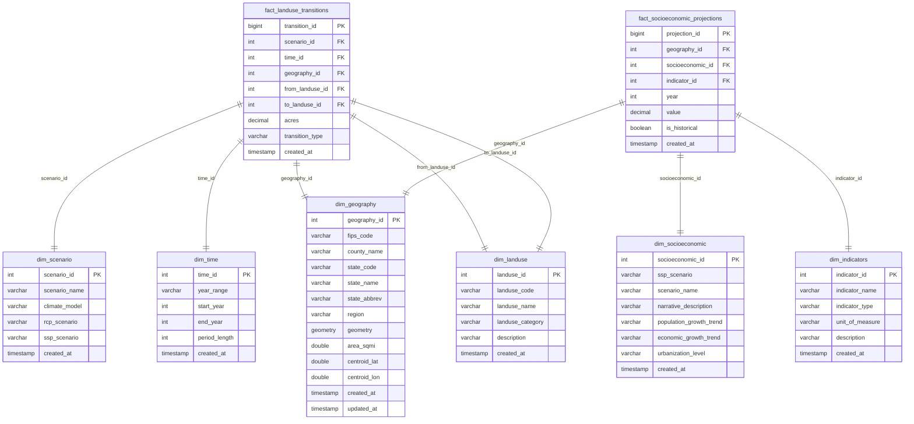
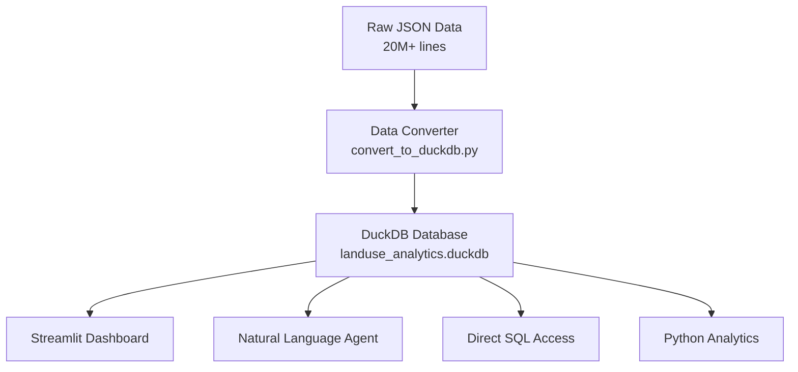

# Database Overview

## Executive Summary

The RPA Land Use Analytics database is a comprehensive 372 MB DuckDB repository containing **5.7+ million land use transition records** across 3,075 US counties, 20 climate scenarios, and 6 time periods (2012-2070). The database uses an optimized star schema design with 8 tables and 4 analytical views, achieving 98.99% storage efficiency.

## Quick Statistics

| Metric | Value |
|--------|-------|
| **Database Size** | 372 MB (390,070,272 bytes) |
| **Total Records** | 5,724,134 records |
| **Land Use Transitions** | 5.4+ million transitions |
| **Geographic Coverage** | 3,075 US counties |
| **Climate Scenarios** | 20 scenarios (5 models × 4 combinations) |
| **Time Periods** | 6 periods (2012-2070) |
| **Total Land Tracked** | 16.7 million (1.67 billion actual acres) |
| **Storage Efficiency** | 98.99% block utilization |

## Database Architecture

### Star Schema Design

The database follows modern data warehousing best practices with a star schema optimized for analytical queries:



## Table Summary

### Fact Tables (Data-Heavy)

| Table | Records | Size | Purpose |
|-------|---------|------|---------|
| `fact_landuse_transitions` | 5,432,198 | 5.18 MB | Core land use transitions between categories |
| `fact_socioeconomic_projections` | 291,936 | 0.28 MB | Population and income projections |

### Dimension Tables (Reference Data)

| Table | Records | Size | Purpose |
|-------|---------|------|---------|
| `dim_geography` | 3,075 | 0.003 MB | County-level geographic information |
| `dim_scenario` | 20 | 0.00002 MB | Climate and socioeconomic scenarios |
| `dim_time` | 6 | 0.000006 MB | Time period definitions |
| `dim_landuse` | 5 | 0.000005 MB | Land use category definitions |
| `dim_socioeconomic` | 5 | 0.000005 MB | SSP scenario descriptions |
| `dim_indicators` | 2 | 0.000002 MB | Socioeconomic indicator definitions |

## Data Coverage

### Geographic Distribution

| Region | Counties | Avg Size (sq mi) | % of Total |
|--------|----------|------------------|------------|
| **South** | 1,389 | 624 | 45.2% |
| **Midwest** | 1,055 | 711 | 34.3% |
| **West** | 414 | 2,836 | 13.5% |
| **Northeast** | 217 | 746 | 7.1% |

### Climate Scenarios

**5 Climate Models:**
- **CNRM_CM5**: "wet" climate model
- **HadGEM2_ES365**: "hot" climate model  
- **IPSL_CM5A_MR**: "dry" climate model
- **MRI_CGCM3**: "least warm" climate model
- **NorESM1_M**: "middle" climate model

**4 RCP/SSP Combinations:**
- **rcp45_ssp1**: Low emissions, medium growth
- **rcp85_ssp2**: High emissions, medium growth
- **rcp85_ssp3**: High emissions, low growth
- **rcp85_ssp5**: High emissions, high growth

### Land Use Categories

| Category | Code | Type | Description |
|----------|------|------|-------------|
| **Crop** | cr | Agriculture | Agricultural cropland |
| **Pasture** | ps | Agriculture | Livestock grazing land |
| **Rangeland** | rg | Natural | Natural grasslands/shrublands |
| **Forest** | fr | Natural | Forested areas |
| **Urban** | ur | Developed | Developed/built areas |

### Time Coverage

| Period | Years | Length | Purpose |
|--------|-------|--------|---------|
| 2012-2020 | 8 years | Calibration period |
| 2020-2030 | 10 years | Near-term projections |
| 2030-2040 | 10 years | Medium-term projections |
| 2040-2050 | 10 years | Mid-century projections |
| 2050-2060 | 10 years | Extended projections |
| 2060-2070 | 10 years | Long-term projections |

## Data Quality Metrics

### Transition Distribution

| Type | Records | Percentage | Avg Acres |
|------|---------|------------|-----------|
| **Change** | 3,887,318 | 71.5% | 0.133 (13.3 actual acres) |
| **Same** | 1,544,880 | 28.5% | 10.456 (1,045.6 actual acres) |

### Top Land Use Transitions

| Transition | Total Acres | Number of Transitions |
|------------|-------------|----------------------|
| Crop → Pasture | 153.2 thousand (15.32 million actual acres) | 347,000 |
| Pasture → Crop | 126.3 thousand (12.63 million actual acres) | 347,000 |
| Forest → Urban | 51.0 thousand (5.10 million actual acres) | 336,000 |
| Pasture → Forest | 37.1 thousand (3.71 million actual acres) | 333,000 |
| Crop → Urban | 24.7 thousand (2.47 million actual acres) | 348,000 |

## Analytical Views

The database includes 4 pre-built analytical views for common query patterns:

| View | Purpose | Records |
|------|---------|---------|
| `v_scenarios_combined` | Climate + socioeconomic scenario integration | 20 |
| `v_landuse_socioeconomic` | Comprehensive transitions with demographics | 5.4M |
| `v_population_trends` | County population projections by scenario | 291,936 |
| `v_income_trends` | County income projections by scenario | 291,936 |

## Performance Characteristics

### Storage Optimization

- **Block Utilization**: 98.99% (1,472 of 1,487 blocks used)
- **Memory Usage**: 512.0 KiB working memory
- **File Compression**: Efficient columnar storage

### Query Performance

- **Star Schema**: Optimized for analytical queries
- **Strategic Indexing**: 10 indexes on frequently queried columns
- **Pre-built Views**: Common patterns pre-computed
- **DuckDB Engine**: Columnar storage optimized for aggregation

### Index Strategy

**Primary Indexes:**
- `idx_geography_fips` - County lookups
- `idx_geography_state` - State-level filtering
- `idx_scenario_name` - Scenario comparisons
- `idx_landuse_code` - Land use filtering

**Composite Indexes:**
- `idx_fact_composite` - Multi-dimensional fact table queries
- `idx_fact_landuse` - Land use transition patterns
- `idx_socioeconomic_composite` - Demographic analysis

## Use Cases

### Policy Analysis
- Compare land use outcomes across climate scenarios
- Analyze agricultural land loss under different policies
- Assess urban growth impacts on natural areas

### Economic Research  
- Study relationships between population growth and land use
- Analyze income effects on development patterns
- Compare regional economic and environmental tradeoffs

### Environmental Planning
- Track forest loss across different climate futures
- Monitor agricultural land preservation
- Plan conservation strategies by scenario

### Geographic Analysis
- State and county-level land use trends
- Regional development pattern analysis
- Cross-state comparative studies

## Access Methods

### Direct Database Access
```bash
# DuckDB Browser UI
duckdb data/processed/landuse_analytics.duckdb -ui

# DuckDB Command Line
duckdb data/processed/landuse_analytics.duckdb
```

### Application Interfaces
```bash
# Streamlit Web Dashboard
uv run streamlit run streamlit_app.py

# Natural Language Query Agent
uv run python -m landuse.agents.agent
```

### Python Integration
```python
import duckdb
conn = duckdb.connect('data/processed/landuse_analytics.duckdb')
result = conn.execute("SELECT * FROM v_scenarios_combined").fetchall()
```

## File Information

- **Path**: `data/processed/landuse_analytics.duckdb`
- **Format**: DuckDB v0.11.0+ database
- **Encoding**: UTF-8
- **Created**: 2025 (latest schema version)
- **Update Frequency**: Static (historical + projection data)

## Data Lineage



## Next Steps

- **Technical Details**: See [DuckDB Schema](duckdb-schema.md) for table specifications
- **Land Use Definitions**: See [Land Use Categories](categories.md) for business definitions  
- **Query Examples**: See [Basic Queries](../queries/basic-queries.md) for usage patterns
- **API Reference**: See [Tools & Utilities](../api/tools.md) for programmatic access