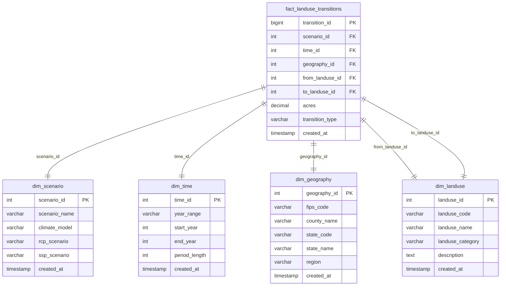

# DuckDB Schema Design

## Overview

The landuse database has been redesigned from a single denormalized table to a **star schema** optimized for analytical queries. This follows modern data warehousing best practices and significantly improves query performance.

## Schema Architecture

### Star Schema Design



## Tables

### Dimension Tables

#### `dim_scenario`
Climate and socioeconomic scenarios
- **scenario_id**: Primary key
- **scenario_name**: Full scenario name (e.g., "CNRM_CM5_rcp45_ssp1")
- **climate_model**: Climate model used (e.g., "CNRM_CM5")
- **rcp_scenario**: Representative Concentration Pathway (e.g., "rcp45")
- **ssp_scenario**: Shared Socioeconomic Pathway (e.g., "ssp1")

#### `dim_time`
Time periods and ranges
- **time_id**: Primary key
- **year_range**: Year range string (e.g., "2012-2020")
- **start_year**: Starting year
- **end_year**: Ending year
- **period_length**: Duration in years

#### `dim_geography`
Geographic locations
- **geography_id**: Primary key
- **fips_code**: 5-digit FIPS county code
- **county_name**: County name (to be populated)
- **state_code**: 2-digit state code
- **state_name**: State name (to be populated)
- **region**: Geographic region (to be populated)

#### `dim_landuse`
Land use types and categories
- **landuse_id**: Primary key
- **landuse_code**: Short code (cr, ps, rg, fr, ur)
- **landuse_name**: Full name (Crop, Pasture, Rangeland, Forest, Urban)
- **landuse_category**: Category (Agriculture, Natural, Developed)
- **description**: Detailed description

### Fact Table

#### `fact_landuse_transitions`
Main fact table containing all land use transitions
- **transition_id**: Primary key
- **scenario_id**: Foreign key to dim_scenario
- **time_id**: Foreign key to dim_time
- **geography_id**: Foreign key to dim_geography
- **from_landuse_id**: Foreign key to dim_landuse (source)
- **to_landuse_id**: Foreign key to dim_landuse (destination)
- **acres**: Area in acres for this transition
- **transition_type**: 'same' or 'change'

## Analytical Views

### `v_agriculture_transitions`
Pre-filtered view for agricultural transitions
```sql
SELECT 
    s.scenario_name,
    t.year_range,
    g.fips_code,
    g.state_code,
    fl.landuse_name as from_landuse,
    tl.landuse_name as to_landuse,
    f.acres,
    f.transition_type
FROM fact_landuse_transitions f
JOIN dim_scenario s ON f.scenario_id = s.scenario_id
JOIN dim_time t ON f.time_id = t.time_id
JOIN dim_geography g ON f.geography_id = g.geography_id
JOIN dim_landuse fl ON f.from_landuse_id = fl.landuse_id
JOIN dim_landuse tl ON f.to_landuse_id = tl.landuse_id
WHERE fl.landuse_category = 'Agriculture' OR tl.landuse_category = 'Agriculture'
```

### `v_scenario_summary`
Aggregated summary by scenario
```sql
SELECT 
    s.scenario_name,
    t.year_range,
    fl.landuse_name as from_landuse,
    tl.landuse_name as to_landuse,
    COUNT(*) as transition_count,
    SUM(f.acres) as total_acres,
    AVG(f.acres) as avg_acres
FROM fact_landuse_transitions f
JOIN dim_scenario s ON f.scenario_id = s.scenario_id
JOIN dim_time t ON f.time_id = t.time_id
JOIN dim_landuse fl ON f.from_landuse_id = fl.landuse_id
JOIN dim_landuse tl ON f.to_landuse_id = tl.landuse_id
GROUP BY s.scenario_name, t.year_range, fl.landuse_name, tl.landuse_name
```

### `v_total_land_area`
Total land area calculations for percentage-based analysis
```sql
WITH land_totals AS (
    SELECT 
        g.geography_id,
        g.fips_code,
        g.state_code,
        SUM(f.acres) as total_land_acres
    FROM fact_landuse_transitions f
    JOIN dim_geography g ON f.geography_id = g.geography_id
    JOIN dim_time t ON f.time_id = t.time_id
    JOIN dim_scenario s ON f.scenario_id = s.scenario_id
    WHERE t.start_year = (SELECT MIN(start_year) FROM dim_time)
      AND s.scenario_name = (SELECT MIN(scenario_name) FROM dim_scenario)
    GROUP BY g.geography_id, g.fips_code, g.state_code
),
state_totals AS (
    SELECT 
        state_code,
        SUM(total_land_acres) as state_total_acres,
        COUNT(*) as counties_in_state
    FROM land_totals
    GROUP BY state_code
)
SELECT 
    lt.geography_id,
    lt.fips_code,
    lt.state_code,
    lt.total_land_acres as county_total_acres,
    st.state_total_acres,
    st.counties_in_state,
    ROUND((lt.total_land_acres / st.state_total_acres) * 100, 2) as pct_of_state
FROM land_totals lt
JOIN state_totals st ON lt.state_code = st.state_code
```

**Key Features:**
- **Baseline Consistency**: Uses earliest time period and first scenario for consistent totals
- **County Level**: Total acres for each county
- **State Level**: Total acres for each state
- **Percentage Calculations**: County as percentage of state
- **Use Cases**: 
  - "Rank states by percentage of forest loss"
  - "Counties with highest percentage of agricultural land"
  - "Urban expansion as percentage of total land area"

## Performance Optimizations

### Indexes
- Primary keys on all dimension tables
- Foreign key indexes on fact table
- Composite index on (scenario_id, time_id, geography_id)
- Individual indexes on commonly queried columns

### Query Patterns
The star schema is optimized for:
- **Aggregation queries**: Sum acres by scenario, time, geography
- **Filtering**: Fast filtering by any dimension
- **Joins**: Efficient joins between fact and dimension tables
- **Time series analysis**: Easy querying across time periods
- **Geographic analysis**: Fast geographic filtering and grouping

## Benefits Over Previous Design

### Before (Single Table)
- ❌ 8.6M rows with repeated dimension data
- ❌ No referential integrity
- ❌ Inefficient storage due to string repetition
- ❌ Slow aggregation queries
- ❌ No clear separation of concerns

### After (Star Schema)
- ✅ Normalized dimension tables with referential integrity
- ✅ Efficient storage through integer foreign keys
- ✅ Fast analytical queries optimized for DuckDB
- ✅ Clear separation between facts and dimensions
- ✅ Extensible design for adding new dimensions
- ✅ Better data quality through constraints

## Usage Examples

### Basic Queries
```sql
-- Get all scenarios
SELECT * FROM dim_scenario;

-- Get landuse categories
SELECT landuse_category, COUNT(*) 
FROM dim_landuse 
GROUP BY landuse_category;

-- Total acres by scenario
SELECT s.scenario_name, SUM(f.acres) as total_acres
FROM fact_landuse_transitions f
JOIN dim_scenario s ON f.scenario_id = s.scenario_id
GROUP BY s.scenario_name;
```

### Advanced Analytics
```sql
-- Agricultural land loss by state and scenario
SELECT 
    s.scenario_name,
    g.state_code,
    SUM(f.acres) as acres_lost
FROM fact_landuse_transitions f
JOIN dim_scenario s ON f.scenario_id = s.scenario_id
JOIN dim_geography g ON f.geography_id = g.geography_id
JOIN dim_landuse fl ON f.from_landuse_id = fl.landuse_id
JOIN dim_landuse tl ON f.to_landuse_id = tl.landuse_id
WHERE fl.landuse_category = 'Agriculture' 
  AND tl.landuse_category != 'Agriculture'
  AND f.transition_type = 'change'
GROUP BY s.scenario_name, g.state_code
ORDER BY acres_lost DESC;
```

## File Location
- **Database**: `data/processed/landuse_analytics.duckdb`
- **Size**: Optimized for analytical workloads
- **Format**: DuckDB (columnar storage, optimized for analytics)

## Tools Integration
- **SQL Query Agent**: Full support for DuckDB queries
- **DuckDB CLI**: Direct database access
- **Python**: pandas integration via DuckDB
- **BI Tools**: Compatible with most analytics tools 