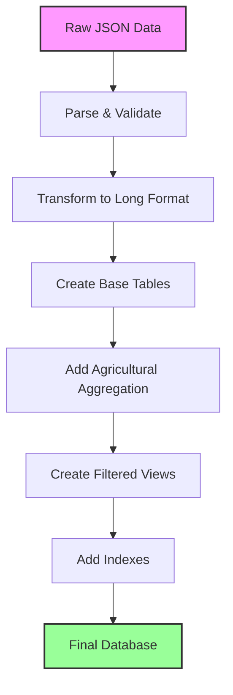

# Data Processing

Detailed explanation of how raw land use projection data is transformed into the queryable database format.

## Processing Pipeline Overview



## Step 1: Raw Data Structure

### Input Format

The raw JSON file (`county_landuse_projections_RPA.json`) has a nested structure:

```json
{
  "06037": {  // FIPS code
    "county_name": "Los Angeles",
    "state": "CA",
    "scenarios": {
      "Baseline": {
        "2012-2020": {
          "transition_matrix": [
            {"_row": "cr", "cr": 100.5, "ps": 2.3, "ur": 5.7, ...},
            {"_row": "ps", "cr": 1.2, "ps": 89.4, "ur": 3.1, ...},
            ...
          ]
        },
        "2020-2030": {...}
      },
      "High Crop Demand": {...}
    }
  }
}
```

### Matrix Interpretation

Each transition matrix represents land use changes:
- Rows: Original land use (from)
- Columns: New land use (to)
- Values: Area in 1000 acres

## Step 2: Conversion Scripts

### Main Converter

`convert_landuse_to_db.py` performs the initial conversion:

```python
def process_matrix_data(matrix_data, scenario, year, year_range, fips):
    """Convert matrix format to transition records."""
    transitions = []
    
    for row in matrix_data:
        from_type = LAND_USE_MAP.get(row.get('_row', ''), row.get('_row', ''))
        
        if from_type != 'Total':  # Skip total row
            for col, value in row.items():
                if col not in ['_row', 't1'] and col in LAND_USE_MAP:
                    to_type = LAND_USE_MAP[col]
                    
                    if to_type != 'Total':  # Skip total column
                        transitions.append({
                            'scenario': scenario,
                            'year': year,
                            'year_range': year_range,
                            'fips': fips,
                            'from_land_use': from_type,
                            'to_land_use': to_type,
                            'area_1000_acres': float(value)
                        })
    
    return transitions
```

### Processing Large Files

For large JSON files, streaming processing is used:

```python
import ijson

def process_large_json(json_path):
    """Stream process large JSON files."""
    with open(json_path, 'rb') as file:
        parser = ijson.items(file, 'item')
        
        for county_data in parser:
            process_county(county_data)
            
            # Batch insert for efficiency
            if len(batch) >= 10000:
                insert_batch(batch)
                batch = []
```

## Step 3: Agricultural Aggregation

### Creating Combined Agriculture

`convert_landuse_with_agriculture.py` adds agricultural aggregation:

```python
def aggregate_agriculture(transitions):
    """Combine Crop and Pasture into Agriculture."""
    ag_transitions = []
    
    for t in transitions:
        # Map individual categories to aggregated
        from_ag = 'Agriculture' if t['from_land_use'] in ['Crop', 'Pasture'] else t['from_land_use']
        to_ag = 'Agriculture' if t['to_land_use'] in ['Crop', 'Pasture'] else t['to_land_use']
        
        # Find or create aggregated transition
        key = (t['scenario'], t['year'], t['fips'], from_ag, to_ag)
        # Sum areas for same aggregated transition
```

### Aggregation Logic

```sql
-- Example: Combining crop and pasture transitions
-- Original: Crop→Urban (10) + Pasture→Urban (5)
-- Becomes: Agriculture→Urban (15)

INSERT INTO landuse_transitions_ag
SELECT 
    scenario, year, year_range, fips,
    CASE 
        WHEN from_land_use IN ('Crop', 'Pasture') THEN 'Agriculture'
        ELSE from_land_use 
    END as from_land_use,
    CASE 
        WHEN to_land_use IN ('Crop', 'Pasture') THEN 'Agriculture'
        ELSE to_land_use 
    END as to_land_use,
    SUM(area_1000_acres) as area_1000_acres
FROM landuse_transitions
GROUP BY scenario, year, year_range, fips, from_land_use, to_land_use;
```

## Step 4: Creating Filtered Views

### Change-Only Views

`add_change_views.py` creates views excluding unchanged land:

```sql
CREATE VIEW landuse_changes_only AS
SELECT * FROM landuse_transitions
WHERE from_land_use != to_land_use
  AND from_land_use != 'Total'
  AND to_land_use != 'Total';

CREATE VIEW landuse_changes_only_ag AS
SELECT * FROM landuse_transitions_ag
WHERE from_land_use != to_land_use
  AND from_land_use != 'Total'
  AND to_land_use != 'Total';
```

### Benefits of Views

1. **Smaller datasets** - Fewer rows to process
2. **Focused analysis** - Only actual changes
3. **Better performance** - Less data to scan
4. **Cleaner results** - No diagonal values

## Step 5: Database Optimization

### Index Creation

```sql
-- Optimize common query patterns
CREATE INDEX idx_scenario ON landuse_transitions(scenario);
CREATE INDEX idx_year ON landuse_transitions(year);
CREATE INDEX idx_fips ON landuse_transitions(fips);
CREATE INDEX idx_from_to ON landuse_transitions(from_land_use, to_land_use);

-- Composite indexes for complex queries
CREATE INDEX idx_scenario_year_fips ON landuse_transitions(scenario, year, fips);
```

### Performance Statistics

```sql
-- Analyze table for query optimization
ANALYZE landuse_transitions;

-- Check index usage
EXPLAIN QUERY PLAN
SELECT * FROM landuse_transitions
WHERE scenario = 'Baseline' AND year = 2050;
```

## Quality Control

### Data Validation

During processing, several checks ensure data quality:

```python
def validate_transitions(transitions, fips, year):
    """Validate transition data integrity."""
    
    # Check 1: Total area should be consistent
    total_from = sum(t['area'] for t in transitions if t['from'] != 'Total')
    total_to = sum(t['area'] for t in transitions if t['to'] != 'Total')
    assert abs(total_from - total_to) < 0.01, f"Area mismatch for {fips} in {year}"
    
    # Check 2: No negative areas
    assert all(t['area'] >= 0 for t in transitions), "Negative area found"
    
    # Check 3: Valid land use categories
    valid_categories = {'Crop', 'Pasture', 'Forest', 'Urban', 'Range', 'Total'}
    assert all(t['from'] in valid_categories for t in transitions), "Invalid category"
```

### Error Handling

```python
def process_county_safe(county_data):
    """Process with error handling."""
    try:
        transitions = process_county(county_data)
        validate_transitions(transitions)
        return transitions
    except Exception as e:
        logger.error(f"Error processing county {county_data.get('fips')}: {e}")
        return []
```

## Processing Performance

### Optimization Techniques

1. **Batch Processing**
   ```python
   # Insert in batches instead of one-by-one
   cursor.executemany(
       "INSERT INTO landuse_transitions VALUES (?,?,?,?,?,?,?)",
       batch_data
   )
   ```

2. **Transaction Management**
   ```python
   conn.execute("BEGIN TRANSACTION")
   # ... bulk inserts ...
   conn.execute("COMMIT")
   ```

3. **Memory Management**
   ```python
   # Process in chunks for large files
   for chunk in pd.read_json(file_path, chunksize=10000):
       process_chunk(chunk)
   ```

### Processing Statistics

Typical processing performance:
- Raw JSON size: ~500 MB
- Processing time: 2-5 minutes
- Final database size: ~200 MB
- Row count: ~1.2 million transitions

## Running the Processors

### Basic Conversion

```bash
# Convert JSON to basic SQLite database
uv run python scripts/converters/convert_landuse_to_db.py
```

### With Agricultural Aggregation

```bash
# Create database with ag aggregation
uv run python scripts/converters/convert_landuse_with_agriculture.py
```

### Add Views to Existing Database

```bash
# Add filtered views
uv run python scripts/converters/add_change_views.py
```

### Full Pipeline

```bash
# Run complete processing pipeline
./scripts/process_all.sh
```

## Customization Options

### Modifying Land Use Categories

Edit the mapping in converter scripts:

```python
LAND_USE_MAP = {
    'cr': 'Cropland',      # Change names
    'ps': 'Pasture',
    'rg': 'Rangeland',     # Alternative naming
    'fr': 'Forest',
    'ur': 'Developed',     # Different term
    'wt': 'Wetland'        # Add new category
}
```

### Custom Aggregations

Create your own groupings:

```python
# Example: Natural vs Developed
NATURAL_LANDS = ['Forest', 'Range', 'Wetland']
DEVELOPED_LANDS = ['Urban', 'Infrastructure']
AGRICULTURAL_LANDS = ['Crop', 'Pasture']
```

### Additional Processing

Add custom calculations during conversion:

```python
# Calculate net change during processing
net_change = area_new - area_original

# Add percentage calculations
percent_change = (net_change / area_original) * 100 if area_original > 0 else 0
```

## Troubleshooting

### Common Issues

1. **Memory Errors**
   - Use streaming processing
   - Increase chunk size
   - Process by scenario

2. **Data Inconsistencies**
   - Check total validations
   - Review error logs
   - Verify source data

3. **Performance Problems**
   - Add appropriate indexes
   - Use batch operations
   - Consider partitioning

### Debugging Tools

```sql
-- Check for data issues
SELECT fips, year, 
       SUM(area_1000_acres) as total,
       COUNT(*) as transitions
FROM landuse_transitions
GROUP BY fips, year
HAVING total < 100  -- Suspiciously small counties
    OR transitions < 25;  -- Missing transitions
```

## Next Steps

- Understand the [Database Schema](schema.md)
- Learn about [Land Use Categories](categories.md)
- Start [Querying the Data](../queries/overview.md)
- Explore [API Documentation](../api/converters.md)