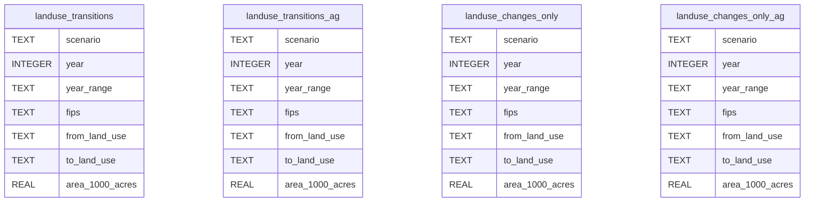

# Database Schema

This page documents the structure of the land use transitions database, including all tables, columns, and relationships.

## Database Overview

The SQLite database (`landuse_transitions_with_ag.db`) contains four main tables:



## Table Descriptions

### 1. `landuse_transitions`

The main table containing all land use transitions, including same-to-same transitions (land that doesn't change use).

**Purpose:** Complete transition matrix for all land uses

**Key Features:**
- Includes unchanged land (e.g., Forest → Forest)
- Separates Crop and Pasture as distinct categories
- Contains "Total" rows for validation

### 2. `landuse_transitions_ag`

Same as `landuse_transitions` but with agricultural aggregation.

**Purpose:** Simplified view with combined agricultural land

**Key Features:**
- Combines Crop + Pasture into "Agriculture"
- Reduces complexity for agricultural analysis
- Maintains all other land use categories

### 3. `landuse_changes_only`

Filtered view excluding same-to-same transitions.

**Purpose:** Focus on actual land use changes

**Key Features:**
- Excludes unchanged land (e.g., no Forest → Forest)
- Smaller dataset for change analysis
- Same schema as main table

### 4. `landuse_changes_only_ag`

Combines agricultural aggregation with change-only filtering.

**Purpose:** Simplified change analysis with agricultural grouping

**Key Features:**
- Only actual changes
- Agricultural land combined
- Most focused view for policy analysis

## Column Definitions

### Core Columns (All Tables)

| Column | Type | Description | Example |
|--------|------|-------------|---------|
| `scenario` | TEXT | Projection scenario name | "Baseline", "High Crop Demand" |
| `year` | INTEGER | End year of the period | 2050 |
| `year_range` | TEXT | Time period of transition | "2040-2050" |
| `fips` | TEXT | County FIPS code | "06037" (Los Angeles) |
| `from_land_use` | TEXT | Original land use | "Forest" |
| `to_land_use` | TEXT | New land use | "Urban" |
| `area_1000_acres` | REAL | Area in thousands of acres | 123.45 |

### Indexes

All tables have indexes on:
- `scenario` - Fast filtering by scenario
- `year` - Efficient time-based queries  
- `fips` - Quick county lookups

## Data Relationships

### Scenario Values

```sql
-- Available scenarios
SELECT DISTINCT scenario FROM landuse_transitions;
```

Common scenarios:
- **Baseline** - Standard projections
- **High Crop Demand** - Increased agricultural pressure
- **High Forest** - Forest conservation emphasis
- **High Urban** - Accelerated urbanization

### Year Ranges

The data uses decade intervals:

| year_range | year (end) |
|------------|------------|
| 2012-2020 | 2020 |
| 2020-2030 | 2030 |
| 2030-2040 | 2040 |
| ... | ... |
| 2090-2100 | 2100 |

### FIPS Code Structure

FIPS codes identify counties:
- First 2 digits: State (e.g., "06" = California)
- Next 3 digits: County (e.g., "037" = Los Angeles)
- Full code: "06037"

## Land Use Categories

### Standard Categories

| Code | Land Use | Description |
|------|----------|-------------|
| Crop | Cropland | Agricultural land for crops |
| Pasture | Pasture | Grazing land for livestock |
| Forest | Forest | Forested areas |
| Urban | Urban | Developed/built areas |
| Range | Range | Rangeland/grassland |
| Total | Total | Sum row/column (validation) |

### Agricultural Aggregation

In `*_ag` tables:
- **Agriculture** = Crop + Pasture
- Reduces 6 categories to 5
- Simplifies agricultural analysis

## Area Calculations

### Understanding area_1000_acres

```sql
-- Convert to acres
actual_acres = area_1000_acres * 1000

-- Convert to square miles  
square_miles = area_1000_acres * 1000 / 640

-- Convert to hectares
hectares = area_1000_acres * 1000 * 0.404686
```

### Validation Queries

```sql
-- Check total area consistency
SELECT year, fips, SUM(area_1000_acres) as total_area
FROM landuse_transitions
WHERE from_land_use != 'Total'
  AND to_land_use != 'Total'
GROUP BY year, fips;

-- Verify transitions balance
SELECT year, 
       SUM(CASE WHEN from_land_use = 'Forest' THEN area_1000_acres ELSE 0 END) as forest_from,
       SUM(CASE WHEN to_land_use = 'Forest' THEN area_1000_acres ELSE 0 END) as forest_to
FROM landuse_transitions
WHERE from_land_use != 'Total' AND to_land_use != 'Total'
GROUP BY year;
```

## Query Patterns

### Basic Transition Query

```sql
-- Find specific transitions
SELECT * FROM landuse_transitions
WHERE from_land_use = 'Forest' 
  AND to_land_use = 'Urban'
  AND scenario = 'Baseline';
```

### Aggregation Query

```sql
-- Total area by land use and year
SELECT year, to_land_use, SUM(area_1000_acres) as total_area
FROM landuse_transitions  
WHERE from_land_use = to_land_use  -- Only unchanged land
  AND to_land_use != 'Total'
GROUP BY year, to_land_use;
```

### Change Analysis Query

```sql
-- Net change in forest area
SELECT year, 
       SUM(CASE WHEN to_land_use = 'Forest' THEN area_1000_acres 
                WHEN from_land_use = 'Forest' THEN -area_1000_acres 
                ELSE 0 END) as net_forest_change
FROM landuse_changes_only
GROUP BY year;
```

### Cross-Scenario Comparison

```sql
-- Compare scenarios
SELECT scenario, SUM(area_1000_acres) as total_urban
FROM landuse_transitions
WHERE to_land_use = 'Urban' 
  AND from_land_use = to_land_use
  AND year = 2050
GROUP BY scenario;
```

## Performance Tips

1. **Use Appropriate Tables**
   - Full analysis: `landuse_transitions`
   - Change focus: `landuse_changes_only`
   - Agricultural studies: `*_ag` tables

2. **Leverage Indexes**
   - Filter by indexed columns first
   - Use scenario, year, fips in WHERE clauses

3. **Aggregate Wisely**
   - Sum areas before calculating percentages
   - Group by fewer columns when possible

4. **Exclude Totals**
   - Always exclude 'Total' land use in calculations
   - Use `WHERE from_land_use != 'Total'`

## Data Quality Notes

- **Consistency**: Total area per county should remain constant
- **Completeness**: All counties have data for all years/scenarios
- **Validation**: 'Total' rows/columns for cross-checking
- **Precision**: Areas in 1000-acre units for manageable numbers

## Next Steps

- Explore [Land Use Categories](categories.md) in detail
- See [Data Sources](sources.md) for data provenance
- Review [Processing Steps](processing.md) for data pipeline