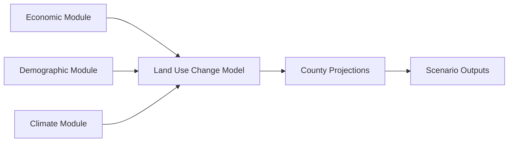

# Data Sources

Understanding the origin, methodology, and reliability of the land use projection data.

## Primary Data Source

### RPA Land Use Projections

The data comes from the **USDA Forest Service Resources Planning Act (RPA) Assessment**, which provides long-term projections of land use change in the United States.

**Key Features:**
- County-level projections
- Multiple scenarios
- 2020-2100 timeframe
- Decade intervals
- All US counties included

**Citation:**
```
USDA Forest Service. (2024). Resources Planning Act (RPA) 
Land Use Projections. Fort Collins, CO: Rocky Mountain 
Research Station.
```

## Projection Methodology

### Modeling Approach

The RPA projections use an integrated assessment model that combines:

1. **Economic Drivers**
   - Population growth
   - Income changes
   - Commodity prices
   - Land values

2. **Policy Assumptions**
   - Conservation programs
   - Zoning regulations
   - Agricultural subsidies
   - Environmental protections

3. **Biophysical Constraints**
   - Soil quality
   - Water availability
   - Climate conditions
   - Topography

### Model Components



## Scenario Descriptions

### Baseline Scenario

**Assumptions:**
- Moderate population growth
- Historical economic trends continue
- Current policies maintained
- Average climate change impacts

**Key Characteristics:**
- Most likely future pathway
- Balanced land use changes
- Reference for comparisons

### High Crop Demand

**Assumptions:**
- Increased global food demand
- Higher commodity prices
- Agricultural expansion incentivized
- Biofuel demand growth

**Expected Outcomes:**
- More forest/range → cropland
- Pasture → crop conversion
- Reduced natural lands

### High Forest

**Assumptions:**
- Strong conservation policies
- Carbon sequestration valued
- Reduced deforestation
- Afforestation programs

**Expected Outcomes:**
- Forest area maintained/increased
- Limited agricultural expansion
- More sustainable land use

### High Urban

**Assumptions:**
- Accelerated population growth
- Concentrated in metro areas
- Higher development rates
- Sprawl patterns continue

**Expected Outcomes:**
- Rapid urban expansion
- Agricultural land loss
- Forest fragmentation
- Infrastructure demands

## Data Processing Pipeline

### 1. Original Format

Raw data structure:
```json
{
  "county": {
    "fips": "06037",
    "name": "Los Angeles",
    "scenarios": {
      "Baseline": {
        "2020-2030": {
          "transitions": [
            {"from": "cr", "to": "ur", "area": 12.5},
            ...
          ]
        }
      }
    }
  }
}
```

### 2. Conversion Process

The conversion scripts (`scripts/converters/`) transform this into:

```sql
-- Normalized relational format
INSERT INTO landuse_transitions VALUES
('Baseline', 2030, '2020-2030', '06037', 'Crop', 'Urban', 12.5);
```

### 3. Data Enhancements

Additional processing creates:
- Agricultural aggregation views
- Change-only filtered tables
- Indexed columns for performance
- Validation totals

## Data Quality and Limitations

### Strengths

✅ **Comprehensive Coverage**
- All US counties included
- Consistent methodology
- Multiple scenarios
- Long time horizon

✅ **Scientific Basis**
- Peer-reviewed methods
- Validated against historical data
- Uncertainty quantified
- Regular updates

✅ **Policy Relevance**
- Used for federal planning
- Informs resource management
- Scenario analysis capability

### Limitations

⚠️ **Spatial Resolution**
- County-level only
- Sub-county variation lost
- Edge effects possible
- Urban detail limited

⚠️ **Temporal Resolution**
- Decade intervals
- Annual variation smoothed
- Sudden changes averaged
- No seasonal data

⚠️ **Uncertainty**
- Future projections inherently uncertain
- Economic assumptions may not hold
- Climate impacts simplified
- Policy changes unpredictable

### Known Issues

1. **Urban Definition**
   - Includes all developed land
   - Mixed-use areas simplified
   - Green space within cities included

2. **Agricultural Categories**
   - Crop/pasture distinction sometimes blurred
   - Rotation systems simplified
   - Specialty crops aggregated

3. **Edge Counties**
   - Small counties may have rounding effects
   - Cross-border influences not captured
   - Island counties special cases

## Validation Methods

### Historical Validation

The model was validated against:
- USDA Census of Agriculture
- National Land Cover Database (NLCD)
- Forest Inventory and Analysis (FIA)
- Economic census data

### Cross-Validation

```sql
-- Check total area consistency
SELECT fips, year, 
       SUM(area_1000_acres) as total_area,
       COUNT(*) as transition_count
FROM landuse_transitions
WHERE from_land_use != 'Total'
GROUP BY fips, year
HAVING COUNT(DISTINCT total_area) > 1;
```

### Scenario Consistency

```sql
-- Verify scenario relationships
SELECT scenario,
       SUM(CASE WHEN to_land_use = 'Urban' THEN area_1000_acres END) as urban_total
FROM landuse_transitions
WHERE year = 2050
GROUP BY scenario
ORDER BY urban_total;
-- High Urban should have highest value
```

## Updates and Versions

### Current Version
- Data version: 2024 RPA Assessment
- Processing date: 2024
- Database format: DuckDB (modern), SQLite 3 (legacy)

### Update Cycle
- RPA assessments every 10 years
- Interim updates for major changes
- Methodology improvements ongoing

### Version Control
```bash
# Check data version
SELECT * FROM metadata WHERE key = 'data_version';

# Processing timestamp
SELECT * FROM metadata WHERE key = 'processed_date';
```

## Related Datasets

### Complementary Data Sources

1. **National Land Cover Database (NLCD)**
   - 30m resolution land cover
   - Historical validation
   - Urban detail

2. **Census of Agriculture**
   - Farm-level data
   - Crop specifics
   - Economic variables

3. **Forest Inventory Analysis (FIA)**
   - Detailed forest data
   - Species composition
   - Management practices

### Integration Opportunities

```python
# Example: Combining with other data
import geopandas as gpd

# Load county boundaries
counties = gpd.read_file('counties.shp')

# Join with land use projections
landuse_2050 = query_database(
    "SELECT fips, SUM(area_1000_acres) as urban_area "
    "FROM landuse_transitions "
    "WHERE to_land_use = 'Urban' AND year = 2050 "
    "GROUP BY fips"
)

# Spatial analysis
counties_with_landuse = counties.merge(
    landuse_2050, 
    left_on='GEOID', 
    right_on='fips'
)
```

## Usage Rights and Citation

### License
- Public domain data
- No usage restrictions
- Attribution appreciated

### Recommended Citation
```
When using this data, please cite:

[Your Project Name]. (2025). Land Use Transition Analysis 
using RPA Projections. Based on USDA Forest Service RPA 
Assessment data.

Original data: USDA Forest Service. (2024). 2020 RPA 
Assessment. Fort Collins, CO: RMRS.
```

### Acknowledgments
This project builds upon the extensive work of:
- USDA Forest Service researchers
- RPA Assessment team
- Land use modeling community

## Data Access

### Raw Data Location
```
data/raw/county_landuse_projections_RPA.json
```

### Processed Databases
```
data/processed/landuse_transitions.db
data/processed/landuse_transitions_with_ag.db
```

### Query Access
```python
# Direct database access (modern DuckDB)
import duckdb
conn = duckdb.connect('data/processed/landuse_analytics.duckdb')

# Legacy SQLite access
import sqlite3
conn = sqlite3.connect('data/processed/landuse_transitions_with_ag.db')

# Through the agent
agent.run("Query the landuse database...")
```

## Next Steps

- Review [Database Schema](schema.md) for structure
- Understand [Land Use Categories](categories.md)
- Learn about [Processing Steps](processing.md)
- Start [Querying Data](../queries/overview.md)