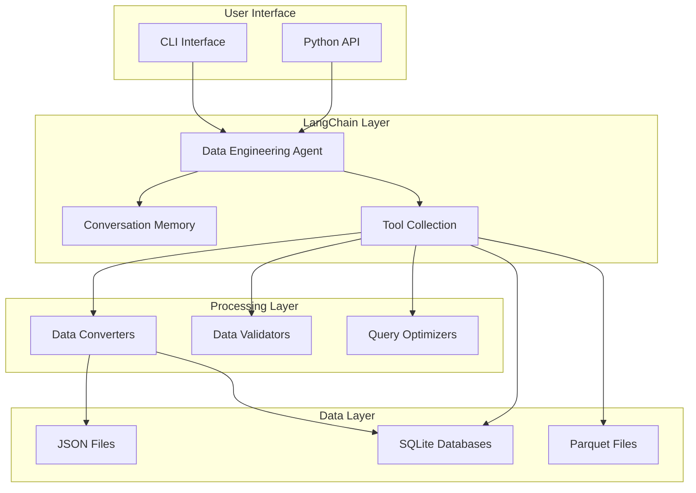
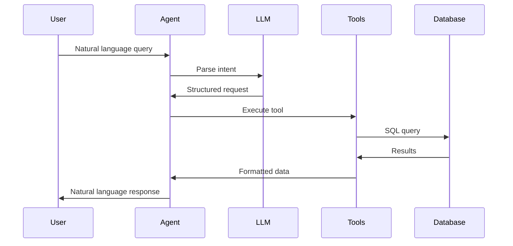

# System Architecture

Understanding the technical architecture of the LangChain Land Use Analysis system.

## Overview

The system follows a modular architecture that separates data processing, storage, and natural language interaction into distinct layers.



## Component Architecture

### 1. User Interface Layer

**CLI Interface (`test_agent.py`)**
- Rich terminal UI
- Interactive chat loop
- Progress indicators
- Syntax highlighting

**Python API**
- Programmatic access
- Batch processing
- Integration points

### 2. LangChain Layer

**Data Engineering Agent**
```python
class DataEngineeringAgent:
    def __init__(self, root_dir: str = None):
        self.llm = ChatOpenAI(...)
        self.memory = MemorySaver()
        self.tools = self._create_tools()
        self.agent = self._create_agent()
```

**Key Components:**
- **LLM Integration**: OpenAI GPT models
- **Memory System**: Conversation context retention
- **Tool Registry**: Dynamic tool loading
- **Prompt Engineering**: Structured prompts

### 3. Tool System

**Tool Architecture:**
```python
Tool(
    name="tool_name",
    func=implementation_function,
    description="Natural language description",
    args_schema=PydanticModel  # Optional
)
```

**Tool Categories:**
- File Operations
- Data Analysis
- SQL Execution
- Format Conversion
- Visualization

### 4. Data Processing Layer

**Converter Pipeline:**
```
Raw JSON → Parser → Transformer → Validator → Database
```

**Processing Steps:**
1. **Parsing**: Extract nested JSON structure
2. **Transformation**: Normalize to relational format
3. **Aggregation**: Create derived views
4. **Optimization**: Add indexes and statistics

### 5. Storage Layer

**Database Design:**
```sql
-- Core tables
landuse_transitions
landuse_transitions_ag

-- Filtered views
landuse_changes_only
landuse_changes_only_ag

-- Indexes for performance
idx_scenario, idx_year, idx_fips
```

## Data Flow Architecture

### Query Processing Flow



### Memory Architecture

The agent uses LangGraph's MemorySaver for context:

```python
# Memory stores:
- Conversation history
- Previous query results
- User preferences
- Context markers
```

## Technical Stack

### Core Dependencies

| Component | Technology | Purpose |
|-----------|------------|---------|
| LLM Framework | LangChain 0.3+ | Agent orchestration |
| LLM Provider | OpenAI GPT-4 | Natural language understanding |
| Database | SQLite 3 | Local data storage |
| Query Engine | DuckDB | SQL on files |
| Data Processing | Pandas 2.2+ | Data manipulation |
| CLI | Rich 14+ | Terminal interface |
| Validation | Pydantic 2+ | Data validation |

### File Processing Stack

```python
# JSON Processing
- ijson: Streaming large files
- json: Standard library

# Tabular Data
- pandas: DataFrames
- pyarrow: Parquet support
- openpyxl: Excel files

# Geospatial
- geopandas: Spatial data
- Parquet: GeoParquet format
```

## Security Architecture

### API Key Management

```python
# Environment-based configuration
load_dotenv(dotenv_path="config/.env")

# Never in code
api_key = os.getenv("OPENAI_API_KEY")
```

### File Access Control

```python
# Restricted to root directory
self.root_dir = root_dir or "./data"

# Path validation
full_path = Path(self.root_dir) / file_path
if not full_path.resolve().is_relative_to(self.root_dir):
    raise SecurityError("Path traversal detected")
```

### Query Safety

- SQL injection prevention via parameterization
- File path sanitization
- Size limits on operations

## Performance Architecture

### Optimization Strategies

1. **Query Optimization**
   - Index usage
   - Query plan analysis
   - Result limiting

2. **Memory Management**
   - Streaming for large files
   - Chunk processing
   - Garbage collection

3. **Caching**
   - 15-minute web fetch cache
   - Query result caching
   - Schema caching

### Scalability Considerations

```python
# Chunked processing
CHUNK_SIZE = 10000

# Parallel processing potential
from concurrent.futures import ThreadPoolExecutor

# Database partitioning
# Could partition by year or scenario
```

## Extension Architecture

### Adding New Tools

```python
class CustomAgent(DataEngineeringAgent):
    def _create_tools(self):
        tools = super()._create_tools()
        tools.append(self._create_custom_tool())
        return tools
    
    def _create_custom_tool(self):
        return Tool(
            name="custom_tool",
            func=self._custom_implementation,
            description="Custom functionality"
        )
```

### Plugin System Potential

```python
# Future: Dynamic tool loading
def load_tools_from_plugins():
    plugin_dir = Path("plugins")
    for plugin_file in plugin_dir.glob("*.py"):
        module = import_module(plugin_file.stem)
        if hasattr(module, "create_tools"):
            tools.extend(module.create_tools())
```

## Deployment Architecture

### Local Deployment

```bash
# Current: Single-user local
python scripts/agents/test_agent.py
```

### Server Deployment Potential

```python
# Future: Multi-user server
from fastapi import FastAPI
from celery import Celery

app = FastAPI()
celery = Celery()

@app.post("/query")
async def query(request: QueryRequest):
    task = celery.send_task("process_query", args=[request])
    return {"task_id": task.id}
```

### Container Architecture

```dockerfile
# Potential Dockerfile
FROM python:3.11-slim
WORKDIR /app
COPY requirements.txt .
RUN pip install --no-cache-dir -r requirements.txt
COPY . .
CMD ["python", "scripts/agents/test_agent.py"]
```

## Monitoring Architecture

### Logging Structure

```python
import logging

logging.basicConfig(
    level=logging.INFO,
    format='%(asctime)s - %(name)s - %(levelname)s - %(message)s',
    handlers=[
        logging.FileHandler('agent.log'),
        logging.StreamHandler()
    ]
)
```

### Metrics Collection

```python
# Future: Metrics tracking
metrics = {
    "queries_processed": Counter(),
    "query_duration": Histogram(),
    "tool_usage": Counter(),
    "error_rate": Rate()
}
```

### Health Checks

```python
def health_check():
    checks = {
        "database": check_database_connection(),
        "llm": check_llm_availability(),
        "disk_space": check_disk_space(),
        "memory": check_memory_usage()
    }
    return all(checks.values())
```

## Error Handling Architecture

### Layered Error Handling

```python
# Level 1: Tool-level errors
try:
    result = execute_tool()
except SpecificError as e:
    return handle_specific_error(e)

# Level 2: Agent-level errors
try:
    response = agent.run(query)
except AgentError as e:
    return fallback_response(e)

# Level 3: System-level errors
try:
    start_system()
except SystemError as e:
    log_and_alert(e)
```

## Testing Architecture

### Test Structure

```
tests/
├── unit/
│   ├── test_converters.py
│   ├── test_tools.py
│   └── test_agent.py
├── integration/
│   ├── test_database_queries.py
│   └── test_full_pipeline.py
└── e2e/
    └── test_user_workflows.py
```

### Test Data Management

```python
# Fixtures for testing
@pytest.fixture
def sample_database():
    # Create test database
    return test_db_path

@pytest.fixture
def mock_llm():
    # Mock LLM responses
    return MockLLM()
```

## Future Architecture Considerations

### Microservices Potential

```
┌─────────────┐     ┌─────────────┐     ┌─────────────┐
│   Query     │────▶│   Agent     │────▶│    Data     │
│  Service    │     │  Service    │     │  Service    │
└─────────────┘     └─────────────┘     └─────────────┘
```

### Event-Driven Architecture

```python
# Future: Event-based processing
class EventBus:
    def publish(self, event: Event):
        for handler in self.handlers[event.type]:
            handler.handle(event)

# Query events, completion events, error events
```

### Multi-Model Support

```python
# Future: Multiple LLM providers
class ModelRouter:
    def route_query(self, query):
        if is_complex_sql(query):
            return self.gpt4_model
        else:
            return self.gpt35_model
```

## Best Practices

1. **Separation of Concerns**
   - Keep data processing separate from UI
   - Isolate LLM interactions
   - Modular tool design

2. **Error Boundaries**
   - Handle errors at appropriate levels
   - Provide meaningful feedback
   - Graceful degradation

3. **Performance First**
   - Design for large datasets
   - Optimize critical paths
   - Monitor resource usage

4. **Extensibility**
   - Plugin-friendly architecture
   - Clear extension points
   - Documented interfaces

## Next Steps

- Review [Contributing Guide](contributing.md) for development
- See [Testing Guide](testing.md) for quality assurance
- Check [API Reference](../api/agent.md) for implementation details