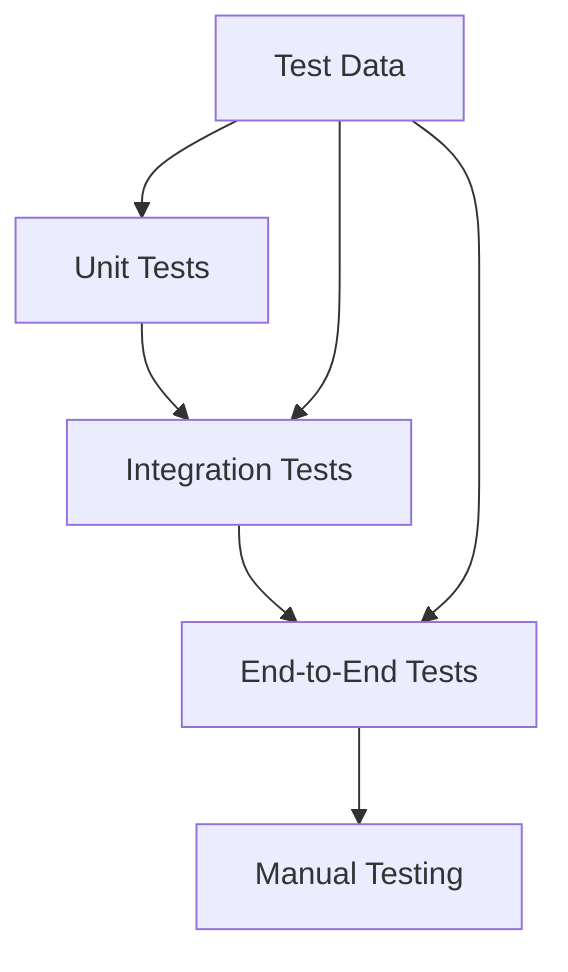

# Testing Guide

Comprehensive guide for testing the LangChain Land Use Analysis system.

## Overview

The project uses a multi-layered testing approach to ensure reliability:



## Test Structure

```
tests/
├── __init__.py
├── conftest.py              # Shared fixtures
├── unit/                    # Unit tests
│   ├── test_converters.py
│   ├── test_tools.py
│   ├── test_validators.py
│   └── test_utils.py
├── integration/             # Integration tests
│   ├── test_agent.py
│   ├── test_database.py
│   └── test_pipeline.py
├── e2e/                     # End-to-end tests
│   ├── test_workflows.py
│   └── test_queries.py
└── data/                    # Test data
    ├── sample.json
    ├── test.db
    └── fixtures.py
```

## Running Tests

### Basic Test Execution

```bash
# Run all tests
uv run pytest

# Run specific test file
uv run pytest tests/unit/test_converters.py

# Run specific test
uv run pytest tests/unit/test_converters.py::test_land_use_mapping

# Run with coverage
uv run pytest --cov=scripts --cov-report=html

# Run with verbose output
uv run pytest -v
```

### Test Categories

```bash
# Run only unit tests
uv run pytest tests/unit/

# Run only integration tests
uv run pytest tests/integration/

# Run tests by marker
uv run pytest -m "not slow"
```

## Unit Testing

### Testing Converters

```python
# tests/unit/test_converters.py
import pytest
from scripts.converters.convert_landuse_to_db import (
    process_matrix_data, 
    extract_end_year,
    LAND_USE_MAP
)

class TestConverters:
    def test_land_use_mapping(self):
        """Test land use code mappings."""
        assert LAND_USE_MAP['cr'] == 'Crop'
        assert LAND_USE_MAP['ps'] == 'Pasture'
        assert LAND_USE_MAP['ur'] == 'Urban'
        
    def test_extract_end_year(self):
        """Test year extraction from range."""
        assert extract_end_year('2020-2030') == 2030
        assert extract_end_year('2090-2100') == 2100
        
    def test_process_matrix_data(self):
        """Test matrix data processing."""
        matrix_data = [
            {'_row': 'cr', 'cr': 100.0, 'ur': 5.0, 'fr': 2.0}
        ]
        
        transitions = process_matrix_data(
            matrix_data, 
            'Baseline', 
            2030, 
            '2020-2030', 
            '06037'
        )
        
        assert len(transitions) == 3
        assert transitions[0]['from_land_use'] == 'Crop'
        assert transitions[0]['area_1000_acres'] == 100.0
```

### Testing Tools

```python
# tests/unit/test_tools.py
from scripts.agents.data_engineering_agent import DataEngineeringAgent

class TestTools:
    @pytest.fixture
    def agent(self):
        """Create agent instance for testing."""
        return DataEngineeringAgent(root_dir="tests/data")
        
    def test_read_csv(self, agent):
        """Test CSV reading tool."""
        result = agent._read_csv("sample.csv")
        assert "Shape:" in result
        assert "Columns:" in result
        
    def test_analyze_dataframe(self, agent):
        """Test dataframe analysis."""
        result = agent._analyze_dataframe("sample.csv")
        analysis = json.loads(result)
        assert "shape" in analysis
        assert "column_analysis" in analysis
        
    @pytest.mark.parametrize("file_path,expected", [
        ("data.csv", "csv"),
        ("data.json", "json"), 
        ("data.parquet", "parquet")
    ])
    def test_file_format_detection(self, agent, file_path, expected):
        """Test file format detection."""
        format = agent._detect_format(file_path)
        assert format == expected
```

### Testing Validators

```python
# tests/unit/test_validators.py
import pytest
from pydantic import ValidationError

def test_query_params_validation():
    """Test query parameter validation."""
    from scripts.agents.data_engineering_agent import FileQueryParams
    
    # Valid params
    params = FileQueryParams(
        file_path="data.csv",
        query="SELECT * FROM data"
    )
    assert params.file_path == "data.csv"
    
    # Invalid params
    with pytest.raises(ValidationError):
        FileQueryParams(query="SELECT *")  # Missing file_path
```

## Integration Testing

### Testing Agent Integration

```python
# tests/integration/test_agent.py
import pytest
from scripts.agents.data_engineering_agent import DataEngineeringAgent

class TestAgentIntegration:
    @pytest.fixture
    def agent(self):
        """Create real agent instance."""
        return DataEngineeringAgent()
        
    def test_natural_language_query(self, agent):
        """Test natural language to SQL conversion."""
        result = agent.run("Show me all tables in test.db")
        assert "Tables:" in result
        assert "rows" in result
        
    def test_multi_step_query(self, agent):
        """Test agent memory and context."""
        # First query
        result1 = agent.run("Read sample.csv")
        assert "Shape:" in result1
        
        # Follow-up query using context
        result2 = agent.run("Now query it for values > 100")
        assert "Query Result" in result2
        
    @pytest.mark.slow
    def test_large_file_processing(self, agent):
        """Test handling of large files."""
        result = agent.run("Process large_dataset.json")
        assert "LARGE FILE" in result
```

### Testing Database Operations

```python
# tests/integration/test_database.py
import sqlite3
import pytest

class TestDatabaseIntegration:
    @pytest.fixture
    def test_db(self, tmp_path):
        """Create test database."""
        db_path = tmp_path / "test.db"
        conn = sqlite3.connect(db_path)
        
        # Create test schema
        conn.execute("""
            CREATE TABLE landuse_transitions (
                scenario TEXT,
                year INTEGER,
                from_land_use TEXT,
                to_land_use TEXT,
                area_1000_acres REAL
            )
        """)
        
        # Insert test data
        test_data = [
            ('Baseline', 2030, 'Forest', 'Urban', 100.5),
            ('Baseline', 2030, 'Crop', 'Urban', 50.2)
        ]
        conn.executemany(
            "INSERT INTO landuse_transitions VALUES (?,?,?,?,?)",
            test_data
        )
        conn.commit()
        conn.close()
        
        return db_path
        
    def test_database_query(self, agent, test_db):
        """Test database querying."""
        result = agent.run(f"Query {test_db}: SELECT COUNT(*) FROM landuse_transitions")
        assert "2" in result
```

## End-to-End Testing

### Testing Complete Workflows

```python
# tests/e2e/test_workflows.py
import pytest
from pathlib import Path

class TestWorkflows:
    def test_county_analysis_workflow(self, agent):
        """Test complete county analysis workflow."""
        # Step 1: Identify county
        result = agent.run("What's the FIPS code for Los Angeles County?")
        assert "06037" in result
        
        # Step 2: Get current land use
        result = agent.run("Show land use for FIPS 06037 in 2020")
        assert "Urban" in result
        assert "Forest" in result
        
        # Step 3: Analyze changes
        result = agent.run("Show land use changes for this county through 2050")
        assert "transitions" in result.lower()
        
        # Step 4: Export results
        result = agent.run("Export this analysis to la_county_analysis.csv")
        assert Path("la_county_analysis.csv").exists()
        
    def test_scenario_comparison_workflow(self, agent):
        """Test scenario comparison workflow."""
        queries = [
            "List all available scenarios",
            "Compare forest area between scenarios in 2050",
            "Which scenario preserves the most forest?",
            "Create a summary table of scenario differences"
        ]
        
        for query in queries:
            result = agent.run(query)
            assert "Error" not in result
```

### Testing Query Patterns

```python
# tests/e2e/test_queries.py
import pytest

class TestQueryPatterns:
    @pytest.mark.parametrize("query,expected_terms", [
        ("Show forest loss", ["Forest", "area", "decrease"]),
        ("Urban growth by decade", ["Urban", "decade", "growth"]),
        ("Agricultural transitions", ["Crop", "Pasture", "transition"])
    ])
    def test_query_understanding(self, agent, query, expected_terms):
        """Test that queries return relevant results."""
        result = agent.run(query)
        for term in expected_terms:
            assert term in result or term.lower() in result.lower()
```

## Test Data Management

### Creating Test Fixtures

```python
# tests/data/fixtures.py
import json
import sqlite3
from pathlib import Path

def create_test_json():
    """Create minimal test JSON data."""
    test_data = {
        "06037": {
            "county_name": "Los Angeles",
            "scenarios": {
                "Baseline": {
                    "2020-2030": {
                        "transition_matrix": [
                            {"_row": "cr", "cr": 100, "ur": 10},
                            {"_row": "ur", "cr": 0, "ur": 200}
                        ]
                    }
                }
            }
        }
    }
    
    with open("tests/data/test.json", "w") as f:
        json.dump(test_data, f)

def create_test_database():
    """Create minimal test database."""
    conn = sqlite3.connect("tests/data/test.db")
    
    # Create schema
    conn.execute("""
        CREATE TABLE IF NOT EXISTS landuse_transitions (
            scenario TEXT,
            year INTEGER,
            fips TEXT,
            from_land_use TEXT,
            to_land_use TEXT,
            area_1000_acres REAL
        )
    """)
    
    # Insert test data
    conn.execute("""
        INSERT INTO landuse_transitions VALUES
        ('Baseline', 2030, '06037', 'Forest', 'Urban', 100.5)
    """)
    
    conn.commit()
    conn.close()
```

### Test Data Best Practices

1. **Keep It Minimal**: Use smallest dataset that tests functionality
2. **Make It Readable**: Clear, understandable test data
3. **Version Control**: Include test data in repository
4. **Isolation**: Each test should be independent

## Mocking and Fixtures

### Mocking LLM Responses

```python
# tests/conftest.py
import pytest
from unittest.mock import Mock, patch

@pytest.fixture
def mock_llm():
    """Mock LLM for testing without API calls."""
    with patch('langchain_openai.ChatOpenAI') as mock:
        instance = Mock()
        instance.invoke.return_value = Mock(content="Mocked response")
        mock.return_value = instance
        yield instance

@pytest.fixture
def agent_with_mock_llm(mock_llm):
    """Agent instance with mocked LLM."""
    from scripts.agents.data_engineering_agent import DataEngineeringAgent
    agent = DataEngineeringAgent()
    agent.llm = mock_llm
    return agent
```

### Database Fixtures

```python
@pytest.fixture
def temp_database(tmp_path):
    """Create temporary database for testing."""
    db_path = tmp_path / "temp.db"
    
    # Create and populate
    conn = sqlite3.connect(db_path)
    # ... setup schema and data ...
    conn.close()
    
    yield db_path
    
    # Cleanup happens automatically with tmp_path
```

## Performance Testing

### Benchmarking Queries

```python
# tests/performance/test_performance.py
import pytest
import time

class TestPerformance:
    @pytest.mark.benchmark
    def test_query_performance(self, agent, benchmark):
        """Benchmark query execution time."""
        def run_query():
            return agent.run("SELECT COUNT(*) FROM landuse_transitions")
        
        result = benchmark(run_query)
        assert "Error" not in result
        
    def test_large_file_processing_speed(self, agent):
        """Test processing speed for large files."""
        start_time = time.time()
        result = agent.run("Process large_test_file.json")
        duration = time.time() - start_time
        
        assert duration < 60  # Should complete within 1 minute
        assert "Error" not in result
```

## Manual Testing Checklist

### Agent Functionality

- [ ] Agent starts without errors
- [ ] Natural language queries work
- [ ] File operations complete successfully
- [ ] Database queries return results
- [ ] Error messages are helpful
- [ ] Memory/context works between queries

### Query Testing

- [ ] Basic queries ("Show me all tables")
- [ ] Complex queries (multi-condition WHERE)
- [ ] Aggregation queries (GROUP BY, SUM)
- [ ] Join queries (if applicable)
- [ ] Export functionality works
- [ ] Visualization generation works

### Edge Cases

- [ ] Empty database handling
- [ ] Missing file handling
- [ ] Invalid query syntax
- [ ] Large result sets
- [ ] Special characters in data
- [ ] Concurrent operations

## Continuous Integration

### GitHub Actions Configuration

```yaml
# .github/workflows/test.yml
name: Tests

on: [push, pull_request]

jobs:
  test:
    runs-on: ubuntu-latest
    
    steps:
    - uses: actions/checkout@v3
    
    - name: Set up Python
      uses: actions/setup-python@v4
      with:
        python-version: '3.11'
        
    - name: Install dependencies
      run: |
        pip install uv
        uv pip install -r config/requirements.txt
        
    - name: Run tests
      env:
        OPENAI_API_KEY: ${{ secrets.OPENAI_API_KEY }}
      run: |
        uv run pytest --cov=scripts --cov-report=xml
        
    - name: Upload coverage
      uses: codecov/codecov-action@v3
```

## Testing Best Practices

### 1. Test Organization

- Group related tests in classes
- Use descriptive test names
- One assertion per test (when possible)
- Use fixtures for common setup

### 2. Test Independence

- Tests should not depend on each other
- Clean up after tests
- Use temporary files/databases
- Reset agent state between tests

### 3. Test Coverage

- Aim for >80% code coverage
- Test happy paths and edge cases
- Test error conditions
- Test performance characteristics

### 4. Test Documentation

```python
def test_complex_scenario():
    """
    Test that scenario comparison works correctly.
    
    This test verifies:
    1. Multiple scenarios can be loaded
    2. Comparisons calculate differences correctly
    3. Results are formatted properly
    """
    # Test implementation
```

## Debugging Tests

### Running Tests in Debug Mode

```bash
# Run with debugger
uv run pytest --pdb

# Run with print statements visible
uv run pytest -s

# Run with full traceback
uv run pytest --tb=long
```

### Common Test Issues

1. **Import Errors**: Ensure PYTHONPATH includes project root
2. **API Key Issues**: Mock LLM calls or use test keys
3. **File Path Issues**: Use relative paths or fixtures
4. **Database Locks**: Ensure connections are closed

## Next Steps

- Review [Architecture](architecture.md) for system design
- See [Contributing](contributing.md) for development workflow
- Check [API Reference](../api/agent.md) for implementation details