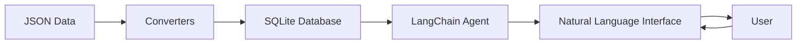

# LangChain Land Use Analysis

Welcome to the LangChain Land Use Analysis documentation! This project enables natural language querying of county-level land use transition data using LangChain agents and SQLite databases.


## 🚀 What is This Project?

This system allows you to:

- **Query land use data using natural language** - Ask questions like "What counties had the most urban growth?" or "Show me forest to cropland transitions in the Midwest"
- **Analyze land use transitions** - Track how land changes between categories (crop, pasture, forest, urban, etc.) over time
- **Process large datasets efficiently** - Convert JSON data to optimized SQLite databases
- **Interact through an AI assistant** - Use LangChain agents that understand your questions and provide intelligent responses

## 🎯 Key Features

### Natural Language Interface
Ask questions in plain English and get meaningful answers:

```bash
You> What are the top 5 counties with the most forest loss between 2020 and 2050?

Agent> I'll query the land use transitions database to find counties with the most forest loss...
```

### Comprehensive Data Analysis
- Track land use changes across multiple scenarios (Baseline, High Crop Demand, etc.)
- Analyze transitions between all land use categories
- Aggregate agricultural data (crops + pasture)
- Focus on actual changes (excluding same-to-same transitions)

### Powerful Agent Capabilities
- SQL query generation from natural language
- Data format conversion (CSV, JSON, Parquet)
- Statistical analysis and visualizations
- Database exploration and schema understanding

## 📊 Example Queries

Here are some natural language queries you can ask:

!!! example "Natural Language Queries"
    - "Show me all urban expansion in California counties"
    - "Which scenario has the most agricultural land conversion?"
    - "Compare forest changes between Baseline and High Crop Demand scenarios"
    - "What's the total cropland area in 2050 across all counties?"
    - "Find counties where pasture is converting to urban areas"

## 🏗️ Architecture Overview



## 🚦 Quick Start

Get started in just a few steps:

1. **Install dependencies**
   ```bash
   uv pip install -r config/requirements.txt
   ```

2. **Set up your OpenAI API key**
   ```bash
   echo "OPENAI_API_KEY=your_key_here" > config/.env
   ```

3. **Run the agent**
   ```bash
   uv run python scripts/agents/test_agent.py
   ```

4. **Start asking questions!**
   ```
   You> Show me the tables in landuse_transitions.db
   ```

## 📚 Documentation Structure

<div class="grid cards" markdown>

-   :material-rocket-launch: **[Getting Started](getting-started/installation.md)**

    ---

    Installation, configuration, and your first queries

-   :material-chat-question: **[Natural Language Queries](queries/overview.md)**

    ---

    Learn how to ask questions and get insights from your data

-   :material-database: **[Data & Schemas](data/sources.md)**

    ---

    Understand the data structure and land use categories

-   :material-api: **[API Reference](api/agent.md)**

    ---

    Detailed documentation of agents, tools, and utilities

-   :material-lightbulb: **[Examples](examples/use-cases.md)**

    ---

    Real-world use cases and sample workflows

-   :material-hammer-wrench: **[Development](development/architecture.md)**

    ---

    Architecture details and contribution guidelines

</div>

## 🤝 Contributing

We welcome contributions! Check out our [contributing guide](development/contributing.md) to get started.

## 📄 License

This project is licensed under the MIT License - see the LICENSE file for details.