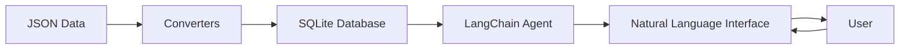

# LangChain Land Use Analysis

Welcome to the LangChain Land Use Analysis documentation! This project enables natural language querying of county-level land use transition data using LangChain agents and SQLite databases.


## 🚀 What is This Project?

This system allows you to:

- **Query land use data using natural language** - Ask questions like "What counties had the most urban growth?" or "Show me forest to cropland transitions in the Midwest"
- **Analyze land use transitions** - Track how land changes between categories (crop, pasture, forest, urban, etc.) over time
- **Process large datasets efficiently** - Convert JSON data to optimized SQLite databases
- **Interact through an AI assistant** - Use LangChain agents that understand your questions and provide intelligent responses

## 🎯 Key Features

### Natural Language Interface
Ask questions in plain English and get meaningful answers:

```bash
You> What are the top 5 counties with the most forest loss between 2020 and 2050?

Agent> I'll query the land use transitions database to find counties with the most forest loss...
```

### Comprehensive Data Analysis
- Track land use changes across multiple scenarios (Baseline, High Crop Demand, etc.)
- Analyze transitions between all land use categories
- Aggregate agricultural data (crops + pasture)
- Focus on actual changes (excluding same-to-same transitions)

### Powerful Agent Capabilities
- SQL query generation from natural language
- Data format conversion (CSV, JSON, Parquet)
- Statistical analysis and visualizations
- Database exploration and schema understanding

## 📊 Example Queries

Here are some natural language queries you can ask:

!!! example "Natural Language Queries"
    - "Show me all urban expansion in California counties"
    - "Which scenario has the most agricultural land conversion?"
    - "Compare forest changes between Baseline and High Crop Demand scenarios"
    - "What's the total cropland area in 2050 across all counties?"
    - "Find counties where pasture is converting to urban areas"

## 🏗️ Architecture Overview



## 🚦 Quick Start

Get started in just a few steps:

1. **Install dependencies**
   ```bash
   uv pip install -r config/requirements.txt
   ```

2. **Set up your OpenAI API key**
   ```bash
   echo "OPENAI_API_KEY=your_key_here" > config/.env
   ```

3. **Run the agent**
   ```bash
   uv run python scripts/agents/test_agent.py
   ```

4. **Start asking questions!**
   ```
   You> Show me the tables in landuse_transitions.db
   ```

## 📚 Documentation Structure

### Getting Started
- **[Installation](getting-started/installation.md)** - Set up the project and dependencies
- **[Quick Start](getting-started/quickstart.md)** - Run your first queries
- **[Configuration](getting-started/configuration.md)** - Customize the system

### Natural Language Queries
- **[Overview](queries/overview.md)** - How natural language processing works
- **[Basic Queries](queries/basic-queries.md)** - Simple query patterns
- **[Advanced Queries](queries/advanced-queries.md)** - Complex analysis techniques
- **[Examples](queries/examples.md)** - Real-world query examples

### Data & Schemas
- **[Data Sources](data/sources.md)** - Understanding the RPA projections
- **[Database Schema](data/schema.md)** - Table structures and relationships
- **[Land Use Categories](data/categories.md)** - Category definitions
- **[Processing Pipeline](data/processing.md)** - How data is transformed

### API Reference
- **[Agent API](api/agent.md)** - DataEngineeringAgent documentation
- **[Converters](api/converters.md)** - Data conversion tools
- **[Tools](api/tools.md)** - Available agent tools

### Examples & Use Cases
- **[Use Cases](examples/use-cases.md)** - Real-world applications
- **[Workflows](examples/workflows.md)** - Step-by-step guides
- **[Notebooks](examples/notebooks.md)** - Jupyter notebook examples

### Development
- **[Architecture](development/architecture.md)** - System design
- **[Contributing](development/contributing.md)** - How to contribute
- **[Testing](development/testing.md)** - Testing guide

### Help
- **[FAQ](faq.md)** - Frequently asked questions
- **[Troubleshooting](troubleshooting.md)** - Common issues and solutions

## 🤝 Contributing

We welcome contributions! Check out our [contributing guide](development/contributing.md) to get started.

## 📄 License

This project is licensed under the MIT License - see the LICENSE file for details.