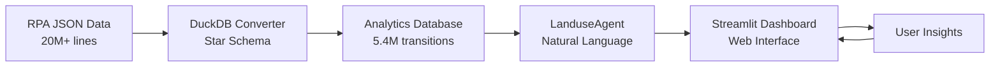

# RPA Land Use Analytics

Welcome to the RPA Land Use Analytics documentation! This AI-powered analytics tool enables natural language exploration of USDA Forest Service 2020 Resources Planning Act (RPA) Assessment land use projections.

<div style="text-align: center; margin: 2em 0;">
<pre style="display: inline-block; text-align: left; font-family: monospace; color: #2E7D32;">
    ____  ____  ___       __                   __   __  __         
   / __ \/ __ \/   |     / /   ____ _____  ____/ /  / / / /_______  
  / /_/ / /_/ / /| |    / /   / __ `/ __ \/ __  /  / / / / ___/ _ \ 
 / _, _/ ____/ ___ |   / /___/ /_/ / / / / /_/ /  / /_/ (__  )  __/ 
/_/ |_/_/   /_/  |_|  /_____/\__,_/_/ /_/\__,_/   \____/____/\___/  
                    ___                __      __  _          
                   /   |  ____  ____ _/ /_  __/ /_(_)_________
                  / /| | / __ \/ __ `/ / / / / __/ / ___/ ___/
                 / ___ |/ / / / /_/ / / /_/ / /_/ / /__(__  ) 
                /_/  |_/_/ /_/\__,_/_/\__, /\__/_/\___/____/  
                                     /____/                    
</pre>
</div>

## 🌲 What is RPA Land Use Analytics?

RPA Land Use Analytics transforms the USDA Forest Service's 2020 Resources Planning Act Assessment data into actionable insights through:

- **Natural Language Queries** - Ask questions in plain English about land use transitions
- **20 Integrated Scenarios** - Explore projections across climate and socioeconomic pathways
- **County-Level Detail** - Analyze 3,075 US counties from 2012-2070
- **AI-Powered Analysis** - Modern agents understand context and provide intelligent insights

## 🎯 Key Features

### Advanced Natural Language Interface
Powered by LangGraph and Claude/GPT-4, ask complex questions and get meaningful answers:

```bash
You> Which RPA scenarios show the most agricultural land loss by 2070?

Agent> I'll analyze agricultural land transitions across all 20 RPA scenarios...

📊 Analysis Assumptions:
- Scenarios: Comparing all 20 climate-socioeconomic combinations
- Time Period: Full projection period 2012-2070
- Geographic Scope: All US counties
```

### Comprehensive RPA Scenario Analysis
- **4 Integrated Scenarios**: LM, HL, HM, HH combining climate and socioeconomic pathways
- **5 Climate Models**: Wet, Hot, Dry, Least warm, Middle projections
- **Private Land Focus**: Based on econometric model calibrated to 2001-2012 observations
- **Development Irreversibility**: Once urban, always urban assumption

### Interactive Streamlit Dashboard
- Modern web interface with natural language chat
- Pre-built visualizations for key insights
- SQL query interface for advanced users
- Data export in multiple formats

## 📊 Example RPA Queries

Explore the 2020 RPA Assessment data with queries like:

!!! example "RPA-Specific Natural Language Queries"
    - "Compare forest loss between the sustainability (LM) and fossil-fueled (HH) scenarios"
    - "Which climate model shows the most urban expansion - hot or dry?"
    - "How does agricultural land change differ between RCP4.5 and RCP8.5?"
    - "Show me land use transitions in the South region under high growth scenarios"
    - "What's the impact of the 'wet' climate model on crop to pasture transitions?"

## 🏗️ Architecture Overview



## 🚦 Quick Start

Get started analyzing RPA land use projections:

1. **Clone and install**
   ```bash
   git clone https://github.com/mihiarc/langchain-landuse
   cd langchain-landuse
   uv sync
   ```

2. **Run guided setup**
   ```bash
   uv run python setup_agents.py
   ```

3. **Launch the dashboard**
   ```bash
   uv run streamlit run landuse_app.py
   ```

4. **Start exploring!**
   ```
   💬 Try: "How much forest is projected to be lost under the high warming scenarios?"
   ```

## 📚 Documentation Structure

### RPA Assessment Background
- **[RPA Overview](rpa/overview.md)** - Understanding the 2020 Assessment
- **[RPA Scenarios](RPA_SCENARIOS.md)** - Detailed scenario definitions
- **[Land Use Methodology](LAND_USE_METHODOLOGY.md)** - Econometric model details
- **[Climate Models](rpa/climate-models.md)** - 5 climate model characteristics

### Getting Started
- **[Installation](getting-started/installation.md)** - Set up the project
- **[Quick Start](getting-started/quickstart.md)** - Run your first RPA queries
- **[Configuration](getting-started/configuration.md)** - Customize for your needs

### Natural Language Queries
- **[Overview](queries/overview.md)** - How the AI understands RPA questions
- **[Basic Queries](queries/basic-queries.md)** - Simple RPA query patterns
- **[Advanced Queries](queries/advanced-queries.md)** - Complex scenario comparisons
- **[Examples](queries/examples.md)** - Real RPA analysis examples

### Data & Schemas
- **[Data Sources](data/sources.md)** - RPA Assessment data structure
- **[Database Schema](data/schema.md)** - Star schema design
- **[Land Use Categories](data/categories.md)** - Crop, Forest, Urban definitions
- **[Processing Pipeline](data/processing.md)** - JSON to DuckDB transformation

### API Reference
- **[LanduseAgent Overview](api/langgraph-agent.md)** - Unified agent architecture and features
- **[Agent API Reference](api/agent.md)** - Complete API documentation
- **[Natural Language Queries](api/landuse-query-agent.md)** - Query processing capabilities
- **[Converters](api/converters.md)** - Data transformation tools
- **[Tools](api/tools.md)** - Available agent capabilities

## 🌟 RPA Scenarios Quick Reference

| Scenario | Climate | Socioeconomic | Key Theme |
|----------|---------|---------------|-----------|
| **LM** | RCP4.5 (~2.5°C) | SSP1 | Sustainability focus, lower warming |
| **HL** | RCP8.5 (~4.5°C) | SSP3 | Regional rivalry, high warming |
| **HM** | RCP8.5 (~4.5°C) | SSP2 | Middle of the road, high warming |
| **HH** | RCP8.5 (~4.5°C) | SSP5 | Fossil-fueled growth, high warming |

## 🤝 Contributing

We welcome contributions! Check out our [contributing guide](development/contributing.md) and [branding strategy](development/BRANDING_STRATEGY.md).

## 📄 Data Attribution

This project analyzes data from the [USDA Forest Service 2020 Resources Planning Act Assessment](https://www.fs.usda.gov/research/rpa).

---

<div style="text-align: center; color: #666; margin-top: 3em;">
<strong>RPA Land Use Analytics</strong><br>
Transforming America's land use data into actionable insights<br>
🌲 Powered by USDA Forest Service RPA Assessment 🌲
</div>