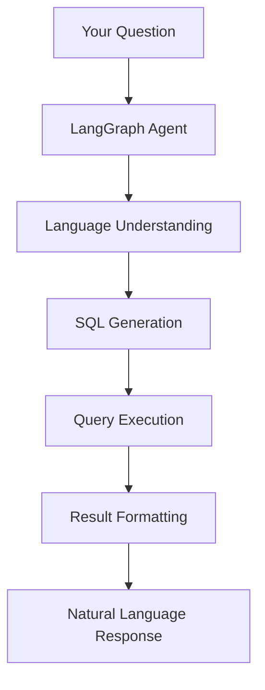

# Complete Natural Language Query Guide

Welcome to the comprehensive guide for natural language querying in the RPA Land Use Analytics system. This guide covers everything from basic exploration to advanced analytical queries, providing you with the tools to extract meaningful insights from USDA Forest Service RPA Assessment data through conversational AI.

## Table of Contents

1. [How Natural Language Queries Work](#how-natural-language-queries-work)
2. [Getting Started with Basic Queries](#getting-started-with-basic-queries)
3. [Advanced Query Patterns](#advanced-query-patterns)
4. [Real-World Query Examples](#real-world-query-examples)
5. [Query Optimization and Best Practices](#query-optimization-and-best-practices)
6. [Troubleshooting and Tips](#troubleshooting-and-tips)

## How Natural Language Queries Work

The power of this system lies in its ability to understand your questions in plain English and translate them into precise database queries. The LangGraph agent interprets natural language and provides comprehensive insights with full SQL transparency.

### The Processing Workflow



### The Complete Process

1. **Language Understanding**: The agent analyzes your question to identify:
   - What data you're looking for
   - Which tables/fields are relevant
   - What filters or conditions to apply
   - How to aggregate or sort results

2. **SQL Generation**: Your question is converted to optimized SQL:
   - Proper table and column selection
   - JOIN operations when needed
   - WHERE clauses for filtering
   - GROUP BY for aggregations
   - ORDER BY for sorting

3. **Intelligent Response**: Results are formatted clearly with:
   - Summary of findings
   - Formatted tables
   - Relevant context
   - Follow-up suggestions

### Query Categories

#### 🔍 Exploratory Queries

Understand your data structure and contents:

```
"What tables are in the database?"
"Show me the columns in the landuse_transitions table"
"What are the unique scenarios in the data?"
"How many records are in each table?"
```

#### 📊 Analytical Queries

Perform calculations and analysis:

```
"What's the total forest area in 2050?"
"Calculate the average urban growth rate per decade"
"Show me the percentage of land that changes use vs stays the same"
"What's the correlation between urban growth and forest loss?"
```

#### 🔄 Transition Queries

Focus on land use changes:

```
"Show all transitions from forest to other land uses"
"Which land use has the most conversions to urban?"
"Find counties where cropland is converting to pasture"
"What are the top 10 most common land use transitions?"
```

#### 📈 Trend Queries

Analyze changes over time:

```
"How does cropland area change from 2020 to 2100?"
"Show me the decade with the most urban expansion"
"Plot forest area trends for all scenarios"
"When does agricultural land peak in the High Crop Demand scenario?"
```

#### 🗺️ Geographic Queries

Location-specific analysis:

```
"What are the land use changes in California counties?"
"Show me the top 20 counties by urban growth"
"Which FIPS codes have the most forest?"
"Compare land use between coastal and inland counties"
```

#### 🔄 Comparison Queries

Compare scenarios, time periods, or regions:

```
"Compare urban growth between Baseline and High Crop Demand"
"What's the difference in forest loss between 2020-2050 and 2050-2080?"
"Show scenario differences for agricultural land in 2100"
"Which scenario preserves the most natural land?"
```

## Getting Started with Basic Queries

### Exploring the Database

#### List Tables

```
You> What tables are in the landuse_transitions database?
```

**Agent Response:**
```
Database: processed/landuse_analytics.duckdb
Tables:
  • fact_landuse_transitions: 5,400,000 rows
  • dim_scenario: 20 rows  
  • dim_geography: 3,075 rows
  • dim_landuse: 5 rows
  • dim_time: 6 rows
```

#### Understand Table Structure

```
You> Describe the schema of the fact_landuse_transitions table
```

**Agent Response:**
```
Table: fact_landuse_transitions
Rows: 5,400,000

Schema:
  scenario_id (INTEGER) NOT NULL
  time_id (INTEGER) NOT NULL
  geography_id (INTEGER) NOT NULL
  from_landuse_id (INTEGER) NOT NULL
  to_landuse_id (INTEGER) NOT NULL
  acres (REAL)

Views Available:
  • v_landuse_with_metadata: Full denormalized view
  • v_landuse_summary: Pre-aggregated summaries
  • v_scenario_comparison: Cross-scenario analysis
```

#### See Sample Data

```
You> Show me 5 sample rows from the landuse transitions
```

### Simple Filtering Queries

#### Filter by Scenario

```
You> Show me data from the Baseline scenario
```

The agent generates:
```sql
SELECT * FROM v_landuse_with_metadata 
WHERE scenario_name = 'Baseline' 
LIMIT 10
```

#### Filter by Year

```
You> What land use transitions happened in 2050?
```

#### Filter by Location

```
You> Show me land use changes in California
```

The agent knows California FIPS codes start with '06':
```sql
SELECT * FROM v_landuse_with_metadata 
WHERE state_fips = '06'
LIMIT 100
```

#### Filter by Land Use Type

```
You> Show me all transitions from forest
```

### Basic Aggregations

#### Count Records

```
You> How many land use transitions are in the database?
```

#### Sum Areas

```
You> What's the total forest area in 2020?
```

**Generated SQL:**
```sql
SELECT SUM(acres) as total_forest_acres
FROM v_landuse_with_metadata
WHERE from_landuse_name = 'Forest' 
  AND to_landuse_name = 'Forest'
  AND year = 2020
```

#### Group By Queries

```
You> Show me total area by land use type
```

#### Calculate Averages

```
You> What's the average urban area per county?
```

### Finding Unique Values

#### List Scenarios

```
You> What scenarios are available in the data?
```

**Response:**
```
Available scenarios (20 total):
- RCP45_SSP1_Ref: Reference case, lower emissions
- RCP45_SSP1_HighCropDemand: High crop demand, lower emissions
- RCP45_SSP1_HighForest: Forest preservation focus
- RCP85_SSP5_Ref: Reference case, higher emissions
- RCP85_SSP5_HighUrban: Urban expansion focus
...
```

#### List Land Use Types

```
You> What are all the land use categories?
```

**Response:**
```
Land Use Categories:
- Crop: Agricultural cropland
- Pasture: Livestock grazing land  
- Forest: Forested areas
- Urban: Developed/built areas
- Rangeland: Natural grasslands
```

#### List Years

```
You> What years does the data cover?
```

### Simple Transition Queries

#### Specific Transitions

```
You> Show me forest to urban transitions
```

**Generated SQL:**
```sql
SELECT * FROM v_landuse_with_metadata
WHERE from_landuse_name = 'Forest' 
  AND to_landuse_name = 'Urban'
LIMIT 100
```

#### All Transitions From a Type

```
You> What does cropland convert to?
```

#### All Transitions To a Type

```
You> What converts to urban land?
```

### Basic Sorting

#### Order by Area

```
You> Show the largest land use transitions by area
```

#### Order by Year

```
You> Show forest area over time, sorted by year
```

#### Top N Results

```
You> What are the top 10 counties by total land area?
```

### Simple Comparisons

#### Compare Two Values

```
You> Is there more forest or cropland in 2050?
```

#### Year-over-Year Changes

```
You> How much did urban area change from 2020 to 2030?
```

#### Scenario Differences

```
You> Compare forest area between Baseline and High Forest scenarios
```

### Working with Results

#### Export Data

```
You> Export the forest transitions to a CSV file
```

#### Get Statistics

```
You> Show me statistics for the acres column
```

#### Count Distinct Values

```
You> How many unique counties are in the data?
```

### Common Basic Query Patterns

#### Pattern 1: Filter + Aggregate
```
"Total [land use] area in [location] for [scenario]"
"Sum of [metric] where [condition]"
"Average [value] by [grouping]"
```

#### Pattern 2: Find Specific Records
```
"Show me [land use] in [year]"
"List [top N] [items] by [metric]"
"Find all [transitions] from [type] to [type]"
```

#### Pattern 3: Compare Values
```
"Compare [metric] between [A] and [B]"
"What's the difference in [value] from [time1] to [time2]"
"Which [item] has more [metric]?"
```

## Advanced Query Patterns

### Complex Filtering and Conditions

#### Multiple Conditions

```
You> Show me counties where forest decreased by more than 20% AND urban increased by more than 50% between 2020 and 2050
```

The agent will create a complex query with:
- Self-joins to compare different years
- Percentage calculations
- Multiple WHERE conditions

#### Conditional Logic

```
You> Find transitions that only happen in certain scenarios but not in Baseline
```

**Generated approach:**
```sql
WITH baseline_transitions AS (
  SELECT DISTINCT from_landuse_name, to_landuse_name 
  FROM v_landuse_with_metadata 
  WHERE scenario_name = 'RCP45_SSP1_Ref'
),
other_transitions AS (
  SELECT DISTINCT scenario_name, from_landuse_name, to_landuse_name 
  FROM v_landuse_with_metadata 
  WHERE scenario_name != 'RCP45_SSP1_Ref'
)
SELECT * FROM other_transitions
WHERE (from_landuse_name, to_landuse_name) NOT IN (
  SELECT from_landuse_name, to_landuse_name FROM baseline_transitions
)
```

#### Dynamic Thresholds

```
You> Show counties where urban growth exceeds the national average
```

### Advanced Aggregations

#### Window Functions

```
You> Calculate the running total of forest loss by year
```

```
You> Show me the rank of each county by agricultural land area
```

#### Percentages and Ratios

```
You> What percentage of each county is urban in 2050?
```

```
You> Calculate the ratio of forest to agricultural land by scenario
```

#### Statistical Analysis

```
You> Show me the standard deviation of land use changes by decade
```

```
You> Find outlier counties with unusual transition patterns
```

### Time Series Analysis

#### Trend Detection

```
You> Identify counties with accelerating urban growth
```

The agent will:
1. Calculate growth rates by period
2. Compare consecutive periods
3. Identify acceleration patterns

#### Period Comparisons

```
You> Compare the rate of change between 2020-2050 and 2050-2080
```

#### Decade Analysis

```
You> Show me which decade has the most dramatic land use changes
```

#### Temporal Patterns

```
You> Find periods where forest loss slows down or reverses
```

### Cross-Scenario Analysis

#### Scenario Divergence

```
You> Where do scenarios diverge the most from Baseline?
```

#### Scenario Rankings

```
You> Rank scenarios by how much natural land they preserve
```

#### Impact Analysis

```
You> Show me how different scenarios affect agricultural land in the Midwest
```

### Geographic Patterns

#### Regional Analysis

```
You> Compare land use transitions between coastal and inland counties
```

#### Spatial Clustering

```
You> Find groups of counties with similar transition patterns
```

#### Hot Spot Detection

```
You> Identify regions with the most intense land use change
```

### Complex Transitions

#### Multi-Step Transitions

```
You> Track land that goes from forest to agriculture to urban over time
```

#### Transition Networks

```
You> Show me the flow of land between all use types in a Sankey diagram format
```

#### Circular Transitions

```
You> Find cases where land returns to its original use
```

### Custom Metrics

#### Sustainability Indices

```
You> Calculate a sustainability score based on natural land preservation and urban efficiency
```

#### Change Intensity

```
You> Create a metric for land use change intensity by county
```

#### Composite Indicators

```
You> Develop an agricultural productivity index considering crop and pasture changes
```

### Data Mining Queries

#### Pattern Discovery

```
You> Find unusual or interesting patterns in the land use transitions
```

#### Anomaly Detection

```
You> Identify counties with transition patterns very different from their neighbors
```

#### Correlation Analysis

```
You> What factors correlate with high urban growth?
```

### Optimization Queries

#### Best/Worst Case Analysis

```
You> Which scenario minimizes agricultural land loss while accommodating urban growth?
```

#### Trade-off Analysis

```
You> Show the trade-off between forest preservation and crop production across scenarios
```

#### Efficiency Metrics

```
You> Calculate land use efficiency by comparing urban area to population capacity
```

### Advanced SQL Patterns

#### Common Table Expressions (CTEs)

```
You> Show me a breakdown of land use changes using step-by-step calculations
```

The agent uses CTEs for clarity:
```sql
WITH yearly_totals AS (
  SELECT year, from_landuse_name, SUM(acres) as total
  FROM v_landuse_with_metadata
  GROUP BY year, from_landuse_name
),
yearly_changes AS (
  SELECT year, from_landuse_name,
         total - LAG(total) OVER (PARTITION BY from_landuse_name ORDER BY year) as change
  FROM yearly_totals
)
SELECT * FROM yearly_changes WHERE change IS NOT NULL
```

#### Pivot Operations

```
You> Create a matrix showing transitions between all land use types
```

#### Recursive Queries

```
You> Trace the history of specific land parcels through multiple transitions
```

## Real-World Query Examples

### 🏙️ Urban Planning

#### Urban Growth Analysis

**Query:**
```
You> Which metropolitan counties will see the most urban expansion by 2050?
```

**Agent Approach:**
- Identifies counties with major cities
- Calculates urban area change from 2020 to 2050
- Ranks by absolute and percentage growth

**Follow-up:**
```
You> For those top counties, what land uses are being converted to urban?
```

#### Urban Density Trends

**Query:**
```
You> Show me counties where urban area is growing faster than the state average
```

**Sample Result:**
```
Counties with above-average urban growth:
- Riverside County (06065): +45.2% vs state avg 28.3%
- San Bernardino (06071): +42.1% vs state avg 28.3%
- Placer County (06061): +38.9% vs state avg 28.3%
```

#### Sustainable Development

**Query:**
```
You> Find counties successfully increasing urban density without expanding into forest areas
```

### 🌾 Agricultural Analysis

#### Crop vs Pasture Dynamics

**Query:**
```
You> How is the balance between cropland and pasture changing over time?
```

**Agent generates analysis showing:**
- Total crop and pasture by decade
- Conversion rates between them
- Regional variations
- Scenario comparisons

#### Agricultural Pressure

**Query:**
```
You> In the High Crop Demand scenario, which counties lose the most pasture to cropland?
```

#### Food Security Assessment

**Query:**
```
You> Calculate total agricultural land (crops + pasture) and show if it's increasing or decreasing nationally
```

**Complex Follow-up:**
```
You> Now break that down by region and identify areas at risk of agricultural land shortage
```

### 🌲 Forest Conservation

#### Deforestation Hotspots

**Query:**
```
You> Identify the top 20 counties with the highest forest loss across all scenarios
```

**Results Format:**
```
Rank | County | FIPS | Forest Loss (acres) | % Loss
1    | County A | 12345 | -523,400 | -32.1%
2    | County B | 23456 | -498,700 | -28.9%
...
```

#### Forest Recovery

**Query:**
```
You> Are there any counties where forest area increases? If so, what's converting to forest?
```

#### Conservation Scenarios

**Query:**
```
You> Compare forest preservation between the Baseline and High Forest scenarios - where are the biggest differences?
```

### 📊 Scenario Comparisons

#### Comprehensive Scenario Analysis

**Query:**
```
You> Create a summary table comparing all scenarios for the year 2100:
- Total urban area
- Total agricultural area  
- Total natural area (forest + range)
- Percentage of land that changed use
```

#### Scenario Divergence

**Query:**
```
You> At what point do the scenarios start to significantly diverge from the Baseline?
```

**Agent Analysis:**
- Calculates year-by-year differences
- Identifies divergence threshold
- Shows which land uses drive differences

#### Best Case Analysis

**Query:**
```
You> Which scenario best balances urban growth needs with environmental preservation?
```

### 📈 Trend Analysis

#### Acceleration Detection

**Query:**
```
You> Show me where land use change is accelerating vs slowing down between the first half (2020-2060) and second half (2060-2100) of the projection period
```

#### Tipping Points

**Query:**
```
You> Identify years where major shifts occur in land use patterns
```

#### Long-term Projections

**Query:**
```
You> Based on current trends, when will urban area exceed 20% in major counties?
```

### 🗺️ Regional Patterns

#### State-Level Analysis

**Query:**
```
You> Summarize land use changes by state, focusing on the top 5 states with the most change
```

#### Coastal vs Inland

**Query:**
```
You> Compare land use transition patterns between coastal counties and inland counties
```

**Agent Approach:**
```sql
-- Identifies coastal counties (could use FIPS patterns or geographic data)
-- Aggregates transitions for each group
-- Calculates and compares metrics
```

#### Metropolitan Influence

**Query:**
```
You> How do land use changes differ between counties with major cities versus rural counties?
```

### 🔄 Transition Patterns

#### Transition Matrix

**Query:**
```
You> Create a transition matrix showing all conversions between land use types for the Baseline scenario
```

**Result Format:**
```
From\To | Crop | Forest | Pasture | Urban | Range
--------|------|--------|---------|-------|-------
Crop    | 85%  | 2%     | 8%      | 5%    | 0%
Forest  | 3%   | 88%    | 2%      | 7%    | 0%
...
```

#### Unusual Transitions

**Query:**
```
You> Find rare or unexpected land use transitions that might indicate data issues or interesting patterns
```

#### Transition Chains

**Query:**
```
You> Track agricultural land that eventually becomes urban - does it go directly or through other uses first?
```

### 💡 Complex Analytical Queries

#### Multi-Criteria Analysis

**Query:**
```
You> Find counties that meet all these criteria:
- Urban growth > 25%
- Forest loss < 10%
- Agricultural land stable (±5%)
- In the Baseline scenario
```

#### Composite Metrics

**Query:**
```
You> Create a "land use change intensity index" that combines:
- Rate of change
- Diversity of transitions
- Deviation from historical patterns
```

#### Predictive Insights

**Query:**
```
You> Based on 2020-2040 patterns, which counties are likely to face land use conflicts by 2080?
```

### 📋 Reporting Queries

#### Executive Summary

**Query:**
```
You> Generate a one-page executive summary of land use changes including:
- Key statistics
- Major trends
- Critical counties to watch
- Policy implications
```

#### County Report Card

**Query:**
```
You> Create a detailed report card for Sacramento County including all scenarios and land use changes
```

#### Stakeholder Analysis

**Query:**
```
You> Prepare data for different stakeholders:
- Farmers: Agricultural land changes
- Conservationists: Natural land preservation  
- Urban planners: Development opportunities
- Policymakers: Overall sustainability
```

### 🛠️ Data Quality Checks

#### Validation Queries

**Query:**
```
You> Verify that total land area remains constant over time for each county
```

#### Consistency Checks

**Query:**
```
You> Check if the sum of all "from" transitions equals the sum of all "to" transitions by year
```

#### Outlier Detection

**Query:**
```
You> Find any suspicious data points where land use changes seem unrealistic
```

### 📊 Export and Visualization Prep

#### Chart Data

**Query:**
```
You> Prepare data for a line chart showing land use trends over time for all scenarios
```

#### Geographic Export

**Query:**
```
You> Export county-level urban growth data in a format suitable for GIS mapping
```

#### Dashboard Metrics

**Query:**
```
You> Create a set of 10 key metrics for a land use monitoring dashboard, updated annually
```

## Query Optimization and Best Practices

### Performance Optimization

#### Query Hints

```
You> For this large analysis, please optimize the query for performance
```

The agent will:
- Use appropriate indexes
- Limit data early in the query
- Avoid unnecessary calculations

#### Sampling Strategies

```
You> Analyze a representative sample of counties to estimate national trends
```

#### Incremental Analysis

```
You> Break down this complex analysis into smaller, manageable queries
```

### Integration Queries

#### Multi-Table Analysis

```
You> Combine data from all dimension tables to show complete transition patterns
```

#### View Utilization

```
You> Use the optimized views to compare agricultural changes across scenarios
```

#### Data Validation

```
You> Verify data consistency between the fact and dimension tables
```

### Visualization Preparation

#### Chart-Ready Data

```
You> Prepare data for a stacked area chart of land use over time
```

#### Map Data

```
You> Format county-level changes for geographic visualization
```

#### Dashboard Metrics

```
You> Create a set of KPIs for a land use monitoring dashboard
```

### Understanding Agent Responses

#### SQL Transparency

The agent shows the generated SQL query:

```sql
Query: SELECT scenario_name, year, SUM(acres) as total_forest
       FROM v_landuse_with_metadata
       WHERE from_landuse_name = 'Forest' 
         AND to_landuse_name = 'Forest'
       GROUP BY scenario_name, year
       ORDER BY scenario_name, year
```

This helps you:
- Verify the query matches your intent
- Learn SQL patterns
- Debug unexpected results

#### Result Interpretation

Results include:
- **Row count**: "Results: 245 rows"
- **Formatted data**: Tables with clear headers
- **Summary**: Key findings highlighted
- **Context**: Explanations of what the data represents

### Common Patterns

#### Time-Based Patterns

```
"between 2020 and 2050"
"in the year 2100"  
"by decade"
"over the entire period"
"changes from [year] to [year]"
```

#### Aggregation Patterns

```
"total area"
"average change"
"sum by scenario"
"count of transitions"
"percentage of total"
```

#### Filtering Patterns

```
"only in California" (state_fips = '06')
"excluding same-to-same transitions"
"where area > 1000"
"for Baseline scenario only"
"top 10 by [metric]"
```

### Advanced Techniques

#### Multi-Step Analysis

Break complex questions into steps:

```
You> First, find the counties with the most agricultural land
Agent> [Shows top agricultural counties]

You> Now show me how urban area changes in those counties
Agent> [Analyzes urban growth in previously identified counties]
```

#### Conditional Queries

Use conditions and logic:

```
"Show counties where forest loss exceeds 20% AND urban growth is above average"
"Find transitions that only occur in the High Crop Demand scenario"
"List counties with increasing cropland but decreasing pasture"
```

#### Custom Calculations

Request specific computations:

```
"Calculate the net change in agricultural land (crops + pasture) by decade"
"Show the ratio of urban growth to forest loss by county"
"What percentage of each county converts from natural to developed land?"
```

## Troubleshooting and Tips

### Best Practices

#### 1. Be Specific

❌ Vague: "Show me some data"
✅ Specific: "Show me forest to urban transitions in California for the Baseline scenario"

#### 2. Include Context

❌ Ambiguous: "What changes the most?"
✅ Clear: "Which land use type has the largest area change between 2020 and 2050?"

#### 3. Specify Filters

❌ Too broad: "Show transitions"
✅ Filtered: "Show transitions from agricultural land to urban in counties with FIPS starting with 06"

#### 4. Request Format

❌ Unclear format: "Give me the data"
✅ Clear format: "List the top 10 counties by forest loss, showing county FIPS and area lost"

### Tips for Success

#### 1. Start Simple

Begin with basic queries and add complexity:
- First: "Show forest data"
- Then: "Show forest data in 2050"  
- Finally: "Show forest to urban transitions in California in 2050"

#### 2. Use Natural Language

Don't try to write SQL-like queries:
- ❌ "SELECT * FROM landuse WHERE..."
- ✅ "Show me land use data where..."

#### 3. Ask for Clarification

If unsure about data:
```
You> What does the 'acres' column represent?
You> What's the difference between the scenarios?
```

#### 4. Build on Previous Queries

The agent remembers context:
```
You> Show me total forest area by year
[Agent shows results]
You> Now just show me the years where it decreases
```

### Best Practices for Complex Queries

1. **Break Down Complex Requests**
   - Start with simpler components
   - Build up to the full analysis
   - Verify each step

2. **Use Agent Memory**
   - Reference previous results
   - Build analyses incrementally
   - Save intermediate results

3. **Optimize for Performance**
   - Request samples for exploration
   - Use filtered subsets
   - Leverage indexed columns

4. **Validate Results**
   - Check totals and subtotals
   - Verify against known values
   - Look for logical consistency

### Query Optimization Tips

1. **Start broad, then narrow**
   - First: "What scenarios are available?"
   - Then: "Show forest changes in the Baseline scenario"

2. **Use table views wisely**
   - `v_landuse_with_metadata`: Complete denormalized view
   - `v_landuse_summary`: Pre-aggregated summaries
   - `v_scenario_comparison`: Cross-scenario analysis

3. **Leverage agent memory**
   - Previous results are remembered
   - Reference earlier queries: "Using those counties, now show..."

4. **Request appropriate limits**
   - "Show me a sample of 10 rows"
   - "List the top 20 counties"
   - "Summarize by decade instead of year"

### Practice Exercises

Try these queries to build familiarity:

1. **Basic Exploration**
   - List all tables in the database
   - Show the first 10 rows of landuse transitions
   - Count total records in each table

2. **Filtering Practice**
   - Find all High Urban scenario data
   - Show transitions in the year 2100
   - List data for FIPS code 06037

3. **Simple Analysis**
   - Calculate total urban area
   - Find the most common land use transition
   - Show which scenario has the most forest

4. **Basic Comparisons**
   - Compare cropland between 2020 and 2050
   - Find the county with the most urban growth
   - Show the difference between scenarios

5. **Complex Analysis**
   - Build incrementally: Start simple, add complexity
   - Use context: Reference previous results
   - Be specific: Include scenarios, years, and regions
   - Think stepwise: Break complex analyses into steps
   - Verify results: Ask for row counts and sanity checks

## Related Documentation

### Quick Links
- **[Complete Agent System Guide](../agents/complete-guide.md)** - Agent configuration and capabilities
- **[Complete Database Reference](../data/complete-reference.md)** - Database schema and tables
- **[Complete Setup Guide](../getting-started/complete-setup.md)** - Installation and configuration
- **[RPA Assessment Complete](../rpa/rpa-assessment-complete.md)** - Methodology and background

### Cross-References
- **Database Schema**: See [Complete Database Reference](../data/complete-reference.md) for detailed table structures and relationships
- **Agent Configuration**: See [Complete Agent System Guide](../agents/complete-guide.md) for model selection and prompt customization
- **Performance Tuning**: See [Agent Performance Monitoring](../agents/complete-guide.md#performance-optimization) for query optimization strategies
- **API Integration**: See [Complete Agent System Guide](../agents/complete-guide.md#api-reference) for programmatic access patterns

The natural language query system provides an intuitive interface to complex land use data, enabling both simple explorations and sophisticated analytical workflows. With the comprehensive patterns and examples in this guide, you can extract meaningful insights from USDA Forest Service RPA Assessment data through conversational AI.

## See Also

### Related Documentation
- **[Complete Examples Guide](../examples/complete-examples.md)** - Real-world workflows and use cases demonstrating these query patterns
- **[Complete Agent Guide](../agents/complete-guide.md)** - Agent configuration, advanced capabilities, and system architecture
- **[Complete Database Reference](../data/complete-reference.md)** - Database schema, table structures, and optimization details
- **[RPA Assessment Complete](../rpa/rpa-assessment-complete.md)** - Comprehensive background on data sources and methodology
- **[Complete Setup Guide](../getting-started/complete-setup.md)** - Installation and initial configuration

### Quick Navigation by Topic
- **Practical Examples**: See [Complete Examples Guide](../examples/complete-examples.md#step-by-step-workflows) for detailed query workflows
- **Agent Configuration**: Check [Complete Agent Guide](../agents/complete-guide.md#configuration) for model settings and optimization
- **Database Schema**: Reference [Database Tables](../data/complete-reference.md#star-schema-design) for understanding data structure
- **Scenario Background**: Learn about [Climate Scenarios](../rpa/rpa-assessment-complete.md#climate-scenarios) for query context
- **Performance Tuning**: See [Query Optimization](../agents/complete-guide.md#performance-optimization) for advanced techniques

> **Consolidation Note**: This guide consolidates information from overview.md, basic-queries.md, advanced-queries.md, and examples.md into a single comprehensive resource. For the most current query patterns and syntax, always refer to this complete guide rather than individual component files.