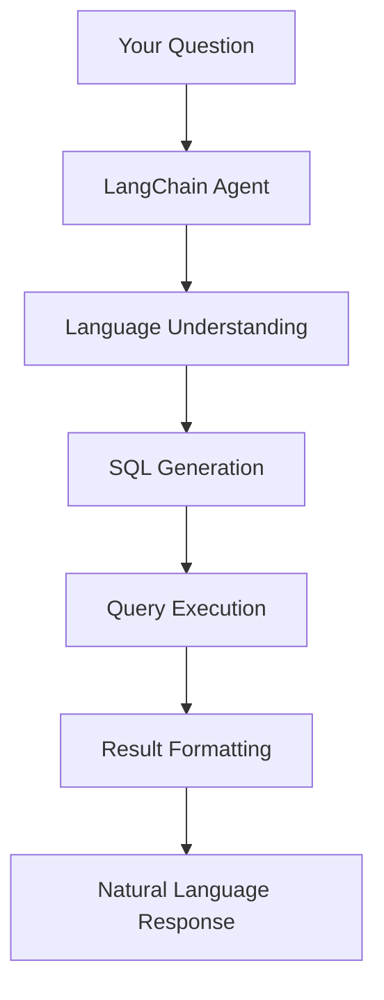

# Natural Language Queries Overview

The power of this system lies in its ability to understand your questions in plain English and translate them into precise database queries. This section explains how the LangChain agent interprets natural language and provides tips for getting the best results.

## How It Works



### The Process

1. **Language Understanding**: The agent analyzes your question to identify:
   - What data you're looking for
   - Which tables/fields are relevant
   - What filters or conditions to apply
   - How to aggregate or sort results

2. **SQL Generation**: Your question is converted to SQL:
   - Proper table and column selection
   - JOIN operations when needed
   - WHERE clauses for filtering
   - GROUP BY for aggregations
   - ORDER BY for sorting

3. **Intelligent Response**: Results are formatted clearly with:
   - Summary of findings
   - Formatted tables
   - Relevant context
   - Follow-up suggestions

## Query Categories

### 🔍 Exploratory Queries

Understand your data structure and contents:

```
"What tables are in the database?"
"Show me the columns in the landuse_transitions table"
"What are the unique scenarios in the data?"
"How many records are in each table?"
```

### 📊 Analytical Queries

Perform calculations and analysis:

```
"What's the total forest area in 2050?"
"Calculate the average urban growth rate per decade"
"Show me the percentage of land that changes use vs stays the same"
"What's the correlation between urban growth and forest loss?"
```

### 🔄 Transition Queries

Focus on land use changes:

```
"Show all transitions from forest to other land uses"
"Which land use has the most conversions to urban?"
"Find counties where cropland is converting to pasture"
"What are the top 10 most common land use transitions?"
```

### 📈 Trend Queries

Analyze changes over time:

```
"How does cropland area change from 2020 to 2100?"
"Show me the decade with the most urban expansion"
"Plot forest area trends for all scenarios"
"When does agricultural land peak in the High Crop Demand scenario?"
```

### 🗺️ Geographic Queries

Location-specific analysis:

```
"What are the land use changes in California counties?"
"Show me the top 20 counties by urban growth"
"Which FIPS codes have the most forest?"
"Compare land use between coastal and inland counties"
```

### 🔄 Comparison Queries

Compare scenarios, time periods, or regions:

```
"Compare urban growth between Baseline and High Crop Demand"
"What's the difference in forest loss between 2020-2050 and 2050-2080?"
"Show scenario differences for agricultural land in 2100"
"Which scenario preserves the most natural land?"
```

## Best Practices

### 1. Be Specific

❌ Vague: "Show me some data"
✅ Specific: "Show me forest to urban transitions in California for the Baseline scenario"

### 2. Include Context

❌ Ambiguous: "What changes the most?"
✅ Clear: "Which land use type has the largest area change between 2020 and 2050?"

### 3. Specify Filters

❌ Too broad: "Show transitions"
✅ Filtered: "Show transitions from agricultural land to urban in counties with FIPS starting with 06"

### 4. Request Format

❌ Unclear format: "Give me the data"
✅ Clear format: "List the top 10 counties by forest loss, showing county FIPS and area lost"

## Understanding Agent Responses

### SQL Transparency

The agent shows the generated SQL query:

```sql
Query: SELECT scenario, year, SUM(area_1000_acres) as total_forest
       FROM landuse_transitions
       WHERE from_land_use = 'Forest' 
         AND to_land_use = 'Forest'
       GROUP BY scenario, year
       ORDER BY scenario, year
```

This helps you:
- Verify the query matches your intent
- Learn SQL patterns
- Debug unexpected results

### Result Interpretation

Results include:
- **Row count**: "Results: 245 rows"
- **Formatted data**: Tables with clear headers
- **Summary**: Key findings highlighted
- **Context**: Explanations of what the data represents

## Advanced Techniques

### Multi-Step Analysis

Break complex questions into steps:

```
You> First, find the counties with the most agricultural land
Agent> [Shows top agricultural counties]

You> Now show me how urban area changes in those counties
Agent> [Analyzes urban growth in previously identified counties]
```

### Conditional Queries

Use conditions and logic:

```
"Show counties where forest loss exceeds 20% AND urban growth is above average"
"Find transitions that only occur in the High Crop Demand scenario"
"List counties with increasing cropland but decreasing pasture"
```

### Custom Calculations

Request specific computations:

```
"Calculate the net change in agricultural land (crops + pasture) by decade"
"Show the ratio of urban growth to forest loss by county"
"What percentage of each county converts from natural to developed land?"
```

## Common Patterns

### Time-Based Patterns

```
"between 2020 and 2050"
"in the year 2100"  
"by decade"
"over the entire period"
"changes from [year] to [year]"
```

### Aggregation Patterns

```
"total area"
"average change"
"sum by scenario"
"count of transitions"
"percentage of total"
```

### Filtering Patterns

```
"only in California" (FIPS LIKE '06%')
"excluding same-to-same transitions"
"where area > 1000"
"for Baseline scenario only"
"top 10 by [metric]"
```

## Query Optimization Tips

1. **Start broad, then narrow**
   - First: "What scenarios are available?"
   - Then: "Show forest changes in the Baseline scenario"

2. **Use table views wisely**
   - `landuse_transitions`: All transitions including same-to-same
   - `landuse_changes_only`: Excludes unchanged land
   - `*_ag` tables: Agricultural aggregation (crop + pasture)

3. **Leverage agent memory**
   - Previous results are remembered
   - Reference earlier queries: "Using those counties, now show..."

4. **Request appropriate limits**
   - "Show me a sample of 10 rows"
   - "List the top 20 counties"
   - "Summarize by decade instead of year"

## Next Steps

- See [Basic Queries](basic-queries.md) for simple examples
- Explore [Advanced Queries](advanced-queries.md) for complex analysis
- Check [Query Examples](examples.md) for real-world scenarios
- Learn about [Data Schemas](../data/schema.md) to understand available fields